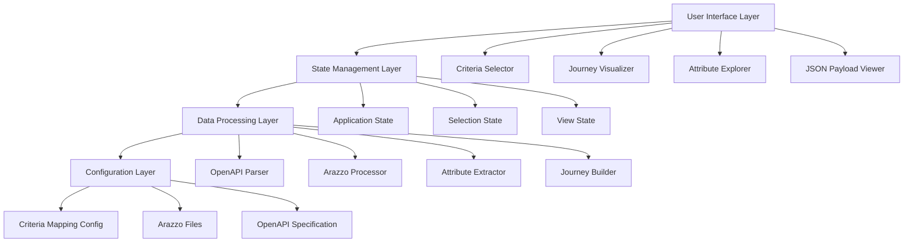
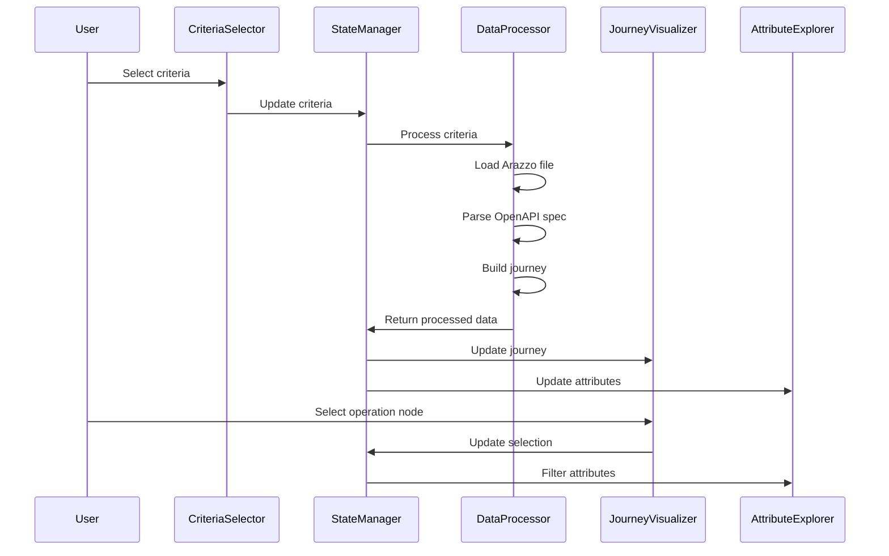

# Design Document

## Overview

The Embedded Finance Solutions Onboarding Explorer is a React-based SPA component that provides an interactive interface for developers to explore and understand the API requirements for onboarding clients. The tool combines OpenAPI specification parsing, Arazzo workflow mapping, and visual flow representation to create a comprehensive developer experience.

The component is designed to be rendered as a full-screen modal/dialog from the main application, using the same libraries and React Flow already present in `app/client-next-ts`. It requires no persistent storage, only loading Arazzo specifications and complementary JSON configuration files as needed. The application follows a modular architecture with clear separation between data processing, visualization, and user interface components.

## Architecture

### High-Level Architecture



### Component Architecture

The application is structured as a single-page application with the following major components:

1. **CriteriaSelector**: Handles user input for product, jurisdiction, and legal entity type
2. **JourneyVisualizer**: Renders the API flow using ReactFlow
3. **AttributeExplorer**: Displays filterable tables of API attributes
4. **PayloadViewer**: Shows JSON payload structures with syntax highlighting
5. **ArazzoViewer**: Displays Arazzo specification details for selected operations

## Components and Interfaces

### Core Components

#### CriteriaSelector Component

```typescript
interface CriteriaSelectorProps {
  onCriteriaChange: (criteria: OnboardingCriteria) => void;
  availableOptions: CriteriaOptions;
}

interface OnboardingCriteria {
  product: ClientProduct;
  jurisdiction: CountryCode;
  legalEntityType: OrganizationType;
}
```

#### JourneyVisualizer Component

```typescript
interface JourneyVisualizerProps {
  journey: ApiJourney;
  onNodeSelect: (nodeId: string) => void;
  selectedNode?: string;
}

interface ApiJourney {
  nodes: JourneyNode[];
  edges: JourneyEdge[];
  metadata: JourneyMetadata;
}

interface JourneyNode {
  id: string;
  type: "operation" | "decision" | "start" | "end";
  operation?: ApiOperation;
  position: { x: number; y: number };
  data: {
    label: string;
    method: string;
    path: string;
    status: "success" | "failure" | "neutral";
  };
}
```

#### AttributeExplorer Component

```typescript
interface AttributeExplorerProps {
  attributes: ApiAttribute[];
  selectedOperation?: string;
  viewMode: "table" | "json" | "side-by-side";
  onViewModeChange: (mode: ViewMode) => void;
}

interface ApiAttribute {
  operationId: string;
  jsonPath: string;
  name: string;
  type: string;
  required: boolean;
  description?: string;
  group: AttributeGroup;
  constraints?: FieldConstraints;
}
```

### Data Models

#### Configuration Models

```typescript
interface CriteriaMapping {
  [key: string]: {
    product: ClientProduct;
    jurisdiction: CountryCode;
    legalEntityType: OrganizationType;
    arazzoFile: string;
    requiredOperations: string[];
  };
}

interface ArazzoWorkflow {
  workflowId: string;
  info: WorkflowInfo;
  sourceDescriptions: SourceDescription[];
  steps: WorkflowStep[];
}

interface WorkflowStep {
  stepId: string;
  description: string;
  operationId: string;
  parameters?: Parameter[];
  successCriteria: Criterion[];
  onSuccess?: StepReference[];
  onFailure?: StepReference[];
}
```

#### API Processing Models

```typescript
interface ParsedApiSpec {
  operations: Map<string, ApiOperation>;
  schemas: Map<string, JsonSchema>;
  examples: Map<string, any>;
}

interface ApiOperation {
  operationId: string;
  method: HttpMethod;
  path: string;
  summary: string;
  description: string;
  requestBody?: RequestBodySchema;
  responses: ResponseSchema[];
  tags: string[];
}
```

## Data Models

### Core Data Structures

The application manages several key data structures:

1. **OnboardingCriteria**: User-selected parameters that determine the journey
2. **ApiJourney**: Processed workflow representation for visualization
3. **AttributeCollection**: Organized API attributes with metadata
4. **ArazzoWorkflow**: Parsed Arazzo specification data

### Data Flow



## Error Handling

### Error Categories

1. **Configuration Errors**: Missing Arazzo files, invalid mappings
2. **Parsing Errors**: Malformed OpenAPI specs, invalid Arazzo syntax
3. **Runtime Errors**: Network failures, state inconsistencies
4. **User Input Errors**: Invalid criteria combinations

### Error Handling Strategy

```typescript
interface ErrorBoundary {
  componentDidCatch(error: Error, errorInfo: ErrorInfo): void;
  render(): ReactNode;
}

interface ErrorState {
  hasError: boolean;
  errorType: ErrorType;
  errorMessage: string;
  recoveryAction?: () => void;
}
```

The application implements graceful error handling with:

- Fallback UI components for critical failures
- User-friendly error messages with recovery suggestions
- Logging for debugging and monitoring
- Progressive enhancement (features degrade gracefully)

## Testing Strategy

### Unit Testing

- Component testing with React Testing Library
- Data processing logic testing with Jest
- Mock API responses and Arazzo files
- Edge case validation for criteria combinations

### Integration Testing

- End-to-end user workflows
- API specification parsing accuracy
- Arazzo workflow processing
- Cross-browser compatibility

### Performance Testing

- Large API specification handling
- Complex journey visualization rendering
- Memory usage with multiple criteria switches
- Bundle size optimization

### Test Data Strategy

- Sample Arazzo files for each supported criteria combination
- Mock OpenAPI specifications with various complexity levels
- Test cases covering all supported product/jurisdiction/entity combinations

## Implementation Details

### File Structure

```
app/client-next-ts/src/components/api-flow-explorer/
├── index.ts                          # Main export
├── ApiFlowExplorer.tsx              # Root component (modal container)
├── components/
│   ├── CriteriaSelector.tsx         # Criteria selection interface
│   ├── JourneyVisualizer.tsx        # ReactFlow-based journey visualization
│   ├── AttributeExplorer.tsx        # Attribute table and filtering
│   ├── PayloadViewer.tsx            # JSON payload display
│   └── ArazzoViewer.tsx             # Arazzo specification viewer
├── hooks/
│   ├── useApiSpecParser.ts          # OpenAPI parsing logic
│   ├── useArazzoProcessor.ts        # Arazzo workflow processing
│   └── useJourneyBuilder.ts         # Journey construction from specs
├── types/
│   ├── api.ts                       # API-related type definitions
│   ├── arazzo.ts                    # Arazzo specification types
│   └── journey.ts                   # Journey visualization types
├── utils/
│   ├── specParser.ts                # OpenAPI specification parsing utilities
│   ├── arazzoProcessor.ts           # Arazzo file processing utilities
│   └── attributeExtractor.ts        # Payload attribute extraction
└── data/
    ├── criteria-mapping.json        # Mapping of criteria to Arazzo files
    ├── arazzo-specs/               # Directory for Arazzo workflow files
    │   ├── embedded-payments-us-llc.yaml
    │   ├── merchant-services-ca-corp.yaml
    │   └── ...
    └── api-specs/                  # OpenAPI specifications
        └── embedded-finance-pub-smbdo-1.0.16.yaml
```

### Integration with Existing Application

The component integrates with the existing Next.js application by:

1. **Using Existing Dependencies**: Leverages React Flow and other libraries already installed
2. **Consistent Styling**: Uses the same design system and CSS framework as the main app
3. **Modal Integration**: Renders as a full-screen modal using existing modal components
4. **State Management**: Uses React hooks for local state, no global state dependencies
5. **Asset Loading**: Loads Arazzo specs and configuration from static assets

### Configuration Management

```typescript
interface CriteriaMappingConfig {
  mappings: {
    [key: string]: {
      product: ClientProduct;
      jurisdiction: CountryCode;
      legalEntityType: OrganizationType;
      arazzoFile: string;
      displayName: string;
      description: string;
    };
  };
  defaultCriteria: OnboardingCriteria;
  supportedCombinations: string[];
}
```

The configuration is stored in `data/criteria-mapping.json` and loaded dynamically when the component mounts. This allows for easy extension of supported criteria combinations without code changes.

### Performance Considerations

- **Lazy Loading**: Arazzo specs are loaded only when needed
- **Memoization**: Expensive parsing operations are memoized
- **Virtual Scrolling**: Large attribute tables use virtual scrolling
- **Bundle Splitting**: Component is code-split to avoid impacting main app bundle size
