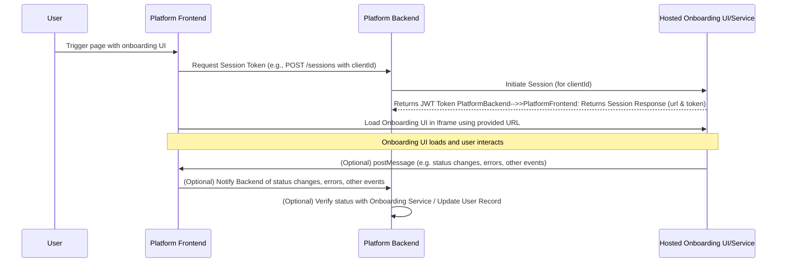

# Hosted Onboarding UI Integration Guide

⚠️ DRAFT - UNDER REVIEW ⚠️

> **Note:** Information contained herein may be incomplete and is subject to
> change.

## Table of Contents

- [1. Integration Overview](#1-integration-overview)
- [2. API Reference: Session Transfer](#2-api-reference-session-transfer)
- [3. Frontend Implementation: Embedding the Onboarding UI](#3-frontend-implementation-embedding-the-onboarding-ui)
  - [3.1. Triggering Session Transfer and Receiving Token](#31-triggering-session-transfer-and-receiving-token)
  - [3.2. Rendering the Iframe](#32-rendering-the-iframe)
  - [3.3. Iframe Security Attributes](#33-iframe-security-attributes)
  - [3.4. Optional: Communication with Iframe (using window.postMessage)](#34-optional-communication-with-iframe-using-windowpostmessage)
- [4. Platform Implementation Guidance (Your Responsibilities)](#4-platform-implementation-guidance-your-responsibilities)
  - [4.1. Service Layer (Your Platform's Backend)](#41-service-layer-your-platforms-backend)
  - [4.2. Representation Layer (Your Platform's Frontend UI)](#42-representation-layer-your-platforms-frontend-ui)
- [5. Handling Onboarding Results & Session State](#5-handling-onboarding-results--session-state)
- [6. Security & Testing Considerations](#6-security--testing-considerations)
  - [6.1. Iframe Security Best Practices](#61-iframe-security-best-practices)
  - [6.2. postMessage Security](#62-postmessage-security)
  - [6.3. API Security (Your Backend & Calls to Onboarding Service)](#63-api-security-your-backend--calls-to-onboarding-service)
  - [6.4. Testing](#64-testing)

This guide outlines the process for integrating the hosted Onboarding UI into
your platform.

## 1. Integration Overview

The integration involves the following key steps:

1.  **Client Status Check (Optional but Recommended):** Before initiating
    onboarding, your platform can check the client's current onboarding status
    (e.g., by calling an API endpoint such as `GET /clients/:id`). If the client
    status is `INFORMATION_REQUESTED`, you might display a specific visual
    indicator to the user.
2.  **Session Initiation (User Action):** When the user triggers the onboarding
    UI (e.g., by clicking a "Wallet" or "Complete Onboarding" button), your
    platform's frontend initiates a session.
3.  **Backend Session Transfer:**
    - The frontend calls a secure backend endpoint on your platform (e.g.,
      `POST /sessions`).
    - Your backend authenticates this request.
    - It then communicates with the Onboarding Service's API to create a session
      or obtain a session token. This might involve passing user identifiers.
    - The Onboarding Service responds with a short-lived JWT token (expected to
      be valid for 60 seconds).
    - Your backend securely returns this token to your frontend.
4.  **Frontend Iframe Embedding:**
    - The frontend receives the session token.    - It uses the provided URL from the response, which already contains the embedded
      authentication token (e.g., 
      `https://url.jpmorgan.com/t/17465629080405AI41`).
    - The Onboarding UI is then loaded within an `<iframe>` on your platform's
      page.
5.  **Communication (Optional):** The iframe can communicate events (e.g.,
    status changes, errors, other events) back to the parent window using
    `window.postMessage`.



## 2. API Reference: Session Transfer

This section describes an API endpoint that **you must build on your platform's
backend** to manage session transfer to the hosted Onboarding UI.

### Initiate Session Transfer

- **Endpoint:** `POST /sessions` (Example endpoint on your platform's backend)
- **Method:** `POST`
- **Description:** Called by your frontend to initiate an onboarding session for
  a user and retrieve a session token required to load the hosted Onboarding UI.
- **Example Request Payload (from your backend to the Onboarding Service):**
  ```json
  {
    "type": "EMBEDDED_UI",
    "target": {
      "id": "1000000000", // clientId
      "type": "CLIENT"
    }
  }
  ```
- **Backend Logic (on your platform's backend):**
  1.  Authenticate the request from your frontend (ensure the user is logged in
      on your platform).
  2.  Make a secure server-to-server call to the Onboarding Service's API
      endpoint (provided by the Onboarding Service) to create a session for the
      given `clientId`. This request requires specifying both the session type (`EMBEDDED_UI`) 
      and the target object with ID and type (`CLIENT` or `PARTY`).
      2.1. In case of error try to retry the request.
      Possible errors:
  - `400`: Bad Request - Invalid input parameters.
  - `404`: The clientId is not found.
  - `422`: The clientId is not valid.
  - `500`: Server error.
  3.  The Onboarding Service's API responds with:
      - The URL (or components to build the URL) for the hosted Onboarding UI
        with a short-lived JWT token (or similar) to authenticate the user
        session within the iframe.
  4.  Your backend securely returns the necessary information (e.g., the JWT
      token) to your frontend.
- **Example Response (from the Onboarding Service to your backend):**
  ```json
  {
    "id": "9000005555",
    "type": "EMBEDDED_UI",
    "target": {
      "id": "1000000000", // clientId
      "type": "CLIENT"
    },
    "url": "https://<onboarding-provider-domain>/onboarding?token={jwt_token}",
    "token": "eyJhbGciOiJIUzUxMiJ9.eyJzdWIiOiJ2aXJ0dWFsY2FyZF9xYTAxX"
  }
  ```

## 3. Frontend Implementation: Embedding the Onboarding UI

**Note:** All code samples provided in this guide are for reference purposes
only and are intended to serve as a starting point for your implementation. They
are provided "as is" without warranty of any kind, and you should adapt and test
them according to your specific requirements.

### 3.1. Triggering Session Transfer and Receiving Token

When the user initiates onboarding on your platform:

1.  Make an authenticated call from your frontend to your platform's backend
    endpoint (e.g., `POST /sessions` as described above).
2.  On success, your frontend receives the session token (and other necessary
    details) from your backend.
3.  Display appropriate loading indicators during this process (e.g., on the
    button that triggers the action, as shown in the `SampleDashboard.tsx`
    example).

### 3.2. Rendering the Iframe

1.  **Use the provided URL:** The response includes a complete `url` field that should be
    used directly as the iframe's `src` attribute. The token is already embedded in this URL.
    For example: `https://url.jpmorgan.com/t/17465629080405AI41`

2.  **Create and mount the iframe**

    - **React Implementation:** In React applications, manage iframe state,
      loading indicators, and resize handling using `useEffect`, `useState`, and
      proper event cleanup.
    - **Loading State:** Display accessible loading indicators with
      `role="status"` and `aria-live="polite"` attributes.
    - **Responsiveness:** Use container queries and viewport-relative sizing for
      optimal display across devices.
    - **Error Handling:** Implement comprehensive error handling with
      `role="alert"` for screen reader announcements.

    **HTML/CSS/JS Implementation**

    ```html
    <!-- Responsive container for the iframe -->
    <section
      class="iframe-container"
      role="region"
      aria-labelledby="onboarding-title"
      style="position:relative; width:100%; min-height:600px; container-type: inline-size;"
    >
      <h2 id="onboarding-title" class="sr-only">Onboarding Application</h2>

      <!-- Loader shown while iframe content is loading -->
      <div
        id="iframe-loader"
        style="display:flex; position:absolute; top:0; left:0; right:0; bottom:0; background:rgba(255,255,255,0.8); z-index:1; align-items:center; justify-content:center;"
      >
        <div role="status" aria-live="polite">Loading Onboarding UI...</div>
      </div>      <iframe
        id="onboarding-iframe"
        title="Complete your account onboarding - interactive form"
        src="YOUR_PROVIDED_SESSION_URL" <!-- Use the url directly from the session response -->
        width="100%"
        height="600"
        style="border:none; display:block; width:100%;"
        allowfullscreen
        referrerpolicy="no-referrer"
        loading="lazy"
        aria-describedby="iframe-instructions"
        onload="handleIframeLoad()"
        onerror="handleIframeError()"
      ></iframe>

      <div id="iframe-instructions" class="sr-only">
        Interactive onboarding form. Use Tab to navigate between fields. Press
        Escape while focused in the form to return to main page navigation.
      </div>
    </section>

    <style>
      .sr-only {
        position: absolute;
        width: 1px;
        height: 1px;
        padding: 0;
        margin: -1px;
        overflow: hidden;
        clip: rect(0, 0, 0, 0);
        white-space: nowrap;
        border: 0;
      }

      /* Responsive iframe container using container queries */
      @container (max-width: 768px) {
        #onboarding-iframe {
          min-height: 500px;
        }
      }

      @container (min-width: 769px) {
        #onboarding-iframe {
          min-height: 700px;
        }
      }

      /* Accessibility and performance optimizations */
      @media (prefers-reduced-motion: reduce) {
        #onboarding-iframe {
          transition: none;
        }
      }
    </style>

    <script>
      function handleIframeLoad() {
        document.getElementById('iframe-loader').style.display = 'none';
        document.getElementById('onboarding-iframe').style.visibility =
          'visible';
      }

      function handleIframeError() {
        const loader = document.getElementById('iframe-loader');
        loader.innerHTML =
          '<div role="alert">Failed to load Onboarding UI. Please try again later.</div>';
        loader.style.background = 'rgba(255, 245, 245, 0.9)';
      }
    </script>
    ```

### 3.3. Iframe Responsiveness Best Practices

- **Container Queries:** Use CSS container queries (`@container`) for responsive
  behavior that adapts to the iframe's container size rather than the viewport.
- **Dynamic Height:** Implement postMessage communication between iframe and
  parent to adjust height based on content.
- **Viewport Considerations:** Limit iframe height to a percentage of viewport
  height (e.g., 85%) to ensure usability on small screens.
- **Flexible Width:** Always use `width="100%"` and responsive CSS to ensure the
  iframe adapts to its container.

### 3.4. Accessibility Note

> **Accessibility (a11y) Notice:**
>
> Each platform is responsible for implementing accessibility (a11y) for the
> iframe integration according to their own standards and requirements. We
> recommend following the latest industry best practices and standards, such as
> [WCAG 2.1 or newer](https://www.w3.org/WAI/standards-guidelines/wcag/), to
> ensure the onboarding experience is accessible to all users. This includes,
> but is not limited to, proper semantic markup, keyboard navigation, screen
> reader support, and sufficient color contrast.

### 3.5. Iframe Security Attributes

- **`sandbox`**: Restricts the capabilities of the content within the iframe.
  This is a critical security feature. Start with the most restrictive set of
  permissions and add only those necessary for the Onboarding UI to function.
  - `allow-scripts`: Allows execution of JavaScript.
  - `allow-popups`: Allows content to open new windows or tabs (e.g., for OAuth
    flows or help documents). Use with caution.
  - `allow-modals`: Allows content to open modal dialogs.
- **`referrerpolicy="no-referrer"`**: Prevents the browser from sending the
  `Referer` header with requests made from the iframe. This is generally good
  practice for privacy and security, unless the provider specifically requires
  it.

### 3.6. Optional: Communication with Iframe (using `window.postMessage`)

> **Note:** All postMessage communication options are subject to discussion
> during the integration implementation and are optional. The structure and
> types of messages should be agreed upon by both parties as part of the
> integration process.

If the Onboarding UI needs to communicate events (e.g., completion, errors,
specific steps, readiness) back to your host platform:

**Optional: Sending Messages to Iframe (less common if token is passed in
`src`):** If you need to send information to the iframe after it has loaded:

```javascript
const onboardingIframe = document.getElementById('onboarding-iframe'); // Get the iframe element
const IFRAME_TARGET_ORIGIN = 'https://onboarding-provider-domain.com';

// Ensure iframe is loaded and you have its contentWindow
if (onboardingIframe && onboardingIframe.contentWindow) {
  onboardingIframe.contentWindow.postMessage(
    {
      type: 'YOUR_MESSAGE_TYPE',
      payload: {
        /* ... */
      },
    },
    IFRAME_TARGET_ORIGIN, // CRITICAL: Specify the target origin
  );
}
```

## 4. Platform Implementation Guidance (Your Responsibilities)

### 4.1. Service Layer (Your Platform's Backend)

- **Responsibilities:**
  - Implement the secure backend endpoint (e.g., `/sessions`) for your frontend
    to call.
  - Authenticate requests from your frontend to this endpoint.
  - Securely store and manage API keys or credentials needed to interact with
    the Onboarding Service's backend API.
  - Call the Onboarding Service's API to initiate a session and obtain a session
    token.
  - Handle errors from the Onboarding Service API gracefully.
  - Return the session token (and any other necessary data) to your frontend.
  - **Webhook Handling (if applicable):** If the Onboarding Service uses
    webhooks to send final status updates:
    - Implement a secure webhook ingestion endpoint on your backend.
    - Verify webhook authenticity (e.g., using cryptographic signatures, IP
      whitelisting).
    - Process the status and update the user's record in your platform's
      database. Correlate the webhook data to the correct user.
  - **Status Update Endpoint (if frontend relays status):** If your frontend
    receives status updates via `postMessage` and then informs your backend:
    - Implement an endpoint (e.g., `/update-status`) for your frontend.
    - **CRITICAL:** Your backend should, if possible, re-verify this status
      directly with the Onboarding Service using a server-to-server API call
      (using the session or inquiry ID) before marking the onboarding as
      complete in your database. This prevents client-side tampering.

### 4.2. Representation Layer (Your Platform's Frontend UI)

- **Responsibilities:**
  - Provide a UI element (e.g., a button) for the user to initiate the
    onboarding process.
  - Call your platform's backend to obtain the session token.  - Create and render the `<iframe>` using the complete `url` provided in the session 
    response and appropriate security attributes.
  - Manage loading states:
    - While waiting for the session token from your backend.
    - While the `<iframe>` content is loading (e.g., using the `onLoad` event
      and/or `postMessage` signals such as `IFRAME_LOADED`).
  - Handle and display errors (e.g., if token generation fails, the iframe fails
    to load, or errors are reported from the iframe via `postMessage`).
  - Implement `postMessage` event listeners to handle messages from the iframe.
  - Ensure that the iframe is responsive and accessible.
  - (Optional) Provide a UI control to refresh the session (obtain a new token
    and reload the iframe), as shown in `SampleDashboard.tsx`.

## 5. Handling Onboarding Results & Session State

- **Receiving Status:**
  - **`postMessage` (from iframe to parent window):** For real-time UI updates
    and intermediate statuses.
  - **Webhooks (from Onboarding Service backend to your platform backend):**
    Often preferred for definitive, secure confirmation of the final onboarding
    status (e.g., APPROVED, DECLINED).
- **Updating User Status in Your Platform's Database:**
  - Store the status (e.g., NEW, APPROVED, DECLINED, REVIEW_IN_PROGRESS,
    INFORMATION_REQUESTED).
  - Store any relevant identifiers from the Onboarding Service (e.g.,
    verification ID, report ID).
  - Timestamp the verification.
  - Update the user's access or UI on your platform based on their new status.
- **Handling Re-entry and Different Statuses:**
  - If a user re-enters the onboarding flow, your system (and potentially the
    Onboarding UI, if it supports it) should handle their current status
    gracefully (e.g., resume an incomplete application, or show a 'Submitted,
    awaiting review' page instead of restarting the flow).

## 6. Security & Testing Considerations

### 6.1. Iframe Security Best Practices

- **`sandbox` Attribute:** Essential. Apply the principle of least privilege.
- **`allow` Attribute:** Only grant necessary device permissions and scope them
  to the Onboarding UI's origin. Not required for this integration.
- **Content Security Policy (CSP) Headers (on your platform):**
  - `frame-src <onboarding-provider-domain.com>;` Restricts where iframes can be
    loaded from on your pages.

### 6.2. `postMessage` Security

- **Always validate `event.origin`:** This is the most critical check when
  receiving messages.
- **Always specify `targetOrigin`:** When sending messages, use the specific
  target origin, not `*`.
- **Validate and sanitize `event.data`:** Treat incoming data as untrusted.
  Validate its structure and content. Sanitize before rendering in HTML to
  prevent XSS.

### 6.3. API Security (Your Backend & Calls to Onboarding Service)

- Use HTTPS for all communication.
- Authenticate and authorize all API calls.
- Securely manage and store API keys and secrets.
- Implement input validation, rate limiting, and robust error handling.

### 6.4. Testing

- Thoroughly test the end-to-end flow for:
  - Successful onboarding.
  - Various failure scenarios (e.g., invalid documents, technical errors, user
    cancellation).
  - 'REVIEW_IN_PROGRESS' and loading statuses.
- Use test environments and test data/scenario triggers provided by the
  Onboarding Service.
- Optional: Test `postMessage` communication: ensure messages from incorrect
  origins are rejected and messages to incorrect target origins are not sent (or
  are handled appropriately).
- Test iframe security attributes: verify that they restrict capabilities as
  intended.
- Conduct security testing (e.g., penetration testing), focusing on the iframe
  boundary, session management, and API interactions. Check for OWASP Top 10
  vulnerabilities.
