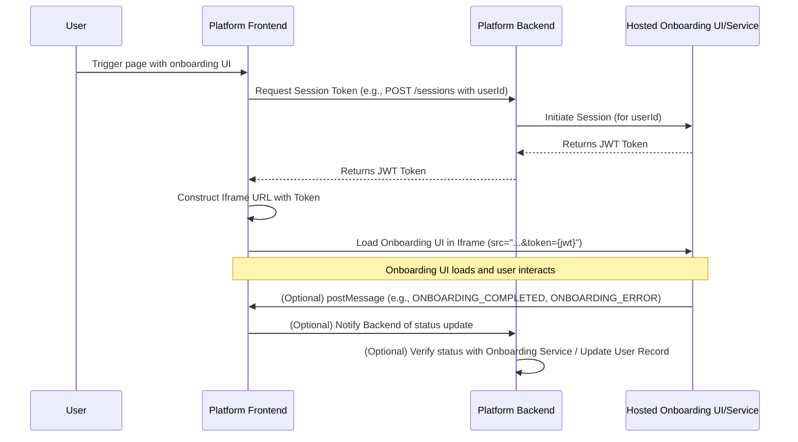

# Hosted Onboarding UI Integration Guide

This guide outlines the process for integrating the hosted Onboarding UI into
your platform.

## 1. Integration Overview

The integration involves the following key steps:

1.  **Client Status Check (Optional but Recommended):** Before initiating
    onboarding, your platform can check the client's current onboarding status
    (e.g., by calling an API endpoint like `GET /clients/:id`). If the status
    indicates that client status is INFORMATION_REQUESTED, you might show a
    specific visual indicator to the user.
2.  **Session Initiation (User Action):** When the user triggers the rendering
    of the web page with the onboarding UI (e.g., by clicking a "Wallet" or
    "Complete Onboarding" button), your platform's frontend initiates a session.
3.  **Backend Session Transfer:**
    - The frontend calls a secure backend endpoint on your platform (e.g.,
      `POST /sessions`).
    - Your backend authenticates this request.
    - It then communicates with the Onboarding Service's API to create a session
      or obtain a session token. This might involve passing user identifiers.
    - The Onboarding Service responds with a short-lived JWT token.
    - Your backend securely returns this token to your frontend.
4.  **Frontend Iframe Embedding:**
    - The frontend receives the session token.
    - It dynamically constructs the URL for the hosted Onboarding UI, appending
      the token as a query parameter (e.g.,
      `https://<host>/onboarding?token={jwt_token}`).
    - The Onboarding UI is then loaded within an `<iframe>` on your platform's
      page.
5.  **Communication (Optional):** The iframe can communicate events (e.g.,
    completion, errors, specific steps) back to the parent window using
    `window.postMessage`.



## 2. API Reference: Session Transfer

This section refers to an API endpoint **you would build on your platform's
backend** to manage the session transfer to the hosted Onboarding UI.

### Initiate Session Transfer

- **Endpoint:** `POST /sessions` (Example endpoint on your platform's backend)
- **Method:** `POST`
- **Description:** Called by your frontend to initiate an onboarding session for
  a user and retrieve a session token required to load the hosted Onboarding UI.
- **Request Payload (Example from your frontend to your backend):**
  ```json
  {
    "clientId": "sample-client-001"
  }
  ```
- **Backend Logic (Your platform's backend):**
  1.  Authenticate the request from your frontend (ensure the user is logged in
      on your platform).
  2.  Retrieve your platform's API credentials for the hosted Onboarding
      Service.
  3.  Make a secure server-to-server call to the Onboarding Service's API
      endpoint (provided by the Onboarding Service) to create a session for the
      given `clientId`. This request might include passing user details to
      pre-fill information.
  4.  The Onboarding Service's API will respond, typically with:
      - A unique session ID or inquiry ID.
      - A short-lived JWT token (or similar) to authenticate the user session
        within the iframe.
      - The URL (or components to build the URL) for the hosted Onboarding UI.
  5.  Your backend securely returns the necessary information (e.g., the JWT
      token) to your frontend.
- **Response (Example from your backend to your frontend):**
  ```json
  {
    "token": "mock-jwt-token-12345",
    "clientId": "sample-client-001"
  }
  ```

## 3. Frontend Implementation: Embedding the Onboarding UI

### 3.1. Triggering Session Transfer and Receiving Token

When the user initiates onboarding on your platform:

1.  Make an authenticated call from your frontend to your platform's backend
    endpoint (e.g., `POST /sessions` as described above).
2.  On success, your frontend receives the session token (and other necessary
    details) from your backend.
3.  Display appropriate loading indicators during this process (e.g., on the
    button that triggers the action, as seen in the `SampleDashboard.tsx`
    example).

### 3.2. Rendering the Iframe

1.  **Dynamically Construct URL:** Use the received token to build the `src` URL
    for the iframe, e.g.
    `https://<onboarding-provider-domain>/onboarding?token=${onboardingToken}`

2.  **Create and Mount Iframe (HTML/JS Example):**
    ```html
    <!-- Responsive container for the iframe -->
    <div style="position:relative; width:100%; min-height:700px;">
      <!-- Loader shown while iframe content is loading -->
      <div id="iframe-loader" style="display:flex; position:absolute; top:0; left:0; right:0; bottom:0; background:rgba(255,255,255,0.8); z-index:1; align-items:center; justify-content:center;">
        Loading Onboarding UI...
      </div>
      <iframe
        id="onboarding-iframe"
        title="Onboarding UI" /* Crucial for accessibility */
        src="YOUR_CONSTRUCTED_IFRAME_URL"
        width="100%"
        height="700" /* Adjust as needed, or manage height dynamically */
        style="border:none; display:block;" /* Initially 'display:none' or visibility hidden until loaded to prevent FOUC */
        allowfullscreen
        referrerpolicy="no-referrer" /* Recommended for security */
        onload="document.getElementById('iframe-loader').style.display='none'; this.style.visibility='visible';"
        onerror="handleIframeError()" /* Optional: Implement iframe error handling */
      ></iframe>
    </div>
    <script>
      function handleIframeError() {
        // Your error handling logic, e.g., display a message to the user
        document.getElementById('iframe-loader').innerHTML = 'Failed to load Onboarding UI. Please try again later.';
      }
    </script>
    ```
    - **React Implementation:** In a React application like
      `SampleDashboard.tsx`, you'd manage the iframe's `src`, loading state
      (`isFrameLoading`), and visibility conditionally using component state and
      the `onLoad` prop of the `iframe` element.
    - **Loading State:** Show a loader (like `iframe-loader` above or the
      `Loader` component in `SampleDashboard.tsx`) until the iframe's `onload`
      event fires.
    - **Responsiveness:** Ensure the iframe and its container are responsive.
    - **Error Handling:** Implement an `onerror` handler or use a timeout
      mechanism to detect if the iframe fails to load.

### 3.3. Iframe Security Attributes

- **`sandbox`**: Restricts the capabilities of the content within the iframe.
  This is a critical security feature. Start with the most restrictive set of
  permissions and add only what is necessary for the Onboarding UI to function.
  - `allow-scripts`: Allows the execution of JavaScript.
  - `allow-popups`: Allows content to open new windows or tabs (e.g., for OAuth
    flows or help documents). Use with caution.
  - `allow-modals`: Allows content to open modal dialogs.
- **`referrerpolicy="no-referrer"`**: Prevents the browser from sending the
  `Referer` header with requests made from the iframe. This is generally a good
  practice for privacy and security unless the provider specifically requires
  it.

### 3.4. Optional: Communication with Iframe (using `window.postMessage`)

If the Onboarding UI needs to communicate events (e.g., completion, errors,
specific steps taken, readiness) back to your host platform:

**Receiving Messages from Iframe (in your platform's frontend):**

```javascript
window.addEventListener('message', function (event) {
  // CRITICAL: ALWAYS verify the origin of the message
  // Replace 'https://your-onboarding-provider.com' with the actual origin of the Onboarding UI
  const EXPECTED_ORIGIN = 'https://your-onboarding-provider.com'; // Store this securely or derive it
  if (event.origin !== EXPECTED_ORIGIN) {
    console.warn(
      `Message received from unexpected origin: ${event.origin}. Expected: ${EXPECTED_ORIGIN}`,
    );
    return;
  }

  const data = event.data; // Data can be a string or an object. Parse if necessary.

  // Process data based on message type or content defined by the Onboarding UI provider
  if (data && data.type === 'IFRAME_LOADED') {
    console.log('Onboarding Iframe Loaded and Ready (via postMessage)');
    // You can use this signal to hide your primary loader if it's more reliable than iframe.onload
  } else if (data && data.type === 'ONBOARDING_COMPLETED') {
    console.log('Onboarding Completed:', data.payload);
    // Handle success: update UI on your platform, notify your backend to update status
  } else if (data && data.type === 'ONBOARDING_STEP_CHANGED') {
    console.log('Onboarding Step Changed:', data.payload);
    // Optionally react to step changes
  } else if (data && data.type === 'ONBOARDING_ERROR') {
    console.error('Onboarding Error reported from iframe:', data.payload);
    // Handle error: show an error message to the user, allow retry, notify backend
  }
  // ... other event types based on Onboarding UI documentation
});
```

- **Origin Verification:** `event.origin` **MUST** be strictly checked against
  the expected origin of the Onboarding UI. Do not use wildcard `*`.
- **Data Handling:** The structure of `event.data` is defined by the Onboarding
  UI provider. It might be a JSON string that needs parsing or an object. Always
  validate and sanitize the data.

**Sending Messages to Iframe (Less common if token is passed in `src`):** If you
need to send information to the iframe after it has loaded:

```javascript
const onboardingIframe = document.getElementById('onboarding-iframe'); // Get the iframe element
const IFRAME_TARGET_ORIGIN = 'https://onboarding-ui-provider.com';

// Ensure iframe is loaded and you have its contentWindow
if (onboardingIframe && onboardingIframe.contentWindow) {
  onboardingIframe.contentWindow.postMessage(
    {
      type: 'YOUR_MESSAGE_TYPE',
      payload: {
        /* ... */
      },
    },
    IFRAME_TARGET_ORIGIN, // CRITICAL: Specify the target origin
  );
}
```

## 4. Platform Implementation Guidance (Your Responsibilities)

### 4.1. Service Layer (Your Platform's Backend)

- **Responsibilities:**
  - Implement the secure backend endpoint (e.g., `/sessions`) for your frontend
    to call.
  - Authenticate requests from your frontend to this endpoint.
  - Securely store and manage API keys or credentials needed to interact with
    the Onboarding Service's backend API.
  - Call the Onboarding Service's API to initiate a session and obtain a session
    token.
  - Handle errors from the Onboarding Service API gracefully.
  - Return the session token (and any other necessary data) to your frontend.
  - **Webhook Handling (If applicable):** If the Onboarding Service uses
    webhooks to send final status updates:
    - Implement a secure webhook ingestion endpoint on your backend.
    - Verify webhook authenticity (e.g., using cryptographic signatures, IP
      whitelisting).
    - Process the status and update the user's record in your platform's
      database. Correlate the webhook data to the correct user.
  - **Status Update Endpoint (If frontend relays status):** If your frontend
    receives status updates via `postMessage` and then informs your backend:
    - Implement an endpoint (e.g., `/update-status`) for your frontend.
    - **CRITICAL:** Your backend should, if possible, re-verify this status
      directly with the Onboarding Service using a server-to-server API call
      (using the session/inquiry ID) before marking the onboarding as complete
      in your database. This prevents client-side tampering.

### 4.2. Representation Layer (Your Platform's Frontend UI)

- **Responsibilities:**
  - Provide a UI element (e.g., button) for the user to initiate the onboarding
    process.
  - Call your platform's backend to get the session token.
  - Dynamically create and render the `<iframe>` with the correct `src` URL
    (including the token) and security attributes.
  - Manage loading states:
    - While waiting for the session token from your backend.
    - While the `<iframe>` content is loading (e.g., using the `onLoad` event
      and/or `postMessage` signals like `IFRAME_LOADED`).
  - Handle and display errors (e.g., if token generation fails, iframe fails to
    load, or errors are reported from the iframe via `postMessage`).
  - Implement `postMessage` event listeners to react to messages from the
    iframe.
  - Ensure the iframe is responsive and accessible.
  - (Optional) Provide a UI control to refresh the session (get a new token and
    reload the iframe), as shown in `SampleDashboard.tsx`.

## 5. Handling Onboarding Results & Session State

- **Receiving Status:**
  - **`postMessage` (from iframe to parent window):** For real-time UI updates
    and intermediate statuses.
  - **Webhooks (from Onboarding Service backend to your platform backend):**
    Often preferred for definitive, secure confirmation of the final onboarding
    status (e.g., APPROVED, DECLINED).
- **Updating User Status in Your Platform's Database:**
  - Once the final KYC/onboarding status is confirmed (ideally via webhook or
    backend-to-backend verification):
- Store the status (e.g., NEW, APPROVED, DECLINED, REVIEW_IN_PROGRESS,
      INFORMATION_REQUESTED).
    - Store any relevant identifiers from the Onboarding Service (e.g.,
      verification ID, report ID).
    - Timestamp the verification.
  - Update the user's access or UI on your platform based on their new status.
- **Handling Re-entry and Different Statuses:**
  - If a user re-enters the onboarding flow, your system (and potentially the
    Onboarding UI, if it supports it) should handle their current status
    gracefully (e.g., resume an incomplete application, show a "Submitted,
    awaiting review" page instead of restarting the flow).

## 6. Security & Testing Considerations

### 6.1. Iframe Security Best Practices

- **`sandbox` Attribute:** Essential. Apply the principle of least privilege.
- **`allow` Attribute:** Only grant necessary device permissions and scope them
  to the Onboarding UI's origin. Not required for this integration.
- **Content Security Policy (CSP) Headers (Your Platform):**
  - `frame-src <onboarding-ui-domain.com>;` Restricts where iframes can be
    loaded from on your pages.

### 6.2. `postMessage` Security

- **Always Validate `event.origin`:** This is the most critical check when
  receiving messages.
- **Always Specify `targetOrigin`:** When sending messages, use the specific
  target origin, not `*`.
- **Validate and Sanitize `event.data`:** Treat incoming data as untrusted.
  Validate its structure and content. Sanitize before rendering in HTML to
  prevent XSS.

### 6.3. API Security (Your Backend & Calls to Onboarding Service)

- Use HTTPS for all communication.
- Authenticate and authorize all API calls.
- Securely manage and store API keys/secrets.
- Implement input validation, rate limiting, and robust error handling.

### 6.4. Testing

- Thoroughly test the end-to-end flow for:
  - Successful onboarding.
  - Various failure scenarios (e.g., invalid documents, technical errors, user
    cancellation).
  - "REVIEW_IN_PROGRESS" and loading statuses.
- Use test environments and test data/scenario triggers provided by
  the Onboarding Service.
- Optional: Test `postMessage` communication: ensure messages from incorrect
  origins are rejected and messages to incorrect target origins are not sent
  (or handled appropriately).
- Test iframe security attributes: verify they restrict capabilities as intended.
- Conduct security testing (e.g., penetration testing) focusing on the iframe
  boundary, session management, and API interactions. Check for OWASP Top 10
  vulnerabilities.
