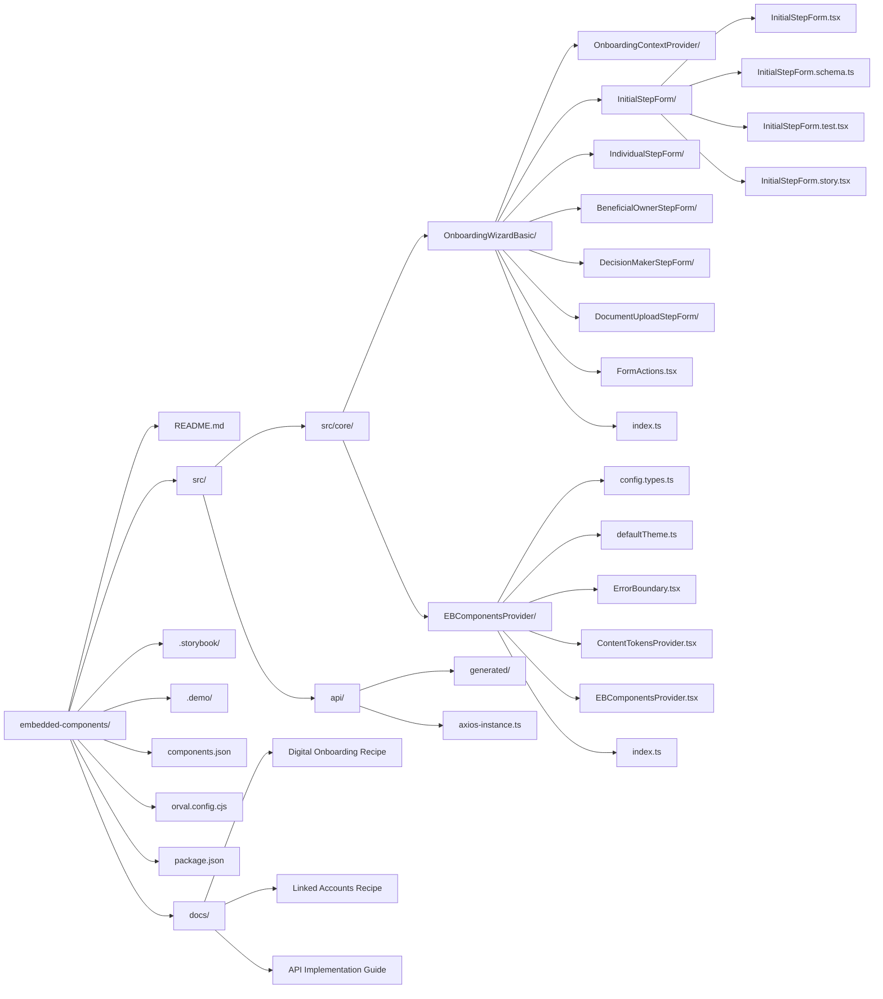

# Embedded Finance Components Architecture Overview

Below is a mermaid diagram representing the key components and file structure related to the Embedded Finance Components project, with special focus on the OnboardingWizardBasic and EBComponentsProvider components.

## Component Architecture Explanation

### 1. OnboardingWizardBasic
Key component for handling digital onboarding flows with the following structure:

- **OnboardingContextProvider/**
  - Manages global onboarding state
  - Handles client configuration (clientId, partyId, jurisdictions, etc.)
  - Provides context for step management

- **Individual Step Components/**
  Each step component (InitialStepForm, IndividualStepForm, etc.) follows a consistent structure:
  - `StepName.tsx`: Main component implementation
  - `StepName.schema.ts`: Zod validation schema
  - `StepName.test.tsx`: Component tests
  - `StepName.story.tsx`: Storybook documentation

- **FormActions.tsx**
  - Controls step navigation
  - Handles form submission
  - Manages loading and disabled states

### 2. EBComponentsProvider
Core provider component that configures the application environment:

- **config.types.ts**
  - Defines configuration interface
  - API configuration types
  - Theme customization options
  - Header management types

- **defaultTheme.ts**
  - Default theme configuration
  - Color scheme definitions
  - Typography settings
  - Spacing and layout variables

- **ErrorBoundary.tsx**
  - Global error handling
  - Fallback UI components
  - Error logging and reporting

- **ContentTokensProvider.tsx**
  - Internationalization support
  - Custom content management
  - Token override capabilities

### Supporting Structure

- **api/**
  - Generated API clients
  - Axios configuration
  - Type definitions

- **.storybook/**
  - Component documentation
  - Interactive examples
  - Development environment

- **docs/**
  - Implementation recipes
  - Best practices
  - Integration guides
