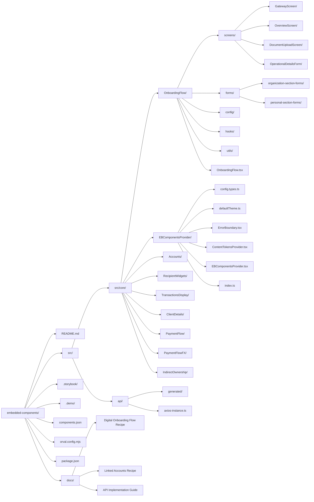

# Embedded Finance Components Architecture Overview

Below is a mermaid diagram representing the key components and file structure related to the Embedded Finance Components project, with focus on the OnboardingFlow and EBComponentsProvider components.

```mermaid
graph LR;
    %% Root Structure
    A[embedded-components/] --> B[README.md]
    A --> C[src/]
    A --> G[.storybook/]
    A --> J[.demo/]
    A --> M[components.json]
    A --> N[orval.config.mjs]
    A --> O[package.json]
    A --> P[docs/]

    %% Core Components
    C --> CORE[src/core/]

    %% OnboardingFlow Structure
    CORE --> OF[OnboardingFlow/]
    OF --> OF1[screens/]
    OF --> OF2[forms/]
    OF --> OF3[config/]
    OF --> OF4[hooks/]
    OF --> OF5[utils/]
    OF --> OF6[OnboardingFlow.tsx]

    %% Screen Structure
    OF1 --> SCR1[GatewayScreen/]
    OF1 --> SCR2[OverviewScreen/]
    OF1 --> SCR3[DocumentUploadScreen/]
    OF1 --> SCR4[OperationalDetailsForm/]

    %% Forms Structure
    OF2 --> FRM1[organization-section-forms/]
    OF2 --> FRM2[personal-section-forms/]

    %% EBComponentsProvider Structure
    CORE --> ECP[EBComponentsProvider/]
    ECP --> ECP1[config.types.ts]
    ECP --> ECP2[defaultTheme.ts]
    ECP --> ECP3[ErrorBoundary.tsx]
    ECP --> ECP4[ContentTokensProvider.tsx]
    ECP --> ECP5[EBComponentsProvider.tsx]
    ECP --> ECP6[index.ts]

    %% Other Core Components
    CORE --> ACC[Accounts/]
    CORE --> RW[RecipientWidgets/]
    CORE --> TD[TransactionsDisplay/]
    CORE --> CD[ClientDetails/]
    CORE --> PF[PaymentFlow/]
    CORE --> PFX[PaymentFlowFX/]
    CORE --> IO[IndirectOwnership/]

    %% API Layer
    C --> D[api/]
    D --> E[generated/]
    D --> F[axios-instance.ts]

    %% Documentation
    P --> DOC1[Digital Onboarding Flow Recipe]
    P --> DOC2[Linked Accounts Recipe]
    P --> DOC3[API Implementation Guide]

```

## Component Architecture Explanation

### 1. OnboardingFlow

Modern onboarding component with screen-based navigation and enhanced state management:

- **screens/**
  - `GatewayScreen/` — Organization type selection and PTC (Publicly Traded Company) flow
  - `OverviewScreen/` — Onboarding progress overview with section status
  - `DocumentUploadScreen/` — Document upload with drag-and-drop and preview
  - `OperationalDetailsForm/` — Operational and business details

- **forms/**
  Each form follows a consistent structure:
  - `FormName.tsx`: Main component implementation
  - `FormName.schema.ts`: Zod validation schema
  - `FormName.test.tsx`: Component tests

- **config/**
  - Field mapping configuration
  - Party field definitions
  - Flow routing logic

- **hooks/**
  - Flow state management
  - Navigation control
  - API interaction hooks

### 2. EBComponentsProvider

Core provider component that configures the application environment:

- **config.types.ts**
  - Defines configuration interface
  - API configuration types
  - Theme customization options
  - Header management types

- **defaultTheme.ts**
  - Default theme configuration
  - Color scheme definitions
  - Typography settings
  - Spacing and layout variables

- **ErrorBoundary.tsx**
  - Global error handling
  - Fallback UI components
  - Error logging and reporting

### 3. Other Core Components

- **Accounts/** — Account management and display
- **PaymentFlow/** — Domestic USD payment / funds transfer (`PaymentFlow`, `PaymentFlowInline`)
- **PaymentFlowFX/** — Cross-border / FX payouts (**Beta**: `PaymentFlowFX`, `PaymentFlowFXInline`)
- **RecipientWidgets/** — Payment recipient and linked account management
  - `LinkedAccountWidget/` — External bank account linking with microdeposit verification
  - `RecipientsWidget/` — Payment recipient management
- **TransactionsDisplay/** — Transaction history and display
- **ClientDetails/** — Detailed client information display
- **IndirectOwnership/** — Ownership hierarchy UI (internal; not yet in public package exports)

- **ContentTokensProvider.tsx**
  - Internationalization support
  - Custom content management
  - Token override capabilities

### Supporting Structure

- **api/**
  - Generated API clients
  - Axios configuration
  - Type definitions

- **.storybook/**
  - Component documentation
  - Interactive examples
  - Development environment

### Removed components (historical)

Do not document as current APIs: `MakePayment` → `PaymentFlow`; `OnboardingWizardBasic` → `OnboardingFlow`; legacy `Recipients` / `RecipientListWidget` → `RecipientsWidget` / `LinkedAccountWidget`.

- **docs/**
  - Implementation recipes
  - Best practices
  - Integration guides
