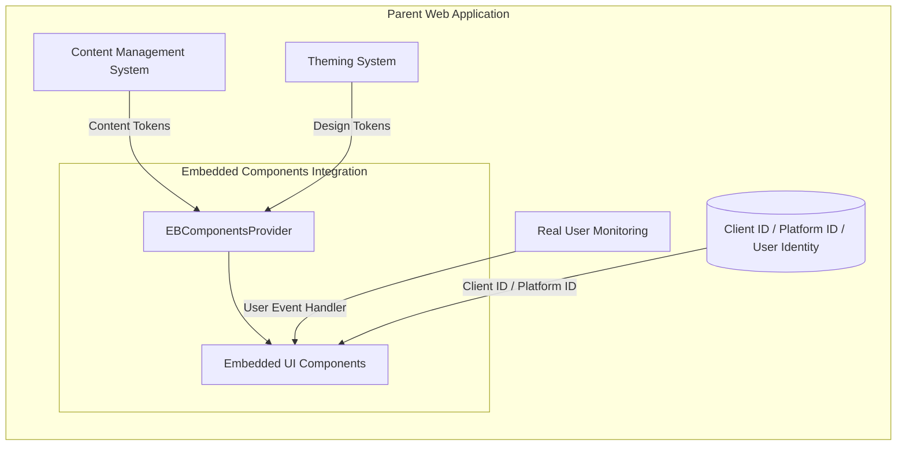
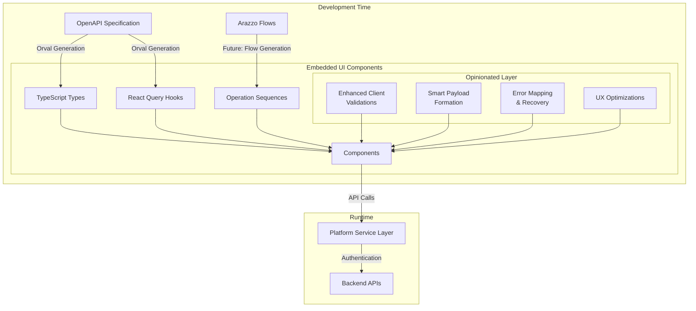

# Embedded UI Components

## 🚧 Pre-release Version Notice

Embedded UI Components and this guide is currently in draft form and under active development. Components are not ready for production use and may change significantly until version 1.x.x is released. Please consider this document as a work in progress.

### ADA Compliance Disclaimer

While we strive to incorporate ADA (Americans with Disabilities Act) best practices, please note that developers are responsible for conducting their own comprehensive ADA testing to ensure full compliance with all applicable standards and regulations.

## Overview

The Embedded UI Components library offers a seamless way to integrate sophisticated UI capabilities into your existing web applications, providing a plug-and-play solution for Embedded Finance features.

## Important Usage Notes

**All Embedded UI Components must be wrapped within the `EBComponentsProvider`.** The `EBComponentsProvider` is specifically designed for these components and is not applicable to any other client components in your application.

## Main Embedded UI Components Architecture Concepts

The library is built on several key architectural concepts:

### Integration Scenarios and Use Cases

The Embedded UI Components are designed for flexible integration into parent web applications, offering several customization points:



#### Integration Flexibility

1. **Runtime Customization**
   - Inject design tokens to match parent app's theme or use the default ones
   - Override content tokens from parent app's CMS systems or any other source
   - Connect to parent app's monitoring via `userEventsHandler`

2. **Component Configuration**
   - Configure API endpoints via provider
   - Customize component behavior through props

3. **Client ID / Platform ID** (only for onboarding components)
   - Onboarding Embedded UI Components can be used in fully controlled (client ID is provided and managed by the parent app) or uncontrolled (client ID is created from scratch by the embedded component) mode
   - In uncontrolled mode the embedded component will create a new client and it is recommended to manage its lifecycle via the `onPostClientSettled` callback prop

#### Future Extensibility

1. **Field Configuration**
   - Externalization of field mapping logic
   - Custom field validation rules
   - Dynamic form layout configuration
   - Validation rules can be overridden from the parent app

2. **Workflow Customization**
   - Integration with Arazzo workflow definitions
   - Custom step sequencing
   - Conditional flow logic

### Overall Logical Composition Diagram

**Note:** The following diagram illustrates the component architecture using the onboarding wizard as an example:



### Key Principles

1. **OpenAPI Specification (OAS) & Future Arazzo Flows**
   - OAS defines API contracts and types
   - Serves as source of truth for API interfaces
   - Generates TypeScript types and React Query hooks
   - Future: Arazzo Flows will enable automated flow generation (not currently available)

2. **Automated Code Generation**
   - Currently, Orval generates from OAS:
     - TypeScript interfaces
     - Type-safe React Query hooks
     - API client utilities
   - Ensures type consistency between API and UI

3. **Other utility functions**

   Built using generated types and hooks with an opinionated layer providing:
   - Enhanced client validations based on API specifications
   - Smart payload formation
   - Error mapping & recovery
   - UX optimizations implemented based on best practices:
     - Smart field prepopulation
     - Cognitive load reduction
     - Intelligent navigation

## Embedded UI Components

The library currently provides the following components:

### EBComponentsProvider

The `EBComponentsProvider` is a crucial wrapper component that must be placed at the top level of your Embedded UI Components implementation. It handles authentication, applies theming, and provides necessary context to all child Embedded UI Components.
It is using @tanstack/react-query for handling API calls and authentication as well as Orval generated types for the API requests and responses.

#### Key Props:

- `apiBaseUrl`: The base URL for API calls (required)
- `theme`: Customization options for the components' appearance (optional)
- `headers`: Custom headers for API requests (optional)
- `queryParams`: Custom query parameters for API requests (optional)
- `contentTokens`: Custom content tokens for internationalization (optional)

#### Usage:

```jsx
import { EBComponentsProvider } from '@jpmorgan-payments/embedded-finance-components';

const EmbeddedFinanceSection = () => {
  return (
    <EBComponentsProvider
      apiBaseUrl="https://your-api-base-url.com"
      theme={{
        colorScheme: 'light',
        variables: {
          primaryColor: '#007bff',
          fontFamily: 'Arial, sans-serif',
        },
      }}
      headers={{
        'Custom-Header': 'value',
      }}
      queryParams={{
        'custom-param': 'value',
      }}
      contentTokens={{
        name: 'enUS',
      }}
    >
      {/* Your Embedded UI Components go here */}
    </EBComponentsProvider>
  );
};
```

### 1. OnboardingWizardBasic

The `OnboardingWizardBasic` component implements the client onboarding process as described in the [Embedded Payments API documentation](https://developer.payments.jpmorgan.com/docs/embedded-finance-solutions/embedded-payments/capabilities/onboard-a-client).

#### Main Features:

- Create a client profile
- Incrementally update client's related parties
- Complete due diligence questions
- Handle client attestations
- Manage requests for additional documentation
- Check and display onboarding status

#### Props:

| Prop Name                          | Type                                                                                                                                      | Required | Description                                             |
| ---------------------------------- | ----------------------------------------------------------------------------------------------------------------------------------------- | -------- | ------------------------------------------------------- |
| `initialClientId`                  | `string`                                                                                                                                  | No       | Initial client ID for existing client onboarding        |
| `onSetClientId`                    | `(clientId: string) => Promise<void>`                                                                                                     | No       | Callback function when client ID is set                 |
| `onGetClientSettled`               | `(clientData: ClientResponse \| undefined, status: 'success' \| 'pending' \| 'error', error: ErrorType<SchemasApiError> \| null) => void` | No       | Callback function triggered when client data is fetched |
| `onPostClientSettled`              | `(response?: ClientResponse, error?: ApiError) => void`                                                                                   | No       | Callback function for client creation response          |
| `onPostPartySettled`               | `(response?: PartyResponse, error?: ApiError) => void`                                                                                    | No       | Callback function for party creation response           |
| `onPostClientVerificationsSettled` | `(response?: ClientVerificationResponse, error?: ApiError) => void`                                                                       | No       | Callback function for client verification response      |
| `availableProducts`                | `Array<ClientProduct>`                                                                                                                    | Yes      | List of available products for onboarding               |
| `availableJurisdictions`           | `Array<Jurisdiction>`                                                                                                                     | Yes      | List of available jurisdictions for onboarding          |
| `availableOrganizationTypes`       | `Array<OrganizationType>`                                                                                                                 | No       | List of available organization types                    |
| `usePartyResource`                 | `boolean`                                                                                                                                 | No       | Whether to use party resource for onboarding            |
| `blockPostVerification`            | `boolean`                                                                                                                                 | No       | Whether to block post-verification steps                |
| `showLinkedAccountPanel`           | `boolean`                                                                                                                                 | No       | Whether to show linked account panel                    |
| `initialStep`                      | `number`                                                                                                                                  | No       | Initial step to start onboarding from                   |
| `variant`                          | `'circle' \| 'circle-alt' \| 'line'`                                                                                                      | No       | Visual variant of the stepper component                 |
| `onboardingContentTokens`          | `DeepPartial<typeof defaultResources['enUS']['onboarding']>`                                                                              | No       | Custom content tokens for onboarding                    |
| `alertOnExit`                      | `boolean`                                                                                                                                 | No       | Whether to show alert when exiting onboarding           |
| `userEventsToTrack`                | `string[]`                                                                                                                                | No       | List of user events to track                            |
| `userEventsHandler`                | `({ actionName }: { actionName: string }) => void`                                                                                        | No       | Handler for user events                                 |

#### Usage:

```jsx
import {
  EBComponentsProvider,
  OnboardingWizardBasic,
} from '@jpmorgan-payments/embedded-finance-components';

const OnboardingSection = () => {
  const [clientId, setClientId] = useManageClientExternalState();

  const handlePostClientResponse = ({ response, error }) => {
    // Handle client creation response or error
    setClientId(response.id);
  };

  const handlePostClientVerificationsResponse = ({ clientId, error }) => {
    // Handle post client verifications response or error
  };

  return (
    <EBComponentsProvider apiBaseUrl="https://your-api-base-url.com">
      <OnboardingWizardBasic
        title="Client Onboarding"
        initialClientId={clientId}
        onPostClientSettled={handlePostClientResponse}
        onPostClientVerificationSettled={handlePostClientVerificationsResponse}
        availableProducts={['EMBEDDED_PAYMENTS']}
        availableJurisdictions={['US']}
        variant="circle-alt"
        initialStep={0}
        showLinkedAccountPanel={true}
        userEventsToTrack={['click']}
        userEventsHandler={({ actionName }) => {
          // Track user events
          console.log(`User action: ${actionName}`);
        }}
      />
    </EBComponentsProvider>
  );
};
```

### 2. OnboardingFlow

The `OnboardingFlow` component provides a modern, enhanced onboarding experience with improved UX and better flow management. It represents the next generation of the onboarding process with screen-based navigation and enhanced state management.

#### Main Features:

- Screen-based navigation with flow control
- Enhanced document upload with preview and drag-and-drop
- Improved mobile responsiveness
- Better error handling and recovery
- Streamlined user experience with intelligent navigation
- Support for document-only onboarding mode

#### Props:

| Prop Name                          | Type                                                                                                                                      | Required | Description                                             |
| ---------------------------------- | ----------------------------------------------------------------------------------------------------------------------------------------- | -------- | ------------------------------------------------------- |
| `initialClientId`                  | `string`                                                                                                                                  | No       | Initial client ID for existing client onboarding        |
| `onGetClientSettled`               | `(clientData: ClientResponse \| undefined, status: 'success' \| 'pending' \| 'error', error: ErrorType<SchemasApiError> \| null) => void` | No       | Callback function triggered when client data is fetched |
| `onPostClientSettled`              | `(response?: ClientResponse, error?: ApiError) => void`                                                                                   | No       | Callback function for client creation response          |
| `onPostPartySettled`               | `(response?: PartyResponse, error?: ApiError) => void`                                                                                    | No       | Callback function for party creation response           |
| `onPostClientVerificationsSettled` | `(response?: ClientVerificationResponse, error?: ApiError) => void`                                                                       | No       | Callback function for client verification response      |
| `availableProducts`                | `Array<ClientProduct>`                                                                                                                    | Yes      | List of available products for onboarding               |
| `availableJurisdictions`           | `Array<Jurisdiction>`                                                                                                                     | Yes      | List of available jurisdictions for onboarding          |
| `availableOrganizationTypes`       | `Array<OrganizationType>`                                                                                                                 | No       | List of available organization types                    |
| `usePartyResource`                 | `boolean`                                                                                                                                 | No       | Whether to use party resource for onboarding            |
| `blockPostVerification`            | `boolean`                                                                                                                                 | No       | Whether to block post-verification steps                |
| `docUploadOnlyMode`                | `boolean`                                                                                                                                 | No       | Whether to show only document upload screens            |
| `height`                           | `string`                                                                                                                                  | No       | Minimum height for the component container              |
| `onboardingContentTokens`          | `DeepPartial<typeof defaultResources['enUS']['onboarding']>`                                                                              | No       | Custom content tokens for onboarding                    |
| `alertOnExit`                      | `boolean`                                                                                                                                 | No       | Whether to show alert when exiting onboarding           |
| `userEventsToTrack`                | `string[]`                                                                                                                                | No       | List of user events to track                            |
| `userEventsHandler`                | `({ actionName }: { actionName: string }) => void`                                                                                        | No       | Handler for user events                                 |

#### Usage:

```jsx
import {
  EBComponentsProvider,
  OnboardingFlow,
} from '@jpmorgan-payments/embedded-finance-components';

const OnboardingSection = () => {
  return (
    <EBComponentsProvider apiBaseUrl="https://your-api-base-url.com">
      <OnboardingFlow
        initialClientId="your-client-id"
        availableProducts={['EMBEDDED_PAYMENTS']}
        availableJurisdictions={['US']}
        height="100vh"
        onPostClientSettled={(response, error) => {
          // Handle client creation
        }}
        docUploadOnlyMode={false}
        alertOnExit={true}
      />
    </EBComponentsProvider>
  );
};
```

### 3. Accounts

> **⚠️ In Testing**: This component is currently in testing state and could be not fully integrated with the OpenAPI Specification (OAS) or missing some target state functional/non-functional capabilities. It could be subject to significant changes.

The `Accounts` component provides a read-only, responsive UI for displaying all accounts associated with a client, including their categories, states, routing information, and balances.

#### Main Features:

- Display accounts with categories, states, and routing information
- Show account balances (ITAV, ITBD) with human-friendly labels
- Filter accounts by category via props
- Responsive layout with mobile support
- Loading states and error handling
- Masked account numbers for security

#### Props:

| Prop Name           | Type       | Required | Description                             |
| ------------------- | ---------- | -------- | --------------------------------------- |
| `allowedCategories` | `string[]` | Yes      | Array of account categories to display  |
| `clientId`          | `string`   | No       | Client ID to filter accounts            |
| `title`             | `string`   | No       | Optional title for the accounts section |

#### Usage:

```jsx
import {
  Accounts,
  EBComponentsProvider,
} from '@jpmorgan-payments/embedded-finance-components';

const AccountsSection = () => {
  return (
    <EBComponentsProvider apiBaseUrl="https://your-api-base-url.com">
      <Accounts
        allowedCategories={['LIMITED_DDA', 'LIMITED_DDA_PAYMENTS']}
        clientId="your-client-id"
        title="My Accounts"
      />
    </EBComponentsProvider>
  );
};
```

### 4. Recipients

The `Recipients` component provides comprehensive management of payment recipients, enabling users to create, view, edit, and delete recipient information. It now supports integration with the MakePayment component for seamless payment workflows.

#### Main Features:

- Create, view, edit, and delete payment recipients
- Support for multiple payment methods (ACH, WIRE, RTP)
- Dynamic form validation based on selected payment methods
- Search and filtering capabilities
- Pagination for large recipient lists
- Mobile-responsive design
- **NEW**: Integration with MakePayment component for direct payment initiation
- **NEW**: Widget mode for compact display in parent applications

#### Props:

| Prop Name                | Type              | Required | Description                                                            |
| ------------------------ | ----------------- | -------- | ---------------------------------------------------------------------- |
| `clientId`               | `string`          | No       | Optional client ID filter                                              |
| `initialRecipientType`   | `string`          | No       | Default recipient type (RECIPIENT, LINKED_ACCOUNT, SETTLEMENT_ACCOUNT) |
| `showCreateButton`       | `boolean`         | No       | Show/hide create functionality                                         |
| `config`                 | `object`          | No       | Configuration for payment methods and validation rules                 |
| `makePaymentComponent`   | `React.ReactNode` | No       | MakePayment component to render in each recipient card/row             |
| `onRecipientCreated`     | `function`        | No       | Callback when recipient is created                                     |
| `onRecipientUpdated`     | `function`        | No       | Callback when recipient is updated                                     |
| `onRecipientDeactivated` | `function`        | No       | Callback when recipient is deactivated                                 |
| `userEventsHandler`      | `function`        | No       | Handler for user events                                                |
| `isWidget`               | `boolean`         | No       | Force widget layout with minimal columns and no filters                |

#### Usage:

```jsx
import {
  EBComponentsProvider,
  MakePayment,
  Recipients,
} from '@jpmorgan-payments/embedded-finance-components';

const RecipientsSection = () => {
  return (
    <EBComponentsProvider apiBaseUrl="https://your-api-base-url.com">
      <Recipients
        clientId="your-client-id"
        initialRecipientType="RECIPIENT"
        showCreateButton={true}
        makePaymentComponent={
          <MakePayment
            triggerButtonVariant="link"
            onTransactionSettled={(response, error) => {
              console.log('Payment completed:', response);
            }}
          />
        }
        onRecipientCreated={(recipient) => {
          console.log('Recipient created:', recipient);
        }}
      />
    </EBComponentsProvider>
  );
};
```

### 5. LinkedAccountWidget

The `LinkedAccountWidget` component facilitates the process of adding a client's linked account, as described in the [Add Linked Account API documentation](https://developer.payments.jpmorgan.com/docs/embedded-finance-solutions/embedded-payments/capabilities/embedded-payments/how-to/add-linked-account).

#### Main Features:

- Add and manage external linked bank accounts for clients
- Handle complex micro-deposits initiation logic
- Support for multiple account types and verification methods
- **NEW**: Integration with MakePayment component for direct payment initiation
- **NEW**: Single account mode for focused workflows

#### Props:

| Prop Name                | Type                                                | Required | Description                                                         |
| ------------------------ | --------------------------------------------------- | -------- | ------------------------------------------------------------------- |
| `variant`                | `'default' \| 'singleAccount'`                      | No       | Display variant for different use cases                             |
| `showCreateButton`       | `boolean`                                           | No       | Show/hide create functionality                                      |
| `makePaymentComponent`   | `React.ReactNode`                                   | No       | MakePayment component to render in each linked account card         |
| `onLinkedAccountSettled` | `(recipient?: Recipient, error?: ApiError) => void` | No       | Callback function for linked account creation/verification response |

#### Usage:

```jsx
import {
  EBComponentsProvider,
  LinkedAccountWidget,
  MakePayment,
} from '@jpmorgan-payments/embedded-finance-components';

const LinkedAccountSection = () => {
  return (
    <EBComponentsProvider apiBaseUrl="https://your-api-base-url.com">
      <LinkedAccountWidget
        variant="default"
        makePaymentComponent={
          <MakePayment
            triggerButtonVariant="link"
            onTransactionSettled={(response, error) => {
              console.log('Payment completed:', response);
            }}
          />
        }
      />
    </EBComponentsProvider>
  );
};
```

### 6. MakePayment

> **⚠️ In Testing**: This component is currently in testing state and could be not fully integrated with the OpenAPI Specification (OAS) or missing some target state functional/non-functional capabilities. It could be subject to significant changes.

The `MakePayment` component provides a comprehensive payment interface that allows users to initiate payments between accounts with various payment methods. It can be used standalone or integrated into other components like Recipients and LinkedAccountWidget.

#### Main Features:

- Payment initiation with multiple payment methods (ACH, RTP, WIRE)
- Fee calculation and display
- Form validation and error handling
- Success confirmation and repeat payment functionality
- Customizable payment methods and fees
- Auto-selection for single options
- **NEW**: Integration with Recipients and LinkedAccountWidget components
- **NEW**: Pre-selection of recipients based on account compatibility
- **NEW**: Real-time account balance validation
- **NEW**: Support for different trigger button variants

#### Props:

| Prop Name              | Type                                                                          | Required | Description                                      |
| ---------------------- | ----------------------------------------------------------------------------- | -------- | ------------------------------------------------ |
| `triggerButton`        | `React.ReactNode`                                                             | No       | Custom trigger button for opening payment dialog |
| `triggerButtonVariant` | `'default' \| 'destructive' \| 'outline' \| 'secondary' \| 'ghost' \| 'link'` | No       | Button variant for trigger button                |
| `accounts`             | `Array<{ id: string; name: string }>`                                         | No       | List of available accounts to pay from           |
| `recipients`           | `Array<{ id: string; name: string; accountNumber: string }>`                  | No       | List of available recipients                     |
| `paymentMethods`       | `Array<{ id: string; name: string; fee: number; description?: string }>`      | No       | List of available payment methods with fees      |
| `icon`                 | `string`                                                                      | No       | Icon name from Lucide React icons                |
| `recipientId`          | `string`                                                                      | No       | Optional recipient ID to pre-select              |
| `onTransactionSettled` | `(response?: TransactionResponseV2, error?: ApiErrorV2) => void`              | No       | Callback when transaction is completed           |

#### Usage:

```jsx
import {
  EBComponentsProvider,
  MakePayment,
} from '@jpmorgan-payments/embedded-finance-components';

const PaymentSection = () => {
  return (
    <EBComponentsProvider apiBaseUrl="https://your-api-base-url.com">
      <MakePayment
        triggerButtonVariant="link"
        accounts={[
          { id: 'account1', name: 'Main Account' },
          { id: 'account2', name: 'Savings Account' },
        ]}
        recipients={[
          {
            id: 'recipient1',
            name: 'John Doe',
            accountNumber: '****1234',
          },
        ]}
        paymentMethods={[
          { id: 'ACH', name: 'ACH Transfer', fee: 2.5 },
          { id: 'WIRE', name: 'Wire Transfer', fee: 25.0 },
        ]}
        icon="CirclePlus"
        onTransactionSettled={(response, error) => {
          if (response) {
            console.log('Payment successful:', response);
          } else {
            console.error('Payment failed:', error);
          }
        }}
      />
    </EBComponentsProvider>
  );
};
```

### 7. TransactionsDisplay

> **⚠️ In Testing**: This component is currently in testing state and could be not fully integrated with the OpenAPI Specification (OAS) or missing some target state functional/non-functional capabilities. It could be subject to significant changes.

The `TransactionsDisplay` component provides a comprehensive view of transaction history with detailed information and filtering capabilities.

#### Main Features:

- Transaction listing with sorting and filtering
- Transaction details view with expandable information
- Support for different transaction types (PAYIN/PAYOUT)
- Currency formatting and localization
- Pagination and search capabilities
- Mobile-responsive design

#### Props:

| Prop Name   | Type     | Required | Description                          |
| ----------- | -------- | -------- | ------------------------------------ |
| `accountId` | `string` | Yes      | Account ID to fetch transactions for |

#### Usage:

```jsx
import {
  EBComponentsProvider,
  TransactionsDisplay,
} from '@jpmorgan-payments/embedded-finance-components';

const TransactionsSection = () => {
  return (
    <EBComponentsProvider apiBaseUrl="https://your-api-base-url.com">
      <TransactionsDisplay accountId="your-account-id" />
    </EBComponentsProvider>
  );
};
```

## Theming

The library supports comprehensive theming through the EBComponentsProvider. Components can be styled to match your application's design system using semantic design tokens.

### Design Token System

The design token naming follows the [Salt Design System](https://www.saltdesignsystem.com/salt/themes/design-tokens/how-to-read-tokens) semantic nomenclature. Tokens are organized by **characteristics** that group tokens sharing the same purpose or intent.

#### Token Format

```
[characteristic][Specifier][Variant][Property][State]
```

- **Characteristic** (required): Groups tokens by purpose (e.g., `actionable`, `container`, `content`)
- **Specifier**: Subset within a characteristic (e.g., `Primary`, `Secondary`)
- **Variant**: Variation within a set (e.g., `Accent`)
- **Property** (required): UI attribute (e.g., `Background`, `Foreground`, `BorderColor`)
- **State**: Element condition (e.g., `Hover`, `Active`)

#### Characteristics

| Characteristic | Purpose                                              |
| -------------- | ---------------------------------------------------- |
| `content`      | Typography and text properties                       |
| `container`    | Surfaces, backgrounds, and layout areas              |
| `actionable`   | Interactive elements (buttons, links)                |
| `editable`     | Form inputs and text fields                          |
| `overlayable`  | Popovers, dialogs, tooltips                          |
| `navigable`    | Sidebars and navigation elements                     |
| `separable`    | Borders and dividers                                 |
| `focused`      | Focus ring indicators                                |
| `sentiment`    | Emotional states (negative, positive, caution)       |
| `status`       | Informational states (info, error, success, warning) |
| `accent`       | Highlight and metric colors                          |

### Theme Configuration

The `EBComponentsProvider` accepts a `theme` prop with these properties:

- `colorScheme`: `'dark'` | `'light'` | `'system'`
- `variables`: Tokens applied to all color schemes
- `light`: Light mode-specific tokens
- `dark`: Dark mode-specific tokens

```jsx
<EBComponentsProvider
  apiBaseUrl="https://api.example.com"
  theme={{
    colorScheme: 'light',
    variables: {
      contentFontFamily: 'Inter, system-ui, sans-serif',
      separableBorderRadius: '0.5rem',
    },
    light: {
      containerPrimaryBackground: '#ffffff',
      actionableAccentedBoldBackground: '#2563eb',
    },
    dark: {
      containerPrimaryBackground: '#1f2937',
      actionableAccentedBoldBackground: '#3b82f6',
    },
  }}
>
  {/* Components */}
</EBComponentsProvider>
```

### Design Token Reference

#### Content Tokens (Typography)

| Token                   | Description                | Default   |
| ----------------------- | -------------------------- | --------- |
| `contentFontFamily`     | Primary font for body text | `"Geist"` |
| `textHeadingFontFamily` | Font for headings (h1-h6)  | Inherits  |

#### Container Tokens (Surfaces)

| Token                          | Description             | Light Default         | Dark Default          |
| ------------------------------ | ----------------------- | --------------------- | --------------------- |
| `containerPrimaryBackground`   | Base page background    | `hsl(0 0% 100%)`      | `hsl(240 10% 3.9%)`   |
| `contentPrimaryForeground`     | Primary text color      | `hsl(240 10% 3.9%)`   | `hsl(0 0% 98%)`       |
| `containerCardBackground`      | Card/panel background   | `hsl(0 0% 100%)`      | `hsl(240 10% 3.9%)`   |
| `containerPrimaryForeground`   | Text on cards/panels    | `hsl(240 10% 3.9%)`   | `hsl(0 0% 98%)`       |
| `containerSecondaryBackground` | Muted/subtle background | `hsl(240 4.8% 95.9%)` | `hsl(240 3.7% 15.9%)` |
| `containerSecondaryForeground` | Subtle text color       | `hsl(240 3.8% 46.1%)` | `hsl(240 5% 64.9%)`   |

#### Actionable Tokens (Buttons)

| Token                     | Description                 | Default      |
| ------------------------- | --------------------------- | ------------ |
| `actionableFontFamily`    | Button font family          | Inherits     |
| `actionableFontWeight`    | Button text weight          | `"500"`      |
| `actionableFontSize`      | Button text size            | `"0.875rem"` |
| `actionableLineHeight`    | Button line height          | `"1.25rem"`  |
| `actionableTextTransform` | Text transform              | `"none"`     |
| `actionableLetterSpacing` | Letter spacing              | `"0em"`      |
| `actionableBorderRadius`  | Button corner radius        | Inherits     |
| `actionableShiftOnActive` | Press animation (1px shift) | `true`       |

**Accented Bold Variant** (Solid CTA with accent/brand color):

| Token                                    | Description                     | Light Default   | Dark Default    |
| ---------------------------------------- | ------------------------------- | --------------- | --------------- |
| `actionableAccentedBoldBackground`       | Accented bold button background | `#155C93`       | `#155C93`       |
| `actionableAccentedBoldBackgroundHover`  | Hover background                | Auto (90%)      | Auto (90%)      |
| `actionableAccentedBoldBackgroundActive` | Active background               | -               | -               |
| `actionableAccentedBoldForeground`       | Accented bold button text       | `hsl(0 0% 98%)` | `hsl(0 0% 98%)` |
| `actionableAccentedBoldBorderWidth`      | Border width                    | `"0rem"`        | `"0rem"`        |
| `actionableAccentedBoldFontWeight`       | Font weight override            | Inherits        | Inherits        |

**Subtle Variant** (Transparent neutral - previous Secondary):

| Token                             | Description              | Light Default         | Dark Default          |
| --------------------------------- | ------------------------ | --------------------- | --------------------- |
| `actionableSubtleBackground`      | Subtle button background | `hsl(240 4.8% 95.9%)` | `hsl(240 3.7% 15.9%)` |
| `actionableSubtleBackgroundHover` | Hover background         | Auto (90%)            | Auto (90%)            |
| `actionableSubtleForeground`      | Subtle button text       | `hsl(240 5.9% 10%)`   | `hsl(0 0% 98%)`       |
| `actionableSubtleBorderWidth`     | Border width             | `"0rem"`              | `"0rem"`              |

#### Editable Tokens (Form Inputs)

| Token                     | Description         | Light Default       | Dark Default          |
| ------------------------- | ------------------- | ------------------- | --------------------- |
| `editableBackground`      | Input background    | `hsl(0 0% 100%)`    | `hsl(240 3.7% 15.9%)` |
| `editableBorderColor`     | Input border color  | `hsl(240 5.9% 90%)` | `hsl(240 3.7% 15.9%)` |
| `editableBorderRadius`    | Input corner radius | Inherits            | Inherits              |
| `editableLabelFontSize`   | Label text size     | `"0.875rem"`        | `"0.875rem"`          |
| `editableLabelLineHeight` | Label line height   | `"1.25rem"`         | `"1.25rem"`           |
| `editableLabelFontWeight` | Label font weight   | `"500"`             | `"500"`               |
| `editableLabelForeground` | Label text color    | `hsl(240 10% 3.9%)` | `hsl(0 0% 98%)`       |

#### Overlayable Tokens (Dialogs, Popovers)

| Token                   | Description               | Light Default       | Dark Default        |
| ----------------------- | ------------------------- | ------------------- | ------------------- |
| `overlayableBackground` | Dialog/popover background | `hsl(0 0% 100%)`    | `hsl(240 10% 3.9%)` |
| `overlayableForeground` | Dialog/popover text       | `hsl(240 10% 3.9%)` | `hsl(0 0% 98%)`     |
| `overlayableZIndex`     | Overlay stacking order    | `100`               | `100`               |

#### Navigable Tokens (Sidebar, Navigation)

| Token                       | Description          | Light Default         | Dark Default          |
| --------------------------- | -------------------- | --------------------- | --------------------- |
| `navigableBackground`       | Sidebar background   | `hsl(0 0% 98%)`       | `hsl(240 5.9% 10%)`   |
| `navigableForeground`       | Sidebar text         | `hsl(240 5.3% 26.1%)` | `hsl(240 4.8% 95.9%)` |
| `navigableAccentBackground` | Active nav item bg   | `hsl(240 4.8% 95.9%)` | `hsl(240 3.7% 15.9%)` |
| `navigableAccentForeground` | Active nav item text | `hsl(240 5.9% 10%)`   | `hsl(240 4.8% 95.9%)` |

#### Separable Tokens (Borders)

| Token                   | Description           | Light Default       | Dark Default          |
| ----------------------- | --------------------- | ------------------- | --------------------- |
| `separableBorderColor`  | Default border color  | `hsl(240 5.9% 90%)` | `hsl(240 3.7% 15.9%)` |
| `separableBorderRadius` | Default corner radius | `"0.375rem"`        | `"0.375rem"`          |

#### Focused Tokens (Focus Indicators)

| Token              | Description      | Light Default       | Dark Default          |
| ------------------ | ---------------- | ------------------- | --------------------- |
| `focusedRingColor` | Focus ring color | `hsl(240 10% 3.9%)` | `hsl(240 4.9% 83.9%)` |

#### Actionable Negative Tokens (Destructive Actions)

**Negative Bold Variant** (Solid destructive):

| Token                                   | Description               | Light Default        | Dark Default     |
| --------------------------------------- | ------------------------- | -------------------- | ---------------- |
| `actionableNegativeBoldBackground`      | Negative bold button bg   | `hsl(0 84.2% 60.2%)` | `hsl(0 74% 54%)` |
| `actionableNegativeBoldBackgroundHover` | Hover background          | Auto (90%)           | Auto (90%)       |
| `actionableNegativeBoldForeground`      | Negative bold button text | `hsl(0 0% 98%)`      | `hsl(0 0% 98%)`  |
| `actionableNegativeBoldBorderWidth`     | Border width              | `"0rem"`             | `"0rem"`         |

#### Sentiment Tokens (Emotional States - Non-Actionable)

**Negative** (Error alerts, messages):

| Token                               | Description            | Default   |
| ----------------------------------- | ---------------------- | --------- |
| `sentimentNegativeAccentBackground` | Error alert background | `#FFECEA` |

**Positive** (Success states):

| Token                               | Description              | Default   |
| ----------------------------------- | ------------------------ | --------- |
| `sentimentPositiveForeground`       | Success indicator color  | `#00875D` |
| `sentimentPositiveAccentBackground` | Success alert background | `#EAF5F2` |

**Caution** (Warning states):

| Token                              | Description              | Default   |
| ---------------------------------- | ------------------------ | --------- |
| `sentimentCautionForeground`       | Warning indicator color  | `#C75300` |
| `sentimentCautionAccentBackground` | Warning alert background | `#FFECD9` |

#### Status Tokens (Informational States)

| Token                        | Description           | Default   |
| ---------------------------- | --------------------- | --------- |
| `statusInfoForeground`       | Info indicator color  | `#0078CF` |
| `statusInfoAccentBackground` | Info alert background | `#EAF6FF` |

#### Accent Tokens (Highlights)

| Token                     | Description        | Light Default         | Dark Default          |
| ------------------------- | ------------------ | --------------------- | --------------------- |
| `accentBackground`        | Accent background  | `hsl(240 4.8% 95.9%)` | `hsl(240 3.7% 15.9%)` |
| `contentAccentForeground` | Accent text        | `hsl(240 5.9% 10%)`   | `hsl(0 0% 98%)`       |
| `accentMetricBackground`  | Data visualization | -                     | -                     |

#### Layout Tokens

| Token         | Description             | Default     |
| ------------- | ----------------------- | ----------- |
| `spacingUnit` | Base spacing multiplier | `"0.25rem"` |

### Backward Compatibility

All legacy token names (e.g., `primaryColor`, `backgroundColor`, `fontFamily`) remain fully supported. The new semantic names are preferred for new implementations.

| Legacy Token             | New Semantic Token                 |
| ------------------------ | ---------------------------------- |
| `fontFamily`             | `contentFontFamily`                |
| `backgroundColor`        | `containerBackground`              |
| `foregroundColor`        | `contentPrimaryForeground`         |
| `primaryColor`           | `actionableAccentedBoldBackground` |
| `primaryForegroundColor` | `actionableAccentedBoldForeground` |
| `secondaryColor`         | `actionableSubtleBackground`       |
| `destructiveColor`       | `actionableNegativeBoldBackground` |
| `successColor`           | `sentimentPositiveForeground`      |
| `warningColor`           | `sentimentCautionForeground`       |
| `informativeColor`       | `statusInfoForeground`             |
| `cardColor`              | `containerPrimaryBackground`       |
| `mutedColor`             | `containerSecondaryBackground`     |
| `popoverColor`           | `overlayableBackground`            |
| `borderColor`            | `separableBorderColor`             |
| `borderRadius`           | `separableBorderRadius`            |
| `inputColor`             | `editableBackground`               |
| `inputBorderColor`       | `editableBorderColor`              |
| `ringColor`              | `focusedRingColor`                 |
| `zIndexOverlay`          | `overlayableZIndex`                |
| `buttonFontWeight`       | `actionableFontWeight`             |
| `buttonFontSize`         | `actionableFontSize`               |
| `formLabelFontSize`      | `editableLabelFontSize`            |

### Theme Inheritance

The theme system uses a layered inheritance approach:

1. **Base Layer**: `defaultTheme.variables` (always applied)
2. **Global Override**: `theme.variables` (overrides base for all modes)
3. **Mode-Specific**: `theme.light` or `theme.dark` (overrides for specific color scheme)

### Complete Theme Example

```jsx
import { EBComponentsProvider } from '@jpmorgan-payments/embedded-finance-components';

function App() {
  return (
    <EBComponentsProvider
      apiBaseUrl="https://api.example.com"
      theme={{
        colorScheme: 'light',
        variables: {
          // Typography
          contentFontFamily: 'Inter, system-ui, sans-serif',

          // Layout
          separableBorderRadius: '0.5rem',
          spacingUnit: '0.25rem',

          // Buttons
          actionableFontWeight: '600',
          actionableShiftOnActive: true,
        },
        light: {
          // Surfaces
          containerPrimaryBackground: '#ffffff',
          contentPrimaryForeground: '#1f2937',
          containerCardBackground: '#f9fafb',

          // Primary actions (accented bold)
          actionableAccentedBoldBackground: '#2563eb',
          actionableAccentedBoldForeground: '#ffffff',

          // Destructive actions (negative bold)
          actionableNegativeBoldBackground: '#dc2626',

          // Sentiment colors (non-actionable)
          sentimentPositiveForeground: '#059669',
          sentimentCautionForeground: '#d97706',
          statusInfoForeground: '#0284c7',
        },
        dark: {
          containerPrimaryBackground: '#111827',
          contentPrimaryForeground: '#f9fafb',
          containerCardBackground: '#1f2937',
          actionableAccentedBoldBackground: '#3b82f6',
        },
      }}
    >
      {/* Components */}
    </EBComponentsProvider>
  );
}
```

## Internationalization

The library supports internationalization with the following languages:

- **English (US)** - `en-US` (default)
- **French (Canada)** - `fr-CA`

### Language Configuration

```jsx
import { EBComponentsProvider } from '@jpmorgan-payments/embedded-finance-components';

const InternationalizedApp = () => {
  return (
    <EBComponentsProvider
      apiBaseUrl="https://api.example.com"
      contentTokens={{
        name: 'frCA', // Use French Canadian
      }}
    >
      {/* Your components */}
    </EBComponentsProvider>
  );
};
```

## Installation

```bash
npm install @jpmorgan-payments/embedded-finance-components
```

or

```bash
yarn add @jpmorgan-payments/embedded-finance-components
```

## Contributing

To contribute to the development of this library, please follow these guidelines:

### Recommended VSCode plugins:

- Prettier
- Tailwind CSS Intellisense

### Recommended VS Code Settings

#### `files.associations`

Use the `files.associations` setting to tell VS Code to always open `.css` files in Tailwind CSS mode:

```json
"files.associations": {
  "*.css": "tailwindcss"
}
```

#### `editor.quickSuggestions`

By default VS Code will not trigger completions when editing "string" content, for example within JSX attribute values. Updating the `editor.quickSuggestions` setting may improve your experience:

```json
"editor.quickSuggestions": {
  "strings": "on"
}
```

### Guidelines

1. Create a new component in `./src/core`
2. Export it in `./src/index.tsx`
3. Also add it to `./src/vanilla/componentRegistry.ts`

### Onboarding fieldMap.ts configuration

This configuration file is a mapping utility that connects form fields to API fields. It is designed to handle server errors and create request bodies for API interactions. The configuration is structured as a partyFieldMap object, which defines the mapping rules for various fields related to both organizations and individuals.

#### Key Components

- **Field Mapping**: Each form field is mapped to a corresponding API field using a path. This path indicates where the data should be placed in the API request or where it can be found in the API response.

- **Base Rules**: Each field has a baseRule that defines its default properties, such as visibility and required status. These rules determine whether a field is visible in the form and whether it is mandatory.

- **Conditional Rules**: Some fields have conditionalRules that modify the base rules based on specific conditions, such as the product type or jurisdiction. These rules allow for dynamic adjustments to field properties.

- **Transformation Functions**: Fields that require data transformation between the form and the API use fromResponseFn and toRequestFn functions. These functions handle the conversion of data formats, such as phone numbers.

## npm scripts

## Build and dev scripts

- `dev` – start development server
- `build` – build production version of the app
- `preview` – locally preview production build

### Testing scripts

- `typecheck` – checks TypeScript types
- `lint` – runs ESLint
- `prettier:check` – checks files with Prettier
- `vitest` – runs vitest tests
- `vitest:watch` – starts vitest watch
- `test` – runs `vitest`, `prettier:check`, `lint` and `typecheck` scripts

### Other scripts

- `storybook` – starts storybook dev server
- `storybook:build` – build production storybook bundle to `storybook-static`
- `prettier:write` – formats all files with Prettier
- `generate-api` – generates API client from OpenAPI specifications using Orval
