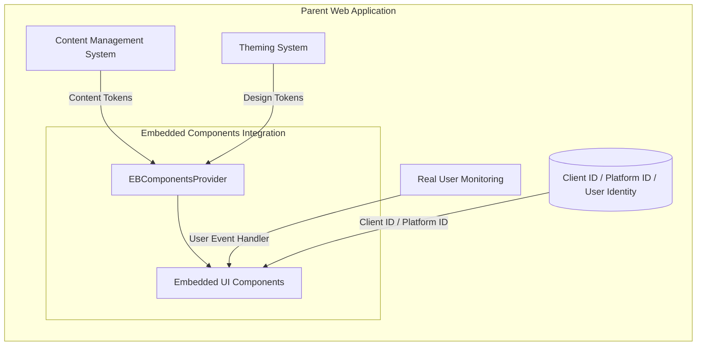
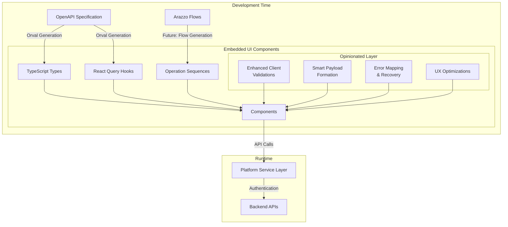

# Embedded UI Components

## 🚧 Pre-release Version Notice

Embedded UI Components and this guide is currently in draft form and under active development. Components are not ready for production use and may change significantly until version 1.x.x is released. Please consider this document as a work in progress.

### ADA Compliance Disclaimer

While we strive to incorporate ADA (Americans with Disabilities Act) best practices, please note that developers are responsible for conducting their own comprehensive ADA testing to ensure full compliance with all applicable standards and regulations.

## Overview

The Embedded UI Components library offers a seamless way to integrate sophisticated UI capabilities into your existing web applications, providing a plug-and-play solution for Embedded Finance features.

## Important Usage Notes

**All Embedded UI Components must be wrapped within the `EBComponentsProvider`.** The `EBComponentsProvider` is specifically designed for these components and is not applicable to any other client components in your application.

## Main Embedded UI Components Architecture Concepts

The library is built on several key architectural concepts:

### Integration Scenarios and Use Cases

The Embedded UI Components are designed for flexible integration into parent web applications, offering several customization points:



#### Integration Flexibility

1. **Runtime Customization**

   - Inject design tokens to match parent app's theme or use the default ones
   - Override content tokens from parent app's CMS systems or any other source
   - Connect to parent app's monitoring via `userEventsHandler`

2. **Component Configuration**

   - Configure API endpoints via provider
   - Customize component behavior through props

3. **Client ID / Platform ID** (only for onboarding components)
   - Onboarding Embedded UI Components can be used in fully controlled (client ID is provided and managed by the parent app) or uncontrolled (client ID is created from scratch by the embedded component) mode
   - In uncontrolled mode the embedded component will create a new client and it is recommended to manage its lifecycle via the `onPostClientSettled` callback prop

#### Future Extensibility

1. **Field Configuration**

   - Externalization of field mapping logic
   - Custom field validation rules
   - Dynamic form layout configuration
   - Validation rules can be overridden from the parent app

2. **Workflow Customization**
   - Integration with Arazzo workflow definitions
   - Custom step sequencing
   - Conditional flow logic

### Overall Logical Composition Diagram

**Note:** The following diagram illustrates the component architecture using the onboarding wizard as an example:



### Key Principles

1. **OpenAPI Specification (OAS) & Future Arazzo Flows**

   - OAS defines API contracts and types
   - Serves as source of truth for API interfaces
   - Generates TypeScript types and React Query hooks
   - Future: Arazzo Flows will enable automated flow generation (not currently available)

2. **Automated Code Generation**

   - Currently, Orval generates from OAS:
     - TypeScript interfaces
     - Type-safe React Query hooks
     - API client utilities
   - Ensures type consistency between API and UI

3. **Other utility functions**

   Built using generated types and hooks with an opinionated layer providing:

   - Enhanced client validations based on API specifications
   - Smart payload formation
   - Error mapping & recovery
   - UX optimizations implemented based on best practices:
     - Smart field prepopulation
     - Cognitive load reduction
     - Intelligent navigation

## Embedded UI Components

The library currently provides the following components:

### EBComponentsProvider

The `EBComponentsProvider` is a crucial wrapper component that must be placed at the top level of your Embedded UI Components implementation. It handles authentication, applies theming, and provides necessary context to all child Embedded UI Components.
It is using @tanstack/react-query for handling API calls and authentication as well as Orval generated types for the API requests and responses.

#### Key Props:

- `apiBaseUrl`: The base URL for API calls (required)
- `theme`: Customization options for the components' appearance (optional)
- `headers`: Custom headers for API requests (optional)
- `queryParams`: Custom query parameters for API requests (optional)
- `contentTokens`: Custom content tokens for internationalization (optional)

#### Usage:

```jsx
import { EBComponentsProvider } from '@jpmorgan-payments/embedded-finance-components';

const EmbeddedFinanceSection = () => {
  return (
    <EBComponentsProvider
      apiBaseUrl="https://your-api-base-url.com"
      theme={{
        colorScheme: 'light',
        variables: {
          primaryColor: '#007bff',
          fontFamily: 'Arial, sans-serif',
        },
      }}
      headers={{
        'Custom-Header': 'value',
      }}
      queryParams={{
        'custom-param': 'value',
      }}
      contentTokens={{
        name: 'enUS',
      }}
    >
      {/* Your Embedded UI Components go here */}
    </EBComponentsProvider>
  );
};
```

### 1. OnboardingWizardBasic

The `OnboardingWizardBasic` component implements the client onboarding process as described in the [Embedded Payments API documentation](https://developer.payments.jpmorgan.com/docs/embedded-finance-solutions/embedded-payments/capabilities/onboard-a-client).

#### Main Features:

- Create a client profile
- Incrementally update client's related parties
- Complete due diligence questions
- Handle client attestations
- Manage requests for additional documentation
- Check and display onboarding status

#### Props:

| Prop Name                          | Type                                                                                                                                      | Required | Description                                             |
| ---------------------------------- | ----------------------------------------------------------------------------------------------------------------------------------------- | -------- | ------------------------------------------------------- |
| `initialClientId`                  | `string`                                                                                                                                  | No       | Initial client ID for existing client onboarding        |
| `onSetClientId`                    | `(clientId: string) => Promise<void>`                                                                                                     | No       | Callback function when client ID is set                 |
| `onGetClientSettled`               | `(clientData: ClientResponse \| undefined, status: 'success' \| 'pending' \| 'error', error: ErrorType<SchemasApiError> \| null) => void` | No       | Callback function triggered when client data is fetched |
| `onPostClientSettled`              | `(response?: ClientResponse, error?: ApiError) => void`                                                                                   | No       | Callback function for client creation response          |
| `onPostPartySettled`               | `(response?: PartyResponse, error?: ApiError) => void`                                                                                    | No       | Callback function for party creation response           |
| `onPostClientVerificationsSettled` | `(response?: ClientVerificationResponse, error?: ApiError) => void`                                                                       | No       | Callback function for client verification response      |
| `availableProducts`                | `Array<ClientProduct>`                                                                                                                    | Yes      | List of available products for onboarding               |
| `availableJurisdictions`           | `Array<Jurisdiction>`                                                                                                                     | Yes      | List of available jurisdictions for onboarding          |
| `availableOrganizationTypes`       | `Array<OrganizationType>`                                                                                                                 | No       | List of available organization types                    |
| `usePartyResource`                 | `boolean`                                                                                                                                 | No       | Whether to use party resource for onboarding            |
| `blockPostVerification`            | `boolean`                                                                                                                                 | No       | Whether to block post-verification steps                |
| `showLinkedAccountPanel`           | `boolean`                                                                                                                                 | No       | Whether to show linked account panel                    |
| `initialStep`                      | `number`                                                                                                                                  | No       | Initial step to start onboarding from                   |
| `variant`                          | `'circle' \| 'circle-alt' \| 'line'`                                                                                                      | No       | Visual variant of the stepper component                 |
| `onboardingContentTokens`          | `DeepPartial<typeof defaultResources['enUS']['onboarding']>`                                                                              | No       | Custom content tokens for onboarding                    |
| `alertOnExit`                      | `boolean`                                                                                                                                 | No       | Whether to show alert when exiting onboarding           |
| `userEventsToTrack`                | `string[]`                                                                                                                                | No       | List of user events to track                            |
| `userEventsHandler`                | `({ actionName }: { actionName: string }) => void`                                                                                        | No       | Handler for user events                                 |

#### Usage:

```jsx
import {
  EBComponentsProvider,
  OnboardingWizardBasic,
} from '@jpmorgan-payments/embedded-finance-components';

const OnboardingSection = () => {
  const [clientId, setClientId] = useManageClientExternalState();

  const handlePostClientResponse = ({ response, error }) => {
    // Handle client creation response or error
    setClientId(response.id);
  };

  const handlePostClientVerificationsResponse = ({ clientId, error }) => {
    // Handle post client verifications response or error
  };

  return (
    <EBComponentsProvider apiBaseUrl="https://your-api-base-url.com">
      <OnboardingWizardBasic
        title="Client Onboarding"
        initialClientId={clientId}
        onPostClientSettled={handlePostClientResponse}
        onPostClientVerificationSettled={handlePostClientVerificationsResponse}
        availableProducts={['EMBEDDED_PAYMENTS']}
        availableJurisdictions={['US']}
        variant="circle-alt"
        initialStep={0}
        showLinkedAccountPanel={true}
        userEventsToTrack={['click']}
        userEventsHandler={({ actionName }) => {
          // Track user events
          console.log(`User action: ${actionName}`);
        }}
      />
    </EBComponentsProvider>
  );
};
```

### 2. OnboardingFlow

The `OnboardingFlow` component provides a modern, enhanced onboarding experience with improved UX and better flow management. It represents the next generation of the onboarding process with screen-based navigation and enhanced state management.

#### Main Features:

- Screen-based navigation with flow control
- Enhanced document upload with preview and drag-and-drop
- Improved mobile responsiveness
- Better error handling and recovery
- Streamlined user experience with intelligent navigation
- Support for document-only onboarding mode

#### Props:

| Prop Name                          | Type                                                                                                                                      | Required | Description                                             |
| ---------------------------------- | ----------------------------------------------------------------------------------------------------------------------------------------- | -------- | ------------------------------------------------------- |
| `initialClientId`                  | `string`                                                                                                                                  | No       | Initial client ID for existing client onboarding        |
| `onGetClientSettled`               | `(clientData: ClientResponse \| undefined, status: 'success' \| 'pending' \| 'error', error: ErrorType<SchemasApiError> \| null) => void` | No       | Callback function triggered when client data is fetched |
| `onPostClientSettled`              | `(response?: ClientResponse, error?: ApiError) => void`                                                                                   | No       | Callback function for client creation response          |
| `onPostPartySettled`               | `(response?: PartyResponse, error?: ApiError) => void`                                                                                    | No       | Callback function for party creation response           |
| `onPostClientVerificationsSettled` | `(response?: ClientVerificationResponse, error?: ApiError) => void`                                                                       | No       | Callback function for client verification response      |
| `availableProducts`                | `Array<ClientProduct>`                                                                                                                    | Yes      | List of available products for onboarding               |
| `availableJurisdictions`           | `Array<Jurisdiction>`                                                                                                                     | Yes      | List of available jurisdictions for onboarding          |
| `availableOrganizationTypes`       | `Array<OrganizationType>`                                                                                                                 | No       | List of available organization types                    |
| `usePartyResource`                 | `boolean`                                                                                                                                 | No       | Whether to use party resource for onboarding            |
| `blockPostVerification`            | `boolean`                                                                                                                                 | No       | Whether to block post-verification steps                |
| `docUploadOnlyMode`                | `boolean`                                                                                                                                 | No       | Whether to show only document upload screens            |
| `height`                           | `string`                                                                                                                                  | No       | Minimum height for the component container              |
| `onboardingContentTokens`          | `DeepPartial<typeof defaultResources['enUS']['onboarding']>`                                                                              | No       | Custom content tokens for onboarding                    |
| `alertOnExit`                      | `boolean`                                                                                                                                 | No       | Whether to show alert when exiting onboarding           |
| `userEventsToTrack`                | `string[]`                                                                                                                                | No       | List of user events to track                            |
| `userEventsHandler`                | `({ actionName }: { actionName: string }) => void`                                                                                        | No       | Handler for user events                                 |

#### Usage:

```jsx
import {
  EBComponentsProvider,
  OnboardingFlow,
} from '@jpmorgan-payments/embedded-finance-components';

const OnboardingSection = () => {
  return (
    <EBComponentsProvider apiBaseUrl="https://your-api-base-url.com">
      <OnboardingFlow
        initialClientId="your-client-id"
        availableProducts={['EMBEDDED_PAYMENTS']}
        availableJurisdictions={['US']}
        height="100vh"
        onPostClientSettled={(response, error) => {
          // Handle client creation
        }}
        docUploadOnlyMode={false}
        alertOnExit={true}
      />
    </EBComponentsProvider>
  );
};
```

### 3. Accounts

> **⚠️ In Testing**: This component is currently in testing state and could be not fully integrated with the OpenAPI Specification (OAS) or missing some target state functional/non-functional capabilities. It could be subject to significant changes.

The `Accounts` component provides a read-only, responsive UI for displaying all accounts associated with a client, including their categories, states, routing information, and balances.

#### Main Features:

- Display accounts with categories, states, and routing information
- Show account balances (ITAV, ITBD) with human-friendly labels
- Filter accounts by category via props
- Responsive layout with mobile support
- Loading states and error handling
- Masked account numbers for security

#### Props:

| Prop Name           | Type       | Required | Description                             |
| ------------------- | ---------- | -------- | --------------------------------------- |
| `allowedCategories` | `string[]` | Yes      | Array of account categories to display  |
| `clientId`          | `string`   | No       | Client ID to filter accounts            |
| `title`             | `string`   | No       | Optional title for the accounts section |

#### Usage:

```jsx
import {
  Accounts,
  EBComponentsProvider,
} from '@jpmorgan-payments/embedded-finance-components';

const AccountsSection = () => {
  return (
    <EBComponentsProvider apiBaseUrl="https://your-api-base-url.com">
      <Accounts
        allowedCategories={['LIMITED_DDA', 'LIMITED_DDA_PAYMENTS']}
        clientId="your-client-id"
        title="My Accounts"
      />
    </EBComponentsProvider>
  );
};
```

### 4. Recipients

The `Recipients` component provides comprehensive management of payment recipients, enabling users to create, view, edit, and delete recipient information. It now supports integration with the MakePayment component for seamless payment workflows.

#### Main Features:

- Create, view, edit, and delete payment recipients
- Support for multiple payment methods (ACH, WIRE, RTP)
- Dynamic form validation based on selected payment methods
- Search and filtering capabilities
- Pagination for large recipient lists
- Mobile-responsive design
- **NEW**: Integration with MakePayment component for direct payment initiation
- **NEW**: Widget mode for compact display in parent applications

#### Props:

| Prop Name                | Type              | Required | Description                                                            |
| ------------------------ | ----------------- | -------- | ---------------------------------------------------------------------- |
| `clientId`               | `string`          | No       | Optional client ID filter                                              |
| `initialRecipientType`   | `string`          | No       | Default recipient type (RECIPIENT, LINKED_ACCOUNT, SETTLEMENT_ACCOUNT) |
| `showCreateButton`       | `boolean`         | No       | Show/hide create functionality                                         |
| `config`                 | `object`          | No       | Configuration for payment methods and validation rules                 |
| `makePaymentComponent`   | `React.ReactNode` | No       | MakePayment component to render in each recipient card/row             |
| `onRecipientCreated`     | `function`        | No       | Callback when recipient is created                                     |
| `onRecipientUpdated`     | `function`        | No       | Callback when recipient is updated                                     |
| `onRecipientDeactivated` | `function`        | No       | Callback when recipient is deactivated                                 |
| `userEventsHandler`      | `function`        | No       | Handler for user events                                                |
| `isWidget`               | `boolean`         | No       | Force widget layout with minimal columns and no filters                |

#### Usage:

```jsx
import {
  EBComponentsProvider,
  MakePayment,
  Recipients,
} from '@jpmorgan-payments/embedded-finance-components';

const RecipientsSection = () => {
  return (
    <EBComponentsProvider apiBaseUrl="https://your-api-base-url.com">
      <Recipients
        clientId="your-client-id"
        initialRecipientType="RECIPIENT"
        showCreateButton={true}
        makePaymentComponent={
          <MakePayment
            triggerButtonVariant="link"
            onTransactionSettled={(response, error) => {
              console.log('Payment completed:', response);
            }}
          />
        }
        onRecipientCreated={(recipient) => {
          console.log('Recipient created:', recipient);
        }}
      />
    </EBComponentsProvider>
  );
};
```

### 5. LinkedAccountWidget

The `LinkedAccountWidget` component facilitates the process of adding a client's linked account, as described in the [Add Linked Account API documentation](https://developer.payments.jpmorgan.com/docs/embedded-finance-solutions/embedded-payments/capabilities/embedded-payments/how-to/add-linked-account).

#### Main Features:

- Add and manage external linked bank accounts for clients
- Handle complex micro-deposits initiation logic
- Support for multiple account types and verification methods
- **NEW**: Integration with MakePayment component for direct payment initiation
- **NEW**: Single account mode for focused workflows

#### Props:

| Prop Name                | Type                                                | Required | Description                                                         |
| ------------------------ | --------------------------------------------------- | -------- | ------------------------------------------------------------------- |
| `variant`                | `'default' \| 'singleAccount'`                      | No       | Display variant for different use cases                             |
| `showCreateButton`       | `boolean`                                           | No       | Show/hide create functionality                                      |
| `makePaymentComponent`   | `React.ReactNode`                                   | No       | MakePayment component to render in each linked account card         |
| `onLinkedAccountSettled` | `(recipient?: Recipient, error?: ApiError) => void` | No       | Callback function for linked account creation/verification response |

#### Usage:

```jsx
import {
  EBComponentsProvider,
  LinkedAccountWidget,
  MakePayment,
} from '@jpmorgan-payments/embedded-finance-components';

const LinkedAccountSection = () => {
  return (
    <EBComponentsProvider apiBaseUrl="https://your-api-base-url.com">
      <LinkedAccountWidget
        variant="default"
        makePaymentComponent={
          <MakePayment
            triggerButtonVariant="link"
            onTransactionSettled={(response, error) => {
              console.log('Payment completed:', response);
            }}
          />
        }
      />
    </EBComponentsProvider>
  );
};
```

### 6. MakePayment

> **⚠️ In Testing**: This component is currently in testing state and could be not fully integrated with the OpenAPI Specification (OAS) or missing some target state functional/non-functional capabilities. It could be subject to significant changes.

The `MakePayment` component provides a comprehensive payment interface that allows users to initiate payments between accounts with various payment methods. It can be used standalone or integrated into other components like Recipients and LinkedAccountWidget.

#### Main Features:

- Payment initiation with multiple payment methods (ACH, RTP, WIRE)
- Fee calculation and display
- Form validation and error handling
- Success confirmation and repeat payment functionality
- Customizable payment methods and fees
- Auto-selection for single options
- **NEW**: Integration with Recipients and LinkedAccountWidget components
- **NEW**: Pre-selection of recipients based on account compatibility
- **NEW**: Real-time account balance validation
- **NEW**: Support for different trigger button variants

#### Props:

| Prop Name              | Type                                                                          | Required | Description                                      |
| ---------------------- | ----------------------------------------------------------------------------- | -------- | ------------------------------------------------ |
| `triggerButton`        | `React.ReactNode`                                                             | No       | Custom trigger button for opening payment dialog |
| `triggerButtonVariant` | `'default' \| 'destructive' \| 'outline' \| 'secondary' \| 'ghost' \| 'link'` | No       | Button variant for trigger button                |
| `accounts`             | `Array<{ id: string; name: string }>`                                         | No       | List of available accounts to pay from           |
| `recipients`           | `Array<{ id: string; name: string; accountNumber: string }>`                  | No       | List of available recipients                     |
| `paymentMethods`       | `Array<{ id: string; name: string; fee: number; description?: string }>`      | No       | List of available payment methods with fees      |
| `icon`                 | `string`                                                                      | No       | Icon name from Lucide React icons                |
| `recipientId`          | `string`                                                                      | No       | Optional recipient ID to pre-select              |
| `onTransactionSettled` | `(response?: TransactionResponseV2, error?: ApiErrorV2) => void`              | No       | Callback when transaction is completed           |

#### Usage:

```jsx
import {
  EBComponentsProvider,
  MakePayment,
} from '@jpmorgan-payments/embedded-finance-components';

const PaymentSection = () => {
  return (
    <EBComponentsProvider apiBaseUrl="https://your-api-base-url.com">
      <MakePayment
        triggerButtonVariant="link"
        accounts={[
          { id: 'account1', name: 'Main Account' },
          { id: 'account2', name: 'Savings Account' },
        ]}
        recipients={[
          {
            id: 'recipient1',
            name: 'John Doe',
            accountNumber: '****1234',
          },
        ]}
        paymentMethods={[
          { id: 'ACH', name: 'ACH Transfer', fee: 2.5 },
          { id: 'WIRE', name: 'Wire Transfer', fee: 25.0 },
        ]}
        icon="CirclePlus"
        onTransactionSettled={(response, error) => {
          if (response) {
            console.log('Payment successful:', response);
          } else {
            console.error('Payment failed:', error);
          }
        }}
      />
    </EBComponentsProvider>
  );
};
```

### 7. TransactionsDisplay

> **⚠️ In Testing**: This component is currently in testing state and could be not fully integrated with the OpenAPI Specification (OAS) or missing some target state functional/non-functional capabilities. It could be subject to significant changes.

The `TransactionsDisplay` component provides a comprehensive view of transaction history with detailed information and filtering capabilities.

#### Main Features:

- Transaction listing with sorting and filtering
- Transaction details view with expandable information
- Support for different transaction types (PAYIN/PAYOUT)
- Currency formatting and localization
- Pagination and search capabilities
- Mobile-responsive design

#### Props:

| Prop Name   | Type     | Required | Description                          |
| ----------- | -------- | -------- | ------------------------------------ |
| `accountId` | `string` | Yes      | Account ID to fetch transactions for |

#### Usage:

```jsx
import {
  EBComponentsProvider,
  TransactionsDisplay,
} from '@jpmorgan-payments/embedded-finance-components';

const TransactionsSection = () => {
  return (
    <EBComponentsProvider apiBaseUrl="https://your-api-base-url.com">
      <TransactionsDisplay accountId="your-account-id" />
    </EBComponentsProvider>
  );
};
```

## Theming

The library supports comprehensive theming through the EBComponentsProvider. Components can be styled to match your application's design system using theme tokens.

The `EBComponentsProvider` accepts a `theme` prop that allows for extensive customization of the components' appearance. The theme object can include the following properties:

- `colorScheme`: 'dark' | 'light' | 'system'
- `variables`: An object containing various theme variables
- `light`: Light theme-specific variables
- `dark`: Dark theme-specific variables

### Theme Design Tokens

The design token system provides a comprehensive set of customization options that can be used in the `variables`, `light`, and `dark` properties of the theme configuration. Tokens are processed and converted to CSS variables with the `--eb-` prefix for use throughout the component library.

#### Implementation Details

The design token system works through a multi-stage process:

1. **Definition**: Tokens are defined in the `EBThemeVariables` type
2. **Processing**: Tokens are transformed into CSS variables via the `convertThemeToCssVariables` function
3. **Color Handling**: All colors are normalized to HSL format for consistent manipulation
4. **Inheritance**: Many tokens can inherit from parent tokens (e.g., `buttonBorderRadius` from `borderRadius`)
5. **Default Values**: The system applies smart defaults when values are not explicitly provided
6. **Dark/Light Mode**: Separate token sets can be defined for light and dark modes
7. **Output**: Tokens become CSS variables with the `--eb-` prefix for use in components

#### Typography Tokens

| Token Name                 | Description                                       | Type   | Default                    | Usage Context                                             |
| -------------------------- | ------------------------------------------------- | ------ | -------------------------- | --------------------------------------------------------- |
| `fontFamily`               | Primary font stack for all text elements          | String | `"Geist"`                  | Applied globally to all text elements as base font        |
| `headerFontFamily`         | Specialized font stack for headings               | String | Inherits from `fontFamily` | Used for h1-h6 elements to maintain visual hierarchy      |
| `buttonFontFamily`         | Font stack for button elements                    | String | Inherits from `fontFamily` | Used for consistent typography across all action elements |
| `formLabelFontSize`        | Text size for form field labels                   | String | `"0.875rem"` (14px)        | Provides appropriate visual weight for form labels        |
| `formLabelLineHeight`      | Vertical spacing for form labels                  | String | `"1.25rem"` (20px)         | Ensures consistent spacing in dense form layouts          |
| `formLabelFontWeight`      | Weight of form label text                         | String | `"500"` (medium)           | Balances readability with sufficient emphasis             |
| `formLabelForegroundColor` | Color of form label text                          | String | `"hsl(240 10% 3.9%)"`      | Provides accessible contrast for form labels              |
| `buttonFontWeight`         | Weight of button text                             | String | `"500"` (medium)           | Ensures button text is clearly visible and legible        |
| `buttonFontSize`           | Size of button text                               | String | `"0.875rem"` (14px)        | Optimized for tap targets and readability                 |
| `buttonLineHeight`         | Vertical spacing in buttons                       | String | `"1.25rem"` (20px)         | Creates proper vertical alignment for button content      |
| `buttonTextTransform`      | Text capitalization for buttons                   | String | `"none"`                   | Controls case presentation of button text                 |
| `buttonLetterSpacing`      | Horizontal spacing between letters in button text | String | `"0em"`                    | Fine-tunes readability of button labels                   |

#### Color System Tokens

| Token Name               | Description                               | Type   | Default                       | Color Role                                                          |
| ------------------------ | ----------------------------------------- | ------ | ----------------------------- | ------------------------------------------------------------------- |
| `backgroundColor`        | Base page background                      | String | `"hsl(0 0% 100%)"`            | Provides the foundation layer for all content                       |
| `foregroundColor`        | Primary text color                        | String | `"hsl(240 10% 3.9%)"`         | Main content text with optimal contrast ratio                       |
| `primaryColor`           | Main brand color                          | String | `"#155C93"`                   | Used for primary actions, brand representation, and key UI elements |
| `primaryHoverColor`      | Hover state for primary elements          | String | Auto-calculated (90% opacity) | Visual feedback for interactive primary elements                    |
| `primaryActiveColor`     | Active/pressed state for primary elements | String | Auto-calculated               | Confirms user interaction with primary elements                     |
| `primaryForegroundColor` | Text on primary background                | String | `"hsl(0 0% 98%)"`             | Ensures readable text on primary-colored backgrounds                |
| `secondaryColor`         | Supporting color                          | String | `"hsl(240 4.8% 95.9%)"`       | Used for secondary actions and supporting UI elements               |
| `destructiveColor`       | Error/warning color                       | String | `"hsl(0 84.2% 60.2%)"`        | Signals destructive actions or error states                         |
| `destructiveAccentColor` | Light variation of destructive color      | String | `"#FFECEA"`                   | Used as background for destructive alerts/notices                   |
| `informativeColor`       | Information notification color            | String | `"#0078CF"`                   | Used for information alerts and notices                             |
| `informativeAccentColor` | Light variation of informative color      | String | `"#EAF6FF"`                   | Background for informative message containers                       |
| `warningColor`           | Alert/caution color                       | String | `"#C75300"`                   | Indicates caution states requiring attention                        |
| `warningAccentColor`     | Light variation of warning color          | String | `"#FFECD9"`                   | Background for warning message containers                           |
| `successColor`           | Positive confirmation color               | String | `"#00875D"`                   | Indicates successful operations                                     |
| `successAccentColor`     | Light variation of success color          | String | `"#EAF5F2"`                   | Background for success message containers                           |
| `mutedColor`             | Subtle background color                   | String | `"hsl(240 4.8% 95.9%)"`       | Used for secondary containers and disabled elements                 |
| `mutedForegroundColor`   | Subtle text color                         | String | `"hsl(240 3.8% 46.1%)"`       | Used for helper text, placeholders, and disabled content            |
| `cardColor`              | Background for card components            | String | `"hsl(0 0% 100%)"`            | Provides visual separation for card-based content                   |
| `cardForegroundColor`    | Text color for card elements              | String | `"hsl(240 10% 3.9%)"`         | Ensures readable text on card backgrounds                           |
| `popoverColor`           | Background for popover components         | String | `"hsl(0 0% 100%)"`            | Creates consistent background for popovers and tooltips             |
| `popoverForegroundColor` | Text color for popovers                   | String | `"hsl(240 10% 3.9%)"`         | Maintains readable text in popover elements                         |
| `alertColor`             | Background color for alerts               | String | `"hsl(0 0% 100%)"`            | Provides base for alert components                                  |
| `alertForegroundColor`   | Text color for alerts                     | String | `"hsl(240 10% 3.9%)"`         | Ensures readable alert messages                                     |
| `accentColor`            | Color for UI accents                      | String | `"hsl(240 4.8% 95.9%)"`       | Highlights specific UI elements                                     |
| `accentForegroundColor`  | Text on accent background                 | String | `"hsl(240 5.9% 10%)"`         | Ensures readable text on accent backgrounds                         |
| `borderColor`            | Color for UI boundaries                   | String | `"hsl(240 5.9% 90%)"`         | Creates subtle visual division between UI sections                  |
| `inputColor`             | Background for input fields               | String | `"hsl(0 0% 100%)"`            | Establishes consistent background for form inputs                   |
| `inputBorderColor`       | Border color for input fields             | String | `"hsl(240 5.9% 90%)"`         | Creates visual boundaries for form elements                         |
| `ringColor`              | Color for focus indicators                | String | `"hsl(240 10% 3.9%)"`         | Provides accessible focus indication for keyboard navigation        |

#### Spacing and Layout Tokens

| Token Name           | Description                         | Type   | Default                      | Layout Impact                                                  |
| -------------------- | ----------------------------------- | ------ | ---------------------------- | -------------------------------------------------------------- |
| `spacingUnit`        | Base unit for spacing scale         | String | `"0.25rem"` (4px)            | Establishes consistent spacing rhythm throughout the interface |
| `borderRadius`       | Default corner rounding             | String | `"0.375rem"` (6px)           | Defines the global corner style for UI elements                |
| `inputBorderRadius`  | Corner rounding for form fields     | String | Inherits from `borderRadius` | Maintains consistent visual style for input elements           |
| `buttonBorderRadius` | Corner rounding for buttons         | String | Inherits from `borderRadius` | Ensures visual consistency across interactive elements         |
| `zIndexOverlay`      | Stacking order for overlay elements | Number | `100`                        | Controls layering of modal dialogs, tooltips, and popovers     |

#### Component-Specific Tokens

| Token Name                    | Description                           | Type    | Default                          | Component Usage                                                             |
| ----------------------------- | ------------------------------------- | ------- | -------------------------------- | --------------------------------------------------------------------------- |
| `primaryBorderWidth`          | Border width for primary elements     | String  | `"0rem"`                         | Controls border visibility on primary buttons and elements                  |
| `secondaryBorderWidth`        | Border width for secondary elements   | String  | `"0rem"`                         | Controls border visibility on secondary buttons and elements                |
| `destructiveBorderWidth`      | Border width for destructive elements | String  | `"0rem"`                         | Controls border visibility on destructive buttons and alerts                |
| `primaryButtonFontWeight`     | Font weight for primary buttons       | String  | Inherits from `buttonFontWeight` | Can be used to emphasize primary actions                                    |
| `secondaryButtonFontWeight`   | Font weight for secondary buttons     | String  | Inherits from `buttonFontWeight` | Provides consistent typography for secondary actions                        |
| `destructiveButtonFontWeight` | Font weight for destructive buttons   | String  | Inherits from `buttonFontWeight` | Maintains consistent typography for destructive actions                     |
| `shiftButtonOnActive`         | Controls button press animation       | Boolean | `true`                           | When true, provides 1px downward shift on button press for tactile feedback |

#### Example Usage in Components

Design tokens are applied as Tailwind CSS classes with the `eb-` prefix:

```tsx
<div className="eb-bg-background eb-text-foreground eb-font-sans">
  <button className="eb-bg-primary eb-text-primary-foreground eb-rounded">
    Submit
  </button>
</div>
```

The complete theme configuration is converted to CSS variables and applied to the document. For example, the `primaryColor` token becomes the `--eb-primary` CSS variable that can be used throughout the component library.

### Theme Usage Example

```jsx
import { EBComponentsProvider } from '@jpmorgan-payments/embedded-finance-components';

const ThemedApplication = () => {
  return (
    <EBComponentsProvider
      apiBaseUrl="https://api.example.com"
      theme={{
        colorScheme: 'light',
        variables: {
          fontFamily: 'Inter, system-ui, sans-serif',
          primaryColor: '#2563eb',
          borderRadius: '0.5rem',
          buttonFontWeight: '600',
        },
        light: {
          backgroundColor: '#ffffff',
          foregroundColor: '#1f2937',
          cardColor: '#f9fafb',
        },
        dark: {
          backgroundColor: '#1f2937',
          foregroundColor: '#f9fafb',
          cardColor: '#374151',
        },
      }}
    >
      {/* Your components */}
    </EBComponentsProvider>
  );
};
```

## Adding Custom Themes

The theme system supports three types of theme variables with different purposes and inheritance patterns:

### Theme Variable Classification

#### 1. **Override Variables** (Tailwind Default Overrides)

These variables override default Tailwind CSS theme values and provide consistent design tokens across the component library.

**When to use:** For fundamental design tokens that should be consistent across all components.

**Examples:**

- `fontFamily` - Overrides Tailwind's default sans font stack
- `borderRadius` - Overrides Tailwind's default border radius scale
- `spacingUnit` - Overrides Tailwind's default spacing scale
- `zIndexOverlay` - Controls stacking order for overlays

**Usage in Tailwind config:**

```javascript
// Overrides default Tailwind values
fontFamily: {
  sans: ['var(--eb-font-family)', ...defaultTheme.fontFamily.sans],
},
borderRadius: {
  md: 'var(--eb-radius)',
  button: 'var(--eb-button-radius)',
},
spacing: {
  1: 'calc(var(--eb-spacing-unit) * 1)',
  2: 'calc(var(--eb-spacing-unit) * 2)',
}
```

#### 2. **Semantic Color Variables** (Component-Specific Colors)

These variables define semantic color relationships and are used throughout components for consistent theming.

**When to use:** For color tokens that have semantic meaning and should adapt to light/dark modes.

**Examples:**

- `primaryColor` / `primaryForegroundColor` - Brand colors and text on primary backgrounds
- `destructiveColor` / `destructiveForegroundColor` - Error states and actions
- `mutedColor` / `mutedForegroundColor` - Secondary content and disabled states
- `cardColor` / `cardForegroundColor` - Card backgrounds and text

**Usage in components:**

```tsx
<button className="eb-bg-primary eb-text-primary-foreground">
  Primary Action
</button>
<div className="eb-bg-destructive eb-text-destructive-foreground">
  Error Message
</div>
```

#### 3. **Component-Specific Variables** (Custom Design Tokens)

These variables provide fine-grained control over specific component behaviors and appearances.

**When to use:** For component-specific styling that doesn't fit into semantic color patterns.

**Examples:**

- `buttonFontWeight` / `buttonFontSize` - Button typography control
- `formLabelFontSize` / `formLabelFontWeight` - Form label styling
- `shiftButtonOnActive` - Button press animation control
- `buttonTextTransform` - Button text capitalization

**Usage in components:**

```tsx
<button className="eb-font-button eb-text-button">
  Custom Button
</button>
<label className="eb-text-label eb-font-label">
  Form Label
</label>
```

### Theme Inheritance Hierarchy

The theme system uses a layered inheritance approach:

1. **Base Layer:** `defaultTheme.variables` (always applied)
2. **Global Override:** `theme.variables` (overrides base for all modes)
3. **Mode-Specific:** `theme.light` or `theme.dark` (overrides for specific color schemes)

```jsx
const customTheme = {
  variables: {
    // Applied to all modes, overrides defaults
    fontFamily: 'Inter, sans-serif',
    primaryColor: '#2563eb',
  },
  light: {
    // Applied only in light mode, overrides variables
    backgroundColor: '#ffffff',
    cardColor: '#f9fafb',
  },
  dark: {
    // Applied only in dark mode, overrides variables
    backgroundColor: '#1f2937',
    cardColor: '#374151',
  },
};
```

### Creating a Complete Custom Theme

```jsx
const customTheme = {
  colorScheme: 'light',
  variables: {
    // Override variables (affect all modes)
    fontFamily: 'Inter, system-ui, sans-serif',
    borderRadius: '0.5rem',
    spacingUnit: '0.25rem',
    buttonFontWeight: '600',
    buttonFontSize: '0.875rem',

    // Semantic colors (base for all modes)
    primaryColor: '#2563eb',
    destructiveColor: '#dc2626',
    successColor: '#059669',
  },
  light: {
    // Light mode specific overrides
    backgroundColor: '#ffffff',
    foregroundColor: '#1f2937',
    cardColor: '#f9fafb',
    borderColor: '#e5e7eb',
  },
  dark: {
    // Dark mode specific overrides
    backgroundColor: '#111827',
    foregroundColor: '#f9fafb',
    cardColor: '#1f2937',
    borderColor: '#374151',
  },
};
```

### Best Practices

1. **Use Override Variables** for fundamental design tokens that should be consistent across your application
2. **Use Semantic Color Variables** for color relationships that need light/dark mode support
3. **Use Component-Specific Variables** sparingly for fine-grained component control
4. **Test in both light and dark modes** when creating custom themes
5. **Follow the inheritance hierarchy** to avoid unexpected overrides
6. **Use HSL color format** for better color manipulation and consistency

## Adding New Design Tokens

To add a new design token to the theme system, follow these steps:

### 1. **Define the Token Type**

First, determine which category your new token belongs to:

- **Override Variable**: If it should override a default Tailwind value
- **Semantic Color Variable**: If it's a color with semantic meaning
- **Component-Specific Variable**: If it's for specific component behavior

### 2. **Add to Type Definition**

Add your new token to the `EBThemeVariables` type in `src/core/EBComponentsProvider/config.types.ts`:

```typescript
export type EBThemeVariables = {
  // ... existing tokens ...

  // New token examples
  customSpacing?: string; // Override variable
  customAccentColor?: string; // Semantic color variable
  customComponentBehavior?: boolean; // Component-specific variable
};
```

### 3. **Add to Theme Conversion**

Add the token to the `convertThemeVariablesToCssVariables` function in `src/core/EBComponentsProvider/convert-theme-to-css-variables.ts`:

```typescript
const convertThemeVariablesToCssVariables = (
  variables: EBThemeVariables
): CSSVariables => {
  const cssVariablesObject: CSSVariables = {
    // ... existing variables ...

    // New CSS variable mapping
    '--eb-custom-spacing': variables.customSpacing,
    '--eb-custom-accent': colorToHsl(variables.customAccentColor),
    '--eb-custom-behavior': variables.customComponentBehavior
      ? 'value'
      : undefined,
  };

  return cssVariablesObject;
};
```

### 4. **Add to Tailwind Config** (if needed)

If your token should be available as a Tailwind class, add it to `tailwind.config.js`:

```javascript
module.exports = {
  theme: {
    extend: {
      // For spacing tokens
      spacing: {
        custom: 'var(--eb-custom-spacing)',
      },

      // For color tokens
      colors: {
        custom: {
          DEFAULT: 'hsl(var(--eb-custom-accent))',
        },
      },

      // For component-specific tokens
      customProperty: {
        behavior: 'var(--eb-custom-behavior)',
      },
    },
  },
};
```

### 5. **Add Default Value**

Add a default value to `src/core/EBComponentsProvider/defaultTheme.ts`:

```typescript
export const defaultTheme: EBTheme = {
  variables: {
    // ... existing defaults ...
    customSpacing: '1rem',
    customAccentColor: '#3b82f6',
    customComponentBehavior: true,
  },
  // ... rest of theme
};
```

### 6. **Usage in Components**

Use your new token in components:

```tsx
// For spacing tokens
<div className="eb-p-custom">Content</div>

// For color tokens
<button className="eb-bg-custom eb-text-white">Button</button>

// For component-specific tokens
<div className="eb-custom-behavior">Component</div>
```

### 7. **Documentation**

Update the README token tables to include your new token:

```markdown
| Token Name      | Description          | Type   | Default  | Usage Context                 |
| --------------- | -------------------- | ------ | -------- | ----------------------------- |
| `customSpacing` | Custom spacing value | String | `"1rem"` | Used for custom spacing needs |
```

### Example: Adding a Custom Border Radius Token

```typescript
// 1. Add to EBThemeVariables
export type EBThemeVariables = {
  // ... existing tokens ...
  customBorderRadius?: string;
};

// 2. Add to conversion function
const cssVariablesObject: CSSVariables = {
  // ... existing variables ...
  '--eb-custom-radius': variables.customBorderRadius,
};

// 3. Add to Tailwind config
borderRadius: {
  custom: 'var(--eb-custom-radius)',
},

// 4. Add default value
export const defaultTheme: EBTheme = {
  variables: {
    // ... existing defaults ...
    customBorderRadius: '0.75rem',
  },
};

// 5. Use in components
<div className="eb-rounded-custom">Custom rounded element</div>
```

### Important Notes

- **Color tokens** should use the `colorToHsl()` function for consistent processing
- **Boolean tokens** should be converted to appropriate CSS values
- **Numeric tokens** should include units (rem, px, etc.)
- **Test your tokens** in both light and dark modes
- **Follow naming conventions** (`--eb-` prefix for CSS variables)
- **Update documentation** to reflect new tokens

## Internationalization

The library supports internationalization with the following languages:

- **English (US)** - `en-US` (default)
- **French (Canada)** - `fr-CA`

### Language Configuration

```jsx
import { EBComponentsProvider } from '@jpmorgan-payments/embedded-finance-components';

const InternationalizedApp = () => {
  return (
    <EBComponentsProvider
      apiBaseUrl="https://api.example.com"
      contentTokens={{
        name: 'frCA', // Use French Canadian
      }}
    >
      {/* Your components */}
    </EBComponentsProvider>
  );
};
```

## Installation

```bash
npm install @jpmorgan-payments/embedded-finance-components
```

or

```bash
yarn add @jpmorgan-payments/embedded-finance-components
```

## Contributing

To contribute to the development of this library, please follow these guidelines:

### Recommended VSCode plugins:

- Prettier
- Tailwind CSS Intellisense

### Recommended VS Code Settings

#### `files.associations`

Use the `files.associations` setting to tell VS Code to always open `.css` files in Tailwind CSS mode:

```json
"files.associations": {
  "*.css": "tailwindcss"
}
```

#### `editor.quickSuggestions`

By default VS Code will not trigger completions when editing "string" content, for example within JSX attribute values. Updating the `editor.quickSuggestions` setting may improve your experience:

```json
"editor.quickSuggestions": {
  "strings": "on"
}
```

### Guidelines

1. Create a new component in `./src/core`
2. Export it in `./src/index.tsx`
3. Also add it to `./src/vanilla/componentRegistry.ts`

### Onboarding fieldMap.ts configuration

This configuration file is a mapping utility that connects form fields to API fields. It is designed to handle server errors and create request bodies for API interactions. The configuration is structured as a partyFieldMap object, which defines the mapping rules for various fields related to both organizations and individuals.

#### Key Components

- **Field Mapping**: Each form field is mapped to a corresponding API field using a path. This path indicates where the data should be placed in the API request or where it can be found in the API response.

- **Base Rules**: Each field has a baseRule that defines its default properties, such as visibility and required status. These rules determine whether a field is visible in the form and whether it is mandatory.

- **Conditional Rules**: Some fields have conditionalRules that modify the base rules based on specific conditions, such as the product type or jurisdiction. These rules allow for dynamic adjustments to field properties.

- **Transformation Functions**: Fields that require data transformation between the form and the API use fromResponseFn and toRequestFn functions. These functions handle the conversion of data formats, such as phone numbers.

## npm scripts

## Build and dev scripts

- `dev` – start development server
- `build` – build production version of the app
- `preview` – locally preview production build

### Testing scripts

- `typecheck` – checks TypeScript types
- `lint` – runs ESLint
- `prettier:check` – checks files with Prettier
- `vitest` – runs vitest tests
- `vitest:watch` – starts vitest watch
- `test` – runs `vitest`, `prettier:check`, `lint` and `typecheck` scripts

### Other scripts

- `storybook` – starts storybook dev server
- `storybook:build` – build production storybook bundle to `storybook-static`
- `prettier:write` – formats all files with Prettier
- `generate-api` – generates API client from OpenAPI specifications using Orval
