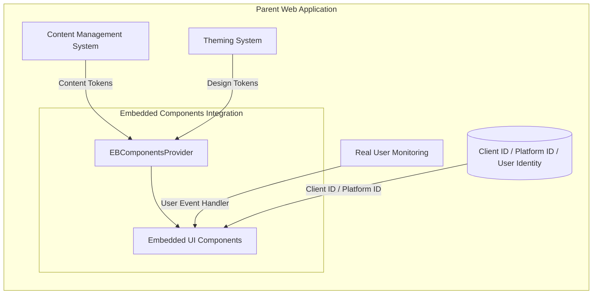
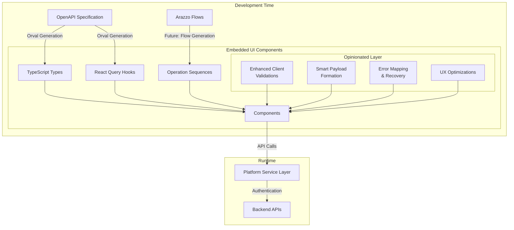

# Embedded UI Components

## 🚧 Pre-release Version Notice

Embedded UI Components and this guide is currently in draft form and under active development. Components are not ready for production use and may change significantly until version 1.x.x is released. Please consider this document as a work in progress.

### ADA Compliance Disclaimer

While we strive to incorporate ADA (Americans with Disabilities Act) best practices, please note that developers are responsible for conducting their own comprehensive ADA testing to ensure full compliance with all applicable standards and regulations.

## Overview

The Embedded UI Components library offers a seamless way to integrate sophisticated UI capabilities into your existing web applications, providing a plug-and-play solution for Embedded Finance features.

## Important Usage Notes

**All Embedded UI Components must be wrapped within the `EBComponentsProvider`.** The `EBComponentsProvider` is specifically designed for these components and is not applicable to any other client components in your application.

## Main Embedded UI Components Architecture Concepts

The library is built on several key architectural concepts:

### Integration Scenarios and Use Cases

The Embedded UI Components are designed for flexible integration into parent web applications, offering several customization points:



#### Integration Flexibility

1. **Runtime Customization**

   - Inject design tokens to match parent app's theme or use the default ones
   - Override content tokens from parent app's CMS systems or any other source
   - Connect to parent app's monitoring via `userEventsHandler`

2. **Component Configuration**

   - Configure API endpoints via provider
   - Customize component behavior through props

3. **Client ID / Platform ID** (only for onboarding components)
   - Onboarding Embedded UI Components can be used in fully controlled (client ID is provided and managed by the parent app) or uncontrolled (client ID is created from scratch by the embedded component) mode
   - In uncontrolled mode the embedded component will create a new client and it is recommended to manage its lifecycle via the `onPostClientSettled` callback prop

#### Future Extensibility

1. **Field Configuration**

   - Externalization of field mapping logic
   - Custom field validation rules
   - Dynamic form layout configuration
   - Validation rules can be overridden from the parent app

2. **Workflow Customization**
   - Integration with Arazzo workflow definitions
   - Custom step sequencing
   - Conditional flow logic

### Overall Logical Composition Diagram

**Note:** The following diagram illustrates the component architecture using the onboarding wizard as an example:



### Key Principles

1. **OpenAPI Specification (OAS) & Future Arazzo Flows**

   - OAS defines API contracts and types
   - Serves as source of truth for API interfaces
   - Generates TypeScript types and React Query hooks
   - Future: Arazzo Flows will enable automated flow generation (not currently available)

2. **Automated Code Generation**

   - Currently, Orval generates from OAS:
     - TypeScript interfaces
     - Type-safe React Query hooks
     - API client utilities
   - Ensures type consistency between API and UI

3. **Other utility functions**

   Built using generated types and hooks with an opinionated layer providing:

   - Enhanced client validations based on API specifications
   - Smart payload formation
   - Error mapping & recovery
   - UX optimizations implemented based on best practices:
     - Smart field prepopulation
     - Cognitive load reduction
     - Intelligent navigation

## Embedded UI Components

The library currently provides the following components:

### EBComponentsProvider

The `EBComponentsProvider` is a crucial wrapper component that must be placed at the top level of your Embedded UI Components implementation. It handles authentication, applies theming, and provides necessary context to all child Embedded UI Components.
It is using @tanstack/react-query for handling API calls and authentication as well as Orval generated types for the API requests and responses.

#### Key Props:

- `apiBaseUrl`: The base URL for API calls (required)
- `theme`: Customization options for the components' appearance (optional)
- `headers`: Custom headers for API requests (optional)

#### Usage:

```jsx
import { EBComponentsProvider } from '@jpmorgan-payments/embedded-finance-components';

const EmbeddedFinanceSection = () => {
  return (
    <EBComponentsProvider
      apiBaseUrl="https://your-api-base-url.com"
      theme={{
        colorScheme: 'light',
        variables: {
          primaryColor: '#007bff',
          fontFamily: 'Arial, sans-serif',
        },
      }}
      headers={{
        'Custom-Header': 'value',
      }}
    >
      {/* Your Embedded UI Components go here */}
    </EBComponentsProvider>
  );
};
```

### 1. OnboardingWizardBasic

The `OnboardingWizardBasic` component implements the client onboarding process as described in the [Embedded Payments API documentation](https://developer.payments.jpmorgan.com/docs/embedded-finance-solutions/embedded-payments/capabilities/onboard-a-client).

#### Main Features:

- Create a client profile
- Incrementally update client's related parties
- Complete due diligence questions
- Handle client attestations
- Manage requests for additional documentation
- Check and display onboarding status

#### Props:

| Prop Name                          | Type                                                                                                                                      | Required | Description                                             |
| ---------------------------------- | ----------------------------------------------------------------------------------------------------------------------------------------- | -------- | ------------------------------------------------------- |
| `initialClientId`                  | `string`                                                                                                                                  | No       | Initial client ID for existing client onboarding        |
| `onSetClientId`                    | `(clientId: string) => Promise<void>`                                                                                                     | No       | Callback function when client ID is set                 |
| `onGetClientSettled`               | `(clientData: ClientResponse \| undefined, status: 'success' \| 'pending' \| 'error', error: ErrorType<SchemasApiError> \| null) => void` | No       | Callback function triggered when client data is fetched |
| `onPostClientSettled`              | `(response?: ClientResponse, error?: ApiError) => void`                                                                                   | No       | Callback function for client creation response          |
| `onPostPartySettled`               | `(response?: PartyResponse, error?: ApiError) => void`                                                                                    | No       | Callback function for party creation response           |
| `onPostClientVerificationsSettled` | `(response?: ClientVerificationResponse, error?: ApiError) => void`                                                                       | No       | Callback function for client verification response      |
| `availableProducts`                | `Array<ClientProduct>`                                                                                                                    | Yes      | List of available products for onboarding               |
| `availableJurisdictions`           | `Array<Jurisdiction>`                                                                                                                     | Yes      | List of available jurisdictions for onboarding          |
| `availableOrganizationTypes`       | `Array<OrganizationType>`                                                                                                                 | No       | List of available organization types                    |
| `usePartyResource`                 | `boolean`                                                                                                                                 | No       | Whether to use party resource for onboarding            |
| `blockPostVerification`            | `boolean`                                                                                                                                 | No       | Whether to block post-verification steps                |
| `showLinkedAccountPanel`           | `boolean`                                                                                                                                 | No       | Whether to show linked account panel                    |
| `initialStep`                      | `number`                                                                                                                                  | No       | Initial step to start onboarding from                   |
| `variant`                          | `'circle' \| 'circle-alt' \| 'line'`                                                                                                      | No       | Visual variant of the stepper component                 |
| `onboardingContentTokens`          | `DeepPartial<typeof defaultResources['enUS']['onboarding']>`                                                                              | No       | Custom content tokens for onboarding                    |
| `alertOnExit`                      | `boolean`                                                                                                                                 | No       | Whether to show alert when exiting onboarding           |
| `userEventsToTrack`                | `string[]`                                                                                                                                | No       | List of user events to track                            |
| `userEventsHandler`                | `({ actionName }: { actionName: string }) => void`                                                                                        | No       | Handler for user events                                 |

#### Usage:

```jsx
import {
  EBComponentsProvider,
  OnboardingWizardBasic,
} from '@jpmorgan-payments/embedded-finance-components';

const OnboardingSection = () => {
  const [clientId, setClientId] = useManageClientExternalState();

  const handlePostClientResponse = ({ response, error }) => {
    // Handle client creation response or error
    setClientId(response.id);
  };

  const handlePostClientVerificationsResponse = ({ clientId, error }) => {
    // Handle post client verifications response or error
  };

  return (
    <EBComponentsProvider apiBaseUrl="https://your-api-base-url.com">
      <OnboardingWizardBasic
        title="Client Onboarding"
        initialClientId={clientId}
        onPostClientSettled={handlePostClientResponse}
        onPostClientVerificationSettled={handlePostClientVerificationsResponse}
        availableProducts={['EMBEDDED_PAYMENTS']}
        availableJurisdictions={['US']}
        variant="circle-alt"
        initialStep={0}
        showLinkedAccountPanel={true}
        userEventsToTrack={['click']}
        userEventsHandler={({ actionName }) => {
          // Track user events
          console.log(`User action: ${actionName}`);
        }}
      />
    </EBComponentsProvider>
  );
};
```

The OnboardingWizard component accepts various props to customize the onboarding process:

- `availableProducts` determines which products are selectable in the initial step. If only one product is provided, the component will default to that product and the field will become read-only.
- `availableJurisdictions` is an array of country codes that are selectable. If only one is provided, it will default to that country.
- `availableOrganizationTypes` allows customization of the types of organizations that can be onboarded.
- `usePartyResource` enables using the party resource for onboarding, which may be required for certain integration scenarios.
- `blockPostVerification` can be used to prevent access to post-verification steps.
- `showLinkedAccountPanel` controls the visibility of the linked account panel.
- `initialStep` allows starting the onboarding process from a specific step.
- `variant` controls the visual style of the stepper component.
- `onboardingContentTokens` enables customization of text content and labels.
- `alertOnExit` provides a warning when users attempt to leave the onboarding process.
- `userEventsToTrack` and `userEventsHandler` enable tracking of user interactions during onboarding.

### 2. LinkedAccountWidget

The `LinkedAccountWidget` component facilitates the process of adding a client's linked account, as described in the [Add Linked Account API documentation](https://developer.payments.jpmorgan.com/docs/embedded-finance-solutions/embedded-payments/capabilities/embedded-payments/how-to/add-linked-account).

#### Main Features:

- Add and manage external linked bank accounts for clients
- Handle complex micro-deposits initiation logic

#### Usage:

```jsx
import {
  EBComponentsProvider,
  LinkedAccountWidget,
} from '@jpmorgan-payments/embedded-finance-components';

const LinkedAccountSection = () => {
  return (
    <EBComponentsProvider apiBaseUrl="https://your-api-base-url.com">
      <LinkedAccountWidget variant="default" />
    </EBComponentsProvider>
  );
};
```

Please refer to the LinkedAccountProps interface in the codebase for more details.

## Theming

The library supports comprehensive theming through the EBComponentsProvider. Components can be styled to match your application's design system using theme tokens.

The `EBComponentsProvider` accepts a `theme` prop that allows for extensive customization of the components' appearance. The theme object can include the following properties:

- `colorScheme`: 'dark' | 'light' | 'system'
- `variables`: An object containing various theme variables
- `light`: Light theme-specific variables
- `dark`: Dark theme-specific variables

### Theme Design Tokens

Here's an updated table of available theme design tokens that can be used in the `variables`, `light`, and `dark` properties:

| Token Name                 | Description                            | Type   | Default                   |
| -------------------------- | -------------------------------------- | ------ | ------------------------- |
| fontFamily                 | Main font family for text              | String |                           |
| backgroundColor            | Background color of the main container | String | `"hsl(0 0% 100%)"`        |
| foregroundColor            | Main text color                        | String | `"hsl(240 10% 3.9%)"`     |
| primaryColor               | Primary brand color                    | String | `"#155C93"`               |
| primaryColorHover          | Hover state of primary color           | String | `"#2D81BD"`               |
| primaryForegroundColor     | Text color on primary background       | String | `"hsl(0 0% 98%)"`         |
| secondaryColor             | Secondary brand color                  | String | `"hsl(240 4.8% 95.9%)"`   |
| secondaryForegroundColor   | Text color on secondary background     | String | `"hsl(240 5.9% 10%)"`     |
| destructiveColor           | Color for destructive actions          | String | `"hsl(0 84.2% 60.2%)"`    |
| destructiveForegroundColor | Text color on destructive background   | String | `"hsl(0 0% 98%)"`         |
| mutedColor                 | Color for muted elements               | String | `"hsl(240 4.8% 95.9%)"`   |
| mutedForegroundColor       | Text color on muted background         | String | `"hsl(240 3.8% 46.1%)"`   |
| accentColor                | Accent color for highlights            | String | `"hsl(240 4.8% 95.9%)"`   |
| accentForegroundColor      | Text color on accent background        | String | `"hsl(240 5.9% 10%)"`     |
| cardColor                  | Background color for card elements     | String | `"hsl(0 0% 100%)"`        |
| cardForegroundColor        | Text color for card elements           | String | `"hsl(240 10% 3.9%)"`     |
| popoverColor               | Background color for popovers          | String | `"hsl(0 0% 100%)"`        |
| popoverForegroundColor     | Text color for popovers                | String | `"hsl(240 10% 3.9%)"`     |
| borderRadius               | Default border radius for elements     | String | `"0.375rem"`              |
| buttonBorderRadius         | Border radius specifically for buttons | String | inherits `"borderRadius"` |
| spacingUnit                | Unit for the numeric spacing scale     | String | `"0.25rem"`               |
| borderColor                | Color for borders                      | String | `"hsl(240 5.9% 90%)"`     |
| inputColor                 | Background color for input fields      | String | `"hsl(240 5.9% 90%)"`     |
| ringColor                  | Color for focus rings                  | String | `"hsl(240 10% 3.9%)"`     |
| zIndexOverlay              | z-index for overlay elements           | Number | `100`                     |

## Installation

```bash
npm install @jpmorgan-payments/embedded-finance-components
```

or

```bash
yarn add @jpmorgan-payments/embedded-finance-components
```

## Contributing

To contribute to the development of this library, please follow these guidelines:

### Recommended VSCode plugins:

- Prettier
- Tailwind CSS Intellisense

### Recommended VS Code Settings

#### `files.associations`

Use the `files.associations` setting to tell VS Code to always open `.css` files in Tailwind CSS mode:

```

"files.associations": {
"\*.css": "tailwindcss"
}

```

#### `editor.quickSuggestions`

By default VS Code will not trigger completions when editing "string" content, for example within JSX attribute values. Updating the `editor.quickSuggestions` setting may improve your experience:

```"editor.quickSuggestions": {
  "strings": "on"
}
```

### Guidelines

1. Create a new component in `./src/core`
2. Export it in `./src/index.tsx`
3. Also add it to `./src/vanilla/componentRegistry.ts`

### Onboarding fieldMap.ts configuration

This configuration file is a mapping utility that connects form fields to API fields. It is designed to handle server errors and create request bodies for API interactions. The configuration is structured as a partyFieldMap object, which defines the mapping rules for various fields related to both organizations and individuals.

#### Key Components

- **Field Mapping**: Each form field is mapped to a corresponding API field using a path. This path indicates where the data should be placed in the API request or where it can be found in the API response.

- **Base Rules**: Each field has a baseRule that defines its default properties, such as visibility and required status. These rules determine whether a field is visible in the form and whether it is mandatory.

- **Conditional Rules**: Some fields have conditionalRules that modify the base rules based on specific conditions, such as the product type or jurisdiction. These rules allow for dynamic adjustments to field properties.

- **Transformation Functions**: Fields that require data transformation between the form and the API use fromResponseFn and toRequestFn functions. These functions handle the conversion of data formats, such as phone numbers.

## npm scripts

## Build and dev scripts

- `dev` – start development server
- `build` – build production version of the app
- `preview` – locally preview production build

### Testing scripts

- `typecheck` – checks TypeScript types
- `lint` – runs ESLint
- `prettier:check` – checks files with Prettier
- `vitest` – runs vitest tests
- `vitest:watch` – starts vitest watch
- `test` – runs `vitest`, `prettier:check`, `lint` and `typecheck` scripts

### Other scripts

- `storybook` – starts storybook dev server
- `storybook:build` – build production storybook bundle to `storybook-static`
- `prettier:write` – formats all files with Prettier
