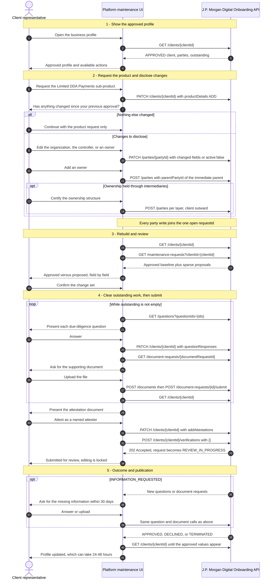

# Approved Client Maintenance UI/UX Recipe

> **Draft - under review.** Open items are tracked in [Open questions](#open-questions).

## Scope

An approved seller onboarded to `EMBEDDED_PAYMENTS / LIMITED_DDA` requests `EMBEDDED_PAYMENTS / LIMITED_DDA_PAYMENTS`. Requesting the product opens a product-add journey, and within it the client may update, add, and remove party information. One verification submits the product request and every party change together.

The journey covers all three actions, because a real client rarely does only one:

| Action     | In this recipe                                                                                                |
| ---------- | ------------------------------------------------------------------------------------------------------------- |
| **Update** | An individual's name and email; the organization's doing-business-as name and address                         |
| **Add**    | An intermediary owner inserted between the client and an existing beneficial owner, plus a new owner          |
| **Remove** | An existing beneficial owner, and a controller replaced by adding the new one before deactivating the old one |

The design problem is keeping the client oriented while all three are in flight at once: what is live today, what has been requested, and what still needs their input.

There is one catch. `GET /clients/{id}` always includes `products`, so you can see the seller is on Embedded Payments. It does not have to include `productDetails`, and that is the only place `subProduct` appears, so the response may never mention Limited DDA at all. When a platform is set up so that Embedded Payments means Limited DDA, take the starting product from your own configuration: do not wait to see `LIMITED_DDA` in the response before offering the journey, and do not tell the seller they hold nothing because the sub-product is missing. Use `productDetails[].onboardingStatus` to follow the product being requested, and expect the product they already hold to be absent from it.

Out of scope: Merchant Services, new-client onboarding, account and payment operations, and any role or field outside [Supported updates](#supported-updates).

This is an implementation companion to the PDP guides in [References](#references). Those guides and the Digital Onboarding OpenAPI specification define supported API behavior. They do not, however, describe how a sparse proposal merges into an existing one, when writes are blocked, what the client response shows while a request is open, or how the UI should assemble a current-versus-requested view. This recipe fills those gaps with design guidance, projection invariants, UX patterns, failure handling, and test recommendations, and marks whether a statement comes from the published guides or from observed API behavior.

The API exposes an approved client snapshot, product status, and sparse party proposals. It does not expose a complete "future client" object or a field-level diff, so the host derives both.

## Relationship to the Digital Onboarding Flow

This recipe follows the section-oriented model described in [`DIGITAL_ONBOARDING_FLOW_RECIPE.md`](./DIGITAL_ONBOARDING_FLOW_RECIPE.md). It extends the same client data, overview, review, attestation, and verification concepts into the approved-client lifecycle.

| Concern            | Digital onboarding flow                          | Approved client maintenance                                                                                      |
| ------------------ | ------------------------------------------------ | ---------------------------------------------------------------------------------------------------------------- |
| Entry state        | New or in-progress client                        | Client whose onboarding status is `APPROVED`                                                                     |
| Primary data       | `GET /clients/{id}` and outstanding requirements | `GET /clients/{id}` plus sparse maintenance proposals                                                            |
| Main navigation    | Overview of business, people, and required tasks | Profile overview with changed sections and a change-review task                                                  |
| Maintenance writes | Create or update onboarding parties and products | `PATCH /clients` for products only; `POST /parties` and sparse `PATCH /parties/{partyId}` for every party change |
| Review             | Review the collected onboarding profile          | Compare the approved profile with proposed changes                                                               |
| Attestation        | Complete outstanding attestation documents       | Review and submit any maintenance attestation requirements                                                       |
| Verification       | Start initial due diligence processing           | Submit maintenance changes for asynchronous due diligence review                                                 |
| Completion signal  | Observe client onboarding status                 | Refetch the approved client and observe maintenance status                                                       |

The reference implementation exposes this lifecycle through a standalone maintenance route without changing `OnboardingFlow.tsx`. A host can instead extend its existing onboarding overview, use a dedicated maintenance area, or present request-specific tasks.

## References

Payments Developer Portal (PDP) sources this recipe is verified against:

- [Update party information](https://developer.payments.jpmorgan.com/docs/commerce/optimization-protection/capabilities/digital-onboarding/how-to/update-party-information) - normative maintenance lifecycle, allowed updates, request bundling, cancellation, and publication timing.
- [Collect indirect ownership information](https://developer.payments.jpmorgan.com/docs/commerce/optimization-protection/capabilities/digital-onboarding/how-to/indirect-ownership) - 25% threshold, intermediary owner fields, and chain construction.
- [Present attestations](https://developer.payments.jpmorgan.com/docs/commerce/optimization-protection/capabilities/digital-onboarding/how-to/present-attestations) and [Complete onboarding steps](https://developer.payments.jpmorgan.com/docs/commerce/optimization-protection/capabilities/digital-onboarding/how-to/complete-onboarding-steps).
- [Present onboarding questions](https://developer.payments.jpmorgan.com/docs/commerce/optimization-protection/capabilities/digital-onboarding/how-to/present-onboarding-questions) and [Upload documents](https://developer.payments.jpmorgan.com/docs/commerce/optimization-protection/capabilities/digital-onboarding/how-to/upload-documents).
- [Digital Onboarding API reference](https://developer.payments.jpmorgan.com/api/commerce/optimization-protection/digital-onboarding/digital-onboarding) and the downloaded [OpenAPI v1.4.1](../api-specs/commerce-digital-onboarding-1.4.1.yaml) used by the showcase.

Use the local v1.4.1 Commerce model subsets. Do not use the generated `embedded-components/src/api` models for these maintenance resources because those models come from different Embedded Payments specifications.

Where the guides and the specification are silent, the behavior described below was established by exercising the API. Those statements are marked as observed behavior and still need confirmation that they are contractual rather than incidental.

## Preconditions and invariants

- The client is `APPROVED` and its business country of formation is the United States. The API does not restrict legal entity type, though a platform may choose to support a narrower set.
- One open maintenance `requestId` per client. Every party write made while it is open is bundled under that same `requestId`, and `ClientResponse.updateRequest` reports that request ID and status.
- `ClientResponse.status` stays `APPROVED` for the whole maintenance lifecycle. Branch on `updateRequest`, never on client status.
- Observed behavior: a request is open while its status is `NEW` or `INFORMATION_REQUESTED`, and party writes are accepted in both. A write is rejected while a `REVIEW_IN_PROGRESS` request exists for the client or the party.
- Send only changed fields. Never replay a complete approved party.
- A value cannot be removed once it is set. It can only be changed to another value. `null` properties and empty arrays are ignored, nested objects merge property by property, and a non-empty array replaces the whole array. Three consequences for the UI: offer no clear affordance; make an address edit resend every address that has to survive, because the array is replaced rather than merged; and never send a write whose fields would all be ignored, because it still opens a maintenance request carrying an empty proposal.
- Repeated writes for one party accumulate into a single stored delta. Per field the latest write wins; fields set by earlier writes remain. The API does not retain the earlier value, so any superseded history has to be recorded by the host.
- A `PATCH` response returns the persisted values plus an `updateRequest` block. Pending values are visible only through the maintenance-request endpoints.
- After verification moves the request to `REVIEW_IN_PROGRESS`, no further edits are allowed.
- Adding a product does not create a maintenance request. `updateRequest` appears only when party information changes: modifying existing information, adding a party, or removing one. Track the requested product through `productDetails[].onboardingStatus` when it is present, and the party request through `updateRequest`.
- One `POST /clients/{id}/verifications` submits the product request together with every party change under the open request. Both the product status and the party request status reach `APPROVED` together, so present them as one submission with one outcome.
- Observed behavior: `ClientResponse.outstanding` is calculated against the proposed state, not the approved one. Pending party edits are overlaid and a party pending removal is excluded before requirements are computed, so outstanding work already reflects the draft.
- Approved values can take 24-48 hours to appear in `GET /clients/{id}`. Approval itself arrives as a notification event; the client response remains the record of what has actually been published.

### Supported updates

| Change                                            | Operation                                                       | Guide-mandated conditions                                                                                                      |
| ------------------------------------------------- | --------------------------------------------------------------- | ------------------------------------------------------------------------------------------------------------------------------ |
| Add the `LIMITED_DDA_PAYMENTS` sub-product        | `PATCH /onboarding/v1/clients/{clientId}` with `productDetails` | `action: ADD`; keeps the approved `LIMITED_DDA` detail                                                                         |
| Client legal name or DBA name                     | `PATCH /onboarding/v1/parties/{clientPartyId}`                  | Sole proprietorships also send `firstName`, `middleName`, `lastName`; upload the name-change documents listed in `outstanding` |
| Client address                                    | `PATCH /onboarding/v1/parties/{clientPartyId}`                  | Supported address types only; an unsupported or sanctioned country terminates the request                                      |
| Controller or beneficial owner name or birth date | `PATCH /onboarding/v1/parties/{partyId}`                        | `firstName`, `middleName`, `lastName`, `birthDate` only; provide documentary evidence                                          |
| Add a beneficial owner or controller              | `POST /onboarding/v1/parties`                                   | `parentPartyId` is the immediate parent; the new party runs identity verification and KYC; FinCEN attestation required         |
| Remove a related party                            | `PATCH /onboarding/v1/parties/{partyId}` with `active: false`   | Provide a replacement when removing the only `CONTROLLER`                                                                      |
| Restate an owner as indirect                      | `PATCH /onboarding/v1/parties/{partyId}`                        | Set `parentPartyId` to the new intermediary and `natureOfOwnership` to `Indirect`                                              |
| Disclose indirect ownership                       | `POST /onboarding/v1/parties` per ownership layer               | See [Disclose indirect ownership](#5-disclose-indirect-ownership)                                                              |

The API enforces a maximum of four `BENEFICIAL_OWNER` parties, counted after pending edits are applied and with `INTERMEDIARY_OWNER` organizations excluded. A fifth is rejected, so mirror the limit in the UI and never let the user reach that error.

Keep the "Has anything changed since your previous approval?" answer in host state; do not send it to the API. A no answer creates no party writes. A yes answer reveals the disclosure controls.

Build form controls and request DTOs from this allowlist. Parse the broader OAS response model, but do not expose other OAS properties as editable maintenance fields.

## High-level flow



`GET /maintenance-requests/{requestId}` complements the list call. The list call discovers requests for a client; the request-scoped call retrieves all party proposals grouped under one `requestId`.

## Endpoint responsibilities

Shared client, party, verification, question, document, and attestation operations retain the responsibilities defined by the [Digital Onboarding Flow](./DIGITAL_ONBOARDING_FLOW_RECIPE.md). This complementary recipe defines only the maintenance-request operations introduced for approved-client maintenance.

| Operation                                                | Contract role in this recipe                              | Important response behavior                                                                            |
| -------------------------------------------------------- | --------------------------------------------------------- | ------------------------------------------------------------------------------------------------------ |
| `GET /onboarding/v1/maintenance-requests?clientId={id}`  | Discover all maintenance items for the approved client    | Exactly one of `clientId` or `partyId` is required; fetch every page before claiming a complete review |
| `GET /onboarding/v1/maintenance-requests/{requestId}`    | Retrieve all party proposals grouped under one request ID | Returns the same list wrapper, not a distinct top-level request resource                               |
| `DELETE /onboarding/v1/maintenance-requests/{requestId}` | Cancel a `NEW` request, optionally for one `partyId`      | Returns the affected items with terminal `TERMINATED` status                                           |

Generate one UUID v4 `Idempotency-Key` for each logical mutation and reuse that key only for retries of that same mutation.

## Maintenance response model

The OAS defines maintenance metadata on each returned party:

```ts
type KycUpdateRequestStatus =
  | 'NEW'
  | 'REVIEW_IN_PROGRESS'
  | 'INFORMATION_REQUESTED'
  | 'APPROVED'
  | 'DECLINED'
  | 'TERMINATED';

type KycUpdateRequestAction = 'ADD' | 'MODIFY' | 'DELETE';

type KycUpdateRequest = {
  status?: KycUpdateRequestStatus;
  action?: KycUpdateRequestAction;
  requestId?: string;
  submittedAt?: string; // date-time
};

type ListKycPartyUpdateRequests = {
  parties?: Array<PartyResponse & { updateRequest?: KycUpdateRequest }>;
  metadata?: PageMetaData;
};
```

Read product proposal metadata from `ClientResponse.productDetails` and `ClientResponse.updateRequest`. Do not synthesize a party proposal for client-owned product update metadata:

```ts
type ClientProductUpdate = {
  productDetails: Array<{
    product: 'EMBEDDED_PAYMENTS';
    subProduct: 'LIMITED_DDA_PAYMENTS';
    action: 'ADD';
  }>;
};

type ClientResponse = {
  productDetails?: ProductDetailsStatusItem[];
  updateRequest?: KycUpdateRequest;
  // other persisted client fields
};

type ProductChange = {
  product: ClientProduct;
  subProduct?: SubProductType;
  requestedAction: 'ADD' | 'REMOVE'; // retained from the submitted command
  onboardingStatus: ProductDetailsOnboardingStatus;
};
```

Apply these response rules:

- A response item is a sparse party proposal, not a `MaintenanceRequest` aggregate; request metadata is nested under `party.updateRequest`.
- A client response holds persisted state; a maintenance-list response holds pending state. The API returns no field-level `before` and `after` values.
- Party proposals come from maintenance-request responses. Product state comes from `ClientResponse.productDetails` alone, because a product change carries no `updateRequest`; never synthesize a party record for it.
- Preserve the submitted product command so the UI can label the requested `ADD` or `REMOVE`; `ProductDetailsStatusItem` returns status, not action.
- Build the projection from the client-scoped list, which is the only read whose published example carries `id` on every item. A proposal is a sparse delta, so without `id` it cannot be attached to a party: the request-scoped examples omit it, and party-scoped reads have been seen without it. Treat identifiers as optional, and keep the party ID you queried as context rather than relying on the payload to carry it.
- One response can mix records for the same party from different requests, for example a `TERMINATED` record beside a `REVIEW_IN_PROGRESS` one. Filter by status; there is no server-side active filter.
- Observed behavior: `updateRequest.submittedAt` is the last time that party's delta was written, not the time the request was submitted for review. Use it to order writes within a request, not to date the submission.
- Validate `requestId`, `action`, and the party ID before projection. Reject payloads missing correlation data and block submission.
- Overlay a proposal by merging nested objects property by property and replacing arrays whole. Do not treat a present nested object as a full replacement; the API does not.
- Once a product `onboardingStatus` or party `updateRequest.status` becomes terminal, drop that proposal from the overlay and refetch the client until its approved values are published.

## Party-maintenance lifecycle invariants

Enforce these state-machine guards:

| `updateRequest.status`  | Host may mutate draft | Host may cancel | Host action                                                                                                                                                           |
| ----------------------- | --------------------- | --------------- | --------------------------------------------------------------------------------------------------------------------------------------------------------------------- |
| No open request         | Yes                   | No              | First supported change creates a draft                                                                                                                                |
| `NEW`                   | Yes                   | Yes             | Continue editing under the same `requestId`; attest and verify when ready                                                                                             |
| `REVIEW_IN_PROGRESS`    | No                    | No              | Show read-only submitted changes and await an outcome                                                                                                                 |
| `INFORMATION_REQUESTED` | Yes                   | No              | Writes still merge into the same request; lead with the returned tasks. Completing them returns the request to `REVIEW_IN_PROGRESS` without another verification call |
| `APPROVED`              | No                    | No              | Exclude from proposed state and refetch until approved values are published                                                                                           |
| `DECLINED`/`TERMINATED` | No                    | No              | Exclude from proposed state and retain request history                                                                                                                |

Fail closed if more than one active `requestId` is returned for one client; the guide allows only one. Preserve the payload for support diagnostics, reject the projection, and block attestation. Records from earlier terminated requests are returned alongside the active one, so filter by status instead of assuming one record per party.

The guide defines four `TERMINATED` triggers: the platform cancels before calling verifications, the client does not answer an information request within 30 days, the updated country is unsupported, or the update carries a different tax identification number that requires new onboarding. Explain which one applies instead of showing a generic cancellation message.

### Resolve outstanding requirements

Resolve requirements at the lifecycle stage in which the API returns them. Complete the required attestations, then call verifications. Documents are not requested up front in this flow; a document request arrives after submission, alongside `INFORMATION_REQUESTED`. Complete information requests within 30 days to prevent automatic termination.

Use `ClientResponse.outstanding` as the task-discovery surface:

1. Refetch `GET /clients/{id}` after every task write and lifecycle event.
2. Whenever `questionIds` are returned, resolve them with `GET /questions?questionIds={ids}` and submit answers through `PATCH /clients/{id}` using `questionResponses`.
3. For each returned `documentRequestId`, read `GET /document-requests/{id}`, upload every required file with `POST /documents`, then submit with `POST /document-requests/{id}/submit`.
4. Present every document in `attestationDocumentIds`, capture the structured attester, and submit the attestation through `PATCH /clients/{id}`. Confirm it landed by refetching until `attestationDocumentIds` no longer lists it, not by reading `ClientResponse.attestations`, which is deprecated.
5. Submit verification and treat `202 Accepted` as the start of asynchronous review, not approval.
6. Use `DocumentRequestResponse.partyId` to associate a document request with its party. Keep questions client-level because `QuestionResponse` has no `partyId`.
7. Deduplicate by document request ID: the same request can appear both in `outstanding` and in a party's `validationResponse[].documentRequestIds`. It is one task, not two blockers.
8. Clear `outstanding.partyIds`, `outstanding.partyRoles`, and `validationResponse` entries by patching the client or the party with the information they name. There is no separate endpoint that starts or resumes validation; the write itself clears the block.
9. Keep the request read-only while additional information is outstanding after submission.

Completing the returned work resumes review by itself, exactly as in the original onboarding. Once every question is answered and every document is accepted, the status returns from `INFORMATION_REQUESTED` to `REVIEW_IN_PROGRESS` on its own. Do not call verification a second time; confirm the transition by refetching `GET /clients/{id}`. A document that is rejected leaves the status unchanged, so keep the task visible until the refetch shows it cleared.

Track status through the notification events webhook channel or by polling `GET /maintenance-requests/{requestId}`; the guide names both.

Keep every party from the approved client snapshot in its approved profile state while maintenance is open. Represent an `ADD` proposal as a new party pending approval; do not assign it an approved profile state until the maintenance proposal is approved and published in `GET /clients/{id}`.

## Operations

Every write uses a fresh UUID v4 `Idempotency-Key`, reused only for retries of that same write. In the examples, `1000010400` is the client ID and `2000000555` is the client organization party (`roles: ["CLIENT"]`); they are different identifiers.

### 1. Request the Limited DDA Payments sub-product

The product upgrade is the only change sent to `PATCH /clients`.

```http
PATCH /onboarding/v1/clients/1000010400
```

```json
{
  "productDetails": [
    {
      "product": "EMBEDDED_PAYMENTS",
      "subProduct": "LIMITED_DDA_PAYMENTS",
      "action": "ADD"
    }
  ]
}
```

Add the requested detail only to the presentation-only proposed client and track it through `productDetails[].onboardingStatus`. Do not remove the approved `LIMITED_DDA` detail; this scenario adds a second sub-product rather than replacing the first.

### 2. Update the client organization

Legal name, DBA name, and address changes are party updates on the `CLIENT` organization, not client updates.

```http
PATCH /onboarding/v1/parties/2000000555
```

```json
{
  "organizationDetails": {
    "dbaName": "Marketplace Vendor Collective",
    "addresses": [
      {
        "addressType": "BUSINESS_ADDRESS",
        "addressLines": ["120 Greene Street", "Floor 3"],
        "city": "New York",
        "state": "NY",
        "postalCode": "10012",
        "country": "US"
      }
    ]
  }
}
```

`addresses` is one logical field: a non-empty array sent here replaces the approved array, while the rest of `organizationDetails` merges property by property. After a legal-name or address change, refetch `GET /clients/{id}` and upload any document listed in `outstanding`.

### 3. Update the controller or an owner

```http
PATCH /onboarding/v1/parties/2000000556
```

```json
{
  "individualDetails": {
    "lastName": "Diaz"
  }
}
```

`firstName`, `middleName`, `lastName`, `birthDate`, and `email` are updatable for an existing individual. Do not replay addresses, roles, or identifiers the user did not edit.

### 4. Remove a related party

```http
PATCH /onboarding/v1/parties/2000000557
```

```json
{ "active": false }
```

Removal is a sparse party update. Treat either `action: "DELETE"` or `action: "MODIFY"` carrying `active: false` as a pending removal and derive `removesParty: true`; the published example shows `MODIFY`. To replace a controller, add the new one first and deactivate the outgoing one second, so the client is never left without a controller in the draft.

### 5. Disclose indirect ownership

Adding Limited DDA Payments can require the client to certify how ownership is held. Present a certification step that asks whether any owner of 25% or more holds its stake through one or more intermediary entities.

Collect, per the indirect ownership guide:

- every individual who owns 25% or more of the client, directly or indirectly (`roles: ["BENEFICIAL_OWNER"]`); and
- every entity in the ownership chain that owns 25% or more (`roles: ["INTERMEDIARY_OWNER"]`).

Set `natureOfOwnership` from the parent's role. The API validates this pair and rejects a mismatch, so derive it rather than asking the user twice:

| Immediate parent role | Required `natureOfOwnership` | Rejection when wrong                              |
| --------------------- | ---------------------------- | ------------------------------------------------- |
| `CLIENT`              | `Direct`                     | Rejected as an invalid nature for the parent role |
| `INTERMEDIARY_OWNER`  | `Indirect`, and required     | Rejected when the nature is omitted               |

Create each layer with its own `POST /parties`, starting with the layer closest to the client, and set `parentPartyId` to the immediate parent returned by the previous call.

Ownership is also restated, not only added. When an owner the client already declared turns out to be held through a company, the client inserts that company between itself and the existing owner. Present this as one action, "this owner is held through a company", and let the UI do the rest: create the intermediary under the client, then re-parent the existing owner beneath it. Never make the client delete and re-enter an owner they have already been approved for.

Re-parenting is a sparse party update on the approved owner. Both properties are updatable after approval:

```http
PATCH /onboarding/v1/parties/2000000556
```

```json
{
  "parentPartyId": "2000000560",
  "individualDetails": { "natureOfOwnership": "Indirect" }
}
```

Intermediary owner (organization):

```http
POST /onboarding/v1/parties
```

```json
{
  "partyType": "ORGANIZATION",
  "parentPartyId": "2000000555",
  "roles": ["INTERMEDIARY_OWNER"],
  "organizationDetails": {
    "organizationType": "C_CORPORATION",
    "organizationName": "Greene Holdings LLC",
    "countryOfFormation": "US",
    "natureOfOwnership": "Direct",
    "addresses": [
      {
        "addressType": "LEGAL_ADDRESS",
        "addressLines": ["120 Greene Street"],
        "city": "New York",
        "state": "NY",
        "postalCode": "10012",
        "country": "US"
      }
    ],
    "organizationIds": [
      { "idType": "EIN", "value": "050110294", "issuer": "US" }
    ]
  }
}
```

Indirect beneficial owner (individual), parented to the intermediary:

```json
{
  "partyType": "INDIVIDUAL",
  "parentPartyId": "2000000560",
  "roles": ["BENEFICIAL_OWNER"],
  "individualDetails": {
    "firstName": "Sam",
    "lastName": "Lee",
    "birthDate": "1985-04-02",
    "countryOfResidence": "US",
    "natureOfOwnership": "Indirect",
    "addresses": [
      {
        "addressType": "RESIDENTIAL_ADDRESS",
        "addressLines": ["18 Prince Street"],
        "city": "New York",
        "state": "NY",
        "postalCode": "10012",
        "country": "US"
      }
    ],
    "individualIds": [{ "idType": "SSN", "value": "214994652", "issuer": "US" }]
  }
}
```

Host rules for the disclosure UI:

- An owner declared `Indirect` requires at least one intermediary entity in its chain. Block submission while a declared indirect owner has an empty chain.
- The four-owner limit counts `BENEFICIAL_OWNER` parties only, after pending edits are applied. `INTERMEDIARY_OWNER` organizations are excluded. The API rejects the fifth, so disable the add control at four.
- A business can be a terminal owner with no individual beneath it. Do not force an individual under every chain.
- Derive the direct or indirect badge from `natureOfOwnership` on the party. Do not keep a separate toggle state.
- Adding a party while an unsubmitted `ADD` already exists for it is rejected. Edit the pending addition instead of creating a second one.
- Every added party, individual or organization, runs identity verification and KYC and can raise new questions or document requests during review.
- Collect the FinCEN attestation required for `BENEFICIAL_OWNER` and `CONTROLLER` additions.

### Read the pending values

Every `PATCH` returns the persisted values plus request metadata. Refetch the maintenance list and read the proposal from there:

```json
{
  "parties": [
    {
      "id": "2000000555",
      "organizationDetails": {
        "dbaName": "Marketplace Vendor Collective"
      },
      "updateRequest": {
        "status": "NEW",
        "action": "MODIFY",
        "requestId": "4000001049",
        "submittedAt": "2026-04-11T10:00:00.000Z"
      }
    }
  ],
  "metadata": { "page": 0, "limit": 25, "total": 1 }
}
```

Do not read submitted values back from a `PATCH` response or optimistically write them into the approved-client cache.

### Cancel a draft

While the request is `NEW`, `DELETE /onboarding/v1/maintenance-requests/{requestId}` cancels the whole draft and `?partyId={partyId}` cancels one party's changes. Both return the affected items with `TERMINATED` status. Cancellation is unavailable after verification starts, and it covers party changes only: a requested product cannot be withdrawn this way.

Observed behavior worth reflecting in the UI:

- Cancelling one party discards that party's stored delta. The change cannot be recovered, so confirm before sending.
- The parent request is terminated only once every party under it is terminated, so a party-scoped cancel usually leaves the request open with the remaining changes intact.
- Editing a party again after its changes were cancelled revives the same record as a new `MODIFY`. Present that as starting a fresh change, not as undoing the cancellation.

## Handle the active request

Use this active-status set:

```ts
const ACTIVE_PREVIEW_STATUSES = new Set([
  'NEW',
  'REVIEW_IN_PROGRESS',
  'INFORMATION_REQUESTED',
]);
```

Before projection, collect the distinct party-maintenance `requestId` values in this set. Accept exactly one active party-maintenance request ID. Block review and submission when more than one is returned. Track requested products separately from `productDetails[].onboardingStatus`.

`GET /maintenance-requests?clientId={id}` returns `404` with `error: NOT_FOUND` only while the client has never had a maintenance request. Once one exists the call returns `200`, including after cancellation, when the only record is `TERMINATED`. Treat that `404` as an empty history and render the approved profile; do not treat it as a load failure and do not match on the response message, which echoes the queried client ID as though it were a request ID.

Exclude `APPROVED`, `DECLINED`, and `TERMINATED` proposals from the proposed profile and actionable counts. Retain them in request history. Keep `GET /clients/{id}` authoritative for persisted values.

Handle approved proposals as follows:

1. Never overlay an `APPROVED` client or party update payload onto the approved baseline.
2. Trust `GET /clients/{id}` as the current approved state after server approval.

This avoids double-applying an already accepted update.

## Build the approved and proposed profiles

### 1. Keep the approved baseline immutable

```ts
const approvedClient = await getClient(clientId);
const maintenance = await getMaintenanceRequests({ clientId });

const proposedClient = structuredClone(approvedClient);
```

Never mutate query-cache data and never send `proposedClient` back to the API. It is a display projection only.

Before cloning, separate product details that are not yet `APPROVED` from the approved ones. Add the pending details only to `proposedClient`, record a `ProductChange` for each, and leave the approved product collection unchanged.

### 2. Use an allowlisted field registry

Do not recursively merge arbitrary JSON. An explicit descriptor controls correlation, sparse presence, writes, labels, formatting, masking, and array semantics:

```ts
type PartyFieldDescriptor = {
  path: EditablePartyPath;
  label: string;
  sensitivity: 'public' | 'masked';
  isPresent: (proposal: PartyResponse) => boolean;
  read: (party: PartyResponse) => unknown;
  write: (party: PartyResponse, value: unknown) => void;
};

const descriptors: PartyFieldDescriptor[] = [
  organizationField('organizationName', 'Legal business name'),
  organizationField('dbaName', 'Doing business as'),
  organizationField('addresses', 'Business address'),
  organizationField('natureOfOwnership', 'Nature of ownership'),
  individualField('firstName', 'First name'),
  individualField('middleName', 'Middle name'),
  individualField('lastName', 'Last name'),
  individualField('birthDate', 'Date of birth', 'masked'),
  individualField('natureOfOwnership', 'Nature of ownership'),
];
```

Keep editable request descriptors separate from broader response descriptors. Treat `addresses` and every other array as one logical field. A present array replaces the complete approved array; omission leaves it unchanged. Do not model append or item-level PATCH semantics.

### 3. Apply action-specific behavior

```text
fetch every maintenance page
collect active party-maintenance request IDs
stop with an integration error if more than one active party-maintenance request ID exists

for each active client product detail:
  remove it from approvedClient
  append it to proposedClient
  record a ProductChange with the client updateRequest provenance

for each maintenance party in the one active request:
  reject it from the projection if status is not a candidate status
  require requestId, submittedAt, action, and enough identity to correlate it

  if action is ADD:
    append a presentation-only party
    record request provenance for every present allowlisted field

  if action is MODIFY:
    find the approved/projected party by id
    for every allowlisted field explicitly present in the sparse proposal:
      replace that logical field in the projection
      append { requestId, submittedAt, status, proposedValue } to provenance

  if action is DELETE or a related-party removal is represented by active: false:
    remove the party from proposedClient
    retain the approved party in PartyChange so the UI can explain the removal

diff approvedClient and proposedClient across the same descriptors
emit PartyChange[] and FieldChange[] with winning and superseded sources
```

### 4. Preserve provenance

```ts
type ChangeSource = {
  requestId: string;
  submittedAt: string;
  status: 'NEW' | 'REVIEW_IN_PROGRESS' | 'INFORMATION_REQUESTED';
};

type FieldChange = {
  path: EditablePartyPath;
  approvedValue: unknown;
  proposedValue: unknown;
  source: ChangeSource;
  sensitivity: 'public' | 'masked';
};

type ChangeSet = {
  approvedClient: ClientResponse;
  proposedClient: ClientResponse; // display only
  productChanges: ProductChange[];
  partyChanges: PartyChange[];
  invalidProposals: PartyResponse[];
};
```

The API coalesces repeated writes for a party and returns only the latest value, so each field carries exactly one source. Do not try to reconstruct earlier values from the response.

## Review UI

One profile hub is the default layout. Alternate layouts must read the same `ChangeSet` and must not change projection rules or API behavior.

### Profile review hub

```text
Approved business profile                              [6 proposed changes]
Disclose changes   Review changes       Attest       Submitted
  ●                 ○                 ○              ○
────────────────────────────────────────────────────────────────────

Products
Limited DDA                                            [Current]
Limited DDA Payments                                   [Proposed addition]

Has anything changed since your previous approval?
( ) No, nothing else changed
(●) Yes, I have changes to disclose

Organization
Marketplace Vendor LLC                                 [1 change] [Edit]

People
Jane Diaz · Controller, beneficial owner · Direct      [1 change] [Edit] [Remove]
Alex Smith · Beneficial owner · Direct                 [Removal requested]
Sam Lee · Beneficial owner · Indirect                  [Proposed addition]
  via Greene Holdings LLC · Intermediary owner         [Proposed addition]

Owners: 3 of 4                              [Review proposed changes]
```

Expanded review:

```text
Jane Doe                                    MODIFY · request 4000001049
┌──────────────────┬────────────────────┬───────────────────────────────┐
│ Field            │ Approved           │ Proposed                      │
├──────────────────┼────────────────────┼───────────────────────────────┤
│ Last name        │ Doe                │ Diaz                          │
└──────────────────┴────────────────────┴───────────────────────────────┘
```

On narrow viewports, render each comparison as an `Approved`/`Proposed` definition stack and stack the ownership chain under its owner. Keep the disclosure answer and the owner count in host state.

### Complete-profile comparison

```text
┌ Approved profile ──────────┐  ┌ Proposed profile ─────────┐
│ Marketplace Vendor        │  │ Marketplace Vendor       │
│ 85 Mercer Street          │  │ 120 Greene Street        │
│ Jane R. Doe               │  │ Jane R. Diaz             │
└────────────────────────────┘  └────────────────────────────┘
```

Stack the approved and proposed profiles on narrow viewports.

### Request task view

```text
Product proposal · REVIEW IN PROGRESS
  Limited DDA Payments      ADD       [Review]

Party request 4000001049 · NEW · 5 tasks
  Marketplace Vendor LLC    MODIFY    [Review]
  Jane Doe                  MODIFY    [Review]
  Alex Smith                REMOVE    [Review]
  Greene Holdings LLC       ADD       [Review]
  Sam Lee                   ADD       [Review]

  [Cancel draft]                       [Review and attest]
```

Open each task into the same field comparison used by the profile review hub.

### State-specific interactions

| Resource state                             | Primary message                               | Available actions                                                                                                     |
| ------------------------------------------ | --------------------------------------------- | --------------------------------------------------------------------------------------------------------------------- |
| No open request                            | Approved profile                              | Edit a supported field, add a related party, or remove a related party                                                |
| Party `updateRequest.status: NEW`          | Draft changes are not yet submitted           | Continue supported party edits, review, attest, verify, or cancel the party-maintenance request                       |
| Product or party `REVIEW_IN_PROGRESS`      | Submitted for review; not approved            | View read-only changes and status; prevent ordinary edit controls                                                     |
| Product or party `INFORMATION_REQUESTED`   | More information is required                  | Show the returned tasks; refetch after each one and return to the submitted view once the status flips back to review |
| Product or party `APPROVED`, not published | Approved; profile update may take 24-48 hours | Remove that proposal overlay and refetch the client until its approved values are published                           |
| Published                                  | Approved profile is current                   | Return to profile and retain request history                                                                          |
| Product or party `DECLINED`                | Changes were not approved                     | Remove that proposal overlay and retain its request history                                                           |
| Party `updateRequest.status: TERMINATED`   | Draft was canceled or auto-closed             | Remove the party proposal overlay and return to the approved profile                                                  |

For cancellation, distinguish “Cancel all draft changes” from party-scoped cancellation. Display the request ID, affected party names, and irreversible result. Offer cancellation only while the request is `NEW`; disable it as soon as verification starts.

## Attestation and verification

Attestations on an existing client go through `addAttestations`. In v1.4.1 that property is marked deprecated and the specification offers no successor, so it remains the only available path; build against it and expect a migration later. Inside it, use the structured `attester` rather than the deprecated `attesterFullName`, and send `attestationTime`, `documentId`, and `ipAddress`, all of which are required. Retrieve each attestation document with `GET /documents/{id}` and its content with `GET /documents/{id}/file` before collecting acceptance:

```json
{
  "addAttestations": [
    {
      "attester": {
        "firstName": "Jordan",
        "lastName": "Lee",
        "designation": "Chief executive officer"
      },
      "attestationTime": "2026-04-12T15:00:00.000Z",
      "documentId": "c4e4739f-33ed-47f6-82fa-0b1c5c992d0b",
      "ipAddress": "192.0.2.10"
    }
  ]
}
```

After the required attestations are submitted, one verification call submits the product request and every party change together as a single review:

```http
POST /onboarding/v1/clients/1000010400/verifications
Idempotency-Key: 037f83cf-971d-42fe-90b0-16e712be157b
Content-Type: application/json
```

```json
{}
```

Handle the `202` response:

```json
{
  "acceptedAt": "2026-04-12T15:01:00.000Z"
}
```

The UI must say “submitted” or “accepted for review,” never “approved.” After verification returns `202`, disable ordinary party editing and draft cancellation. Obtain subsequent status from webhooks and refetches. Treat `acceptedAt` as optional when parsing the response.

Read product outcome from `productDetails[].onboardingStatus` and request state from `updateRequest`. Remove each proposal overlay when it reaches a terminal state. Subscribe to the notification events webhook channel or poll `GET /maintenance-requests/{requestId}`, and keep `GET /clients/{id}` as the persisted baseline. Approval and publication are separate: the event says the change was approved, the client payload says it is live. Say "approved, updating your profile" until the value appears.

## Client state and cache boundaries

Keep three distinct state objects:

```ts
type MaintenanceWorkspaceState = {
  approvedClient: ClientResponse; // GET /clients/{id}; persisted source of truth
  maintenancePages: ListKycPartyUpdateRequests[]; // sparse pending/history data
  projection: ChangeSet; // derived, presentation-only, never sent to the API
};
```

Invalidate both caches after every mutation:

```ts
const clientKey = ['digital-onboarding', 'client', clientId];
const maintenanceKey = ['digital-onboarding', 'maintenance', clientId];

async function patchParty(partyId: string, changedFields: UpdatePartyRequest) {
  await api.patchParty(partyId, changedFields, crypto.randomUUID());

  // The PATCH response contains persisted values, not the proposed field values.
  await Promise.all([
    queryClient.invalidateQueries({ queryKey: clientKey }),
    queryClient.invalidateQueries({ queryKey: maintenanceKey }),
  ]);
}
```

- Do not optimistically patch `approvedClient` with submitted values.
- Retain form values until the maintenance refetch succeeds and label them local and unsynchronized.
- Fetch page zero, then page with the limit you requested: `metadata` returns `page` and `total` but has been observed to omit `limit`, and every field in it is optional. The maximum page size is 25. Keep paging until the collected count reaches `total`, then verify it against a final page-zero refetch before enabling review or attestation.
- Treat malformed metadata, a missing page, or a changing total as an incomplete read and block review.
- Rebuild the projection from query data; do not store a second mutable copy.
- Key request-specific caches by both client and `requestId` to avoid cross-client collisions.
- Redact birth dates and identifiers from analytics, errors, and mutation logs.

## Staleness and consistency

The platform is the only writer, so it serializes its own edits and no cross-consumer conflict exists. What can still move underneath the UI is server-driven: a request can enter review, ask for information, be approved, or be auto-terminated at any moment.

Refetch the client and every maintenance page immediately before attestation and verification, and rebuild the change set. If the request status is no longer the one the client reviewed under, show the new state instead of submitting.

Use the same event model as the regular onboarding flow. Refetch client and maintenance resources after a relevant event, track product `onboardingStatus` and party `updateRequest.status`, and stop tracking each proposal when it becomes terminal. Continue lower-frequency client refetches during the 24-48 hour publication window. Do not keep an approved proposal overlay visible while waiting for publication.

## Sensitive data

Mask sensitive KYC values in every field diff using per-field sensitivity metadata:

- government identifiers show type and only a masked ending;
- dates of birth are fully masked in delta rows;
- phone numbers show only the final four digits;
- raw sensitive values are excluded from UI telemetry and request logs;
- unknown fields are not rendered merely because they appear in JSON.

Apply masking in the host before rendering or logging values.

## Projection safety rules

- Overlay only allowlisted fields explicitly present in a maintenance proposal.
- Keep the approved value when an allowlisted property is absent, is `null`, or is an empty array. None of those clear anything.
- Merge a nested object property by property, and replace an array whole when it is non-empty. Mirror that so the preview matches the outcome.
- Read pending additions from maintenance responses and retain their assigned party IDs.
- Build the proposed party set from the union of approved parties and pending additions.
- Treat `TERMINATED` as a terminal request state, not as deletion of the committed party.
- Treat `active: false` with an active request status, under either `MODIFY` or `DELETE`, as a pending removal.
- Read party proposal metadata from maintenance responses; do not require `updateRequest` on approved parties returned by `GET /clients/{id}`.
- Ignore unknown response fields. Do not render or log them automatically.

## Required error and edge-state behavior

| State                                                                            | Required host response                                                                                                |
| -------------------------------------------------------------------------------- | --------------------------------------------------------------------------------------------------------------------- |
| Client is not `APPROVED` or is out of scope                                      | Do not offer maintenance; route to the appropriate onboarding/support state                                           |
| Client load fails                                                                | Keep route context, show retry, do not render stale deltas as current                                                 |
| Product, party-create, or party-update write fails                               | Keep local input, focus the error, and do not mutate the approved cache                                               |
| PATCH succeeds but maintenance refetch fails                                     | Show the request as synchronizing; do not invent the proposed value from the PATCH response                           |
| More than one open party-maintenance request ID is returned                      | Block attestation/verification and surface an integration error                                                       |
| Maintenance list is incomplete/unpageable                                        | Do not claim the proposed snapshot is complete                                                                        |
| Proposal lacks correlation fields                                                | Exclude it from projection, show a validation warning, and block submission                                           |
| Request status changed since the client reviewed it                              | Show the new state instead of submitting                                                                              |
| Mutation returns `409`                                                           | Treat it as a lifecycle lock, preserve local input, refetch client and maintenance state, and show the current status |
| Mutation returns a status-related `422`                                          | Parse `ApiError.context`, refetch lifecycle status, and render the allowed state-specific actions                     |
| Draft cancellation returns `409`/`422`                                           | Refetch status; do not locally mark the request terminated                                                            |
| Attestation PATCH fails                                                          | Do not call verification                                                                                              |
| Verification returns `409` or `422`                                              | Preserve review data and display actionable API context                                                               |
| Verification returns `202`                                                       | Show accepted for processing and refetch product and party status independently                                       |
| Product or party status becomes `INFORMATION_REQUESTED`                          | Surface returned outstanding questions, documents, and party requirements                                             |
| Product or party status becomes `APPROVED`                                       | Exclude that proposal from projection and refetch client through the 24-48 hour publication window                    |
| Product or party status becomes `DECLINED`, or party status becomes `TERMINATED` | Remove that proposal from proposed state and retain request history and audit context                                 |

## Required test coverage

Eligibility and product:

- approved-client and US country-of-formation guards;
- `LIMITED_DDA_PAYMENTS` added alongside the approved `LIMITED_DDA`, never replacing it, and never Merchant Services;
- a product-only change producing no `updateRequest`, and product state read from `productDetails[].onboardingStatus` without manufacturing a party record.

Party maintenance:

- the since-approval checkpoint: no continues with the product change only, yes reveals the disclosure controls;
- request DTOs that omit unchanged fields and reject fields outside the allowlist;
- client legal name, DBA name, and address sent to `PATCH /parties/{clientPartyId}`, never to `PATCH /clients`;
- repeated party writes sharing one open `requestId` and merging into one delta, with the latest value winning per field;
- `null` and empty-array properties treated as no-ops, nested objects merged property by property, and a non-empty array replacing the whole array;
- no clear affordance offered for any field, and a write whose fields would all be ignored never sent;
- `outstanding` driving the task list even though it reflects the proposed state;
- `ClientResponse.status` staying `APPROVED` while `updateRequest` drives the UI;
- a `404` from the client-scoped maintenance list rendering an empty history rather than a load failure, and a post-cancellation `200` with a `TERMINATED` record;
- terminated records from an earlier request filtered out of the active projection;
- paging that ignores a missing `metadata.limit` and stops on `total`;
- `MODIFY` or `DELETE` with `active: false` deriving `removesParty: true`, and the replacement-controller guard;
- `PATCH` responses retaining persisted values while the maintenance GET returns pending values;
- approved baseline immutability after every product, create, update, and removal write;
- more than one active `requestId` blocking projection and submission;
- missing correlation fields excluded from projection and blocking submission;
- sparse nested overlay that does not erase untouched approved fields, with a present array replacing the whole array;
- writes accepted while the request is `INFORMATION_REQUESTED` and rejected once it is `REVIEW_IN_PROGRESS`;
- party-scoped cancellation discarding one delta while the request stays open, and a later edit reviving that party as `MODIFY`;
- identity, birth-date, and phone masking.

Indirect ownership:

- the certification question gating the chain controls;
- inserting an intermediary above an already-declared owner without asking the client to re-enter that owner, re-parenting it with `parentPartyId` and `natureOfOwnership`;
- `outstanding` entries clearing through the patch that supplies the named information, with no separate validation call;
- a controller replacement that adds the incoming controller before deactivating the outgoing one;
- an owner declared `Indirect` blocking submission until at least one intermediary exists;
- chain creation ordered from the client outward with `parentPartyId` set to the immediate parent;
- `natureOfOwnership` derived from the parent's role, `Direct` under the client and `Indirect` under an intermediary, with no separate toggle state;
- the four-owner limit counting `BENEFICIAL_OWNER` parties after pending edits and excluding intermediaries, with the add control disabled at four;
- a second `ADD` for a party that already has a pending addition blocked in the UI;
- a business permitted as a terminal owner with no individual beneath it.

Lifecycle:

- full-request and party-scoped cancellation while `NEW`, and the lock after submission;
- attestation required before verification;
- verification moving `NEW` to `REVIEW_IN_PROGRESS` and preventing further edits;
- `INFORMATION_REQUESTED` surfacing returned questions and document requests, and returning to `REVIEW_IN_PROGRESS` once they are complete without a second verification call;
- each documented `TERMINATED` trigger rendering its own explanation;
- `202 Accepted` separated from later approval, and 24-48 hour publication messaging without overlaying approved data;
- both client and maintenance resources refetched after every write and before attestation.

Add contract and integration coverage for pagination, sparse nested objects, cancellation scope, information requests, status events, and publication timing.

## Reference implementation map

| Concern                       | Location                                                                                                             |
| ----------------------------- | -------------------------------------------------------------------------------------------------------------------- |
| Runnable route                | `app/client-next-ts/src/routes/approved-client-maintenance.tsx`                                                      |
| Main workflow                 | `app/client-next-ts/src/components/client-maintenance/ClientMaintenanceWorkspace.tsx`                                |
| Local v1.4.1 model subset     | `app/client-next-ts/src/components/client-maintenance/models/maintenance-api.ts`                                     |
| Approved/proposed projection  | `app/client-next-ts/src/components/client-maintenance/utils/build-maintenance-projection.ts`                         |
| Commerce-shaped mock handlers | `app/client-next-ts/src/components/client-maintenance/mocks/create-client-maintenance-handlers.ts`                   |
| API client calls              | `app/client-next-ts/src/components/client-maintenance/client-maintenance-api.ts`                                     |
| Ownership chain UI            | `embedded-components/src/core/IndirectOwnership/` and `embedded-components/docs/indirect-ownership-recovery-plan.md` |
| Focused tests                 | Colocated under `app/client-next-ts/src/components/client-maintenance/`                                              |

Run the showcase:

```powershell
pnpm -C app/client-next-ts run dev
```

```text
http://localhost:3000/approved-client-maintenance
```

## Open questions

Move each resolved answer into the owning section above, then remove its row.

### Not determinable from the specification, the guides, or the API

| Flow area                              | Question                                                                                                                                                                                                                                                                                                                                                                       |
| -------------------------------------- | ------------------------------------------------------------------------------------------------------------------------------------------------------------------------------------------------------------------------------------------------------------------------------------------------------------------------------------------------------------------------------ |
| Ownership certification                | Is there a certification or attestation specific to the indirect-ownership disclosure, beyond the FinCEN attestation for new owners?                                                                                                                                                                                                                                           |
| Writable field, role, and entity scope | What is the complete allowlist by country, legal entity type, party type, and role, and what response identifies an unsupported field, role, or entity?                                                                                                                                                                                                                        |
| Correlating a proposal to a party      | A proposal is a sparse delta, so `id` is what attaches it to a party. `PartyResponse` marks `id` optional and the request-scoped examples omit it, leaving no way to place the items of a multi-party request. Is `id` guaranteed on maintenance reads? Is `parentPartyId` returned for a pending `ADD`, so a fresh session can place a proposed party in the ownership chain? |
| Attestation payload                    | `addAttestations`, `removeAttestations`, and `ClientResponse.attestations` are all deprecated in v1.4.1 with no successor in the specification. What replaces them, on what timeline, and until then is `addAttestations` with a structured `attester` supported in production?                                                                                                |
| Error taxonomy and correlation         | Which codes distinguish lifecycle locks, invalid fields, unsupported roles, duplicate submissions, and retryable failures, and how must `ApiError.context`, `traceId`, `requestId`, and `Idempotency-Key` be correlated?                                                                                                                                                       |
| Status and publication events          | Which events carry maintenance status changes and the point at which approved values become live on the client, which identifiers do they include, and what delivery and retry behavior must the host support? Approved values are not always live when the request reaches `APPROVED`; closing that gap is in progress.                                                       |

### Observed behavior to confirm as contractual

The sections above already build on these. Each was established by exercising the API, and none is stated in the guides or the specification. Confirm each is guaranteed, or say what to rely on instead.

- `ClientResponse.status` stays `APPROVED` while a request is under review, and `client.updateRequest` is always populated while a party-only request is active.
- A request is open in `NEW` and `INFORMATION_REQUESTED`; writes are rejected only once a `REVIEW_IN_PROGRESS` request exists for the client or the party.
- Sparse writes accumulate into one stored delta per party: nested objects merge property by property and non-empty arrays replace whole.
- `ClientResponse.outstanding` is computed against the proposed state, with parties pending removal excluded.
- `updateRequest.submittedAt` is the last write time of that party's delta, not the review submission time.
- Maintenance reads render the stored delta plus `updateRequest`, which is why party-scoped results omit `id` and `partyId`.
- One response can mix active and terminal records for the same party, and no active-only filter parameter exists.
- `metadata` has been observed without `limit`, so clients must page using the limit they requested.
- The empty-result `404` applies only before the client's first maintenance request; after cancellation the call returns `200` with a `TERMINATED` record.
- The not-found message echoes the queried client ID as a maintenance request ID, so error text is not safe to match on.
- Cancelling a party discards its delta, the parent request terminates only when every party under it is terminated, and a later edit revives the record as a new `MODIFY`.
- Four `BENEFICIAL_OWNER` parties is a server-enforced maximum, evaluated after pending edits and excluding `INTERMEDIARY_OWNER`.
- `natureOfOwnership` is validated against the immediate parent's role: `Direct` under `CLIENT`, `Indirect` and mandatory under `INTERMEDIARY_OWNER`.
- Mutation responses never carry the submitted value, so every write needs a follow-up maintenance read.
