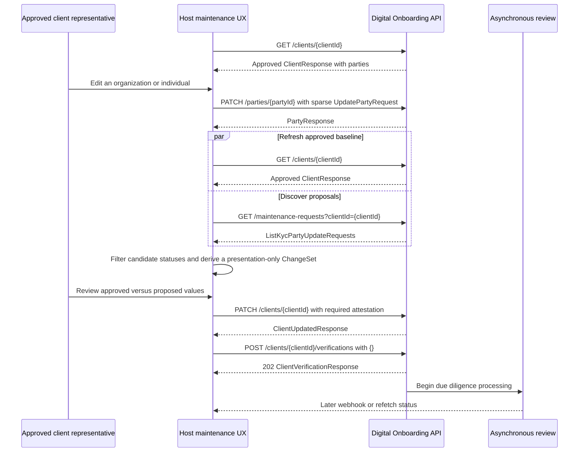

⚠️ DRAFT - UNDER REVIEW ⚠️

This document is a draft and is currently being updated. Information contained herein may be incomplete or subject to change.

# Approved Client Maintenance UI/UX Recipe

## Introduction

An already approved client may need to update its organization or related-party information. The API exposes an approved client snapshot and sparse maintenance proposals, but it does not expose a complete “future client” object or field-level diff.

This recipe provides guidelines for implementing a client-facing maintenance experience with the Commerce Digital Onboarding API. A typical journey allows a client representative to:

1. Retrieve the approved client and all approved parties.
2. Let the client representative propose an edit to a party.
3. Refetch the approved client and sparse maintenance proposals.
4. Derive approved and proposed presentation models without changing the approved baseline.
5. Review changed fields with request provenance.
6. Present and submit required attestations.
7. Request verification and represent `202 Accepted` as asynchronous processing.
8. Observe later status changes through refetch or webhooks.

The suggested workflow can be adapted to a host platform's navigation, state management, and design system. Merge policies and status handling should be confirmed against the published API contract and product guidance before production use.

## Relationship to the Digital Onboarding Flow

This recipe follows the section-oriented model described in [`DIGITAL_ONBOARDING_FLOW_RECIPE.md`](./DIGITAL_ONBOARDING_FLOW_RECIPE.md). It extends the same client data, overview, review, attestation, and verification concepts into the approved-client lifecycle.

| Concern           | Digital onboarding flow                          | Approved client maintenance                                      |
| ----------------- | ------------------------------------------------ | ---------------------------------------------------------------- |
| Entry state       | New or in-progress client                        | Client whose onboarding status is `APPROVED`                     |
| Primary data      | `GET /clients/{id}` and outstanding requirements | `GET /clients/{id}` plus sparse maintenance proposals            |
| Main navigation   | Overview of business, people, and required tasks | Profile overview with changed sections and a change-review task  |
| Party editing     | Create or update onboarding parties              | Submit sparse updates with `PATCH /parties/{partyId}`            |
| Review            | Review the collected onboarding profile          | Compare the approved profile with proposed changes               |
| Attestation       | Complete outstanding attestation documents       | Review and submit any maintenance attestation requirements       |
| Verification      | Start initial due diligence processing           | Submit maintenance changes for asynchronous due diligence review |
| Completion signal | Observe client onboarding status                 | Refetch the approved client and observe maintenance status       |

The standalone reference route mirrors this lifecycle without changing `OnboardingFlow.tsx`. Hosts can instead extend their existing overview, use a dedicated maintenance area, or present request-specific tasks.

## References

- [Digital Onboarding API reference](https://developer.payments.jpmorgan.com/api/commerce/optimization-protection/digital-onboarding/digital-onboarding) - OpenAPI v1.4.1.
- [Get maintenance requests by request ID](https://developer.payments.jpmorgan.com/api/commerce/optimization-protection/digital-onboarding/digital-onboarding#/operations/smbdo-getAllMaintenanceRequestsByRequestId).
- [Complete onboarding steps](https://developer.payments.jpmorgan.com/docs/commerce/optimization-protection/capabilities/digital-onboarding/how-to/complete-onboarding-steps).
- [Present attestations](https://developer.payments.jpmorgan.com/docs/commerce/optimization-protection/capabilities/digital-onboarding/how-to/present-attestations).

The reference implementation defines local v1.4.1 model subsets. The generated `embedded-components/src/api` models come from different Embedded Payments specifications and do not define the Commerce maintenance resources used here.

## API contract notes

Keep published API behavior separate from client-side presentation choices when implementing the workflow.

| Source                        | How it is used                                                                                       |
| ----------------------------- | ---------------------------------------------------------------------------------------------------- |
| **Digital Onboarding v1.4.1** | Defines operations and schemas, including sparse `PartyResponse` maintenance items                   |
| **PDP workflow guidance**     | Describes attestation and `POST /clients/{id}/verifications`, including the `202` response           |
| **Suggested client behavior** | Provides presentation choices such as an active-status filter and a latest-wins preview              |
| **Clarification needed**      | Identifies behavior to confirm when the contract does not define correlation, precedence, or merging |

## High-Level Flow



`GET /maintenance-requests/{requestId}` complements the list call. The list call discovers requests for a client; the request-scoped call retrieves all party proposals associated with one `requestId`.

## Endpoint responsibilities

| Operation                                               | Contract role in this recipe                              | Important response behavior                                                                    |
| ------------------------------------------------------- | --------------------------------------------------------- | ---------------------------------------------------------------------------------------------- |
| `GET /onboarding/v1/clients/{id}`                       | Approved/current client and party baseline                | Returns `ClientResponse`; `parties[]` contains full party details                              |
| `PATCH /onboarding/v1/parties/{partyId}`                | Submit a sparse organization or individual update         | Accepts `UpdatePartyRequest`; returns `PartyResponse` with `200`                               |
| `GET /onboarding/v1/maintenance-requests?clientId={id}` | Discover maintenance proposals for the client             | Exactly one of `clientId` or `partyId` is required; returns paged `ListKycPartyUpdateRequests` |
| `GET /onboarding/v1/maintenance-requests/{requestId}`   | Retrieve all party proposals grouped under one request ID | Returns the same list wrapper, not a distinct top-level request resource                       |
| `PATCH /onboarding/v1/clients/{id}`                     | Submit outstanding attestation data                       | Accepts `UpdateClientRequestSmbdo`; returns `ClientUpdatedResponse`                            |
| `POST /onboarding/v1/clients/{id}/verifications`        | Request due diligence processing                          | Accepts `ClientVerificationRequest` (documented example `{}`); returns `202` with `acceptedAt` |

All mutating calls should send a unique `Idempotency-Key`. The OAS recommends UUID v4 values.

## Maintenance response model

The OAS defines maintenance metadata on each returned party:

```ts
type KycUpdateRequestStatus =
  | 'NEW'
  | 'REVIEW_IN_PROGRESS'
  | 'INFORMATION_REQUESTED'
  | 'APPROVED'
  | 'DECLINED'
  | 'TERMINATED';

type KycUpdateRequestAction = 'ADD' | 'MODIFY' | 'DELETE';

type KycUpdateRequest = {
  status?: KycUpdateRequestStatus;
  action?: KycUpdateRequestAction;
  requestId?: string;
  submittedAt?: string; // date-time
};

type ListKycPartyUpdateRequests = {
  parties?: Array<PartyResponse & { updateRequest?: KycUpdateRequest }>;
  metadata?: PageMetaData;
};
```

Important consequences:

- A response item is a sparse party proposal, not a `MaintenanceRequest` aggregate.
- Request metadata is nested under `party.updateRequest`.
- Multiple party items may share a `requestId`.
- The OAS does not require the `KycUpdateRequest` properties.
- `PartyResponse.id` is optional in the schema, and some published maintenance examples omit it.
- The API does not return field-level `before` and `after` values.

## Example sparse update cycle

An individual update can be sent without replaying the full approved party:

```http
PATCH /onboarding/v1/parties/2000000556
Idempotency-Key: 6e6d53d0-d4d4-45d3-a929-4fc735394834
Content-Type: application/json
```

```json
{
  "individualDetails": {
    "jobTitle": "CFO",
    "addresses": [
      {
        "addressType": "RESIDENTIAL_ADDRESS",
        "addressLines": ["28 Pine Avenue"],
        "city": "Brooklyn",
        "state": "NY",
        "postalCode": "11217",
        "country": "US"
      }
    ]
  }
}
```

A later list response may expose a sparse proposal such as:

```json
{
  "parties": [
    {
      "id": "2000000556",
      "individualDetails": {
        "jobTitle": "CFO",
        "addresses": [
          {
            "addressType": "RESIDENTIAL_ADDRESS",
            "addressLines": ["28 Pine Avenue"],
            "city": "Brooklyn",
            "state": "NY",
            "postalCode": "11217",
            "country": "US"
          }
        ]
      },
      "updateRequest": {
        "status": "NEW",
        "action": "MODIFY",
        "requestId": "4000001048",
        "submittedAt": "2026-04-10T10:00:00.000Z"
      }
    }
  ],
  "metadata": { "page": 0, "limit": 25, "total": 1 }
}
```

## Suggested active-request handling

A reference implementation can use this candidate set for the proposed-profile preview:

```ts
const ACTIVE_PREVIEW_STATUSES = new Set([
  'NEW',
  'REVIEW_IN_PROGRESS',
  'INFORMATION_REQUESTED',
]);
```

`APPROVED`, `DECLINED`, and `TERMINATED` proposals do not contribute to the proposed future snapshot or actionable counts. They may appear in collapsed history. This is a presentation policy, not an OAS rule.

The original requirement to “ignore approved update requests” is therefore implemented in two ways:

1. Never overlay an `APPROVED` maintenance payload onto the approved baseline.
2. Trust `GET /clients/{id}` as the current approved state after server approval.

This avoids double-applying an already accepted update.

## Build approved and proposed client objects

### 1. Keep the approved baseline immutable

```ts
const approvedClient = await getClient(clientId);
const maintenance = await getMaintenanceRequests({ clientId });

const proposedClient = structuredClone(approvedClient);
```

Never mutate query-cache data and never send `proposedClient` back to the API. It is a display projection only.

### 2. Use an allowlisted field registry

Do not recursively merge arbitrary JSON. An explicit descriptor controls correlation, sparse presence, writes, labels, formatting, masking, and array semantics:

```ts
type PartyFieldDescriptor = {
  path: EditablePartyPath;
  label: string;
  sensitivity: 'public' | 'masked';
  isPresent: (proposal: PartyResponse) => boolean;
  read: (party: PartyResponse) => unknown;
  write: (party: PartyResponse, value: unknown) => void;
};

const descriptors: PartyFieldDescriptor[] = [
  individualField('jobTitle', 'Job title'),
  individualField('addresses', 'Residential address'),
  individualField('individualIds', 'Government identification', 'masked'),
  organizationField('website', 'Website'),
  organizationField('organizationIds', 'Business identification', 'masked'),
];
```

Arrays need field-specific semantics. In the reference implementation, `addresses`, `roles`, and identity collections are whole logical fields and an explicitly present proposal array replaces the approved array in the projection. Confirm the intended behavior for each collection before applying this policy in production.

### 3. Apply action-specific behavior

```text
for each maintenance party in deterministic order:
  reject it from the projection if status is not a candidate status
  require requestId, submittedAt, action, and enough identity to correlate it

  if action is ADD:
    append a presentation-only party
    record request provenance for every present allowlisted field

  if action is MODIFY:
    find the approved/projected party by id
    for every allowlisted field explicitly present in the sparse proposal:
      replace that logical field in the projection
      append { requestId, submittedAt, status, proposedValue } to provenance

  if action is DELETE:
    remove the party from proposedClient
    retain the approved party in PartyChange so the UI can explain the removal

diff approvedClient and proposedClient across the same descriptors
emit PartyChange[] and FieldChange[] with winning and superseded sources
```

### 4. Preserve provenance and conflict evidence

```ts
type ChangeSource = {
  requestId: string;
  submittedAt: string;
  status: 'NEW' | 'REVIEW_IN_PROGRESS' | 'INFORMATION_REQUESTED';
};

type FieldChange = {
  path: EditablePartyPath;
  approvedValue: unknown;
  proposedValue: unknown;
  source: ChangeSource;
  supersededSources: ChangeSource[];
  sensitivity: 'public' | 'masked';
};

type ChangeSet = {
  approvedClient: ClientResponse;
  proposedClient: ClientResponse; // display only
  partyChanges: PartyChange[];
  conflicts: FieldChange[];
  unresolvedProposals: PartyResponse[];
};
```

The reference implementation sorts oldest-to-newest by `submittedAt`, then by `requestId`; a newer value overlays an older value. Every overwritten source remains visible. This is a client-side presentation choice because the API does not document server precedence.

## Concurrent-proposal strategies

The runnable workflow implements option B, but all three are legitimate integration candidates pending API clarification.

| Option                                            | Behavior                                                          | Strength                                 | Risk                                  |
| ------------------------------------------------- | ----------------------------------------------------------------- | ---------------------------------------- | ------------------------------------- |
| **A. Request-centric, no merged future snapshot** | Render each `requestId` independently and flag overlapping fields | Makes no precedence claim                | Client must mentally combine requests |
| **B. Latest-wins preview with provenance**        | Overlay by `submittedAt`, retain superseded sources and warning   | Produces a comprehensible future profile | Can differ from server adjudication   |
| **C. Server-resolved projection**                 | API returns canonical proposed state or ordered field deltas      | Highest integration confidence           | Requires a new/expanded contract      |

If server ordering cannot be guaranteed, option A is the safest production default.

## UX options

### Option 1: profile review hub (implemented illustration)

```text
Approved business profile                              [3 proposed changes]
Profile       Review changes       Attest       Submitted
  ●                 ○                 ○              ○
────────────────────────────────────────────────────────────────────

Organization
Marketplace Vendor LLC                                [1 change] [Edit]

People
Jane Doe · Controller, beneficial owner               [2 changes] [Edit]
Alex Smith · Beneficial owner                         [Current]   [Edit]
```

Expanded review:

```text
Jane Doe                                      MODIFY · 2 fields · 4000001048
┌──────────────────┬────────────────────┬─────────────────────────┐
│ Field            │ Approved           │ Proposed                │
├──────────────────┼────────────────────┼─────────────────────────┤
│ Job title        │ Treasurer          │ Chief financial officer│
│ Home address     │ 10 Market St…      │ 28 Pine Ave…            │
└──────────────────┴────────────────────┴─────────────────────────┘
```

This balances future-profile comprehension with field and request provenance. On mobile, each comparison becomes an `Approved`/`Proposed` definition stack.

### Option 2: side-by-side complete profiles

```text
┌ Approved profile ──────────┐  ┌ Proposed profile ─────────┐
│ Jane Doe                   │  │ Jane Doe             (2)  │
│ Treasurer                  │  │ Chief financial officer   │
│ 10 Market Street           │  │ 28 Pine Avenue            │
└────────────────────────────┘  └────────────────────────────┘
```

This is useful for exhaustive legal review but repeats unchanged values and degrades quickly on small screens.

### Option 3: request ledger

```text
4000001048 · INFORMATION_REQUESTED · Apr 10
  Jane Doe / job title       Treasurer → Chief financial officer
  Jane Doe / address         10 Market St → 28 Pine Ave

4000001042 · REVIEW_IN_PROGRESS · Apr 8
  Jane Doe / job title       Treasurer → Finance director
  Superseded in reference preview by 4000001048
```

This gives operations users strong auditability but asks a client representative to reconstruct the future profile.

These wireframes are design options, not API requirements. A host can use a wizard, task inbox, request ledger, side-by-side diff, or another accessible pattern while preserving the same contract boundaries.

## Attestation and verification

The OAS defines structured `attester` details:

```json
{
  "addAttestations": [
    {
      "attester": {
        "firstName": "Jordan",
        "lastName": "Lee",
        "designation": "Chief executive officer"
      },
      "attestationTime": "2026-04-12T15:00:00.000Z",
      "documentId": "c4e4739f-33ed-47f6-82fa-0b1c5c992d0b",
      "ipAddress": "192.0.2.10"
    }
  ]
}
```

Contract tension to clarify:

- `UpdateClientRequestSmbdo.addAttestations` is marked deprecated in v1.4.1.
- `Attestation.attesterFullName` is also deprecated; structured `attester` is available.
- The current PDP “Present attestations” how-to still demonstrates `addAttestations` with deprecated `attesterFullName`.
- The OAS does not expose an obvious non-deprecated replacement property for adding attestations.

The reference implementation uses `addAttestations` with structured `attester` to avoid the deprecated name field while keeping the documented update operation. Confirm the intended replacement contract before production use.

After outstanding requirements are submitted:

```http
POST /onboarding/v1/clients/1000010400/verifications
Idempotency-Key: 037f83cf-971d-42fe-90b0-16e712be157b
Content-Type: application/json
```

```json
{}
```

The documented success response is `202`:

```json
{
  "acceptedAt": "2026-04-12T15:01:00.000Z"
}
```

The UI must say “submitted” or “accepted for review,” never “approved.” Later status should come from a refetch or an applicable webhook event.

## Staleness and consistency

Immediately before attestation, the reference implementation refetches the client and maintenance list in parallel and rebuilds the `ChangeSet`. If party changes differ from the reviewed set, it invalidates the attestation and asks the user to review again.

This reduces risk but does not create transaction-level consistency between the two GET calls. The API design should clarify whether clients can obtain:

- a version, ETag, or snapshot token;
- an “as of” timestamp shared by client and maintenance responses;
- an optimistic-concurrency precondition on attestation or verification; or
- a server-computed proposed snapshot.

## Sensitive data

Field diffs can accidentally expose more KYC data than the profile UI normally displays. The implementation uses per-field sensitivity metadata:

- government identifiers show type and only a masked ending;
- dates of birth are fully masked in delta rows;
- phone numbers show only the final four digits;
- raw sensitive values are excluded from UI telemetry and request logs;
- unknown fields are not rendered merely because they appear in JSON.

Masking is a host responsibility unless the API offers presentation-safe values.

## API clarifications and design considerations

Confirm the following behavior when designing a production maintenance experience:

| Area                    | What v1.4.1 exposes                                                                        | Question to resolve                                                                                                                      |
| ----------------------- | ------------------------------------------------------------------------------------------ | ---------------------------------------------------------------------------------------------------------------------------------------- |
| Proposal correlation    | Sparse `PartyResponse`; `id` is optional and absent in some maintenance examples           | What stable key correlates a `MODIFY`/`DELETE` proposal to an approved party when `id` is absent?                                        |
| Request aggregate       | `requestId` is nested on each party; list returns `parties[]`                              | Is one request an atomic group across all matching party items?                                                                          |
| Overlap precedence      | `submittedAt` and `requestId`, no precedence statement                                     | Can active requests overlap on one field? If yes, which value represents the canonical proposed state?                                   |
| Timestamp ties          | `submittedAt` is date-time                                                                 | Is ordering strict and unique, or must clients handle equal/missing timestamps?                                                          |
| PATCH response          | `PATCH /parties/{id}` returns `PartyResponse`                                              | For approved clients, is this the approved party, sparse proposal, or merged proposed party? Must `updateRequest` be present?            |
| Sparse nested objects   | `UpdatePartyRequest` fields are optional                                                   | Are nested objects merged by property? Are arrays replaced, merged, or action-addressed?                                                 |
| Clearing values         | No explicit null/removal semantics in the reviewed model                                   | How does a client intentionally remove an optional scalar, address, phone, role, or identity?                                            |
| `ADD` identity          | Maintenance response party `id` is optional                                                | Is a stable proposed party ID assigned before approval? How are parent relationships represented?                                        |
| `DELETE` semantics      | Action enum includes `DELETE`                                                              | Is deletion soft/inactivation or removal, and what should `GET /clients/{id}` return during/after review?                                |
| Status ownership        | Client, party profile, product, and update request each have statuses                      | Which status controls maintenance UX and which transitions are guaranteed together?                                                      |
| Approved history        | Approved payloads can remain in maintenance results                                        | When is an approved change guaranteed to appear in `GET /clients/{id}`? How long are approved requests retained?                         |
| Pagination              | Maintenance list is paged, default/max 25                                                  | Must a client fetch every page before producing a complete future snapshot? Can pages change during traversal?                           |
| Verification scope      | Verification request body can be `{}`                                                      | Does one verification call submit all active maintenance requests for the client, only outstanding data, or another server-selected set? |
| Attestation deprecation | `addAttestations` and `attesterFullName` carry deprecation signals                         | What is the intended non-deprecated maintenance attestation contract?                                                                    |
| New requirements        | Client response exposes outstanding questions, attestations, parties, roles, and documents | Which requirements can maintenance create, and must all be completed before verification?                                                |
| Concurrency control     | `409` documents concurrent-request errors but no resource version is exposed               | Which operations can return `409`, and what retry/review behavior is expected?                                                           |
| Webhooks                | General client onboarding events are documented                                            | Is there a maintenance/request-specific event with `requestId`, party ID, action, and status?                                            |
| Termination             | DELETE endpoint terminates requests by `requestId`, optionally `partyId`                   | Is partial termination supported when one request groups multiple parties, and is the remaining group still atomic?                      |
| Authorization           | OAS defines OAuth/mTLS/token schemes                                                       | Can any authorized client user modify and attest all party roles, or must the host enforce role-specific authorization?                  |

Document confirmed behavior in the API description, model property descriptions, examples, error contracts, or how-to guides so implementations do not need to infer it.

## Error and edge-state expectations

| State                                      | Illustrative UX response                                                |
| ------------------------------------------ | ----------------------------------------------------------------------- |
| Client load fails                          | Keep route context, show retry, do not render stale deltas as current   |
| Party PATCH fails                          | Keep drawer values and focus the error                                  |
| Maintenance list is incomplete/unpageable  | Do not claim the future snapshot is complete                            |
| Proposal lacks correlation fields          | Exclude it from projection and show an unresolved-proposal warning      |
| Reviewed data changes before attestation   | Invalidate attestation and return to review                             |
| Attestation PATCH fails                    | Do not call verification                                                |
| Verification returns `409` or `422`        | Preserve review data and display actionable API context                 |
| Verification returns `202`                 | Show submitted/pending; continue observing status                       |
| Status becomes `INFORMATION_REQUESTED`     | Surface new outstanding questions/documents/party fields                |
| Requests become `APPROVED`                 | Refetch client; exclude approved requests from active projection        |
| Requests become `DECLINED` or `TERMINATED` | Remove from future projection and retain optional history/audit context |

## Testing recommendations

Tests should cover:

- active-status filtering and approved-request exclusion;
- sparse nested-field overlay without erasing untouched approved fields;
- `ADD`, `MODIFY`, and `DELETE` projection behavior;
- deterministic overlapping-field precedence with source retention;
- unresolved proposal handling;
- identity, birth-date, and phone masking;
- approved baseline immutability after `PATCH /parties/{id}`;
- request-scoped maintenance lookup;
- attestation required before verification in the demo;
- `202 Accepted` separated from later approval;
- refetch after every write and before attestation;
- edit, review, attest, submit, review-in-progress, and approved UI states.

Add contract or integration coverage for any behavior that depends on server ordering, sparse update semantics, or asynchronous status transitions.

## Reference implementation map

| Concern                       | Location                                                                                           |
| ----------------------------- | -------------------------------------------------------------------------------------------------- |
| Runnable route                | `app/client-next-ts/src/routes/approved-client-maintenance.tsx`                                    |
| Main workflow                 | `app/client-next-ts/src/components/client-maintenance/ClientMaintenanceWorkspace.tsx`              |
| Local v1.4.1 model subset     | `app/client-next-ts/src/components/client-maintenance/models/maintenance-api.ts`                   |
| Approved/proposed projection  | `app/client-next-ts/src/components/client-maintenance/utils/build-maintenance-projection.ts`       |
| Commerce-shaped mock handlers | `app/client-next-ts/src/components/client-maintenance/mocks/create-client-maintenance-handlers.ts` |
| API client calls              | `app/client-next-ts/src/components/client-maintenance/client-maintenance-api.ts`                   |
| Focused tests                 | Colocated under `app/client-next-ts/src/components/client-maintenance/`                            |

Run the showcase and open the illustration:

```powershell
pnpm -C app/client-next-ts run dev
```

```text
http://localhost:3000/approved-client-maintenance
```
