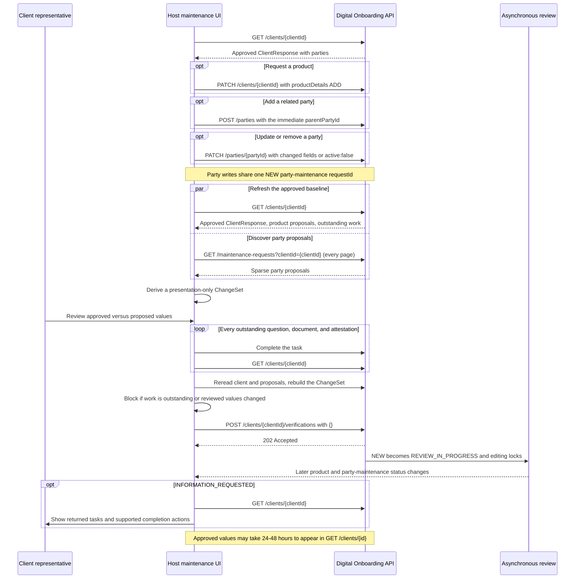

# Approved Client Maintenance Recipe

> **Draft - under review.** This recipe may change before it is finalized. Current limitations are listed in [Known Limitations](#known-limitations).

## Introduction

After a client is approved, it may need to add a product or keep its `CLIENT` party and related parties current. This recipe helps developers build a UI for that on top of the Digital Onboarding API.

The API exposes three things:

- the approved client, from `GET /clients/{id}`;
- client-level product proposals, on that same client response; and
- sparse party proposals, from the maintenance-request endpoints.

It does not return a complete "future client" or field-level before-and-after values. Most of the work in a maintenance UI is deriving that view safely, keeping it apart from the approved data, and submitting it at the right time.

This recipe complements the official [Update party information](https://developer.payments.jpmorgan.com/docs/commerce/optimization-protection/capabilities/digital-onboarding/how-to/update-party) guide and the OpenAPI reference, which define supported behavior. It adds implementation invariants, a projection approach, failure handling, test ideas, and UX recommendations. Page structure, navigation, visual design, and wording are yours to choose.

### How to read this recipe

- **Must** statements protect data integrity or follow from how the API works.
- **Recommended** statements are suggestions. Adapt them to your product.

A typical journey lets a client representative:

1. View the approved client profile and its related parties.
2. Request an additional product, update supported party information, add a related party, or remove one.
3. Review every pending change against the approved values.
4. Complete the questions, documents, and attestations the API asks for.
5. Submit the changes for review, then follow their status until the approved values are published.

## References

- [Update party information](https://developer.payments.jpmorgan.com/docs/commerce/optimization-protection/capabilities/digital-onboarding/how-to/update-party): lifecycle, supported update scenarios, request grouping, cancellation, and publication timing.
- [Digital Onboarding API reference](https://developer.payments.jpmorgan.com/api/commerce/optimization-protection/digital-onboarding/digital-onboarding).
- [Get maintenance requests by request ID](https://developer.payments.jpmorgan.com/api/commerce/optimization-protection/digital-onboarding/digital-onboarding#/operations/smbdo-getAllMaintenanceRequestsByRequestId).
- [Complete onboarding steps](https://developer.payments.jpmorgan.com/docs/commerce/optimization-protection/capabilities/digital-onboarding/how-to/complete-onboarding-steps).
- [Present attestations](https://developer.payments.jpmorgan.com/docs/commerce/optimization-protection/capabilities/digital-onboarding/how-to/present-attestations).
- [Digital Onboarding Flow recipe](./DIGITAL_ONBOARDING_FLOW_RECIPE.md): the onboarding counterpart to this recipe.

## Relationship to the Digital Onboarding Flow

Maintenance reuses the onboarding concepts of client data, outstanding requirements, review, attestation, and verification, and applies them to an approved client.

| Concern           | Digital onboarding flow                          | Approved client maintenance                                                       |
| ----------------- | ------------------------------------------------ | --------------------------------------------------------------------------------- |
| Entry state       | New or in-progress client                        | Client whose status is `APPROVED`                                                 |
| Primary data      | `GET /clients/{id}` and outstanding requirements | `GET /clients/{id}` plus sparse maintenance proposals                             |
| Writes            | Create or update onboarding parties and products | `PATCH /clients/{id}`, `POST /parties`, or sparse `PATCH /parties/{partyId}`      |
| Review            | Review the collected onboarding profile          | Compare the approved profile with the proposed changes                            |
| Attestation       | Complete outstanding attestation documents       | Complete any attestations the maintenance changes require                         |
| Verification      | Start initial due diligence                      | Submit the changes for asynchronous review                                        |
| Completion signal | Client onboarding status                         | Product and party-maintenance statuses, then the published approved client values |

You can extend an existing onboarding overview, add a dedicated maintenance area, or organize the work as request-specific tasks.

## Prerequisites and Scope

### Preconditions

- **Must:** offer maintenance only when the client's status is `APPROVED`.
- **Must:** expect at most one open party-maintenance `requestId` per client. Party writes made while that request is `NEW` are grouped under the same `requestId`.
- **Must:** treat a `NEW` proposal as changing. Repeated writes to a party are merged into that party's one proposal in the same maintenance request: the latest value of each field wins, fields written earlier are kept, and `submittedAt` moves to the latest write. Reread the proposals after every write instead of assuming earlier values still hold.
- **Must:** send only the fields whose values changed. Don't replay a complete party object.
- **Must:** stop accepting edits once verification moves the request to `REVIEW_IN_PROGRESS`. The API rejects edits and discards from then on (`11902`), but see [Known Limitations](#known-limitations) for additions.
- **Must:** respect the five-minute lead time after the first product verification. See [Enforce the product-verification lead time](#enforce-the-product-verification-lead-time).

### Supported changes

The [Update party information](https://developer.payments.jpmorgan.com/docs/commerce/optimization-protection/capabilities/digital-onboarding/how-to/update-party) guide lists these approved-client maintenance scenarios:

- change the `CLIENT` party's `organizationName` or `dbaName`;
- change the `CLIENT` party's address;
- add a related party;
- remove a related party by setting `active: false`; and
- change a related party's first, middle, or last name, or birth date.

Depending on your integration, maintenance can also cover the following. Check with your J.P. Morgan representative before enabling them:

- Role changes through `roles` on `PATCH /parties/{partyId}`, such as replacing the `CONTROLLER` party.
- Ownership moves through `parentPartyId` on `PATCH /parties/{partyId}`.
- Other `individualDetails` or `organizationDetails` fields, such as contact details or industry.

### Editable fields

The API rejects a maintenance update to a field that isn't editable, with error `10105` ("…is not editable"). Currently, these fields are accepted on an existing party:

| `partyType`    | Editable                                                                                                                          | Not editable                                                      |
| -------------- | --------------------------------------------------------------------------------------------------------------------------------- | ----------------------------------------------------------------- |
| `INDIVIDUAL`   | `firstName`, `middleName`, `lastName`, `birthDate`, `jobTitle`, `addresses`, `phone`, `email`, `roles`, `parentPartyId`, `active` | `nameSuffix`, `countryOfResidence`, `individualIds`               |
| `ORGANIZATION` | `organizationName`, `dbaName`, `organizationDescription`, `organizationType`, `website`, `phone`, `addresses`, `email`            | `yearOfFormation`, `organizationIds`, `countryOfFormation`, `mcc` |

- `industry` can only be sent together with `organizationDescription` (error `10001`).
- Lists, such as `roles` and `addresses`, are replaced whole. Send every item the party should keep.

**Must:** build form controls and request bodies from an explicit allowlist of supported fields. Parse the full response model, but don't make a property editable just because it appears in a response.

### Eligibility configuration

- **Must:** decide eligibility from host configuration that matches the client's country of formation and legal entity type exactly. Deny maintenance when nothing matches.
- **Recommended:** configure eligibility by kind of change, such as profile changes, product additions, or indirect ownership, rather than by individual field. An `INDIVIDUAL` party's details form one form, and field-level switches produce partial forms that are hard to explain.
- **Recommended:** hide controls for changes the configuration doesn't allow. Show a control disabled only for a temporary state, such as the product lead time or a locked review. When nothing is allowed, a view-only profile is enough.

### Legal entity and ownership rules

- **Recommended:** apply the same legal entity rules as onboarding. For example, onboarding collects no ownership structure for a `SOLE_PROPRIETORSHIP` client, so don't offer ownership views or `BENEFICIAL_OWNER` actions for one in maintenance.
- A `BENEFICIAL_OWNER` party owns 25% or more of the client, so a client has at most four. **Recommended:** enforce this before the API rejects a fifth.
- A client keeps one `CONTROLLER` party. **Recommended:** model a `CONTROLLER` change as a replacement, not as separate additions and removals. See [Replace the `CONTROLLER` party](#replace-the-controller-party).

## High-Level Flow


```mermaid
sequenceDiagram
    participant U as Client representative
    participant UX as Host maintenance UI
    participant API as Digital Onboarding API
    participant JPMC as Asynchronous review

    UX->>API: GET /clients/{clientId}
    API-->>UX: Approved ClientResponse with parties
    opt Request a product
      UX->>API: PATCH /clients/{clientId} with productDetails ADD
    end
    opt Add a related party
      UX->>API: POST /parties with the immediate parentPartyId
    end
    opt Update or remove a party
      UX->>API: PATCH /parties/{partyId} with changed fields or active:false
    end
    Note over UX,API: Party writes share one NEW party-maintenance requestId
    par Refresh the approved baseline
        UX->>API: GET /clients/{clientId}
        API-->>UX: Approved ClientResponse, product proposals, outstanding work
    and Discover party proposals
        UX->>API: GET /maintenance-requests?clientId={clientId} (every page)
        API-->>UX: Sparse party proposals
    end
    UX->>UX: Derive a presentation-only ChangeSet
    U->>UX: Review approved versus proposed values
    loop Every outstanding question, document, and attestation
      UX->>API: Complete the task
      UX->>API: GET /clients/{clientId}
    end
    UX->>API: Reread client and proposals, rebuild the ChangeSet
    UX->>UX: Block if work is outstanding or reviewed values changed
    UX->>API: POST /clients/{clientId}/verifications with {}
    API-->>UX: 202 Accepted
    API->>JPMC: NEW becomes REVIEW_IN_PROGRESS and editing locks
    JPMC-->>UX: Later product and party-maintenance status changes
    opt INFORMATION_REQUESTED
      UX->>API: GET /clients/{clientId}
      UX->>U: Show returned tasks and supported completion actions
    end
    Note over UX,API: Approved values may take 24-48 hours to appear in GET /clients/{id}
```

## Endpoints

| Operation                                                       | Role in maintenance                                               |
| --------------------------------------------------------------- | ----------------------------------------------------------------- |
| `GET /clients/{id}`                                             | Approved baseline, product proposals, and outstanding work        |
| `PATCH /clients/{id}`                                           | Product additions, question responses, and attestations           |
| `POST /parties`                                                 | Add a related party                                               |
| `PATCH /parties/{partyId}`                                      | Sparse party updates and removals                                 |
| `GET /maintenance-requests?clientId={id}`                       | Discover every party proposal for the client                      |
| `GET /maintenance-requests/{requestId}`                         | Retrieve the party proposals grouped under one request            |
| `DELETE /maintenance-requests/{requestId}`                      | Cancel a `NEW` request, optionally for one party with `?partyId=` |
| `GET /document-requests?clientId={id}&includeRelatedParty=true` | Discover document requests for the client and its related parties |
| `GET /document-requests/{id}`                                   | Retrieve one document request and its requirements                |
| `POST /documents`, `POST /document-requests/{id}/submit`        | Upload files and submit a fulfilled document request              |
| `GET /questions?questionIds={ids}`                              | Retrieve outstanding questions                                    |
| `GET /documents/{id}`, `GET /documents/{id}/file`               | Retrieve an attestation document and its content                  |
| `POST /clients/{id}/verifications`                              | Submit the changes for review                                     |

Notes on the maintenance-request operations:

- The list call requires exactly one of `clientId` or `partyId`. Fetch every page before claiming the review is complete.
- The request-scoped call returns the same list wrapper as the list call, not a distinct request resource.
- `DELETE` returns the affected items with the terminal `TERMINATED` status.

**Must:** generate one UUID v4 `Idempotency-Key` per logical mutation, and reuse it only to retry that same mutation.

## Response Model

Each party returned by the maintenance endpoints carries its maintenance metadata:

```ts
type KycUpdateRequestStatus =
  | 'NEW'
  | 'REVIEW_IN_PROGRESS'
  | 'INFORMATION_REQUESTED'
  | 'APPROVED'
  | 'DECLINED'
  | 'TERMINATED';

type KycUpdateRequestAction = 'ADD' | 'MODIFY' | 'DELETE';

type KycUpdateRequest = {
  status?: KycUpdateRequestStatus;
  action?: KycUpdateRequestAction;
  requestId?: string;
  submittedAt?: string; // date-time
};

type ListKycPartyUpdateRequests = {
  parties?: Array<PartyResponse & { updateRequest?: KycUpdateRequest }>;
  metadata?: PageMetaData;
};
```

Product proposals live on the client, in `ClientResponse.productDetails` and `ClientResponse.updateRequest`:

```ts
type ClientResponse = {
  productDetails?: ProductDetailsStatusItem[];
  updateRequest?: KycUpdateRequest;
  // other persisted client fields
};

type ProductChange = {
  product: ClientProduct;
  subProduct?: SubProductType;
  requestedAction: 'ADD' | 'REMOVE';
  onboardingStatus: ProductDetailsOnboardingStatus;
  source?: KycUpdateRequest;
};
```

Apply these rules when parsing:

- A maintenance item is a sparse party proposal, not a request aggregate. Its request metadata is nested under `party.updateRequest`.
- Treat every `KycUpdateRequest` property as optional. When a proposal lacks `PartyResponse.id` or the correlation data you need, mark it unresolved and block submission.
- A proposal returns collections it doesn't change as empty arrays, for example `roles: []` or `individualDetails.addresses: []`. Treat an empty array in a proposal as unchanged, not as a request to clear the collection.
- The client response holds persisted state. The maintenance response holds pending state. Never mix the two.
- `GET /clients/{id}` also lists parties that aren't approved yet, such as pending additions. Use each party's `profileStatus`: `APPROVED` parties form the approved baseline; parties with any other value, such as `NEW`, don't. A pending addition may also carry an `ADD` `updateRequest` in the client response, but don't rely on it.
- Read product proposals from the client response and party proposals from the maintenance response. Don't manufacture a party record for a product change, and don't join the two by `requestId`.
- `ProductDetailsStatusItem` reports a status, not an action. Keep track of the command you sent so you can label an `ADD` or `REMOVE`.
- A pending product detail may omit `product` and `action`, for example `{ "subProduct": "LIMITED_DDA_PAYMENTS", "onboardingStatus": "NEW" }`. Map known sub-products to their product family and infer `ADD`, or the pending product disappears from your review.

## Lifecycle

### Party-maintenance states

| `updateRequest.status`  | Host may change the draft | Host may cancel | Host behavior                                                                                    |
| ----------------------- | ------------------------- | --------------- | ------------------------------------------------------------------------------------------------ |
| No open request         | Yes                       | No              | The first party write creates a draft                                                            |
| `NEW`                   | Yes                       | Yes             | Keep writing under the same `requestId`; attest and verify when ready                            |
| `REVIEW_IN_PROGRESS`    | No                        | No              | Show the submitted changes read-only and wait for an outcome                                     |
| `INFORMATION_REQUESTED` | Returned tasks only       | No              | Keep ordinary edits disabled; show the returned tasks and only actions supported for those tasks |
| `APPROVED`              | No                        | No              | Drop it from the proposed state and refetch until the approved values are published              |
| `DECLINED`/`TERMINATED` | No                        | No              | Drop it from the proposed state and keep it as history                                           |

**Must:** fail closed if more than one open party-maintenance `requestId` is returned for a client. Keep the payload for support diagnostics, but don't invent a precedence rule or allow submission against an ambiguous projection.

### Product and party lifecycles are independent

Track each product detail's `onboardingStatus` separately from the party-maintenance `updateRequest.status`. One verification call submits both, but they progress, fail, and cancel independently.

- A product-only addition has no party-maintenance `requestId`, and may have no `ClientResponse.updateRequest`. Don't require a request ID to show or submit a product-only change.
- A client response can include terminal maintenance history, such as `updateRequest.status: TERMINATED`, alongside an active product addition. Decide what to present from active items only. For example, check for an active party proposal first, then an active client `updateRequest`, then an active product status. Terminal history must never hide active work.

## Write Operations

The examples below add the `LIMITED_DDA_PAYMENTS` sub-product to a client already approved for `EMBEDDED_PAYMENTS / LIMITED_DDA`. Substitute the products your platform offers.

### Request an additional product

```http
PATCH /onboarding/v1/clients/1000010400
Idempotency-Key: 6e6d53d0-d4d4-45d3-a929-4fc735394834
Content-Type: application/json
```

```json
{
  "productDetails": [
    {
      "product": "EMBEDDED_PAYMENTS",
      "subProduct": "LIMITED_DDA_PAYMENTS",
      "action": "ADD"
    }
  ]
}
```

- Keep the pending product out of the approved snapshot. Show it only in the proposed view until it is approved and the client response publishes it.
- An additional sub-product sits alongside the approved one. Don't present it as a replacement.
- A client can already have the sub-product configured even when `productDetails` is empty, for example on clients onboarded before `productDetails` existed. The API then rejects the addition with `11901` ("Product config already exists"). Treat that as already added.
- A product addition can create outstanding requirements, such as a document request, before verification. Which requirements appear depends on the client, so refetch the client and render whatever `outstanding` returns.

### Cancel a pending product addition

To withdraw a pending product addition, send the same product with `action: REMOVE` to `PATCH /clients/{id}`. Use a new idempotency key, then refetch the client and the maintenance proposals.

- A product addition can be withdrawn only while its status is `NEW`.
- `DELETE /maintenance-requests/{requestId}` cancels party changes only. Never present it as canceling a product addition.
- Canceling the product leaves any party changes in place. **Recommended:** say so when the user cancels the product while party changes are pending.

### Add a related party

```http
POST /onboarding/v1/parties
Idempotency-Key: 7fb4c4bb-a33f-48ec-9e9b-624c74b6b2b1
Content-Type: application/json
```

```json
{
  "parentPartyId": "2000000555",
  "partyType": "INDIVIDUAL",
  "roles": ["BENEFICIAL_OWNER"],
  "email": "sam.lee@marketplacevendor.example",
  "individualDetails": {
    "firstName": "Sam",
    "lastName": "Lee",
    "countryOfResidence": "US"
  }
}
```

- Set `parentPartyId` to the immediate parent. For a direct `BENEFICIAL_OWNER`, that's the `CLIENT` party's ID, not the client ID. For an indirect one, it's the `INTERMEDIARY_OWNER` party it owns through.
- An `INTERMEDIARY_OWNER` party is an `ORGANIZATION` party, parented to its own immediate parent in the same way.
- Show the returned `ADD` proposal as pending until approval, and keep its assigned party ID.
- A new party creates no outstanding work before verification; its requirements are evaluated during review.

### Update a party

```http
PATCH /onboarding/v1/parties/2000000556
Idempotency-Key: f4ac3d31-c373-4280-97f4-c41fdcc8038d
Content-Type: application/json
```

```json
{
  "individualDetails": {
    "lastName": "Diaz"
  }
}
```

Send only the changed fields. Don't replay names, addresses, roles, identifiers, or other values the user didn't edit.

### Remove a party

```http
PATCH /onboarding/v1/parties/2000000557
Idempotency-Key: 0c656e91-f74e-49e7-866e-4246b4e063f7
Content-Type: application/json
```

```json
{
  "active": false
}
```

Removal is a sparse update. When a maintenance response shows `action: "MODIFY"` with `active: false`, keep the `MODIFY` action and treat the proposal as a removal. Don't rewrite the action to `DELETE`.

`active: false` works only for approved parties. For a party that was never approved, the API returns `11911`; withdraw a pending addition by discarding it instead (see [Cancel pending party changes](#cancel-pending-party-changes)).

### Replace the `CONTROLLER` party

Offer this only if role changes are enabled for your integration (see [Supported changes](#supported-changes)).

A `CONTROLLER` change touches two parties:

- **Incoming party:** add `CONTROLLER` to an existing party's `roles`, or create a new party with that role.
- **Outgoing party:** remove it with `active: false`, or, if it stays on as a `BENEFICIAL_OWNER`, send `roles` without `CONTROLLER`.

**Recommended:**

- Treat the replacement as one user action. Apply both writes, then refetch once.
- If one write fails, retry the remaining write before letting the user continue. Never present zero or two `CONTROLLER` parties as a settled state.
- Undo a replacement by restoring roles rather than discarding each party's other pending edits.

### Move ownership

Moving a `BENEFICIAL_OWNER` or `INTERMEDIARY_OWNER` party changes its `parentPartyId`. Offer moves only if ownership moves are enabled for your integration (see [Supported changes](#supported-changes)).

Moving an approved party creates a `MODIFY` proposal with the new `parentPartyId`; the party keeps its approved position until the change is approved. Moving a pending addition updates its `ADD` proposal instead of creating a separate change.

Send `natureOfOwnership` with every move: `Direct` when the new parent is the `CLIENT` party, `Indirect` when it's an `INTERMEDIARY_OWNER` party. A party keeps its other roles when it moves, so a `CONTROLLER` that also owns through an `INTERMEDIARY_OWNER` party is one party with both roles, parented to that party.

- **Must:** move a party with `parentPartyId` rather than removing it and adding it again. A re-added party is a new party with no approved history, and must be verified from scratch.

**Recommended:**

- Exclude the moved node and all of its descendants from the list of destinations, to prevent cycles.
- When removing an `INTERMEDIARY_OWNER` party that has child parties, let the user either keep each child by moving it to the removed party's parent, or remove the whole branch. Remove children before parents, and keep any unrelated roles.

### Apply multi-step changes safely

Several of the operations above take more than one write.

- **Must:** give each step its own stable idempotency key and record which steps completed.
- **Must:** after a partial failure, refetch the current state and retry only the remaining steps. Never replay completed steps with new keys.

### Cancel pending party changes

- `DELETE /maintenance-requests/{requestId}` cancels every party change in the request. It returns the affected proposals with status `TERMINATED`, and pending additions become inactive and leave the client response.
- Adding `?partyId={partyId}` cancels only that party's changes.
- Discarding a request that adds an `INTERMEDIARY_OWNER` party fails, and can leave the party behind. See [Known Limitations](#known-limitations).
- Cancellation is available only while the request is `NEW`. After verification starts, the API rejects it.
- A cancelled edit can leave the party needing information. See [Validation follows every write](#validation-follows-every-write).
- **Recommended:** before cancelling, tell the user exactly what will be dropped and what will stay, including any product change, which cancellation doesn't touch.

### Example sparse update cycle

A `CLIENT` party name and address update, sent without replaying the rest of the party:

```http
PATCH /onboarding/v1/parties/2000000555
Idempotency-Key: 93a593fa-1747-454d-8677-a1da015e5c3d
Content-Type: application/json
```

```json
{
  "organizationDetails": {
    "dbaName": "Marketplace Vendor Collective",
    "addresses": [
      {
        "addressType": "BUSINESS_ADDRESS",
        "addressLines": ["120 Greene Street", "Floor 3"],
        "city": "New York",
        "state": "NY",
        "postalCode": "10012",
        "country": "US"
      }
    ]
  }
}
```

The `200` response keeps the persisted values and adds request metadata. Don't read the submitted values back from it or write them into the approved-client cache:

```json
{
  "id": "2000000555",
  "organizationDetails": {
    "organizationName": "Marketplace Vendor LLC",
    "dbaName": "Marketplace Vendor",
    "addresses": [
      {
        "addressType": "BUSINESS_ADDRESS",
        "addressLines": ["85 Mercer Street", "Suite 410"],
        "city": "New York",
        "state": "NY",
        "postalCode": "10012",
        "country": "US"
      }
    ]
  },
  "updateRequest": {
    "status": "NEW",
    "action": "MODIFY",
    "requestId": "4000001049",
    "submittedAt": "2026-04-11T10:00:00.000Z"
  }
}
```

Refetch the maintenance list and read the pending values from its sparse proposal:

```json
{
  "parties": [
    {
      "id": "2000000555",
      "organizationDetails": {
        "dbaName": "Marketplace Vendor Collective",
        "addresses": [
          {
            "addressType": "BUSINESS_ADDRESS",
            "addressLines": ["120 Greene Street", "Floor 3"],
            "city": "New York",
            "state": "NY",
            "postalCode": "10012",
            "country": "US"
          }
        ]
      },
      "updateRequest": {
        "status": "NEW",
        "action": "MODIFY",
        "requestId": "4000001049",
        "submittedAt": "2026-04-11T10:00:00.000Z"
      }
    }
  ],
  "metadata": { "page": 0, "limit": 25, "total": 1 }
}
```

## Outstanding Requirements

`ClientResponse.outstanding` is where the API lists the work required before, or during, review.

- **Must:** refetch `GET /clients/{id}` after every task write and lifecycle change.
- **Must:** resolve every outstanding item before the initial verification. The API refuses verification while anything is outstanding, with `11903` ("…could not be performed due to outstanding information").
- **Must:** keep verification disabled while any outstanding item remains. When your integration has no way to complete an item, block submission and tell the user.

Handle each kind of item as follows:

- **Questions** (`questionIds`): fetch them with `GET /questions?questionIds={ids}` and answer through `PATCH /clients/{id}` with `questionResponses`. Questions belong to the client; `QuestionResponse` has no `partyId`.
- **Documents** (`documentRequestIds`, and each party's `validationResponse.documentRequestIds`):
  - Collect the IDs from both places and fetch each with `GET /document-requests/{id}`. `GET /document-requests?clientId={id}&includeRelatedParty=true` doesn't always include requests created for a party during maintenance.
  - Upload each file with `POST /documents` (multipart `file` plus a `documentData` JSON part with `documentType` and `documentRequestId`), then submit with `POST /document-requests/{id}/submit`.
  - `documentType` must be one of the types the request lists. Other types are rejected with `11903` ("Invalid document type").
  - Use `DocumentRequestResponse.partyId` to associate a request with its party. If a request names a party that isn't on the profile, keep it visible rather than dropping it.
- **Party information** (`partyIds`): read the party's `validationResponse`. See [Validation follows every write](#validation-follows-every-write).
  - A `NEEDS_INFO` / `ENTITY_VALIDATION` entry can list missing fields, for example `fields: [{ "name": "firstName" }, { "name": "lastName" }]`, a document request, or both.
  - **Recommended:** tell the user which fields or documents are needed for which party, and link to where they can provide them.
- **Roles** (`partyRoles`): the proposed changes leave the client without a party in that role, for example after the only `CONTROLLER` party is removed or loses the role.
  - **Recommended:** prevent it by modeling a `CONTROLLER` change as a replacement. If it appears, ask the user to assign the role to another party, or discard the change that removed it.

### Validation follows every write

The API re-validates a party after each maintenance write to it, against current onboarding rules.

- A name change marks the party `NEEDS_INFO` and creates a document request for proof of identity (`GOV_ISSUED_ID_CARD`). Once the document is submitted, the party moves to `NEEDS_REVIEW` and the requirement clears.
- Validation checks the approved record, not the pending values. If the approved record lacks a field that's now required, such as a job title, the party stays `NEEDS_INFO` for that field even when the pending change supplies it, and verification is refused.
- Cancelling the change doesn't undo the validation. A party can stay `NEEDS_INFO`, and listed in `outstanding.partyIds`, after its changes are discarded.
- **Recommended:** check each party's `validationResponse` before the user edits it, and warn when the approved record is incomplete, since any change to that party can then block submission.

When a product or party status becomes `INFORMATION_REQUESTED`:

- refetch the client and show every returned item;
- enable only completion actions documented for that status, and keep others disabled; and
- complete the requested information within 30 days, or the request is terminated automatically.

Keep every approved party in its approved state while maintenance is open. Show an `ADD` proposal as a new party pending approval, not as an approved party, until the client response publishes it.

## Build the Approved and Proposed Profiles

### 1. Keep the approved baseline immutable

```ts
const approvedClient = await getClient(clientId);
const maintenance = await getAllMaintenancePages({ clientId });

const proposedClient = structuredClone(approvedClient);
```

**Must:**

- Never mutate query-cache data.
- Never send `proposedClient` to the API. It exists only for display.
- Separate active product details from the approved product collection before cloning, and record each one as a `ProductChange`.

### 2. Use an allowlisted field registry

Don't recursively merge arbitrary JSON. Describe each field you support, including how to detect its presence in a sparse proposal:

```ts
type PartyFieldDescriptor = {
  path: EditablePartyPath;
  label: string;
  sensitivity: 'public' | 'masked';
  isPresent: (proposal: PartyResponse) => boolean;
  read: (party: PartyResponse) => unknown;
  write: (party: PartyResponse, value: unknown) => void;
};

const descriptors: PartyFieldDescriptor[] = [
  organizationField('organizationName', 'Legal business name'),
  organizationField('dbaName', 'Doing business as'),
  organizationField('addresses', 'Business address'),
  individualField('firstName', 'First name'),
  individualField('middleName', 'Middle name'),
  individualField('lastName', 'Last name'),
  individualField('birthDate', 'Date of birth', 'masked'),
  partyField('roles', 'Roles'),
  partyField('parentPartyId', 'Owned through'),
];
```

- Keep editable request descriptors separate from the broader set used to display responses.
- Treat `addresses` as one logical field. Block the field when replacement or clear intent is ambiguous.
- Include `parentPartyId` if you support ownership changes. Treat an approved party without a parent as owned by the client, so re-stating the client as its parent isn't a change.

### 3. Apply each proposal by action

```text
fetch every maintenance page
collect the active party-maintenance request IDs
stop with an integration error if more than one exists

for each active client product detail:
  remove it from approvedClient
  add it to proposedClient
  record a ProductChange

for each party proposal in the one active request:
  skip it if its status isn't active
  require an id, requestId, submittedAt, and action

  ADD:
    add a presentation-only party
    record provenance for every allowlisted field present

  MODIFY:
    find the party by id
    for every allowlisted field present in the proposal:
      replace that field in the projection
      record { requestId, submittedAt, status, proposedValue }

  DELETE, or MODIFY with active:false:
    remove the party from proposedClient
    keep the approved party in its PartyChange so the removal can be shown

diff approvedClient and proposedClient across the same descriptors
emit PartyChange[] and FieldChange[] with their sources
```

A party pending removal is absent from `proposedClient`. **Recommended:** keep showing it, in its approved position and marked as pending removal, anywhere you display the profile or ownership structure, until the removal is approved.

### 4. Keep provenance and conflict evidence

```ts
type ChangeSource = {
  requestId: string;
  submittedAt: string;
  status: 'NEW' | 'REVIEW_IN_PROGRESS' | 'INFORMATION_REQUESTED';
};

type FieldChange = {
  path: EditablePartyPath;
  approvedValue: unknown;
  proposedValue: unknown;
  source: ChangeSource;
  supersededSources: ChangeSource[];
  sensitivity: 'public' | 'masked';
};

type ChangeSet = {
  approvedClient: ClientResponse;
  proposedClient: ClientResponse; // display only
  productChanges: ProductChange[];
  partyChanges: PartyChange[];
  conflicts: FieldChange[];
  unresolvedProposals: PartyResponse[];
};
```

If several records in one request propose different values for the same field, keep every source, mark the field ambiguous, and block submission. Don't pick a winner. The API merges repeated writes into one proposal, so this indicates an inconsistent response.

## Review

### What a review must show

- every pending product and party change, with the approved and proposed values of each changed field;
- pending additions and removals, clearly distinguished from approved data;
- sensitive values masked (see [Sensitive data](#sensitive-data));
- any outstanding work, and why it blocks submission; and
- that submitting starts a review, not an approval.

A field comparison can be as simple as:

```text
Jane Doe
Field        Approved    Proposed
Last name    Doe         Diaz
```

On narrow screens, stack the approved and proposed values instead of placing them side by side.

### Recommendations

- Review product and party changes together, because one verification call submits both. Keep them separate in your data layer.
- Show document requests next to the party they're for, so the user sees what each document is for where they act on it.
- Show the maintenance request ID so users can quote it to support.
- If you ask the user to confirm completeness, for example that the ownership structure lists everyone who owns 25% or more, keep the confirmation in UI state. It is not an attestation and must not be labeled as one.
- If you ask "Has anything changed since your approval?", keep the answer in UI state; the API has no field for it.

### State-specific behavior

| Resource state                             | What to tell the user                      | Available actions                                                            |
| ------------------------------------------ | ------------------------------------------ | ---------------------------------------------------------------------------- |
| No open request                            | The approved profile                       | Supported edits, additions, removals, and product requests                   |
| Party request `NEW`, or product `NEW`      | Changes are saved but not submitted        | Keep editing, review, complete tasks, submit, or cancel                      |
| Product or party `REVIEW_IN_PROGRESS`      | Submitted for review; not approved         | View the submitted changes read-only                                         |
| Product or party `INFORMATION_REQUESTED`   | More information is needed                 | Show the returned tasks and only the completion actions supported for them   |
| Product or party `APPROVED`, not published | Approved; the profile may take 24-48 hours | Drop the proposal from the proposed view and refetch until the values appear |
| Published                                  | The approved profile is current            | Keep the request history                                                     |
| Product or party `DECLINED`                | The changes were not approved              | Drop the proposal from the proposed view and keep its history                |
| Party request `TERMINATED`                 | The changes were canceled or closed        | Drop the proposal from the proposed view                                     |

## Attestation and Verification

### Enforce the product-verification lead time

**Must:** don't submit a product addition, product update, or second verification until both conditions hold:

1. At least five minutes have passed since the first product verification was accepted. Use the verification response's `acceptedAt`. When it's absent, store the time you received the `202` response and use that.
2. A fresh `GET /clients/{id}` response reports the original product's `onboardingStatus` as `APPROVED`.

Don't unlock on elapsed time alone. If the original product is still `NEW`, `REVIEW_IN_PROGRESS`, or `INFORMATION_REQUESTED` after five minutes, keep polling and keep the controls disabled. Don't retry automatically during this window; requests can fail while the first verification is still processing.

### Submit attestations

`addAttestations` is marked deprecated in the API specification, but it's the way to submit attestations today. Adding a `BENEFICIAL_OWNER` or `CONTROLLER` party requires the FinCEN attestation.

- Send structured `attester` details. Don't send the deprecated `attesterFullName`.

```json
{
  "addAttestations": [
    {
      "attester": {
        "firstName": "Jordan",
        "lastName": "Lee",
        "designation": "Chief executive officer"
      },
      "attestationTime": "2026-04-12T15:00:00.000Z",
      "documentId": "c4e4739f-33ed-47f6-82fa-0b1c5c992d0b",
      "ipAddress": "192.0.2.10"
    }
  ]
}
```

If the attestation `PATCH` fails, don't call verification.

### Submit for review

```http
POST /onboarding/v1/clients/1000010400/verifications
Idempotency-Key: 037f83cf-971d-42fe-90b0-16e712be157b
Content-Type: application/json
```

```json
{}
```

The API responds `202 Accepted`. Treat `acceptedAt` as optional:

```json
{
  "acceptedAt": "2026-04-12T15:01:00.000Z"
}
```

The body may not include `acceptedAt` at all; use the time you received the `202` instead. After a successful verification, the request and its proposals move to `REVIEW_IN_PROGRESS`.

- **Must:** describe the result as submitted or accepted for review, never as approved.
- **Must:** disable ordinary editing and draft cancellation after the `202`.
- Verification fails with `11903` when outstanding work remains, or when the client has no pending change it can submit.
- Get later status by polling `GET /maintenance-requests/{requestId}` and `GET /clients/{id}`; there's no maintenance notification type yet. Track product and party statuses independently, and drop each proposal from the proposed view only when it reaches a terminal state.
- Approved changes appear in `GET /clients/{id}` within 24 to 48 hours of approval. Keep refetching through that window.

## Client State and Cache Boundaries

Keep three separate pieces of state:

```ts
type MaintenanceWorkspaceState = {
  approvedClient: ClientResponse; // GET /clients/{id}; persisted source of truth
  maintenancePages: ListKycPartyUpdateRequests[]; // sparse pending and history data
  projection: ChangeSet; // derived, display only, never sent to the API
};
```

Invalidate both the client and the maintenance data after every mutation, including failed ones:

```ts
const clientKey = ['digital-onboarding', 'client', clientId];
const maintenanceKey = ['digital-onboarding', 'maintenance', clientId];

async function patchParty(partyId: string, changedFields: UpdatePartyRequest) {
  await api.patchParty(partyId, changedFields, crypto.randomUUID());

  // The PATCH response contains persisted values, not the proposed ones.
  await Promise.all([
    queryClient.invalidateQueries({ queryKey: clientKey }),
    queryClient.invalidateQueries({ queryKey: maintenanceKey }),
  ]);
}
```

- **Must:** don't optimistically write submitted values into `approvedClient`.
- Keep form values until the maintenance refetch succeeds, and label them as not yet saved.
- Fetch page zero, validate `metadata.page`, `metadata.limit`, and `metadata.total`, fetch every remaining page, and check the combined count against a final page-zero refetch before enabling review.
- Treat malformed metadata, a missing page, or a changing total as an incomplete read, and block review.
- When a client has no maintenance requests, the list call returns `404` with `error: NOT_FOUND` and a "KYC Maintenance request with ID: [...] not found" message. Treat that response as an empty list, and any other `404` as a failure.
- Rebuild the projection from query data rather than storing a second mutable copy.
- Key request-specific caches by both client and `requestId`.
- Keep birth dates and identifiers out of analytics, errors, and logs.

## Staleness and Consistency

The API doesn't expose a version or snapshot token (see [Known Limitations](#known-limitations)), so use a review fingerprint for best-effort drift detection:

```ts
const reviewedFingerprint = stableHash({
  products: changeSet.productChanges,
  parties: changeSet.partyChanges.map(
    ({ partyId, action, removesParty, fieldChanges }) => ({
      partyId,
      action,
      removesParty,
      fields: fieldChanges.map(({ path, proposedValue, source }) => ({
        path,
        proposedValue,
        requestId: source.requestId,
        submittedAt: source.submittedAt,
      })),
    })
  ),
});
```

**Must**, immediately before attestation and verification:

- refetch the client and every maintenance page;
- rebuild the `ChangeSet` and compare its fingerprint with the reviewed one;
- require two consecutive identical complete reads; and
- when values changed, invalidate the attestation and return the user to review.

No notification type covers maintenance requests yet, so poll product `onboardingStatus` and party `updateRequest.status` independently:

- back off while nothing changes;
- stop polling each proposal once it's terminal; and
- keep refetching the client at a lower frequency through the publication window.

## Sensitive Data

Mask sensitive values in every comparison, using per-field sensitivity metadata:

- government identifiers show their type and only a masked ending;
- dates of birth are fully masked in comparisons;
- phone numbers show only the last four digits;
- raw sensitive values never reach telemetry or request logs; and
- unknown fields aren't rendered just because they appear in JSON.

## Projection Safety Rules

- Overlay only allowlisted fields explicitly present in a proposal.
- Keep the approved value when an allowlisted field is absent. Block the field when presence is indeterminate.
- Block an address or collection change when replacement or clear intent can't be determined.
- Read pending additions from maintenance responses and keep their assigned party IDs.
- Build the approved baseline only from parties whose `profileStatus` is `APPROVED`. The client response also lists pending additions.
- Build the proposed party set from the approved parties plus pending additions.
- Treat `TERMINATED` as a terminal request state, not as deletion of the party.
- Treat `active: false` on an active `MODIFY` proposal as a pending removal.
- Read party proposal metadata from maintenance responses. Don't expect `updateRequest` on the approved parties returned by `GET /clients/{id}`.
- Ignore unknown response fields. Don't render or log them automatically.

## UX Recommendations

These are suggestions, not requirements.

- **Hide what isn't allowed.** Disable a control only for a temporary state, and say why it's disabled.
- **Name statuses in words.** Say what is happening to what, such as "Pending removal" or "Changes under review", rather than relying on an icon, a color, or a bare "In review". Derive each status once and reuse it everywhere, so every part of the UI agrees.
- **Don't make pending look approved.** Avoid success styling, such as green, for pending items if you use it elsewhere for completed ones.
- **Name the request and its changes distinctly.** Use "maintenance request" for what is submitted, reviewed, or discarded as a whole and has a request ID. Use "changes" for the individual edits, additions, and removals inside it. A product upgrade has its own lifecycle, so name it separately rather than folding it into the maintenance request.
- **Keep users where they acted.** After removing, restoring, or editing something, stay on the same page and update its status in place. Navigate away only when the page's subject no longer exists.
- **Make confirmations exact.** Before discarding, say what will be dropped and what will stay. Capture a confirmation dialog's content when it opens, so a background refetch doesn't change what the user is confirming.
- **Explain temporary locks.** When the product lead time or a review lock applies, tell the user when or why actions will become available.

## Error and Edge States

| State                                                                          | Required host response                                                                                           |
| ------------------------------------------------------------------------------ | ---------------------------------------------------------------------------------------------------------------- |
| Client isn't `APPROVED` or doesn't match the eligibility configuration         | Don't offer maintenance                                                                                          |
| Client load fails                                                              | Keep the page context, offer a retry, and don't show stale changes as current                                    |
| A product, party-create, or party-update write fails                           | Keep the user's input, show the error, refetch client and maintenance state, and don't change the approved cache |
| A write succeeds but the maintenance refetch fails                             | Show the change as still syncing; don't build the proposed value from the write response                         |
| More than one open party-maintenance request ID                                | Block review and submission, and show an integration error                                                       |
| The maintenance list is incomplete or can't be paged                           | Don't claim the proposed profile is complete                                                                     |
| A proposal lacks correlation fields                                            | Leave it out of the projection, show an unresolved warning, and block submission                                 |
| Reviewed data changes before attestation                                       | Invalidate the attestation and return to review                                                                  |
| A product change or second verification is attempted before the lead time ends | Don't send it; explain that the first verification is still processing, then refetch after five minutes          |
| `outstanding.partyRoles` is not empty                                          | Ask the user to assign the missing role, or discard the change that removed it                                   |
| A mutation returns `409`                                                       | Treat it as a concurrent change: keep the input, refetch client and maintenance state, and require review again  |
| A mutation returns a status-related `422`                                      | Read `ApiError.context`, refetch the lifecycle status, and show the actions allowed for that status              |
| Cancellation returns `409` or `422`                                            | Refetch the status; don't mark the request terminated locally                                                    |
| The attestation `PATCH` fails                                                  | Don't call verification                                                                                          |
| Verification returns `409` or `422`                                            | Keep the review data and show the API's context                                                                  |
| Verification returns `202`                                                     | Show the changes as accepted for review and track product and party status independently                         |
| A status becomes `INFORMATION_REQUESTED`                                       | Show the returned questions, documents, and party requirements                                                   |
| A status becomes `APPROVED`                                                    | Drop that proposal from the projection and refetch the client through the publication window                     |
| A status becomes `DECLINED` or `TERMINATED`                                    | Drop that proposal from the proposed view and keep its history                                                   |

### Error codes

These codes appear in `ApiError.context[].code` for maintenance calls. Show the `message` alongside your own explanation.

| Code    | Meaning                                                                                                                                                          | Host response                                                              |
| ------- | ---------------------------------------------------------------------------------------------------------------------------------------------------------------- | -------------------------------------------------------------------------- |
| `10001` | A required field is missing, for example `industry` sent without `organizationDescription`                                                                       | Send the related fields together                                           |
| `10002` | A value is too short or too long, for example an empty `middleName`                                                                                              | Validate lengths before sending                                            |
| `10105` | The field isn't editable during maintenance                                                                                                                      | Remove the field from the form; see [Editable fields](#editable-fields)    |
| `11901` | The resource already exists, for example a product that's already configured                                                                                     | Treat as already done and refetch                                          |
| `11902` | The maintenance request is under review, so the change can't be made                                                                                             | Refetch and show the request as locked                                     |
| `11903` | The data doesn't allow the action: outstanding work blocks verification, an invalid document type, or a pending `INTERMEDIARY_OWNER` party couldn't be discarded | Read the message, refetch, and show what blocks the action                 |
| `11911` | The operation isn't available for this party, for example `active: false` on a party that was never approved                                                     | Use the alternative the message describes, or discard the pending addition |
| `15000` | System error                                                                                                                                                     | Refetch before retrying; the action may have partly applied                |

## Test Coverage

Cover at least:

- eligibility: approved status, exact country and legal entity match, and hidden controls for changes that aren't configured;
- the product lead time: blocked before five minutes, still blocked at five minutes without `APPROVED`, and open only after both conditions hold;
- product additions kept alongside the approved product, never replacing it;
- product-only additions without a request ID, and product details that omit `product` or `action`;
- terminal maintenance history not hiding an active product addition;
- product cancellation separate from party-maintenance cancellation;
- request bodies that omit unchanged fields and reject unsupported fields;
- repeated party writes sharing one `NEW` request ID and merging into one proposal per party;
- `parentPartyId` set to the immediate parent for new parties;
- write responses keeping persisted values while the maintenance list returns pending ones;
- more than one active request ID blocking submission;
- sparse nested-field overlays that don't erase untouched approved fields;
- `ADD`, `MODIFY`, and `DELETE` projections, and `MODIFY` plus `active: false` treated as a removal;
- ownership moves, if supported, including cycle prevention;
- ambiguous duplicate fields and unresolved proposals blocking submission;
- identifier, birth-date, and phone masking;
- an unchanged approved baseline after every kind of write;
- multi-step changes resuming after a partial failure without replaying completed steps;
- whole-request and party-scoped cancellation while `NEW`, including requests with a pending `INTERMEDIARY_OWNER` party, and no cancellation after submission;
- a refetch after every failed write;
- each kind of outstanding requirement, including party fields from `validationResponse`, party document requests missing from the client document list, and role requirements;
- request bodies limited to editable fields, and `roles` sent as the complete list;
- pending additions in the client response excluded from the approved baseline by `profileStatus`;
- verification moving `NEW` to `REVIEW_IN_PROGRESS` and locking edits;
- `INFORMATION_REQUESTED` showing all returned work while ordinary edits stay disabled;
- `202 Accepted` presented as submitted, separate from approval and publication; and
- pagination, the empty-list `404`, and staleness detection before submission.

## Known Limitations

These reflect the current API. Design around them; this section will be updated as they change.

| Area                                    | Current behavior                                                                                                                                                                                                                                                                                                                                                                                                                                                                                                                                                                                                                 | What to do                                                                                                                                                                                                                                                                                 |
| --------------------------------------- | -------------------------------------------------------------------------------------------------------------------------------------------------------------------------------------------------------------------------------------------------------------------------------------------------------------------------------------------------------------------------------------------------------------------------------------------------------------------------------------------------------------------------------------------------------------------------------------------------------------------------------- | ------------------------------------------------------------------------------------------------------------------------------------------------------------------------------------------------------------------------------------------------------------------------------------------ |
| Maintenance scope                       | Beyond the scenarios in the update guide, the supported fields, role changes, and ownership moves vary by integration.                                                                                                                                                                                                                                                                                                                                                                                                                                                                                                           | Enable only what your J.P. Morgan representative confirms for your integration.                                                                                                                                                                                                            |
| Discarding `INTERMEDIARY_OWNER` parties | Discarding a pending `INTERMEDIARY_OWNER` party always fails with `11903` ("Party with role [INTERMEDIARY_OWNER] could not be inactivated"), whether it's discarded alone or with its request. A failed party-scoped discard still ends its `ADD`, leaving the party active, never approved, and impossible to remove (`active: false` returns `11911`). `GET /clients/{id}` returns it with the ended `ADD` until the next maintenance request starts, then with `updateRequest: null`, so it looks approved. A failed whole-request discard can mark the client's `updateRequest` `TERMINATED` while the proposals stay `NEW`. | Before adding an `INTERMEDIARY_OWNER` party, tell the user it can't be withdrawn once added. Treat a party with `profileStatus: NEW` and no open or approved `ADD` as an unreviewed leftover, not an approved party: mark it, offer no changes to it, and ask the user to contact support. |
| Hidden open request                     | After a failed whole-request discard, the next write starts a new request. The earlier request's proposals stay `NEW` but no longer appear in `GET /maintenance-requests?clientId={id}`, only in `GET /maintenance-requests/{requestId}`, and verification is refused.                                                                                                                                                                                                                                                                                                                                                           | Treat a client `updateRequest` of `TERMINATED` alongside `NEW` proposals as a blocked state, and ask the user to contact support.                                                                                                                                                          |
| Additions during review                 | While a request is `REVIEW_IN_PROGRESS`, `POST /parties` returns `11902` but still creates the party, active, with no proposal. Edits and discards are rejected as expected; a whole-request discard returns `500`.                                                                                                                                                                                                                                                                                                                                                                                                              | Block every write while the request is under review, and refetch after any failed write. Treat a party whose `profileStatus` isn't `APPROVED` and that has no proposal as unreviewed.                                                                                                      |
| Validation after changes                | Validation reads the approved record, and stays after a change is discarded. An approved record missing a now-required field blocks submission after any change to that party.                                                                                                                                                                                                                                                                                                                                                                                                                                                   | Warn before editing a party whose `validationResponse` isn't `VALIDATED`; if it blocks submission, ask the user to contact support.                                                                                                                                                        |
| Stale role requirement                  | After a change that removed the only `CONTROLLER` party is discarded, `outstanding.partyRoles` can keep listing the role until the next write starts a new request.                                                                                                                                                                                                                                                                                                                                                                                                                                                              | Don't block on `partyRoles` when no pending change removes that role; refetch after the next write.                                                                                                                                                                                        |
| Clearing a value                        | An empty string is rejected (`10002`), and `null` is ignored, so an existing value can't be cleared.                                                                                                                                                                                                                                                                                                                                                                                                                                                                                                                             | Don't offer clearing an existing value; ask for a replacement value instead.                                                                                                                                                                                                               |
| Product withdrawal                      | A product addition can be withdrawn only while it is `NEW`, and withdrawing it leaves the document request it created.                                                                                                                                                                                                                                                                                                                                                                                                                                                                                                           | Remove the withdraw option once the product leaves `NEW`. Don't ask the user to complete a document request whose product was withdrawn.                                                                                                                                                   |
| Status notifications                    | The Notifications API has no notification type for maintenance requests, although the update guide refers to the notification events webhook channel.                                                                                                                                                                                                                                                                                                                                                                                                                                                                            | Poll `GET /maintenance-requests/{requestId}` and `GET /clients/{id}` for status changes.                                                                                                                                                                                                   |
| `INFORMATION_REQUESTED`                 | Only the returned tasks can be completed. Ordinary edits stay locked.                                                                                                                                                                                                                                                                                                                                                                                                                                                                                                                                                            | Show the returned tasks, then follow the status by refetching. Don't call verification again automatically.                                                                                                                                                                                |
| Concurrency                             | There is no version, ETag, or snapshot token for a maintenance request.                                                                                                                                                                                                                                                                                                                                                                                                                                                                                                                                                          | Use the review fingerprint and two consecutive identical reads before attestation and verification.                                                                                                                                                                                        |

## Example Implementation

The [`ApprovedClientMaintenance`](../src/core/ApprovedClientMaintenance/) component in this repository is one implementation of this recipe. Its layout, navigation, wording, and visual design are its own choices, not requirements. Its Storybook stories under **Draft/ApprovedClientMaintenance** show it with different eligibility configurations, legal entity types, maintenance request statuses, and outstanding requirements.
