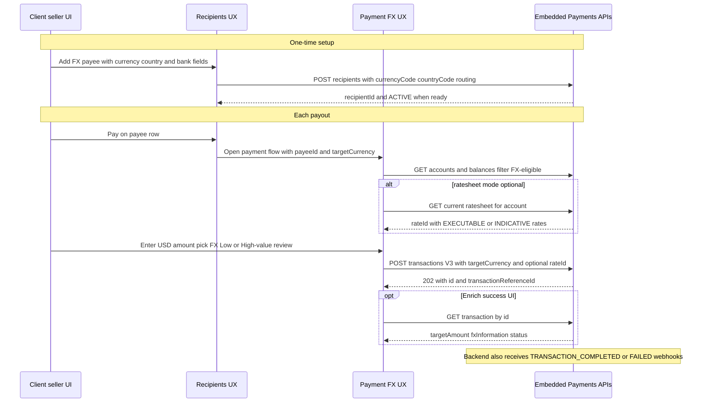

> ⚠️ **DRAFT / WIP — NOT PRODUCT DOCUMENTATION**
>
> This document is an **internal engineering draft**. It is incomplete, may be inaccurate, and is **not** an official J.P. Morgan Payments Developer Portal (PDP) guide.
>
> - **Status:** Work in progress (client UX / component wiring recipe)
> - **Audience:** Platform engineers embedding Recipients + PaymentFlowFX (or equivalent custom UI)
> - **Complements (does not replace):** [Make a cross-border FX payout](https://developer.payments.jpmorgan.com/docs/embedded-finance-solutions/embedded-payments/capabilities/transactions/payouts/how-to/cross-border-fx-payout)
> - **Do not** treat field matrices, rail labels, or settlement copy as contractual product specs until confirmed with your relationship manager / official PDP + onboarding materials.

# Cross-border FX payout — Client UX / UI wiring recipe (DRAFT)

## What this recipe is (and is not)

|                 | Official PDP how-to                                                     | This draft recipe                                                                   |
| --------------- | ----------------------------------------------------------------------- | ----------------------------------------------------------------------------------- |
| Focus           | API steps: create payee → rates → `POST /transactions` → webhooks / GET | How a **client-facing UI** can be wired to those APIs across currencies             |
| Audience        | Integrators calling Embedded Payments APIs                              | Hosts building React (or similar) payout experiences                                |
| Source of truth | PDP + OpenAPI                                                           | Lessons from `RecipientsWidget` + `PaymentFlowFX` in this repo — **as-built, beta** |
| Completeness    | Product documentation                                                   | **WIP** — gaps called out explicitly below                                          |

**Use the PDP for:** eligibility tables, rail availability by market, account types, webhook event contracts, and sample API payloads.

**Use this recipe for:** UX sequencing, which UI surface owns which API call, the **per-currency form/view ↔ Recipients API matrix** (DRAFT), rate-preview patterns, and pitfalls we hit while implementing components.

---

## Terminology

| Term                                               | Meaning                                                                                                                        |
| -------------------------------------------------- | ------------------------------------------------------------------------------------------------------------------------------ |
| **Partner platform / host**                        | You — the marketplace / SaaS embedding Embedded Payments                                                                       |
| **Client**                                         | Your customer (e.g. seller) who funds the payout from an EP account                                                            |
| **Payee / recipient**                              | External beneficiary paid in a **target (credit) currency**                                                                    |
| **Debit currency**                                 | Always **USD** for FX payouts from the NY branch (product constraint)                                                          |
| **FX Low-value / High-value**                      | Product rail tiers. In API/`type` they often appear as `ACH` / `WIRE` — **not** US domestic network semantics for cross-border |
| **`PaymentFlowFX`**                                | Beta UI component in this library for USD → USD and USD → non-USD payouts via Transactions **V3**                              |
| **`RecipientsWidget` (`paymentFlowVariant="fx"`)** | Payee list + create/edit; Pay opens `PaymentFlowFX`                                                                            |

---

## End-to-end client journey (UX map to API)



**WIP note:** Full webhook-driven client toast / activity feed patterns belong in [`WEBHOOK_INTEGRATION_RECIPE.md`](./WEBHOOK_INTEGRATION_RECIPE.md); this recipe only points at the FX-specific payload fields (`targetAmount`, `targetCurrency`, `fxInformation`).

---

## Recommended UI surfaces (two-component split)

Hosts should keep **payee lifecycle** and **payment execution** as separate concerns — the same split we used in the library:

| Surface                 | Owns                                                         | Primary APIs                                                 | Library mapping (as-built)                                                                               |
| ----------------------- | ------------------------------------------------------------ | ------------------------------------------------------------ | -------------------------------------------------------------------------------------------------------- |
| **Recipients / payees** | Create/edit FX payees; show currency; gate Pay until ready   | `POST/GET/PATCH /recipients`                                 | `RecipientsWidget` with `paymentFlowVariant="fx"` (currency column/badges on by default for FX)          |
| **Make payment (FX)**   | Account → payee → method → amount → quote → submit → success | Accounts, Rate Sheet (optional), `POST/GET /transactions` V3 | `PaymentFlowFX` / `PaymentFlowFXInline` + `fxConfig`                                                     |
| **Activity / history**  | Show From/To, USD debit, target credit, status               | `GET /transactions`, webhooks                                | `TransactionsDisplay` (host-wired); display names should use **seller org** for From on outbound payouts |

### Host wiring pattern (showcase lesson)

```tsx
// When the scenario / product capability is FX-enabled:
<RecipientsWidget
  paymentFlowVariant="fx"
  fxConfig={{ mode: 'ratesheet' }} // or 'realtime' | 'provider'
  // showRecipientCurrency defaults to true when paymentFlowVariant === 'fx'
/>
```

Domestic-only hosts keep the default `paymentFlowVariant="domestic"` (opens classic `PaymentFlow`, no currency column) — **non-breaking**.

**Status:** Implemented in library (beta). Showcase scenario “Seller with FX Payments” exercises this path.

---

## Step-by-step: UX aligned to the PDP “How it works”

The numbered steps below mirror the PDP how-to. Each step adds **client UX guidance** and **implementation notes** from our build.

### 1. Create payee (LIMITED_DDA_PAYMENTS) — Recipients UX

**PDP:** `POST /recipients` with `account.currencyCode`, `account.countryCode`, routing, and party address country. Payee currency drives FX conversion target.

**Client UX (recommended):**

1. Separate **domestic USD** vs **international** payee creation (or a currency-first step).
2. Once currency (+ country) is chosen, **reshape the bank fields** (IBAN vs local account + routing label).
3. Show a clear currency badge on the payee list (flag + ISO code) so Pay destination is scannable.
4. Only enable **Pay** when the payee is in a payable status and FX-capable fields are present.

**Lessons learnt:**

| Topic                        | Lesson                                                                                                                                                                            | Status                                            |
| ---------------------------- | --------------------------------------------------------------------------------------------------------------------------------------------------------------------------------- | ------------------------------------------------- |
| Currency drives everything   | `targetCurrency` at pay time should come from the **saved payee’s** `account.currencyCode`, not a free-typed field at submit                                                      | As-built                                          |
| Per-currency field matrix    | PDP publishes **rails by market**, not a full beneficiary-field matrix. We encoded a **best-effort** matrix in `fxRecipientRequirements.ts` (IBAN/CLABE/BSB/IFSC/sort code, etc.) | **WIP / best-effort** — confirm before production |
| Routing code types           | Persist the correct `routingCodeType` (e.g. `AUBSB`, `INFSC`, `BIC`) — do not default international payees to `USABA`                                                             | As-built intent in FX recipient form              |
| One-time cross-border payees | Out of scope for `PaymentFlowFX` v1 (domestic one-time preserved only)                                                                                                            | Product decision (spec D4)                        |
| Extra KYC for FX             | PDP: collect additional KYC for cross-border — **UI for that is not covered here**                                                                                                | **Gap / WIP**                                     |

### 2. Subscribe to webhooks — platform backend (not the React dialog)

**PDP:** `TRANSACTION_COMPLETED` / `TRANSACTION_FAILED` with FX fields in the resource.

**Client UX:**

- Treat dialog success as **accepted for processing** (202), not final settlement.
- Use webhooks (or your BFF) to update activity feeds, email, and “Recipient receives X EUR” once `targetAmount` / rate are final.
- See [`WEBHOOK_INTEGRATION_RECIPE.md`](./WEBHOOK_INTEGRATION_RECIPE.md).

**Status:** Pattern recommended; showcase MSW only simulates enrichment via `GET`, not full webhook fan-out.

### 3. Obtain rates — quote UX inside the payment flow

**PDP:** Real-time market rate (omit `rateId`) **or** Rate Sheet (`rateId` on the transaction).

**Client UX modes (as implemented in `fxConfig.mode`):**

| Mode                 | UX behaviour                                                                                                   | Submit                                    |
| -------------------- | -------------------------------------------------------------------------------------------------------------- | ----------------------------------------- |
| `realtime` (default) | Show “rate determined at processing” / optional indicative helper                                              | No `fxInformation.rateId`                 |
| `ratesheet`          | Fetch sheet for selected debtor account; lock **EXECUTABLE** rates with countdown; **INDICATIVE** display-only | Send `rateId` only when locked executable |
| `provider`           | Host supplies `getRate`                                                                                        | Send provider `rateId` when present       |

**Lessons learnt:**

- Enter amount on the **USD debit** side only (`targetAmount` is not on the V3 **request** schema).
- Rate failures should be **non-blocking**: fall back to market-rate messaging and still allow submit without `rateId` (unless your risk policy requires a lock).
- Review panel should keep a live **expiry countdown** for locked quotes; on expiry, force re-quote before submit.
- Whole-number credit currencies (e.g. KRW, JPY, VND per PDP): round/display carefully on the **estimate** line — **WIP** to harden UX per currency in all locales.

### 4. Initiate FX transaction — payment flow submit

**PDP sample (conceptual):** USD `amount` + `targetCurrency` + payee + debtor account + optional `fxInformation.rateId`.

**V3 shape used by `PaymentFlowFX` (verified against local OAS — prefer this over older V2 flat fields):**

```jsonc
{
  "transactionReferenceId": "PHUI_…",
  "type": "ACH", // or "WIRE" — maps to FX Low-value / High-value in UI copy
  "amount": "1250.00", // string — do not parseFloat before send
  "currency": "USD",
  "targetCurrency": "EUR", // omit for domestic USD→USD
  "memo": "Invoice 42",
  "fxInformation": { "rateId": "R1…" }, // only when locked
  "debtor": {
    "account": {
      "type": "REGISTERED_ACCOUNT",
      "registeredAccount": { "id": "<accountId>" },
    },
  },
  "creditor": { "id": "<recipientId>" },
}
```

**Lessons learnt:**

| Topic                      | Lesson                                                                                                                                                   | Status                                                         |
| -------------------------- | -------------------------------------------------------------------------------------------------------------------------------------------------------- | -------------------------------------------------------------- |
| API version                | FX path uses **Transactions V3** (counterparties + string amount + minimal **202**)                                                                      | As-built                                                       |
| Method labels              | For FX, show **FX Low-value** / **FX High-value** (settlement copy), not domestic ACH/Wire branding alone                                                | As-built                                                       |
| Method availability        | Restrict to ACH/WIRE; keep RTP visible but **disabled with reason**                                                                                      | As-built                                                       |
| Account eligibility        | Only FX-capable categories (e.g. `LIMITED_DDA_PAYMENTS`, `TRANSACTION_ACCOUNT`); disable others with reason                                              | As-built                                                       |
| Sync payee → currency      | Opening Pay with `initialPayeeId` must also set `targetCurrency` from the payee — otherwise method labels stay domestic                                  | Bug fixed in component                                         |
| Async 202                  | Success UI must not assume full FX details in the create response; optional single `GET` enrichment                                                      | As-built                                                       |
| Display names after create | Mock/demo backends that only read V2 flat fields can mis-label **From** (e.g. “Mock Customer”). Prefer seller **organization name** for outbound payouts | Showcase MSW fixed; hosts should map V3 → their ledger display |

### 5. Receive FX payment details — success + activity

**PDP:** `GET /transactions/{id}` (and webhooks) for `targetAmount`, `targetCurrency`, `fxInformation`.

**Client UX:**

1. Immediate success: “Payment submitted — converting to {CUR}…”
2. Enrich when GET returns amounts/rate; degrade silently if enrichment fails (payment already accepted).
3. Activity list: show debit USD, credit target, rate if available, and clear From (seller) / To (payee) names.

---

## Per-currency presentation matrix (DRAFT / WIP)

> ⚠️ **Best-effort draft.** The universal Recipients API is currency-agnostic
> (`account.number`, `account.routingInformation[]`, `account.currencyCode`, …).
> The **UI** must relabel and reshape fields per destination. Values below come from
> `src/core/PaymentFlowFX/fxRecipientRequirements.ts` (as-built starting point) plus the
> PDP Availability rails table. **Confirm with product / RM before treating as final.**

### Why a matrix is required

The Recipients API is **one schema for all markets**. Client UX is **not** one form:

| Layer                   | Responsibility                                                                                                       |
| ----------------------- | -------------------------------------------------------------------------------------------------------------------- |
| **Universal API**       | Persist ISO currency/country + account number + routing rows (`routingNumber`, `routingCodeType`, `transactionType`) |
| **Create / edit form**  | Show local labels (IBAN, CLABE, BSB, IFSC, sort code…); hide US checking/savings when N/A; restrict rails            |
| **List / details view** | Same labels on read-back — never show “Routing Number” / “ACH” / “Wire Transfer” for FX payees                       |
| **Pay flow**            | `targetCurrency` from payee; method copy = **FX Low-value** (`ACH`) / **FX High-value** (`WIRE`)                     |

### Universal Recipients API ↔ UI field map

Conceptual mapping used by the library (and recommended for custom hosts):

| UI concept (form & details)                  | Recipients API field                           | Notes                                                          |
| -------------------------------------------- | ---------------------------------------------- | -------------------------------------------------------------- |
| Destination currency                         | `account.currencyCode`                         | Drives FX conversion target and all labels below               |
| Account country                              | `account.countryCode`                          | Alpha-2; also `partyDetails.address.countryCode`               |
| Account number / IBAN / CLABE                | `account.number`                               | Label changes; value still lands in `number`                   |
| Checking / Savings                           | `account.type`                                 | **Omit / hide** when market does not use US account types      |
| Bank identifier (BSB, IFSC, BIC, sort code…) | `account.routingInformation[].routingNumber`   | Label from matrix; **do not** hard-code “Routing Number”       |
| Identifier kind                              | `account.routingInformation[].routingCodeType` | e.g. `AUBSB`, `INFSC`, `BIC`, `CACPA` — **not** `USABA` for FX |
| Enabled rail(s)                              | `account.routingInformation[].transactionType` | API: `ACH` \| `WIRE` (…); UI: FX Low-value / High-value        |
| Party name / address                         | `partyDetails.*`                               | Address country required for FX create                         |

**Rail copy rule (view + pay):**

| API `transactionType` | Domestic USD UI | FX credit-currency UI         |
| --------------------- | --------------- | ----------------------------- |
| `ACH`                 | ACH             | **FX Low-value**              |
| `WIRE`                | Wire Transfer   | **FX High-value**             |
| `RTP`                 | RTP             | Disabled / unavailable for FX |

### Form vs details presentation rules

| Rule                  | Create / edit form                                                 | Details / list view                                          |
| --------------------- | ------------------------------------------------------------------ | ------------------------------------------------------------ |
| Currency first        | Select currency (+ country) before bank fields                     | Badge: flag + ISO code (+ full label in details)             |
| Account number label  | Use matrix `accountNumberLabel` (IBAN / CLABE / Account number)    | Same label on read-back                                      |
| Bank identifier label | Use matrix `routingCode.label` (or hide if none, e.g. MXN CLABE)   | Same label next to the value — **not** “Routing Number”      |
| Account type          | Show only if `requiresAccountType`                                 | Hide when false                                              |
| Bank name             | Collect when `requiresBankName` (**partial in shared form today**) | Show if present                                              |
| Methods               | Only rails allowed for that currency + funding account type        | Show FX Low/High-value for each configured `transactionType` |
| Validation            | Relax US 9-digit ABA rules; use local formats                      | N/A                                                          |

Living source of truth in code: `FX_CURRENCY_REQUIREMENTS` in
[`fxRecipientRequirements.ts`](../src/core/PaymentFlowFX/fxRecipientRequirements.ts).

### Currency matrix — UI labels + API mapping

**Legend**

- **Rails (L)** = from `LIMITED_DDA_PAYMENTS` · **Rails (T)** = from `TRANSACTION_ACCOUNT` (PDP Availability; API still `ACH`/`WIRE`)
- **Acct # label** = form & details label for `account.number`
- **Bank ID label** = form & details label for `routingInformation[].routingNumber` (`—` = no separate routing field)
- **`routingCodeType`** = value to persist (WIP / best-effort)

| CCY | Country   | Acct # format | Acct # label (UI) | Bank ID label (UI)           | `routingCodeType` | Acct type? | Bank name? | Rails (L)  | Rails (T)  |
| --- | --------- | ------------- | ----------------- | ---------------------------- | ----------------- | ---------- | ---------- | ---------- | ---------- |
| CAD | CA        | LOCAL         | Account number    | Transit & institution number | `CACPA`           | Yes        | No         | —          | Low-value  |
| AUD | AU        | LOCAL         | Account number    | BSB code                     | `AUBSB`           | No         | No         | High + Low | High + Low |
| HKD | HK        | LOCAL         | Account number    | Bank & branch code           | `HKNCC`           | No         | Yes        | High + Low | High + Low |
| INR | IN        | LOCAL         | Account number    | IFSC code                    | `INFSC`           | No         | No         | High + Low | High + Low |
| PHP | PH        | LOCAL         | Account number    | SWIFT / BIC code             | `BIC`             | No         | Yes        | High + Low | High + Low |
| KRW | KR        | LOCAL         | Account number    | Bank code                    | `BIC`             | No         | Yes        | High-value | High-value |
| SGD | SG        | LOCAL         | Account number    | Bank & branch code           | `SGIBG`           | No         | Yes        | Low-value  | Low-value  |
| VND | VN        | LOCAL         | Account number    | SWIFT / BIC code             | `BIC`             | No         | Yes        | High-value | High-value |
| EUR | EU (SEPA) | IBAN          | IBAN              | BIC / SWIFT                  | `BIC`             | No         | No         | High-value | High-value |
| PLN | PL        | IBAN          | IBAN              | BIC / SWIFT                  | `BIC`             | No         | No         | Low-value  | Low-value  |
| RON | RO        | IBAN          | IBAN              | BIC / SWIFT                  | `BIC`             | No         | No         | Low-value  | Low-value  |
| SEK | SE        | IBAN          | IBAN              | BIC / SWIFT                  | `BIC`             | No         | No         | —          | Low-value  |
| AED | AE        | IBAN          | IBAN              | BIC / SWIFT                  | `BIC`             | No         | No         | Low-value  | Low-value  |
| GBP | GB        | IBAN          | IBAN              | Sort code (or BIC)           | `BIC`             | No         | No         | High-value | Low-value  |
| BRL | BR        | LOCAL         | Account number    | Bank & branch (agência) code | `BRSTN`           | No         | Yes        | High-value | High-value |
| MXN | MX        | CLABE         | CLABE             | — (embedded in CLABE)        | —                 | No         | No         | High-value | High-value |

**Low-value** = API `ACH` · **High-value** = API `WIRE`.

**Also confirm (not fully encoded in the UI matrix yet):**

| Topic                       | PDP / product note                                                          | UI status |
| --------------------------- | --------------------------------------------------------------------------- | --------- |
| Whole-number credit amounts | KRW, JPY, VND, CLP, PYG (no decimals)                                       | **WIP**   |
| Min thresholds              | e.g. PHP Wire USD 1,000 / ACH USD 75; JPY USD 3,000; AUD USD 6; HKD USD 100 | **WIP**   |
| Extra FX KYC                | Required for cross-border clients                                           | **Gap**   |

### Review checklist (when adding a currency)

| Checkpoint                      | Form        | Details view                      | API                                                              |
| ------------------------------- | ----------- | --------------------------------- | ---------------------------------------------------------------- |
| Currency + country collected    | ✓           | Badge shown                       | `currencyCode` / `countryCode`                                   |
| Local account number label      | ✓           | ✓                                 | `account.number`                                                 |
| Local bank-ID label (or hidden) | ✓           | ✓ — never “Routing Number” for FX | `routingInformation[].routingNumber` + correct `routingCodeType` |
| Rails limited to matrix         | ✓           | FX Low/High-value labels          | `transactionType` ACH/WIRE only                                  |
| US account type hidden when N/A | ✓           | ✓                                 | Omit or ignore `account.type`                                    |
| Min amount / decimals           | ✓ (desired) | N/A                               | Amount rules on payout                                           |

Supported credit currencies in the library: AED, AUD, BRL, CAD, EUR, GBP, HKD, INR, KRW, MXN, PHP, PLN, RON, SEK, SGD, VND.  
**Note:** PDP table typo “VDN” → ISO **VND**.

---

## Account & product eligibility (UX gating)

From PDP + as-built filters:

| Account type                        | FX payout | Beneficiary model                              | UI implication                                                                                       |
| ----------------------------------- | --------- | ---------------------------------------------- | ---------------------------------------------------------------------------------------------------- |
| `LIMITED_DDA_PAYMENTS` (FX enabled) | Yes       | Registered recipient                           | Primary SellSense / marketplace path                                                                 |
| `TRANSACTION_ACCOUNT`               | Yes       | Inline / unregistered payee allowed by product | Host may need different create-payee UX — **partially out of scope for current Recipients+Pay path** |
| `LIMITED_DDA`                       | No        | —                                              | Show disabled + reason if listed                                                                     |
| Other categories                    | No        | —                                              | Hide or disable                                                                                      |

**WIP:** Capability flags (“FX enabled on this client”) are environment-specific — hosts should gate the FX Recipients variant from their own product config, not only from account category.

---

## Domestic vs FX in one product

| Concern         | Domestic USD                                 | Cross-border FX                              |
| --------------- | -------------------------------------------- | -------------------------------------------- |
| Component       | `PaymentFlow` or `PaymentFlowFX` in USD mode | `PaymentFlowFX` with non-USD payee           |
| Recipients prop | `paymentFlowVariant="domestic"`              | `paymentFlowVariant="fx"`                    |
| Currency column | Off by default                               | On by default for FX variant                 |
| Submit API      | V2 (`PaymentFlow`) or V3 (`PaymentFlowFX`)   | V3 only in `PaymentFlowFX`                   |
| Method copy     | ACH / Wire / RTP as domestic                 | FX Low-value / High-value (+ settlement ETA) |

**Recommendation:** Prefer one FX-capable payment surface (`PaymentFlowFX`) when the host must support both domestic and cross-border for the same client, so method/account eligibility stays consistent.

---

## Open questions & WIP backlog

Explicitly unfinished — do not ship assumptions without confirmation:

1. **Official sign-off on the per-currency matrix** in this doc (replace best-effort `fxRecipientRequirements` / promote DRAFT → Stable).
2. **Min-amount / whole-number validation** fully productized in UI for every market.
3. **Inline unregistered FX payees** for transaction-account model (spec non-goal for v1).
4. **Additional FX KYC collection** UX tied to onboarding / disclosures.
5. **Non-USD debit** (not supported by current product docs — NY / USD).
6. **Webhook → client real-time UX** for FX enrichment (beyond single GET on success).
7. **Fee / spread disclosure** copy (`clientSpread` is platform-side; UI copy TBD).
8. **GA readiness** of `PaymentFlowFX` (still **Beta** — API/behaviour may change).

---

## Reference implementation map (this repo)

| Concern                        | Location                                                                                                                                                                            |
| ------------------------------ | ----------------------------------------------------------------------------------------------------------------------------------------------------------------------------------- |
| Component README               | `src/core/PaymentFlowFX/README.md`                                                                                                                                                  |
| As-built specification         | `src/core/PaymentFlowFX/SPECIFICATION.md`                                                                                                                                           |
| Per-currency form requirements | `src/core/PaymentFlowFX/fxRecipientRequirements.ts`                                                                                                                                 |
| Recipients FX variant          | `src/core/RecipientWidgets/` + `docs/component-implementation.md` (RecipientsWidget: FX payment variant)                                                                            |
| Showcase wiring                | `app/client-next-ts` scenario **Seller with FX Payments** (`paymentFlowVariant: 'fx'`, `fxConfig: { mode: 'ratesheet' }`)                                                           |
| Official API how-to            | [Cross-border FX payout](https://developer.payments.jpmorgan.com/docs/embedded-finance-solutions/embedded-payments/capabilities/transactions/payouts/how-to/cross-border-fx-payout) |
| FX Rate Sheet                  | [FX Rate Sheet docs](https://developer.payments.jpmorgan.com/docs/treasury/fx-rate-sheet/doc)                                                                                       |
| Webhook UX companion           | [`WEBHOOK_INTEGRATION_RECIPE.md`](./WEBHOOK_INTEGRATION_RECIPE.md)                                                                                                                  |

---

## Document control

| Field          | Value                                                                                    |
| -------------- | ---------------------------------------------------------------------------------------- |
| Title          | Cross-border FX payout — Client UX / UI wiring recipe                                    |
| Classification | **DRAFT / WIP**                                                                          |
| Created        | 2026-07-20                                                                               |
| Based on       | PaymentFlowFX + Recipients FX implementation lessons; PDP cross-border FX payout how-to  |
| Next review    | Confirm field matrix + min amounts with product / RM; promote sections from WIP → Stable |

When promoting out of draft: remove the top banner only after product review, and re-link any statements that still say “best-effort”.
