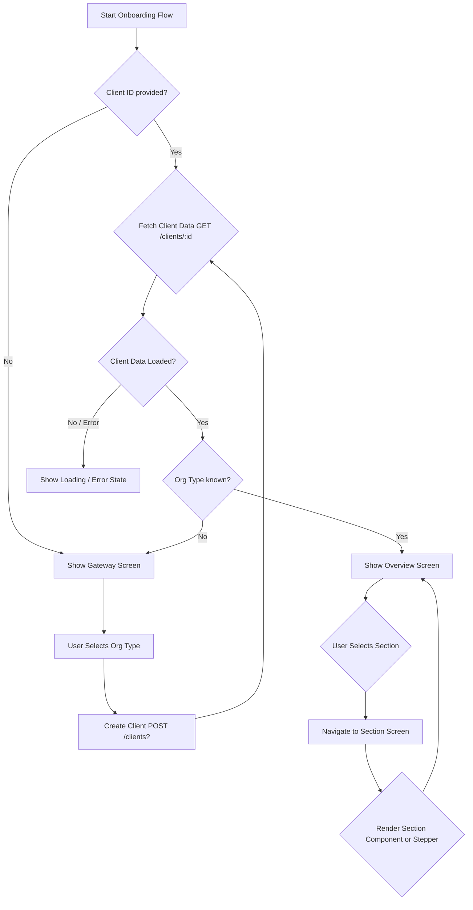

# Digital Onboarding Flow UI/UX Recipe (`OnboardingFlow.tsx`)

⚠️ DRAFT - BASED ON CODE ANALYSIS ⚠️

This document describes the implementation and design decisions behind the `OnboardingFlow.tsx` component, which provides a flexible, section-based approach to digital onboarding, distinct from the linear stepper of `OnboardingWizardBasic.tsx`.

<!-- toc -->

- [Digital Onboarding Flow UI/UX Recipe (`OnboardingFlow.tsx`)](#digital-onboarding-flow-uiux-recipe-onboardingflowtsx)
  - [Introduction](#introduction)
  - [High-Level Flow](#high-level-flow)
  - [Key Components and Concepts](#key-components-and-concepts)
    - [`OnboardingFlow.tsx`](#onboardingflowtsx)
    - [`FlowProvider` & `useFlowContext`](#flowprovider--useflowcontext)
    - [`OnboardingOverviewContext.Provider` & `useOnboardingOverviewContext`](#onboardingoverviewcontextprovider--useonboardingoverviewcontext)
    - [`flowConfig.ts`](#flowconfigts)
    - [Screen Types (`component` vs `stepper`)](#screen-types-component-vs-stepper)
    - [Section Configuration (`sectionConfig`)](#section-configuration-sectionconfig)
    - [Stepper Configuration (`stepperConfig`)](#stepper-configuration-stepperconfig)
  - [Screen Definitions and Rationale](#screen-definitions-and-rationale)
    - [Static Screens](#static-screens)
      - [`gateway`](#gateway)
      - [`checklist`](#checklist)
      - [`overview`](#overview)
      - [`owner-stepper`](#owner-stepper)
    - [Section Screens](#section-screens)
      - [`personal-section`](#personal-section)
      - [`business-section`](#business-section)
      - [`owners-section`](#owners-section)
      - [`additional-questions-section`](#additional-questions-section)
      - [`review-attest-section`](#review-attest-section)
      - [`upload-documents-section`](#upload-documents-section)
  - [Data Flow and State Management](#data-flow-and-state-management)
    - [Client Data Fetching](#client-data-fetching)
    - [Navigation State](#navigation-state)
    - [Session Data](#session-data)
    - [Context Propagation](#context-propagation)
  - [UX Best Practices Implemented](#ux-best-practices-implemented)
  - [Error Handling](#error-handling)
  - [Configuration and Customization](#configuration-and-customization)

<!-- tocstop -->

## Introduction

The `OnboardingFlow.tsx` component offers an alternative user experience for digital onboarding compared to the step-by-step `OnboardingWizardBasic.tsx`. Instead of a purely linear progression, it presents onboarding as a series of distinct sections or tasks, often displayed on an overview or checklist screen. This allows users more flexibility in navigating and completing sections, potentially out of order, although dependencies might exist.

This approach uses a configuration-driven system (`flowConfig.ts`) to define the available screens and sections, their content (React components or nested steppers), and associated logic (like status resolution).

## High-Level Flow

**Explanation:**

1.  The flow initializes, potentially with an `initialClientId`.
2.  If a `clientId` exists, it fetches client data using `useSmbdoGetClient`.
3.  If no `clientId` or `organizationType` is available from the fetched data, the `GatewayScreen` is shown (presumably to select the organization type and potentially create the client).
4.  Once `clientId` and `organizationType` are known, the `OverviewScreen` (or potentially a `ChecklistScreen`, depending on initial configuration) is displayed.
5.  The `OverviewScreen` likely lists the different onboarding sections defined in `flowConfig.ts`.
6.  Users navigate to individual sections.
7.  Sections can be either standalone components (`type: 'component'`) or multi-step forms rendered using `StepperRenderer` (`type: 'stepper'`).
8.  Completion status for sections can be dynamically determined using `statusResolver` functions defined in the configuration.

## Key Components and Concepts

### `OnboardingFlow.tsx`

- **Purpose**: The main entry point and orchestrator for this onboarding experience.
- **Responsibilities**:
  - Manages the top-level `clientId` state.
  - Fetches client data (`useSmbdoGetClient`) based on `clientId`.
  - Sets up context providers (`OnboardingOverviewContext.Provider`, `FlowProvider`).
  - Handles initial screen logic (Gateway vs. Overview based on client data).
  - Manages configuration props (content tokens, alertOnExit, event tracking).
  - Renders the `FlowRenderer` which handles the actual screen display based on context.

### `FlowProvider` & `useFlowContext`

- **Purpose**: Manages the navigation state within the flow.
- **Context Value**: Likely includes `currentScreenId`, `sessionData` (for temporary state between screens or flow-specific flags), navigation functions (`goTo`, `goBack`), and potentially history.
- **Usage**: Used by `FlowRenderer` to determine which screen to render and by individual screens/components to navigate between steps or sections.

### `OnboardingOverviewContext.Provider` & `useOnboardingOverviewContext`

- **Purpose**: Provides core onboarding data needed across different screens and sections.
- **Context Value**: Includes `clientData` (fetched API response), `setClientId` (to update the client ID, e.g., after creation in the Gateway), `organizationType`, and potentially other shared props/configs.
- **Usage**: Consumed by various screens and components within the flow to access client details and configuration.

### `flowConfig.ts`

- **Purpose**: Central configuration file defining the structure and behavior of the onboarding flow.
- **Structure**: Exports a `flowConfig` object containing an array of `screens`. Screens are further categorized into `staticScreens` (standalone pages like Gateway, Overview) and `sectionScreens` (representing major onboarding tasks displayed on the Overview).
- **Key Properties**:
  - `id`: Unique identifier for the screen/section.
  - `type`: `'component'` or `'stepper'`.
  - `Component`: The React component to render for `type: 'component'`.
  - `stepperConfig`: Configuration for `type: 'stepper'`, including steps, associated party details, etc.
  - `sectionConfig`: Metadata for sections displayed on the overview (label, icon, statusResolver).
  - `isSection`: Boolean flag indicating if it's a main section shown on the overview.

### Screen Types (`component` vs `stepper`)

- **`component`**: Renders a single, specified React component (`Component`). Used for standalone screens (Gateway, Overview) or sections with custom UI logic (Owners Section, Document Upload).
- **`stepper`**: Renders a multi-step form experience using the `StepperRenderer` component. Configuration is provided via `stepperConfig`. Used for sections involving multiple related forms (Personal Details, Business Details).

### Section Configuration (`sectionConfig`)

- **Applies to**: Screens marked with `isSection: true`.
- **Purpose**: Defines how a section appears on the `OverviewScreen`.
- **Properties**:
  - `label`: Display name of the section.
  - `icon`: Icon associated with the section.
  - `statusResolver`: (Optional) A function `(sessionData, clientData) => status` that dynamically calculates the completion status ('not_started', 'completed', 'on_hold', etc.) of the section based on current `sessionData` and fetched `clientData`. This allows the Overview screen to reflect real-time progress.
  - `helpText`: Optional additional descriptive text.

### Stepper Configuration (`stepperConfig`)

- **Applies to**: Screens with `type: 'stepper'`.
- **Purpose**: Defines the behavior and content of the `StepperRenderer`.
- **Properties**:
  - `steps`: An array defining each step within the stepper (id, title, description, Component for `stepType: 'form'`, etc.). Includes special step types like `'check-answers'`.
  - `associatedPartyFilters`: Defines criteria (e.g., `partyType`, `roles`) to find the relevant party in the `clientData` to associate with this stepper instance (e.g., find the 'CONTROLLER' party for the personal details stepper).
  - `defaultPartyRequestBody`: Provides default data when needing to create a new party associated with this stepper.

## Screen Definitions and Rationale

The `flowConfig.ts` defines the following screens, grouped by static/section:

### Static Screens

These are typically single-purpose screens used for navigation or specific tasks outside the main section flow.

- **`gateway` (`GatewayScreen`)**:
  - **Purpose**: Initial entry point when `organizationType` is unknown. Likely allows the user to select their business type, potentially triggering client creation.
  - **Rationale**: Handles the scenario where the onboarding context (specifically business type) isn't yet established.
- **`checklist` (`ChecklistScreen`)**:
  - **Purpose**: Potentially an alternative overview screen, possibly showing a simpler task list format. (Its exact usage depends on how it's navigated to).
  - **Rationale**: Offers a different presentation style for the onboarding tasks.
- **`overview` (`OverviewScreen`)**:
  - **Purpose**: The main hub displaying the different onboarding sections (`sectionScreens`) with their current statuses. Allows users to navigate into each section.
  - **Rationale**: Provides a central dashboard for the user to track progress and choose which part of the application to work on next.
- **`owner-stepper` (`StepperRenderer` with `ownerSteps`)**:
  - **Purpose**: A dedicated multi-step form (using `StepperRenderer`) specifically for adding/editing Beneficial Owner details. This is likely navigated to from the `owners-section`.
  - **Rationale**: Encapsulates the owner data collection into a reusable stepper, separate from the main overview structure.

### Section Screens

These represent the core data collection areas, displayed on the `OverviewScreen`.

- **`personal-section` (`StepperRenderer`)**:
  - **Purpose**: Collects personal details, identity documents, and contact info for the individual identified as the 'CONTROLLER'. Uses a stepper for guided input.
  - **Rationale**: Groups related personal information forms into a single, manageable section using a standard stepper UI. Uses `associatedPartyFilters` to target the 'CONTROLLER'.
- **`business-section` (`StepperRenderer`)**:
  - **Purpose**: Collects business classification, identification, customer-facing details, and contact info for the 'CLIENT' organization. Uses a stepper.
  - **Rationale**: Groups core business information forms. Uses `associatedPartyFilters` to target the 'CLIENT' party.
- **`owners-section` (`OwnersSectionScreen`)**:
  - **Purpose**: Manages the collection of information for Beneficial Owners. It renders a custom component (`OwnersSectionScreen`) which likely lists owners and provides actions to add/edit (navigating to `owner-stepper`).
  - **Rationale**: Handles the complexity of potentially multiple owners, requiring a custom UI (`type: 'component'`) rather than a single linear stepper. The `statusResolver` checks if all added owners have valid data according to `ownerSteps`.
- **`additional-questions-section` (`OperationalDetailsForm`)**:
  - **Purpose**: Displays and collects answers for dynamic, additional due diligence questions fetched from the API (`clientData.outstanding.questionIds`). Uses a custom component (`OperationalDetailsForm`).
  - **Rationale**: Handles dynamic questions which aren't known upfront, requiring a dedicated component. The `statusResolver` checks if `outstanding.questionIds` is empty.
- **`review-attest-section` (`StepperRenderer`)**:
  - **Purpose**: Allows the user to review all collected information and attest to required documents (Terms & Conditions, etc.). Uses a stepper containing static review (`ReviewForm`) and document (`TermsAndConditionsForm`) components.
  - **Rationale**: Consolidates the final review and legal agreement steps. The `statusResolver` checks the overall `clientData.status`.
- **`upload-documents-section` (`DocumentUploadScreen`)**:
  - **Purpose**: Provides an interface for uploading any required supporting documents (`clientData.outstanding.documentRequestIds`). Uses a custom component.
  - **Rationale**: Handles conditional document upload requirements. The `statusResolver` makes this section available based on `clientData.status` or specific session flags.

## Data Flow and State Management

### Client Data Fetching

- `useSmbdoGetClient` hook in `OnboardingFlow.tsx` fetches the core `clientData` based on the current `clientId`.
- Fetched `clientData` is passed down via `OnboardingOverviewContext`.
- Individual screens/components consume `clientData` from the context to display information and determine status/visibility.

### Navigation State

- Managed by `FlowProvider` and `useFlowContext`.
- `currentScreenId` dictates which screen component/stepper is rendered by `FlowRenderer`.
- Navigation functions (`goTo`, `goBack`) modify `currentScreenId`.

### Session Data

- Managed by `FlowProvider` (`sessionData`, `updateSessionData`).
- Used for temporary state or flags specific to the current onboarding session that might not be directly part of the `clientData` API response (e.g., `isOwnersSectionDone`, `mockedVerifyingSectionId`, `mockedKycCompleted`).
- `statusResolver` functions can use `sessionData` alongside `clientData` to determine section status.

### Context Propagation

- `OnboardingOverviewContext`: Provides global onboarding state (`clientData`, `organizationType`, `setClientId`).
- `FlowContext`: Provides navigation state (`currentScreenId`, `goTo`, `sessionData`).

## UX Best Practices Implemented

- **Configuration Driven UI**: Allows easier modification and reordering of the flow.
- **Clear Sectioning**: Breaks down onboarding into manageable, themed sections.
- **Status Indication**: `statusResolver` provides visual feedback on section completion/status on the Overview screen.
- **Contextual Data**: Uses `associatedPartyFilters` to ensure steppers operate on the correct data entity (e.g., Controller vs. Business).
- **Loading/Error States**: Handles API fetch status (`pending`, `error`) gracefully.
- **Conditional Rendering**: Shows Gateway only when necessary; dynamically determines section statuses.
- **User Event Tracking**: Includes infrastructure for tracking user interactions (`userEventsHandler`, `useEnableDTRUMTracking`).
- **Exit Confirmation**: Optional `alertOnExit` prop prevents accidental data loss.
- **Scrolling**: Smooth scrolling to the top of the active section/step (`FlowRenderer`).

## Error Handling

- API errors during the initial `useSmbdoGetClient` fetch are caught and displayed using `ServerErrorAlert` in `OnboardingFlow.tsx`.
- Error handling within individual forms or steppers would be managed by those specific components (similar to the pattern described in `DIGITAL_ONBOARDING_RECIPE.md` for `OnboardingWizardBasic`).

## Configuration and Customization

- **Flow Structure**: Modify `flowConfig.ts` to add, remove, or reorder screens and sections.
- **Content**: Change components rendered for screens/steps, update labels, descriptions, icons.
- **Logic**: Modify `statusResolver` functions for custom section status logic. Update `associatedPartyFilters` or `defaultPartyRequestBody` for steppers.
- **Localization**: Leverages `react-i18next` and content tokens (`onboardingContentTokens`) for internationalization.
- **Styling**: Uses Tailwind CSS with `eb-` prefixes.
- **Behavior**: Controlled via props like `initialClientId`, `alertOnExit`, `userEventsHandler`.
