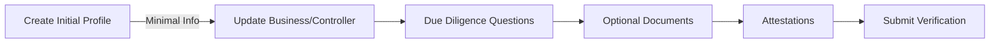

# SMBDO Onboarding Flow Variations

## Merchant Services - Canada

### Sole Proprietorship

**Key Characteristics:**
- Combined business/controller information collection
- Single party acts as both CLIENT and CONTROLLER
- Optional document requirements
- Single attestation
- Simplified verification process

### Limited Liability Company

```mermaid
graph LR
    A[Create Initial Profile] -->|Minimal Info| B[Update Business Details]
    B --> C[Update Controller Details]
    C --> D[Add Beneficial Owners]
    D --> E[Add Decision Makers]
    E --> F[Due Diligence Questions]
    F --> G[Required Documents]
    G --> H[Attestations]
    H --> I[Submit Verification]
```

**Key Characteristics:**
- Separate collection steps for:
  - Business details (CLIENT)
  - Controller information (CONTROLLER)
  - Beneficial owners >25% (BENEFICIAL_OWNER)
  - Decision makers (DECISION_MAKER)
- Required documentation:
  - Business registration
  - Ownership verification
  - Identity verification for all parties
- Multiple attestations may be required
- More complex verification process
