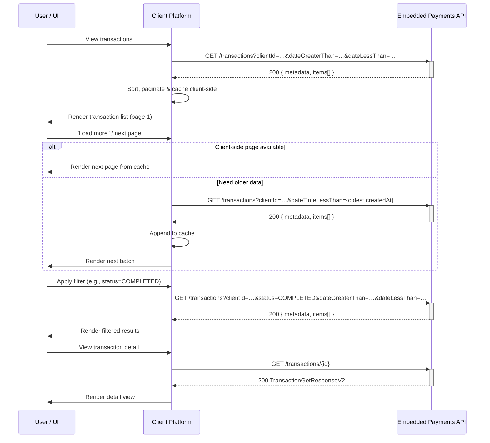
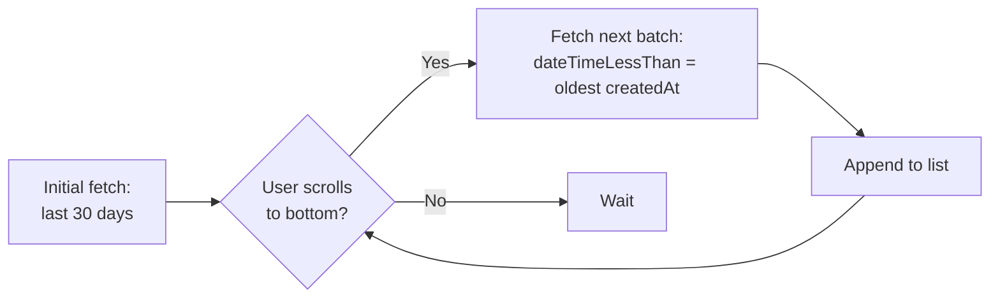
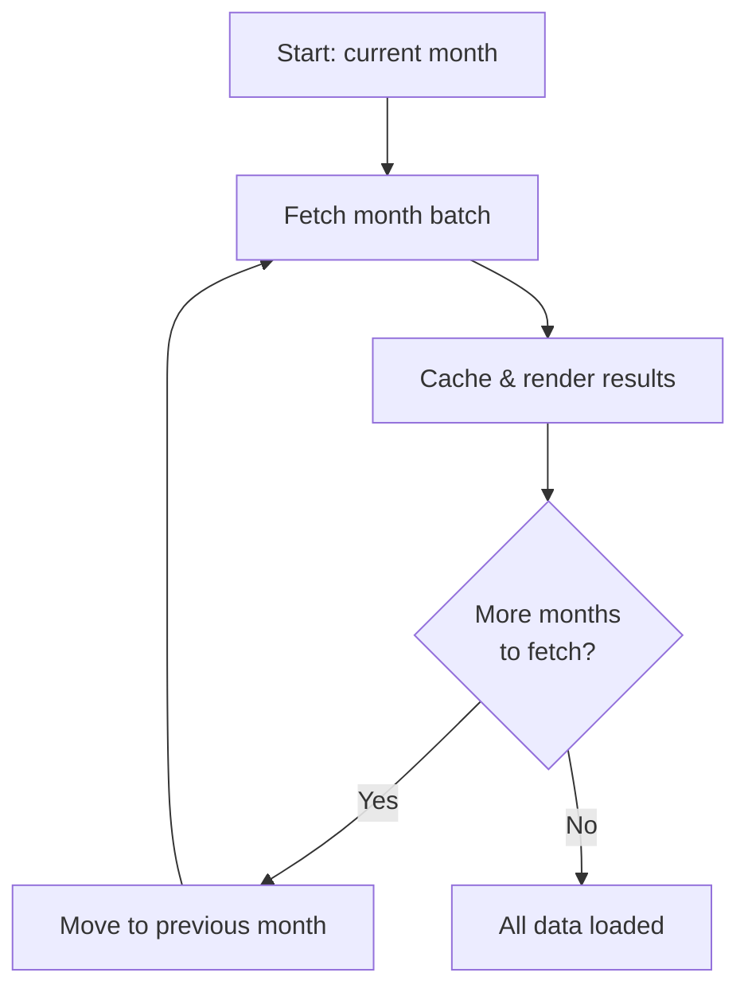
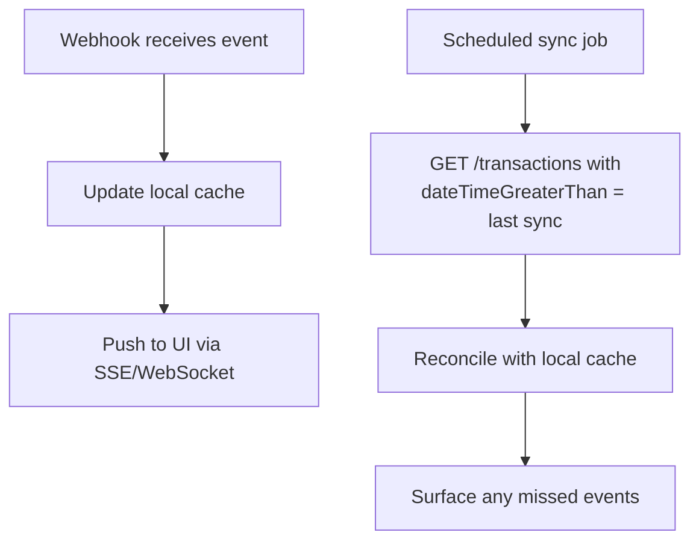

# List Transactions API Integration Recipe

## Introduction

This recipe provides guidelines for integrating with the **List Transactions API** (`GET /transactions`, `listTransactionsV2`, OAS v2.0.47) in a React-based web application using Embedded Payments. It covers the available filter parameters, client-side pagination strategies, and best practices for common use cases — from building a transaction history UI to running reconciliation jobs.

> **API References:**
>
> - [List Transactions API](https://developer.payments.jpmorgan.com/api/embedded-finance-solutions/embedded-payments/embedded-payments/transactions#/operations/getTransactions)
> - [Get Transaction Details API](https://developer.payments.jpmorgan.com/api/embedded-finance-solutions/embedded-payments/embedded-payments/transactions#/operations/getTransaction)
> - [Manage and Display Transactions (How-To)](https://developer.payments.jpmorgan.com/docs/embedded-finance-solutions/embedded-payments/capabilities/embedded-payments/how-to/manage-display-transactions-v2)
> - [Notification Subscriptions (How-To)](https://developer.payments.jpmorgan.com/docs/embedded-finance-solutions/embedded-payments/capabilities/notification-subscriptions/how-to/manage-notifications)

---

## Known Limitation: No Server-Side Pagination

The `GET /transactions` response includes a `metadata` object with `page`, `limit`, and `total_items` fields. However, **there are currently no corresponding request parameters** (`page`, `limit`, `offset`, or `cursor`) to control pagination. The API returns all matching transactions in a single response.

This means clients **must use the rich filter set** to keep result sets small and manageable, and implement client-side pagination as needed. The strategies in this recipe are designed around this constraint.

---

## Sequence Diagram



---

## Setup

1. Set up a React project (Vite, Next.js, or CRA).
2. Install dependencies: `@tanstack/react-query`, `axios` (or equivalent HTTP client).
3. Use [Orval](https://orval.dev/) to generate React Query hooks and TypeScript types from the OpenAPI specification (`embedded-finance-pub-ep-transactions-2.0.47.yaml`).

### Generated Hooks & Types

| Generated artifact | Description |
|---|---|
| `useListTransactionsV2` | React Query hook for `GET /transactions` |
| `useGetTransactionV2` | React Query hook for `GET /transactions/{id}` |
| `ListTransactionsV2Params` | Query parameter type |
| `ListTransactionsSearchResponseV2` | Response type (`{ metadata, items }`) |
| `TransactionsSearchResponseV2` | Individual transaction in the list |
| `TransactionGetResponseV2` | Detailed transaction response |
| `RequestTransactionTypeV2` | Enum: `ACH`, `WIRE`, `RTP`, `TRANSFER`, `REVERSAL`, `RETURN`, `OTHER`, `CARD`, `FEE` |
| `RequestTransactionStatus` | Enum: `PENDING`, `CANCELED`, `COMPLETED`, `COMPLETED_WITH_EXCEPTIONS`, `REJECTED`, `RETURNED`, `PARTIALLY_COMPLETED`, `UNDEFINED` |

---

## Available Filter Parameters

The API exposes a rich set of **query parameters** to narrow results. Always use filters — especially date-range — to keep response payloads manageable.

| Parameter | Type | Description | Example |
|---|---|---|---|
| `clientId` | `string` (10-digit) | **Required in practice.** Filters by client. | `0030000131` |
| `type` | `RequestTransactionTypeV2[]` | Filters by transaction type(s). Comma-separated. | `ACH,WIRE` |
| `status` | `RequestTransactionStatus[]` | Filters by status(es). Comma-separated. | `COMPLETED,PENDING` |
| `accountId` | `string` | Filters by the Embedded Finance account ID. | `ae86b765e147…` |
| `recipientId` | `string` | Filters by recipient. | `616d93a1-ce53…` |
| `transactionReferenceId` | `string` | Matches a specific client-provided reference ID. | `inv-pay-1234` |
| `amountEquals` | `string` | Exact amount match. | `100` |
| `amountGreaterThan` | `string` | Amounts greater than value. | `100` |
| `amountLessThan` | `string` | Amounts less than value. | `5000` |
| `dateEquals` | `string` (date) | Exact payment date match. | `2026-03-15` |
| `dateGreaterThan` | `string` (date) | Transactions after this payment date. | `2026-03-01` |
| `dateLessThan` | `string` (date) | Transactions before this payment date. | `2026-04-01` |
| `dateTimeGreaterThan` | `string` (date-time) | Transactions created after this timestamp. | `2026-03-01T00:00:00.000Z` |
| `dateTimeLessThan` | `string` (date-time) | Transactions created before this timestamp. | `2026-04-01T00:00:00.000Z` |

### Response Shape

```typescript
interface ListTransactionsSearchResponseV2 {
  metadata: {
    page?: number;       // Currently server-controlled (no request param)
    limit?: number;      // Currently mirrors total_items (no request param)
    total_items?: number; // Total transactions matching filters
  };
  items: TransactionsSearchResponseV2[];
}
```

> **Note:** `metadata.page` and `metadata.limit` are present in the response but cannot be controlled via request parameters. Use `metadata.total_items` to display result count information in the UI.

---

## Integration Strategies by Use Case

### Strategy 1: Transaction History UI (Primary)

**The most effective approach:** Always pass `dateGreaterThan` / `dateLessThan` to bound the query to a narrow time window (e.g., 7–30 days).

```
GET /transactions?clientId=0030000131&dateGreaterThan=2026-03-01&dateLessThan=2026-04-01
```

#### Implementation Example

```tsx
import { useListTransactionsV2 } from '@/api/generated/ep-transactions';
import type { ListTransactionsV2Params } from '@/api/generated/ep-transactions.schemas';

function TransactionHistory({ clientId }: { clientId: string }) {
  const [dateRange, setDateRange] = useState({
    from: startOfMonth(new Date()),
    to: endOfMonth(new Date()),
  });

  const params: ListTransactionsV2Params = {
    clientId,
    dateGreaterThan: format(dateRange.from, 'yyyy-MM-dd'),
    dateLessThan: format(dateRange.to, 'yyyy-MM-dd'),
  };

  const { data, isLoading, isError, error } = useListTransactionsV2(params);

  // Client-side pagination over the returned items
  const [page, setPage] = useState(0);
  const pageSize = 10;
  const transactions = data?.items ?? [];
  const totalPages = Math.ceil(transactions.length / pageSize);
  const pageItems = transactions.slice(page * pageSize, (page + 1) * pageSize);

  if (isLoading) return <TransactionsSkeleton />;
  if (isError) return <ErrorWithRetry error={error} />;

  return (
    <div>
      <DateRangePicker value={dateRange} onChange={setDateRange} />
      <TransactionTable items={pageItems} />
      <Pagination
        page={page}
        totalPages={totalPages}
        onPageChange={setPage}
      />
      <span>{data?.metadata?.total_items} transactions found</span>
    </div>
  );
}
```

### Strategy 2: "Load More" / Infinite Scroll

When the UI needs progressive loading, implement **client-managed cursor pagination** by shifting the date window using the `createdAt` timestamp of the last item returned.



#### Implementation Example

```tsx
function useInfiniteTransactions(clientId: string) {
  const [batches, setBatches] = useState<TransactionsSearchResponseV2[]>([]);
  const [cursor, setCursor] = useState<string | null>(null);
  const [hasMore, setHasMore] = useState(true);

  const params: ListTransactionsV2Params = {
    clientId,
    // First batch: last 30 days. Subsequent: before the oldest item.
    ...(cursor
      ? { dateTimeLessThan: cursor }
      : {
          dateGreaterThan: format(subDays(new Date(), 30), 'yyyy-MM-dd'),
          dateLessThan: format(new Date(), 'yyyy-MM-dd'),
        }),
  };

  const { data, isFetching, refetch } = useListTransactionsV2(params, {
    query: { enabled: false }, // Manual trigger
  });

  const loadMore = useCallback(async () => {
    const result = await refetch();
    const newItems = result.data?.items ?? [];

    if (newItems.length === 0) {
      setHasMore(false);
      return;
    }

    setBatches((prev) => [...prev, ...newItems]);

    // Set cursor to the oldest item's createdAt for the next batch
    const oldestItem = newItems[newItems.length - 1];
    if (oldestItem?.createdAt) {
      setCursor(oldestItem.createdAt);
    } else {
      setHasMore(false);
    }
  }, [refetch]);

  // Load the first batch on mount
  useEffect(() => {
    loadMore();
  }, []);

  return { transactions: batches, loadMore, hasMore, isFetching };
}
```

### Strategy 3: Filtered Views

Stack multiple filters to build focused views. All filter parameters compose with each other in a single call.

```
GET /transactions?clientId=0030000131&status=COMPLETED&type=ACH&dateGreaterThan=2026-03-01&dateLessThan=2026-04-01
```

#### Implementation Example

```tsx
function FilteredTransactionView({ clientId }: { clientId: string }) {
  const [filters, setFilters] = useState<Partial<ListTransactionsV2Params>>({
    dateGreaterThan: format(subDays(new Date(), 30), 'yyyy-MM-dd'),
    dateLessThan: format(new Date(), 'yyyy-MM-dd'),
  });

  const params: ListTransactionsV2Params = {
    clientId,
    ...filters,
  };

  const { data, isLoading } = useListTransactionsV2(params);

  return (
    <div>
      <TransactionFilters
        value={filters}
        onChange={setFilters}
        typeOptions={Object.values(RequestTransactionTypeV2)}
        statusOptions={Object.values(RequestTransactionStatus)}
      />
      <TransactionTable items={data?.items ?? []} isLoading={isLoading} />
    </div>
  );
}
```

### Strategy 4: Full Transaction Ledger (Progressive Fetching)

When the UI needs to display an "all-time" transaction history, fetch in date-range batches and cache results client-side.



#### Implementation Example

```tsx
function useFullLedger(clientId: string) {
  const [allTransactions, setAllTransactions] = useState<
    TransactionsSearchResponseV2[]
  >([]);
  const [currentMonth, setCurrentMonth] = useState(new Date());
  const [isComplete, setIsComplete] = useState(false);

  const fetchMonth = useCallback(
    async (monthDate: Date) => {
      const from = format(startOfMonth(monthDate), 'yyyy-MM-dd');
      const to = format(endOfMonth(monthDate), 'yyyy-MM-dd');

      const response = await listTransactionsV2({
        clientId,
        dateGreaterThan: from,
        dateLessThan: to,
      });

      return response.items ?? [];
    },
    [clientId]
  );

  const loadNextMonth = useCallback(async () => {
    const items = await fetchMonth(currentMonth);
    if (items.length === 0) {
      setIsComplete(true);
      return;
    }

    setAllTransactions((prev) => [...prev, ...items]);
    setCurrentMonth((prev) => subMonths(prev, 1));
  }, [currentMonth, fetchMonth]);

  return { allTransactions, loadNextMonth, isComplete };
}
```

### Strategy 5: Reconciliation / Reporting

For bulk exports and accounting, use tight date-time intervals with scheduled incremental fetches.

```
GET /transactions?clientId=0030000131&dateTimeGreaterThan=2026-03-31T00:00:00.000Z&dateTimeLessThan=2026-04-01T00:00:00.000Z
```

#### Implementation Pattern

```typescript
/**
 * Scheduled reconciliation job — runs daily.
 * Fetches transactions since last successful run and persists to local store.
 */
async function reconcileTransactions(
  clientId: string,
  lastRunTimestamp: string
) {
  const now = new Date().toISOString();

  const response = await listTransactionsV2({
    clientId,
    dateTimeGreaterThan: lastRunTimestamp,
    dateTimeLessThan: now,
  });

  const transactions = response.items ?? [];

  // Persist to your data store for querying/aggregation
  await persistTransactions(transactions);

  // Update the last-run watermark
  await updateLastRunTimestamp(now);

  return {
    fetched: transactions.length,
    totalReported: response.metadata?.total_items,
  };
}
```

### Strategy 6: Real-Time Updates via Webhooks

Instead of polling `GET /transactions`, subscribe to **transaction webhooks** (`POST /webhooks`) to receive push notifications for transaction events. This eliminates frequent list calls and provides an event-sourced record.

| Webhook Event Type | When Fired |
|---|---|
| `TRANSACTION_COMPLETED` | Transaction completed (including ACH returns) |
| `TRANSACTION_FAILED` | Transaction failed to process |
| `TRANSACTION_CHANGE_REQUESTED` | Notification of Change — recipient info needs correction |

See the [Notification Subscriptions How-To](https://developer.payments.jpmorgan.com/docs/embedded-finance-solutions/embedded-payments/capabilities/notification-subscriptions/how-to/manage-notifications) and the [Webhook Integration Recipe](./WEBHOOK_INTEGRATION_RECIPE.md) for details.

#### Combined Pattern: Webhook + Periodic Sync



This hybrid approach ensures:
- **Low latency** for real-time UI updates (webhook-driven)
- **Completeness** guaranteed by periodic catch-up sync (poll-driven)

---

## Sorting and Display Order

The API does not expose a sort parameter. Transactions can be sorted client-side using:

- **`effectiveDate`** (descending) — most recent settled transactions first
- **`postingVersion`** (descending) — chronological order of account updates
- **`createdAt`** (descending) — order of creation

As documented in the [Manage and Display Transactions](https://developer.payments.jpmorgan.com/docs/embedded-finance-solutions/embedded-payments/capabilities/embedded-payments/how-to/manage-display-transactions-v2) how-to, `effectiveDate` + `postingVersion` is the recommended sort order for ledger-style views.

```typescript
const sortedItems = [...(data?.items ?? [])].sort((a, b) => {
  // Primary: effectiveDate descending
  const dateCompare =
    (b.effectiveDate ?? '').localeCompare(a.effectiveDate ?? '');
  if (dateCompare !== 0) return dateCompare;
  // Secondary: postingVersion descending
  return (b.postingVersion ?? 0) - (a.postingVersion ?? 0);
});
```

---

## Transaction Detail View

Use `GET /transactions/{id}` to fetch the full detail for a single transaction when the user drills down.

```tsx
import { useGetTransactionV2 } from '@/api/generated/ep-transactions';

function TransactionDetail({ transactionId }: { transactionId: string }) {
  const { data, isLoading, isError } = useGetTransactionV2(transactionId);

  if (isLoading) return <DetailSkeleton />;
  if (isError) return <ErrorWithRetry />;

  return (
    <dl>
      <dt>Status</dt>
      <dd><StatusBadge status={data.status} /></dd>
      <dt>Amount</dt>
      <dd>{formatCurrency(data.amount, data.currency)}</dd>
      <dt>Type</dt>
      <dd>{data.type}</dd>
      <dt>Payment Date</dt>
      <dd>{formatDate(data.paymentDate)}</dd>
      <dt>Effective Date</dt>
      <dd>{formatDate(data.effectiveDate)}</dd>
      <dt>From</dt>
      <dd>{data.debtorName} ({maskAccountNumber(data.debtorAccountNumber)})</dd>
      <dt>To</dt>
      <dd>{data.creditorName} ({maskAccountNumber(data.creditorAccountNumber)})</dd>
      <dt>Memo</dt>
      <dd>{data.memo}</dd>
      <dt>Reference</dt>
      <dd>{data.transactionReferenceId}</dd>
    </dl>
  );
}
```

---

## UX Best Practices

- **Always default to a bounded date range** (e.g., last 30 days) on initial load — never fetch unbounded.
- **Show a loading skeleton** matching the final table/card layout while data loads.
- **Display `metadata.total_items`** so users know the full result count.
- **Provide clear empty states** with guidance (e.g., "No transactions found for this period. Try expanding the date range.").
- **Use status badges** with semantic colors for transaction statuses.
- **Mask sensitive data** (account numbers) with a reveal toggle.
- **Sort by `effectiveDate` + `postingVersion`** descending for ledger-style views.
- **Cache aggressively client-side** — transaction data changes infrequently once settled.
- **Implement error states with retry** — use React Query's built-in retry and refetch.

---

## Use Case Summary

| Use Case | Approach | Key Filters |
|---|---|---|
| UI transaction list | Date-range window (e.g., last 30 days) | `dateGreaterThan` + `dateLessThan` + `clientId` |
| "Load more" in UI | Shift date window using last item's `createdAt` | `dateTimeLessThan` (set to previous batch's oldest `createdAt`) |
| Filtered views | Stack status/type/amount filters | `status`, `type`, `amountGreaterThan` / `amountLessThan` |
| Full ledger | Monthly batch fetching + client-side cache | `dateGreaterThan` + `dateLessThan` per month |
| Reconciliation | Daily/weekly scheduled batch fetches | `dateTimeGreaterThan` + `dateTimeLessThan` |
| Real-time updates | Webhook subscription + periodic sync | N/A — push-based |
| Single transaction | Direct lookup by ID | `GET /transactions/{id}` |

---

## API Error Handling

| HTTP Status | Meaning | Recommended Action |
|---|---|---|
| `400` | Bad request (invalid params) | Show validation error, check filter values |
| `401` | Unauthorized (token expired/missing) | Refresh token and retry |
| `403` | Forbidden (insufficient permissions) | Show access denied message |
| `404` | Not found | Check `clientId` or `transactionId` |
| `500` | Internal server error | Retry with exponential backoff |
| `503` | Service unavailable | Retry after delay, show maintenance message |

```typescript
const { data, error, refetch } = useListTransactionsV2(params, {
  query: {
    retry: 3,
    retryDelay: (attempt) => Math.min(1000 * 2 ** attempt, 30000),
  },
});
```

---

## Related Recipes

- [Webhook Integration Recipe](./WEBHOOK_INTEGRATION_RECIPE.md) — Real-time event notifications
- [Linked Accounts Recipe](./LINKED_ACCOUNTS_RECIPE.md) — Recipient/linked account management
- [Digital Onboarding Recipe](./DIGITAL_ONBOARDING_RECIPE.md) — Client onboarding workflow
