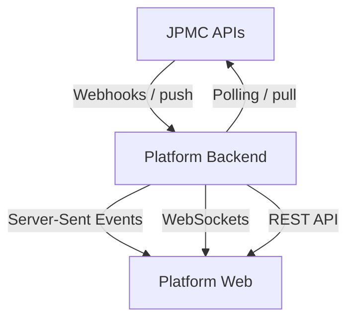

# Webhook Integration Recipe: Persona-Based UX Guidance

> **Note**: This document provides suggested UI/UX principles and patterns for webhook integration. These are recommendations that should be adapted to your specific platform context, technical architecture, and business requirements. Implementation details will vary based on your technology stack, user base, and operational needs.

## Introduction: Webhook vs Pull Integration Patterns

### Core Concepts

- **Webhooks**: The platform pushes event notifications to your backend. Best for timely, asynchronous updates and lower latency/overhead.
- **Pull/Polling**: Your backend or frontend periodically queries the platform for current state. Useful as a safety net and for reconciliation.

### Suggested Integration Pattern

One common approach: Backend receives and verifies webhooks, normalizes them, persists events and state snapshots, then exposes them to client applications via real-time channels (SSE, WebSocket, push notifications) with polling fallback. This provides both real-time updates and an authoritative state endpoint for consistency.

> **Note**: Your implementation may vary based on your infrastructure, scale requirements, and client application types (web, mobile, desktop).

## Integration Architecture Overview

## References

- **Manage notifications**: [JPMC Developer Docs - Manage Notifications](https://developer.payments.jpmorgan.com/docs/embedded-finance-solutions/embedded-payments/capabilities/notification-subscriptions/how-to/notifications)
- **Notification payloads and structure**: [JPMC Developer Docs - Notification Payloads](https://developer.payments.jpmorgan.com/docs/embedded-finance-solutions/embedded-payments/capabilities/notification-subscriptions/how-to/notification-payloads)
- **Digital onboarding flow and state machine**: [JPMC Developer Docs - Onboard a Client](https://developer.payments.jpmorgan.com/docs/embedded-finance-solutions/embedded-payments/capabilities/onboard-a-client)

## Supported Event Types

Embedded Payments provides webhook notifications for the following event categories:

| Event Type | Description | Use Case Priority |
|------------|-------------|------------------|
| `TRANSACTION_COMPLETED` | Transaction completed (including ACH returns) | High |
| `TRANSACTION_FAILED` | Transaction failed to process | High |
| `TRANSACTION_CHANGE_REQUESTED` | Notification of Change - recipient info needs correction | High |
| `CLIENT_ONBOARDING` | Client onboarding status changed | High |
| `ACCOUNT_CREATED` | New account successfully created | Medium |
| `ACCOUNT_CLOSED` | Account has been closed | Medium |
| `ACCOUNT_OVERDRAWN` | Account has negative balance | High |
| `RECIPIENT_READY_FOR_VALIDATION` | Microdeposits sent, ready for verification | Medium |
| `RECIPIENT_READY_FOR_VALIDATION_REMINDER` | Validation expires in 3 days | Medium |
| `RECIPIENT_READY_FOR_VALIDATION_EXPIRED` | Validation window closed | Medium |
| `THRESHOLD_LIMIT` | Program-level negative balance limits reached | Critical |

## Personas and UX Patterns

> **Note**: The majority of UX principles outlined below are based on [Jakob Nielsen's 10 Usability Heuristics](https://www.nngroup.com/articles/ten-usability-heuristics/) from Nielsen Norman Group.

### 1. C2: End-Customer (Ultimate Client) Onboarding UI

**Goal**: Help the customer understand their progress, what's needed, and what happens next.

#### Onboarding Events & UX Recommendations

| Events                            | Description                                                                              | UX Recommendation                                                                           |
| --------------------------------- | ---------------------------------------------------------------------------------------- | ------------------------------------------------------------------------------------------- |
| **New**                           | Application received, initial processing                                                 | Show welcome message with estimated timeline. Display progress tracker starting point.      |
| **Derived: Ready for Submission** | No webhook event. Platform calculates if all info provided but not submitted | Show prominent "Submit for Review" button with clear call-to-action. Once submitted, transitions to Review in Progress. |
| **Review in progress**            | Application under review (triggered after submission)                                              | Show progress indicator with "Under Review" status. Display estimated review time.          |
| **Information requested**         | Additional documents/info needed from customer                                           | Show action panel with clear list of required items. Provide upload/documentation guidance. |
| **Approved**                      | Application fully approved                                                               | Show success state with next steps. Provide onboarding completion guidance.                 |
| **Declined**                      | Application declined                                                               | Show clear decline message with reason (if available). Provide guidance on next steps or appeal process if applicable. |
| **Suspended**                     | Client suspended from product usage                                                               | Display suspension notice with reason. Provide contact information for resolution. Disable restricted features. |
| **Terminated**                    | Client terminated from product usage or application                                                               | Show termination notice with reason. Provide final account status and any required actions. |

#### Core UX Principles

- **Clarity of status**: Present a simple, linear progression that mirrors the onboarding state machine (e.g., Application received → Review in progress → Information requested → Approved).
- **Actionability**: When the state implies user work, present a focused action with clear guidance; otherwise minimize noise.
- **Reassurance and expectations**: Communicate that reviews take time and that the system is monitoring their application; provide last-updated information.
- **Accessibility and mobile-first**: Ensure semantic structure, readable contrast, live announcements for status changes, and touch-friendly components.
- **Privacy**: Surface only what's necessary; avoid internal identifiers or technical details.

#### UI Patterns

- Progress tracker that maps to primary states and only advances forward visually; avoid regressions from out-of-order events by relying on the latest authoritative status.
- "Next step" panel that conditionally appears when user action is required, otherwise a passive info card.
- Status freshness indicator (last update, time zone-appropriate display with consistent UTC in metadata).
- Notification center for significant transitions, with user-consented email/SMS where applicable.
- Safe empty states for missing details (e.g., when upstream events don't include itemized requests).

#### Backend Webhook Consumption Strategy

> **Note**: This table outlines backend logic for handling webhook events. Your platform should adapt this based on your state management and business rules.

| Client Status | hasOutstandingInformation | customerIdentityStatus | Backend Action |
|---------------|---------------------------|------------------------|----------------|
| **New** | `true` | Not Started | Present outstanding information for client to complete. Poll until cleared from outstanding block. |
| **New** | `false` | Not Started | Trigger `/verifications` to start client onboarding process. |
| **Review In Progress** | `false` | Review In Progress | No action. CIP (Customer Identification Program) verification in progress. |
| **Review In Progress** | `false` | Approved | No action. CIP verified, onboarding continues. |
| **Information Requested** | `true` | Review In Progress | Present outstanding information. CIP verification in progress. |
| **Information Requested** | `true` | Information Requested | Present outstanding information. CIP not verified - documents required. Show document requests from outstanding block. |
| **Information Requested** | `true` | Approved | Present outstanding information. CIP verified but additional info needed. |
| **Approved** | `false` | Approved | Client approved. Enable product features. |
| **Declined** | `false` | Review In Progress / Approved | Client declined. Disable onboarding flow. Provide decline reason if available. |
| **Suspended** | `false` | Approved | Client suspended. Restrict product usage per business rules. |
| **Terminated** | `true` or `false` | Any | Client terminated. Disable access. Archive client data per retention policy. |

**Key Fields**:
- `hasOutstandingInformation`: Indicates if client needs to provide additional information
- `customerIdentityStatus`: CIP verification status (identity verification progress)
- Backend should poll `/clients/{id}` for current state and outstanding information details

### 2. C2: End-Customer Transaction & Account Management UI

**Goal**: Keep customers informed about payment status, account activities, and required actions.

#### Transaction Events & UX Recommendations

| Events | Description | Suggested UX Approach |
|--------|-------------|----------------------|
| **Transaction completed** | Payment successfully processed | Success confirmation with transaction details. Update balance immediately. |
| **Transaction completed (Return)** | Previously completed payment returned (2-60 days later) | Prominent alert with return reason. Prompt to update recipient or choose different method. |
| **Transaction failed** | Payment failed to process | Clear error message with reason and suggested actions. Offer retry or alternatives. |
| **Transaction change requested (NOC)** | Bank requests updated recipient information | Notice that payment succeeded but info needs updating. Provide update flow. |
| **Account created** | New account opened | Success message with account details. Highlight next steps. |
| **Account closed** | Account closed | Closure confirmation. Guide on fund transfers if applicable. |
| **Account overdrawn** | Negative balance | Urgent alert with amount. Clear steps to resolve. |

#### Recipient (Linked Account) Events & UX Recommendations

| Events | Description | Suggested UX Approach |
|--------|-------------|----------------------|
| **Ready for validation** | Microdeposits sent | "Check your bank and verify amounts." Provide verification form. |
| **Validation reminder** | 17 days elapsed, 3 days remaining | Urgent reminder with deadline. Prominent verification CTA. |
| **Validation expired** | 20 days passed without verification | Expiry notice. Guide to restart process. |

#### Core UX Principles

- **Immediate feedback**: Update UI quickly when events received
- **Clarity of outcomes**: Use visual indicators (colors, icons) for status
- **Actionable guidance**: Provide specific next steps, not just error messages
- **Proactive notifications**: Surface time-sensitive items
- **Balance transparency**: Show current balance after transaction events

#### Suggested UI Patterns

- Transaction timeline with real-time status updates
- Inline notifications for action items
- Balance widgets with visual indicators for overdrawn states
- Modal dialogs for critical events
- Countdown timers for time-sensitive actions

### 3. C1: Platform Operations/Treasury Management UI

**Goal**: Monitor program health, manage liquidity, respond to operational events.

#### Program-Level Threshold Events & UX Recommendations

| Events | Description | Suggested UX Approach |
|--------|-------------|----------------------|
| **Alert percent exceeded** | Approaching negative balance limit (e.g., 80%) | Warning banner with utilization. Trend chart. Balance management recommendations. |
| **Restrict percent reached** | Maximum negative balance - transactions failing | Critical alert: "Processing suspended." Show affected count. Urgent resolution steps. |
| **Alert reset** | Balance improved below alert threshold | Success notification with updated metrics. |
| **Restrict reset** | Balance improved below restrict threshold | Success notification: "Processing resumed." Recovery metrics. |

#### Core UX Principles

- **Program-level visibility**: Dashboard showing aggregate balances
- **Trend awareness**: Historical charts and patterns
- **Predictive alerts**: Forecast when limits will be reached
- **Client segmentation**: Identify high-impact clients
- **Resolution tracking**: Monitor progress toward limit resolution

#### Suggested UI Patterns

- Program health dashboard with utilization gauges
- Alert/restrict threshold visualizations
- Client-level drill-down views
- Trend graphs with threshold lines
- Actionable client lists sorted by impact

### 4. C1: Platform Operations/Compliance UI

**Goal**: Ensure throughput, resolve blockers, maintain SLAs, and retain auditability.

#### Core UX Principles

- **Operational visibility**: Provide a work queue that prioritizes items requiring attention (e.g., information requested, SLA risk).
- **Traceability**: Every status change is represented on a timeline with provenance and timing.
- **Control and prioritization**: Filters, sorting, and saved views tailored to operational segments (e.g., high-value, time-in-state).
- **Health awareness**: Surface ingestion health and latency so ops can distinguish platform delays from business bottlenecks.
- **Governance**: Respect RBAC, mask sensitive data by default, and provide auditable reveal actions.

#### UI Patterns

- Work queue with status filters, SLA indicators, and assignment controls.
- Client detail page with a consolidated activity timeline combining webhook-driven events and internal actions.
- SLA/health widgets showing counts by status, median time in status, and event delay.
- "Information requested" management surface to track requested items, reminders, and communications.
- Export/audit views with consistent time normalization and event identifiers.

### 5. C1: Platform Developer/Technical Admin UI

**Goal**: Integrate, observe, and troubleshoot the event flow safely.

#### Core UX Principles

- **Observability**: Make event streams, validation outcomes, and processing results inspectable.
- **Safety**: Keep powerful actions (e.g., replay, secret rotation) clearly labeled and gated.
- **Explainability**: Document event semantics and any normalization/mapping between upstream payloads and internal models.
- **Reliability**: Indicate stream health, retry states, and backlog pressure to differentiate transport issues from application logic.

#### UI Patterns

- Integration status overview with connection health, last event received, and validation indicators.
- Subscriptions view that reflects enabled event types and provides test fixtures for non-production environments.
- Event explorer with filters and a details drawer for structured, pretty-printed payloads and metadata.
- Health dashboard with success rates, retry queues, and max/median latency over time.

## Implementation Considerations

> **Note**: These are general suggestions. Your implementation approach will depend on your platform's architecture, scale, technology stack, and specific requirements.

### Webhook Handling Best Practices

**Response Requirements**:

- Respond with `200 OK` within 3 seconds (JPMC requirement)
- JPMC retries after 5 minutes if no response
- Maximum 3 retry attempts over 72 hours
- Process events asynchronously after acknowledging receipt

**Duplicate Management**:

- Check `eventId` to detect duplicates
- Maintain log of processed event IDs
- Always respond `200 OK` even for duplicates
- Implement idempotency in your processing logic

**Event Ordering**:

- Events may arrive out of sequence
- Use timestamps to determine precedence
- Rely on authoritative GET requests for current state
- Design UI to handle out-of-order updates

**Security (OAuth Pattern)**:

- Optional: Use `clientId`, `clientSecret`, `tokenEndpoint` for signed payloads
- Verify signature using provided `publicKeyText`
- Monitor `publicKeyExpirationDate` for key rotation
- Add custom headers via `headerFields` for additional validation

### Frontend Delivery Options

Common approaches for delivering events to client applications:

**Server-Sent Events (SSE)**:

- Simple HTTP-based, automatic reconnection
- Good for web applications, one-way updates
- Works through most firewalls and proxies

**WebSockets**:

- Full-duplex communication
- Better for bi-directional needs (chat, collaboration)
- Requires WebSocket-compatible infrastructure

**Push Notifications**:

- For native mobile apps
- Works when app is backgrounded
- Use for critical events only

**REST Polling**:

- Fallback mechanism for compatibility
- Works everywhere (standard HTTP)
- Higher latency, not truly real-time

> **Recommendation**: Consider a hybrid approach with real-time push (SSE/WebSocket) as primary and polling as fallback for reliability.

### Architecture Patterns

**Suggested Flow**:

1. Receive webhook from JPMC → Verify signature
2. Store raw event → Return `200 OK` (< 3 seconds)
3. Process asynchronously → Update canonical state
4. Deliver to clients via chosen channel(s)
5. Provide REST endpoints for state verification

**Key Considerations**:

- Event store for audit trail and replay capability
- Message queue for async processing (SQS, RabbitMQ, Redis, etc.)
- Canonical state store (database) derived from events
- Connection management for real-time channels
- Graceful degradation when services unavailable
