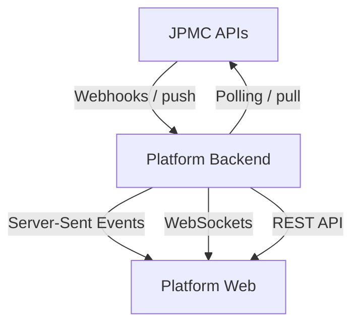

# Webhook Integration Recipe: Persona-Based UX Guidance

> **Note**: This document provides UI/UX principles and patterns for webhook integration, not implementation code. It focuses on design patterns and user experience considerations for different personas in the onboarding flow.

## Introduction: Webhook vs Pull Integration Patterns

### Core Concepts

- **Webhooks**: The platform pushes event notifications to your backend. Best for timely, asynchronous updates and lower latency/overhead.
- **Pull/Polling**: Your backend or frontend periodically queries the platform for current state. Useful as a safety net and for reconciliation.

### Recommended Integration Pattern

Backend receives and verifies webhooks, normalizes them, persists a canonical event and state snapshot, and exposes them to the web app via a push channel such as SSE or WebSocket (with polling fallback). This gives the UI both a real-time stream for change awareness and an authoritative "current status" endpoint for consistency.

## Integration Architecture Overview

## References

- **Notification payloads and structure**: [JPMC Developer Docs - Notification Payloads](https://developer.payments.jpmorgan.com/docs/embedded-finance-solutions/embedded-payments/capabilities/notification-subscriptions/how-to/notification-payloads)
- **Digital onboarding flow and state machine**: [JPMC Developer Docs - Onboard a Client](https://developer.payments.jpmorgan.com/docs/embedded-finance-solutions/embedded-payments/capabilities/onboard-a-client)

## Personas and UX Patterns

> **Note**: The majority of UX principles outlined below are based on [Jakob Nielsen's 10 Usability Heuristics](https://www.nngroup.com/articles/ten-usability-heuristics/) from Nielsen Norman Group.

### 1. C2: End-Customer (Ultimate Client) Onboarding UI

**Goal**: Help the customer understand their progress, what's needed, and what happens next.

#### Onboarding Events & UX Recommendations

| Events                            | Description                                                                              | UX Recommendation                                                                           |
| --------------------------------- | ---------------------------------------------------------------------------------------- | ------------------------------------------------------------------------------------------- |
| **New**                           | Application received, initial processing                                                 | Show welcome message with estimated timeline. Display progress tracker starting point.      |
| **Review in progress**            | Application under review by compliance team                                              | Show progress indicator with "Under Review" status. Display estimated review time.          |
| **Information requested**         | Additional documents/info needed from customer                                           | Show action panel with clear list of required items. Provide upload/documentation guidance. |
| **Approved**                      | Application fully approved                                                               | Show success state with next steps. Provide onboarding completion guidance.                 |
| **Derived: Ready for Submission** | No webhook event. Platform will have to calculate if all info provided but not submitted | Show prominent "Submit for Review" button with clear call-to-action.                        |

#### Core UX Principles

- **Clarity of status**: Present a simple, linear progression that mirrors the onboarding state machine (e.g., Application received → Review in progress → Information requested → Approved).
- **Actionability**: When the state implies user work, present a focused action with clear guidance; otherwise minimize noise.
- **Reassurance and expectations**: Communicate that reviews take time and that the system is monitoring their application; provide last-updated information.
- **Accessibility and mobile-first**: Ensure semantic structure, readable contrast, live announcements for status changes, and touch-friendly components.
- **Privacy**: Surface only what's necessary; avoid internal identifiers or technical details.

#### UI Patterns

- Progress tracker that maps to primary states and only advances forward visually; avoid regressions from out-of-order events by relying on the latest authoritative status.
- "Next step" panel that conditionally appears when user action is required, otherwise a passive info card.
- Status freshness indicator (last update, time zone-appropriate display with consistent UTC in metadata).
- Notification center for significant transitions, with user-consented email/SMS where applicable.
- Safe empty states for missing details (e.g., when upstream events don't include itemized requests).

### 2. C1: Platform Operations/Compliance UI

**Goal**: Ensure throughput, resolve blockers, maintain SLAs, and retain auditability.

#### Core UX Principles

- **Operational visibility**: Provide a work queue that prioritizes items requiring attention (e.g., information requested, SLA risk).
- **Traceability**: Every status change is represented on a timeline with provenance and timing.
- **Control and prioritization**: Filters, sorting, and saved views tailored to operational segments (e.g., high-value, time-in-state).
- **Health awareness**: Surface ingestion health and latency so ops can distinguish platform delays from business bottlenecks.
- **Governance**: Respect RBAC, mask sensitive data by default, and provide auditable reveal actions.

#### UI Patterns

- Work queue with status filters, SLA indicators, and assignment controls.
- Client detail page with a consolidated activity timeline combining webhook-driven events and internal actions.
- SLA/health widgets showing counts by status, median time in status, and event delay.
- "Information requested" management surface to track requested items, reminders, and communications.
- Export/audit views with consistent time normalization and event identifiers.

### 3. C1: Platform Developer/Technical Admin UI

**Goal**: Integrate, observe, and troubleshoot the event flow safely.

#### Core UX Principles

- **Observability**: Make event streams, validation outcomes, and processing results inspectable.
- **Safety**: Keep powerful actions (e.g., replay, secret rotation) clearly labeled and gated.
- **Explainability**: Document event semantics and any normalization/mapping between upstream payloads and internal models.
- **Reliability**: Indicate stream health, retry states, and backlog pressure to differentiate transport issues from application logic.

#### UI Patterns

- Integration status overview with connection health, last event received, and validation indicators.
- Subscriptions view that reflects enabled event types and provides test fixtures for non-production environments.
- Event explorer with filters and a details drawer for structured, pretty-printed payloads and metadata.
- Health dashboard with success rates, retry queues, and max/median latency over time.

## Implementation Considerations

### Transport Technologies

- **HTTPS Webhooks**: Primary event delivery mechanism
- **Server-Sent Events (SSE)**: Real-time updates to web clients
- **WebSockets**: Bi-directional communication for admin interfaces
- **Polling Fallback**: Backup mechanism for reliability

### Security & Reliability

- Webhook signature verification
- Idempotency handling
- Retry mechanisms with exponential backoff
- Dead letter queues for failed events
- Comprehensive logging and monitoring

### Performance Optimization

- Event batching and aggregation
- Efficient state storage and retrieval
- Real-time push channel optimization
- Graceful degradation under load
