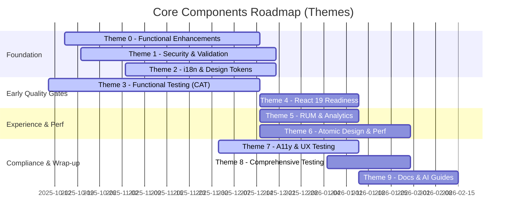

# Refined Core Components Development Roadmap

Target: Align all core components with API docs, i18n, private labeling (design/content tokens), security (OWASP), performance (Core Web Vitals), a11y (WCAG 2.1 AA), UX-tested flows, and OAS-superset client validation.

**Last Updated:** December 3, 2025  
**Related Documents:**
- `BACKLOG.md` - Detailed task backlog with priorities and UX testing findings
- `docs/ux-testing/2025-12-02/UX_TESTING_REPORT.md` - Comprehensive UX testing results

## Components (scope)

- OnboardingFlow
- LinkedAccountWidget
- Recipients
- MakePayment
- TransactionsDisplay
- Accounts

## Timeline (visual)

Each theme applies to all components. Within every theme, we will review and enhance each component to meet the revised expectations and target state; many already comply for several themes and will be validated rather than reworked.

Baseline readiness: Basic functionality across all themes for all components is ready and verified. This roadmap captures the next iteration of enhancements and evolution.

**Last Updated:** December 3, 2025  
**Related Documents:** See `BACKLOG.md` for detailed task breakdown and UX testing findings.

## Theme 0: Functional Enhancements (In Progress)

- OnboardingFlow
  - Add support for new entity types (with focus on publicly traded companies, government entities, and other non-profit entities)
  - Refine owner/controller flows
- LinkedAccountWidget
  - ✅ Handle verification responses (PR #583 - Dec 2, 2025)
  - ✅ Add interaction stories (PR #583 - Dec 2, 2025)
  - Parity with Recipients payment methods; better status messaging
  - Robust microdeposit flows (retry/lockout messaging)
- Recipients
  - Conditional attributes per payment method (ACH/RTP/WIRE)
  - Edit flows parity + masking
  - Recipient duplicate detection UX
- MakePayment
  - Recipient/method filtering logic
  - Review fee/time ETA display
  - Review/confirmation UX
  - Cross-currency payment support
- TransactionsDisplay
  - Pagination;
  - Review details attribute mapping
  - Review PAYIN/PAYOUT derivation and counterpart display
- Accounts
  - Responsive cards;
  - Review balance types mapping and tooltips
  - Masking/toggle for sensitive routing/account info

## Theme 1: Security & Validation (In Progress)

- OWASP hardening (XSS sanitization with dompurify, sensitive-data masking, idempotency keys, auth/CSRF via axios interceptor, throttling on verification flows).
- Client-side validation: centralize Zod schemas (superset of OAS), strict regex for routing/account numbers, progressive and accessible errors.
- OAS alignment: verify against latest specs; prefer generated hooks/types; no ad-hoc fetch clients.

## Theme 2: i18n & Tokens (In Progress)

- Extract content tokens and wire `react-i18next` + `zod-i18n-map`.
- Expand design tokens for full theming/private labeling; ensure runtime overrides via `EBComponentsProvider`.

## Theme 3: Functional Testing (CAT) (In Progress)

- Wire environment config for CAT endpoints/headers.
- Smoke and regression suites against CAT APIs using generated hooks; record diffs, capture contract mismatches.

## Theme 4: React 19 Readiness

- Verify peer compatibility, incremental adoption plan, and guardrails.
- Migrate low-risk areas (test environment, Storybook, non-critical flows) first; keep feature flags.

## Theme 5: RUM & Analytics

- Standard event catalog per component; configurable `userEventsHandler` hooks; perf timing utilities.

## Theme 6: Refined Atomic Design & Performance

- Extract shared atoms/molecules/organisms and utilities.
- Core Web Vitals targets TBD; apply memoization, virtualization, code-splitting.

## Theme 7: A11y & UX Testing (In Progress)

- ✅ UX scenarios per component (completed Dec 2, 2025 - see UX_TESTING_REPORT.md)
- 🚧 Mitigate found issues (see BACKLOG.md Priority 1-3 for detailed items)
- WCAG 2.1 AA; axe automated tests; keyboard/focus management, ARIA correctness.
- **Key Findings from UX Testing:**
  - Design system inconsistencies (button styles, colors, labels)
  - Make Payment form discoverability issues
  - Missing tooltips and accessibility features
  - Responsive design issues
  - Data quality and display issues

## Theme 8: Comprehensive Testing

- 90%+ coverage: unit (validators/hooks), component, integration (MSW), E2E for critical paths.
- Storybook scenarios: loading/error/empty/edge/i18n/theme/a11y.
- ✅ Enhanced test setup with ResizeObserver mock (PR #582 - Dec 3, 2025)
- ✅ Improved test reliability and structure (PR #582 - Dec 3, 2025)

## Theme 9: Documentation & AI Guides

## Theme 10: Tech Debt & Dependency Hygiene

- Dependency audit and hygiene
  - Review and update all package dependencies (runtime and dev) with a security-first allowlist.
  - Remove obsolete or unused devDependencies (eslint plugins/configs, storybook addons, test utilities, etc.).
  - Consolidate eslint/prettier configs; drop overlapping/legacy rules.
- TypeScript and related toolchain
  - Consider bumping TypeScript and all related type utilities and tooling (tsc, @types/\*, vitest, tsconfig libs) to latest compatible versions.
  - Validate build output and generated d.ts after bump; fix any strictness regressions.
- Build/test infrastructure
  - Verify Vite/Storybook compatibility after bumps; adjust configs if needed.
  - Rebaseline CI (typecheck/lint/test/storybook build) performance and caching.

- Per-component docs (usage, configuration, validation, security, a11y, testing, performance).
- Enhanced Cursor rules and codegen/dev templates for AI agents.

## Orval & Dependencies

- Review and update Orval codegen to latest 7.x; ensure React Query v5 generators and axios mutator are configured. Regenerate from latest OAS in `api-specs/`.
- Dependency policy: prioritize security patches; keep React 18.3 baseline now, React 19 in Theme 4. Track axios/react-query/radix/msw/storybook/vite minors.
- Package manager: migrate to pnpm (workspaces) for speed and content-addressable store. Update docs/CI to use `pnpm -w` equivalents (build, test, storybook, generate-api). Keep Yarn lock for a short deprecation window if needed.

### package.json audit (components)

- React/DOM peers already support `^19`; keep runtime on 18.3 until Theme 4.
- Vite 6 and Storybook 9 are aligned (OK). Ensure any Storybook addon minor bumps remain compatible.
- MSW 2.7 is current; keep handlers typed and update if breaking changes appear.
- Orval 7.0.1 can be bumped within 7.x after changelog review.
- dompurify 3.2.x is fine; avoid major bumps without review.
- Consider removing unused runtime deps if identified during Theme 0 (Functional Enhancements) hardening.

## Refined Security Recommendations

This guide outlines security controls applied across embedded-components, leveraging existing stack capabilities to avoid duplication.

### Input & Output Handling

- Sanitize any HTML using `dompurify`. Avoid `dangerouslySetInnerHTML` unless sanitized.
- Enforce strict Zod schemas (superset of OAS). Validate lengths, character sets, formats.
- Mask sensitive values (account/routing numbers, SSN/EIN) in UI (show last 4 only).

### Network & Auth

- All API calls via Orval-generated React Query hooks using a shared axios instance.
- Axios interceptors:
  - Inject auth headers/tenant headers from `EBComponentsProvider`.
  - Add `Idempotency-Key` on mutating requests.
  - Redact tokens/PII in error logs.
  - Optional CSRF header propagation (if environment requires).

### File Uploads

- Restrict mime types and size limits client-side. Prefer signed uploads when possible.

Tailor to host application domains.

### Logging & Telemetry

- Do not log secrets/tokens/PII.
- Use RUM hooks for business events; prefer hashed IDs when possible.

### Dependency Hygiene

- Run dependency audits (CodeQL/Snyk/npm audit).
- Prefer minor/patch updates first; isolate risky major bumps.

### Browser & Clickjacking

- Recommend host to set `X-Frame-Options: SAMEORIGIN` or CSP `frame-ancestors` as needed.

### Rate Limiting & Abuse

- Throttle verification and retry loops client-side to reduce abuse patterns.

### Testing

- Include OWASP test cases in component suites (XSS, validation bypass, sensitive data leakage).
