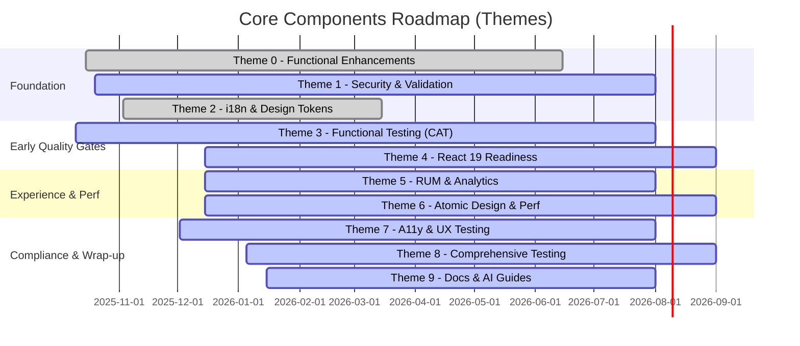

# Refined Core Components Development Roadmap

Target: Align all core components with API docs, i18n, private labeling (design/content tokens), security (OWASP), performance (Core Web Vitals), a11y (WCAG 2.1 AA), UX-tested flows, and OAS-superset client validation.

**Last Updated:** July 16, 2026  
**Related Documents:**

- `BACKLOG.md` - Detailed task backlog with priorities and UX testing findings
- `docs/ux-testing/` - Point-in-time UX testing session archives
- `docs/README.md` - Docs index for this package
- `CHANGELOG.md` - Shipped releases (see v0.14–v0.16 for PTC, PaymentFlowFX, legacy removals)

## Components (scope)

**Public:**

- OnboardingFlow (incl. PTC via `enablePubliclyTradedCompanies`)
- LinkedAccountWidget / RecipientsWidget
- PaymentFlow / PaymentFlowInline
- PaymentFlowFX / PaymentFlowFXInline (**Beta**)
- TransactionsDisplay
- Accounts
- ClientDetails

**Internal (not yet package-exported):**

- IndirectOwnership

**Removed — do not plan work against these APIs:**

- `MakePayment` → `PaymentFlow` (removed v0.15)
- `OnboardingWizardBasic` → `OnboardingFlow` (removed v0.15)
- Legacy `Recipients` / `RecipientListWidget` → widgets above

## Timeline (visual)

Each theme applies to all components. Within every theme, we will review and enhance each component to meet the revised expectations and target state; many already comply for several themes and will be validated rather than reworked.

Baseline readiness: Basic functionality across foundation themes for core components is ready and verified. This roadmap captures the next iteration of enhancements and evolution.

```mermaid
gantt
    title Core Components Roadmap (Themes)
    dateFormat  YYYY-MM-DD

    section Foundation
    Theme 0 - Functional Enhancements    :done, t0, 2025-10-15, 2026-06-15
    Theme 1 - Security & Validation      :active, t1, 2025-10-20, 2026-08-01
    Theme 2 - i18n & Design Tokens       :done, t2, 2025-11-03, 2026-03-15

    section Early Quality Gates
    Theme 3 - Functional Testing (CAT)   :active, t3, 2025-10-10, 2026-08-01
    Theme 4 - React 19 Readiness         :active, t4, 2025-12-15, 2026-09-01

    section Experience & Perf
    Theme 5 - RUM & Analytics            :active, t5, 2025-12-15, 2026-08-01
    Theme 6 - Atomic Design & Perf       :active, t6, 2025-12-15, 2026-09-01

    section Compliance & Wrap-up
    Theme 7 - A11y & UX Testing          :active, t7, 2025-12-02, 2026-08-01
    Theme 8 - Comprehensive Testing      :active, t8, 2026-01-05, 2026-09-01
    Theme 9 - Docs & AI Guides           :active, t9, 2026-01-15, 2026-08-01
```

## Theme 0: Functional Enhancements (largely complete — track residual in BACKLOG)

- OnboardingFlow
  - ✅ Publicly Traded Companies (PTC) gated by `enablePubliclyTradedCompanies` (shipped 2026-05/06)
  - [ ] Refine owner/controller flows; additional entity types as needed
- LinkedAccountWidget
  - ✅ Handle verification responses, interaction stories, compact/virtualized list
  - [ ] Parity with Recipients payment methods [BL-401-2]
  - [ ] Better status messaging [BL-401-3]
  - [ ] Robust microdeposit flows (retry/lockout messaging) [BL-401-4]
- RecipientsWidget
  - Shared architecture with LinkedAccountWidget
  - ✅ Compact-cards default + table view, scrollable virtual list, config-driven forms
- PaymentFlow
  - ✅ Core domestic flow shipped; superseded legacy MakePayment
  - [ ] Recipient/method filtering polish [BL-403-1]
  - [ ] Review fee/time ETA display [BL-403-2, BL-031]
  - [ ] Review/confirmation UX [BL-403-3]
- PaymentFlowFX (**Beta**)
  - ✅ Initial FX / multicurrency payout draft (v0.16.x)
  - [ ] Stabilize API, expand corridor coverage, exit Beta
- TransactionsDisplay
  - [ ] Pagination / details mapping / PAYIN-PAYOUT derivation [BL-404-*]
  - [ ] Review PAYIN/PAYOUT derivation and counterpart display [BL-404-3]
  - [ ] Fix "$NaN" display for Ledger Balance [BL-050-1]
  - [ ] Replace "N/A" values with meaningful data or hide fields [BL-050-2]
- Accounts
  - ✅ Account number masking (`****${number.slice(-4)}`) and browser verification [BL-003]
  - ✅ Visual refresh, responsive cards, masking/toggle [BL-405-1, BL-405-3]
  - [ ] Review balance types mapping and tooltips [BL-405-2]
  - [ ] Add "View Transactions" / "Transfer Funds" buttons [BL-090-1, BL-090-2]
  - [ ] Remove redundant "Accounts" heading [BL-091-1]
- ClientDetails
  - ✅ Error/loading/skeleton + content tokens (2026-03)
  - [ ] Full UX audit [BL-810]

## Theme 1: Security & Validation (In Progress)

- OWASP hardening (XSS sanitization with dompurify, sensitive-data masking, idempotency keys, auth/CSRF via axios interceptor, throttling on verification flows).
- Client-side validation: centralize Zod schemas (superset of OAS), strict regex for routing/account numbers, progressive and accessible errors.
- OAS alignment: verify against latest specs; prefer generated hooks/types; no ad-hoc fetch clients.

## Theme 2: i18n & Tokens (largely complete)

- ✅ Locales: `en-US`, `fr-CA`, `es-US` with content-token overrides via `EBComponentsProvider`
- ✅ Theme configuration aligned with Salt Design System semantic tokens
- [ ] Continue expanding token coverage for full private labeling [BL-420-3]
- [ ] Keep Zod / form error messages wired to i18n maps where gaps remain

## Theme 3: Functional Testing (CAT) (In Progress)

- Wire environment config for CAT endpoints/headers.
- Smoke and regression suites against CAT APIs using generated hooks; record diffs, capture contract mismatches.

## Theme 4: React 19 Readiness

- Verify peer compatibility, incremental adoption plan, and guardrails.
- Migrate low-risk areas (test environment, Storybook, non-critical flows) first; keep feature flags.

## Theme 5: RUM & Analytics

- Standard event catalog per component; configurable `userEventsHandler` hooks; perf timing utilities.

## Theme 6: Refined Atomic Design & Performance

- Extract shared atoms/molecules/organisms and utilities.
- Core Web Vitals targets TBD; apply memoization, virtualization, code-splitting.

## Theme 7: A11y & UX Testing (In Progress)

- ✅ UX scenarios per component (completed Dec 2, 2025 - see UX_TESTING_REPORT.md) [BL-470-1]
- ✅ Code inspection completed (Dec 9, 2025 - see PHASE1_CODE_INSPECTION.md)
- 🚧 Mitigate found issues (see BACKLOG.md Priority 1-3 for detailed items) [BL-470-2]
- [ ] WCAG 2.1 AA compliance [BL-470-3]
- [ ] Axe automated tests [BL-470-4]
- [ ] Keyboard/focus management [BL-470-5]
- [ ] ARIA correctness [BL-470-6]
- **Key Findings from UX Testing (Dec 2, 2025):**
  - Design system inconsistencies (button styles, colors, labels) [BL-001, BL-002, BL-009]
  - Make Payment / PaymentFlow form discoverability issues [BL-010]
  - Missing tooltips and accessibility features [BL-070]
  - Responsive design issues [BL-080]
  - Data quality and display issues [BL-050]
- **Progress Since Dec 2 Testing:**
  - ✅ Account number masking code standardized and browser verified (Dec 9, 2025) [BL-003]
  - ✅ Payment form structure improved (PR #601; now `PaymentFlow`) [BL-010]
  - ✅ RecipientsWidget pagination / list patterns (legacy Recipients removed)
  - ✅ Browser testing completed (Dec 9, 2025) - See `docs/ux-testing/2025-12-09/UX_TESTING_REPORT.md`
- **New Findings from Dec 9 Testing:**
  - ✅ Recipients data inconsistency (table vs pagination) [BL-600] - **RESOLVED** (Dec 9, 2025 - Re-test confirmed)
  - 🟠 Duplicate API calls across all components [BL-602]
  - 🟡 Dialog accessibility warnings [BL-601]
  - 🟡 MSW initialization errors [BL-603]

## Theme 8: Comprehensive Testing

- [ ] 90%+ coverage: unit (validators/hooks), component, integration (MSW), E2E for critical paths [BL-480-1]
- [ ] Storybook scenarios: loading/error/empty/edge/i18n/theme/a11y [BL-480-2]
- ✅ Enhanced test setup with ResizeObserver mock (PR #582 - Dec 3, 2025) [BL-480-3]
- ✅ Improved test reliability and structure (PR #582 - Dec 3, 2025) [BL-480-4]
- ✅ Test warnings fixed and MSW handlers updated for onboarding (PR #602 - Dec 9, 2025)

## Theme 9: Documentation & AI Guides

## Theme 10: Tech Debt & Dependency Hygiene

- Dependency audit and hygiene
  - Review and update all package dependencies (runtime and dev) with a security-first allowlist.
  - Remove obsolete or unused devDependencies (eslint plugins/configs, storybook addons, test utilities, etc.).
  - Consolidate eslint/prettier configs; drop overlapping/legacy rules.
- TypeScript and related toolchain
  - Consider bumping TypeScript and all related type utilities and tooling (tsc, @types/\*, vitest, tsconfig libs) to latest compatible versions.
  - Validate build output and generated d.ts after bump; fix any strictness regressions.
- Build/test infrastructure
  - Verify Vite/Storybook compatibility after bumps; adjust configs if needed.
  - Rebaseline CI (typecheck/lint/test/storybook build) performance and caching.

- Per-component docs (usage, configuration, validation, security, a11y, testing, performance).
- Enhanced AI agent skills and codegen/dev templates.

## Orval & Dependencies

- Review and update Orval codegen to latest 7.x; ensure React Query v5 generators and axios mutator are configured. Regenerate from latest OAS in `api-specs/`.
- Dependency policy: prioritize security patches; keep React 18.3 baseline now, React 19 in Theme 4. Track axios/react-query/radix/msw/storybook/vite minors.
- Package manager: migrate to pnpm (workspaces) for speed and content-addressable store. Update docs/CI to use `pnpm -w` equivalents (build, test, storybook, generate-api). Keep Yarn lock for a short deprecation window if needed.

### package.json audit (components)

- React/DOM peers already support `^19`; keep runtime on 18.3 until Theme 4.
- Vite 6 and Storybook 9 are aligned (OK). Ensure any Storybook addon minor bumps remain compatible.
- MSW 2.7 is current; keep handlers typed and update if breaking changes appear.
- Orval 7.0.1 can be bumped within 7.x after changelog review.
- dompurify 3.2.x is fine; avoid major bumps without review.
- Consider removing unused runtime deps if identified during Theme 0 (Functional Enhancements) hardening.

## Refined Security Recommendations

This guide outlines security controls applied across embedded-components, leveraging existing stack capabilities to avoid duplication.

### Input & Output Handling

- Sanitize any HTML using `dompurify`. Avoid `dangerouslySetInnerHTML` unless sanitized.
- Enforce strict Zod schemas (superset of OAS). Validate lengths, character sets, formats.
- Mask sensitive values (account/routing numbers, SSN/EIN) in UI (show last 4 only).

### Network & Auth

- All API calls via Orval-generated React Query hooks using a shared axios instance.
- Axios interceptors:
  - Inject auth headers/tenant headers from `EBComponentsProvider`.
  - Add `Idempotency-Key` on mutating requests.
  - Redact tokens/PII in error logs.
  - Optional CSRF header propagation (if environment requires).

### File Uploads

- Restrict mime types and size limits client-side. Prefer signed uploads when possible.

Tailor to host application domains.

### Logging & Telemetry

- Do not log secrets/tokens/PII.
- Use RUM hooks for business events; prefer hashed IDs when possible.

### Dependency Hygiene

- Run dependency audits (CodeQL/Snyk/npm audit).
- Prefer minor/patch updates first; isolate risky major bumps.

### Browser & Clickjacking

- Recommend host to set `X-Frame-Options: SAMEORIGIN` or CSP `frame-ancestors` as needed.

### Rate Limiting & Abuse

- Throttle verification and retry loops client-side to reduce abuse patterns.

### Testing

- Include OWASP test cases in component suites (XSS, validation bypass, sensitive data leakage).
