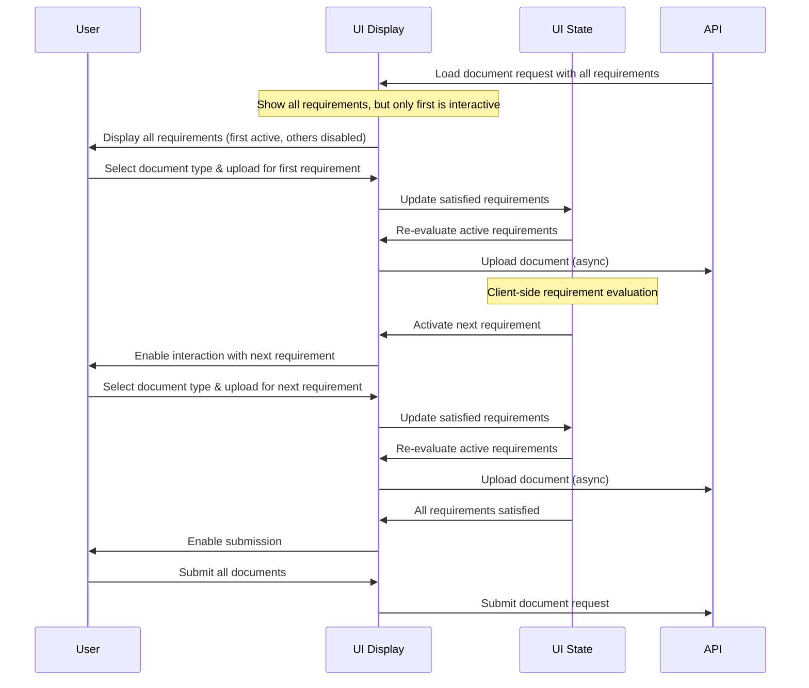

# Implementing an Incremental Document Upload Experience

> **Note**: This document is a work in progress and subject to change.

## Overview

The document upload process can be simplified by using an incremental approach that guides users through requirements step-by-step, while still providing visibility of the overall process. This represents one possible approach to consuming the document upload API through a user interface.

## User Flow with Client-Side State Management

## Implementation Details

### State Management

- **Active Requirements**: Track which requirements are currently interactive using a state object mapping document request IDs to arrays of active requirement indices.
- **Satisfied Document Types**: Maintain a list of document types that have been satisfied to prevent duplicate uploads.
- **Form State**: Use React Hook Form with dynamic Zod validation schemas that adapt based on active requirements.

### Key Implementation Patterns

1. **Progressive Disclosure**: Show all requirements but make only active ones interactive, activating them sequentially as previous ones are completed.

2. **Client-Side Validation**: Watch form values to evaluate requirement satisfaction and update UI accordingly.

3. **Document Processing**: Convert files to base64, upload with unique IDs, and process asynchronously.

4. **Multi-Party Support**: Handle document requests for multiple parties with appropriate filtering and display.

5. **UI Considerations**: Provide visual indicators of completion status and implement appropriate validation.

This pattern creates an intuitive experience by giving users visibility of the entire process while guiding them through each step in a controlled manner. While this implementation uses React Hook Form and client-side state management, other approaches to consuming the API are possible depending on specific requirements.
