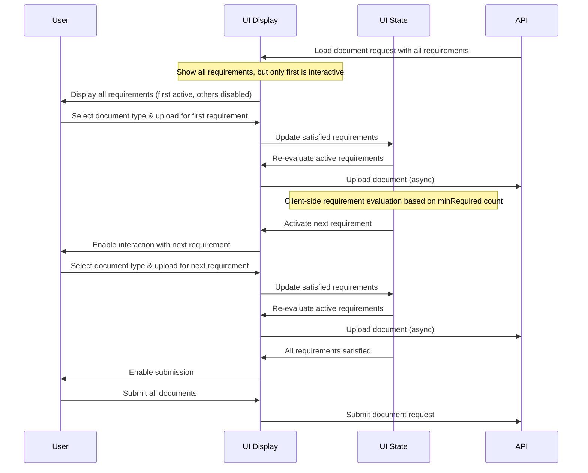

# Implementing an Incremental Document Upload Experience

> **Note**: This document is a work in progress and subject to change.

## Overview

The document upload process implements a guided approach that helps users provide all required documents in a single session, while still maintaining a clear step-by-step interface. While the API supports incremental document uploads (via the `outstanding` field), our implementation encourages users to provide all required documents at once for a more streamlined experience.

## Document Upload Strategy

### API State vs UI State

- The API provides two ways to track document requirements:
  1. Root `requirements`: The complete set of document requirements
  2. `outstanding.requirements`: Documents still needed based on previous uploads

Our implementation uses the root `requirements` because:

1. We want users to provide all documents in one session
2. The same document type can be uploaded multiple times for different requirements
3. This approach ensures all requirements are visible and can be satisfied in one go

### User Flow with Client-Side State Management



## Implementation Details

### State Management

- **Active Requirements**: Track which requirements are currently interactive using a state object mapping document request IDs to arrays of active requirement indices.
- **Satisfied Document Types**: Maintain a list of document types that have been satisfied to prevent duplicate uploads within the same requirement.
- **Form State**: Use React Hook Form with dynamic Zod validation schemas that adapt based on active requirements and minRequired counts.

### Key Implementation Patterns

1. **Progressive Disclosure**:

   - Show all requirements but make only active ones interactive
   - Activate them sequentially as previous ones are completed
   - Base requirement completion on the `minRequired` count from each requirement

2. **Client-Side Validation**:

   - Watch form values to evaluate requirement satisfaction
   - Use root `requirements` to determine what documents are needed
   - Track progress based on the `minRequired` count for each requirement

3. **Document Processing**:

   - Convert files to base64
   - Upload with unique IDs
   - Process asynchronously
   - Allow same document type to be used for different requirements

4. **Multi-Party Support**:

   - Handle document requests for multiple parties with appropriate filtering and display
   - Track requirements per party

5. **UI Considerations**:
   - Show clear progress indicators based on minRequired counts
   - Display already satisfied requirements in a completed state
   - Provide visual feedback for remaining required documents
   - Implement appropriate validation based on requirements

### Document Requirements Structure

The component uses the root requirements structure:

```typescript
interface DocumentRequest {
  requirements: {
    documentTypes: DocumentTypeSmbdo[];
    minRequired: number;
  }[];
}
```

This pattern creates an intuitive experience by:

1. Giving users visibility of all requirements upfront
2. Guiding them through each step in a controlled manner
3. Allowing the same document type to be used for different requirements
4. Ensuring all requirements can be satisfied in a single session

While the API supports incremental uploads through the `outstanding` field, our implementation encourages providing all documents at once for a more streamlined user experience.

## Testing Scenarios for EP/US Document Requests

For Embedded Payments (EP) in the US jurisdiction, there are two primary document request scenarios that need to be tested:

### 1. Organization Party Document Requests

This scenario occurs either at the client object level or during party validation. The request structure follows the pattern in `efOrganizationDocumentRequestDetails.mock.ts`:

```typescript
{
  requirements: [{
    documentTypes: [
      'ARTICLES_OF_INCORPORATION',
      'CERTIFICATE_OF_GOOD_STANDING',
      'CERTIFICATE_OF_INCUMBENCY',
      'ARTICLES_OF_ASSOCIATION',
      'CONSTITUTIONAL_DOCUMENT',
      'LLC_AGREEMENT',
      'FILING_RECEIPT',
      'OPERATING_AGREEMENT',
    ],
    minRequired: 1
  }],
  outstanding: {
    documentTypes: [/* same as above */],
    requirements: [{
      documentTypes: [/* same as above */],
      missing: 1
    }]
  }
}
```

Key testing considerations:

- Verify that only one document from the list is required
- Test that uploading any valid document type satisfies the requirement
- Ensure proper handling of organization-specific document types
- Verify the request appears both at client level and in party validation contexts

### 2. Individual Party Document Requests

This scenario occurs during party validation for individual parties. The request structure follows the pattern in `efDocumentRequestDetails.mock.ts`:

```typescript
{
  requirements: [
    {
      documentTypes: ['PASSPORT', 'DRIVERS_LICENSE'],
      minRequired: 1
    },
    {
      documentTypes: [
        'PASSPORT',
        'DRIVERS_LICENSE',
        'CREDIT_CARD_STATEMENT',
        'BANK_STATEMENT',
        'LOAN_ACCOUNT_STATEMENT',
        'UTILITY_BILL',
        'INSURANCE_DOCUMENT'
      ],
      minRequired: 2
    }
  ],
  outstanding: {
    documentTypes: [/* same as above */],
    requirements: [
      {
        documentTypes: ['PASSPORT', 'DRIVERS_LICENSE'],
        missing: 1
      },
      {
        documentTypes: [/* same as above */],
        missing: 2
      }
    ]
  }
}
```

Key testing considerations:

- Verify the sequential nature of requirements (first requirement must be satisfied before second becomes active)
- Test various valid document combinations:
  - Passport + any secondary document
  - Driver's license + any secondary document
- Ensure proper handling of individual-specific document types
- Verify that requirements are properly tracked and updated as documents are uploaded

### Common Testing Considerations

For both scenarios:

1. Validate proper filtering of document requests by party ID
2. Test file upload functionality for each document type
3. Verify proper handling of the `missing` count in the outstanding requirements
4. Test error scenarios and validation messages
5. Verify proper state management as requirements are satisfied
6. Test the completion state when all requirements are met
