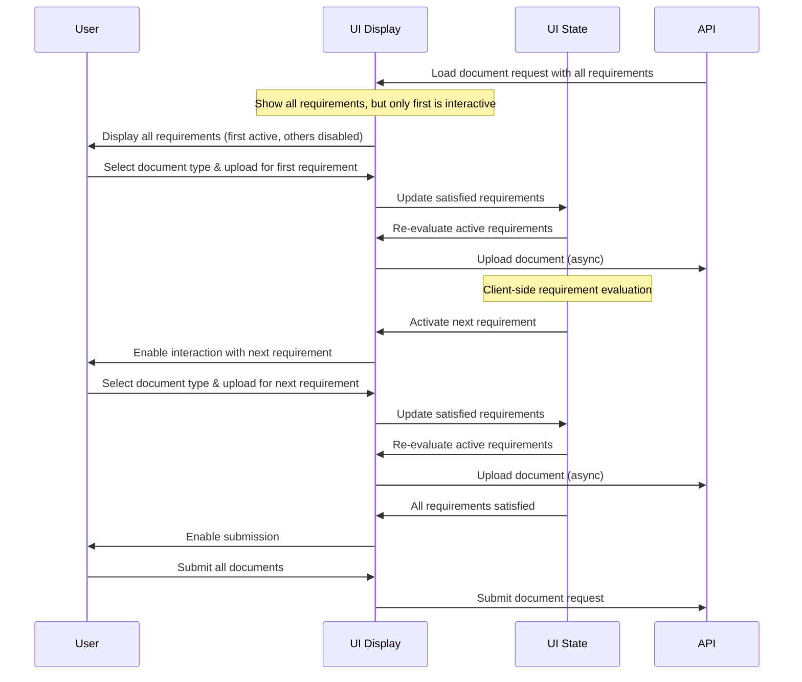

# Implementing an Incremental Document Upload Experience

## Overview

The document upload process can be simplified by using an incremental approach that guides users through requirements step-by-step, while still providing visibility of the overall process.

## User Flow with Client-Side State Management

## Implementation Note

The recommended approach manages requirements as UI state:

- All requirements are visible to the user from the beginning, showing the complete picture
- Only the currently active requirement(s) are interactive (enabled for document type selection and file upload)
- As requirements are satisfied, the UI state updates locally, without needing server confirmation
- Previously completed requirements show confirmation indicators
- Next requirements become interactive in sequence as previous ones are completed
- Document uploads happen asynchronously without blocking the UI
- Final submission occurs only when all requirements are satisfied

This pattern gives users visibility of the entire process while guiding them through each step in a controlled manner, creating a more intuitive experience.