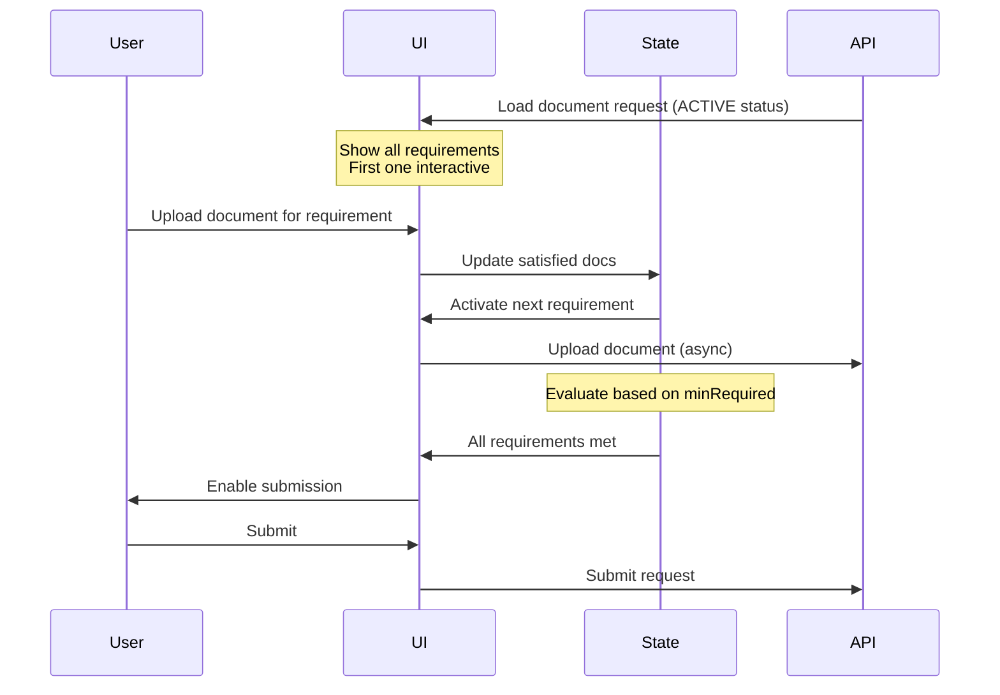

# Document Upload Form Implementation Guide

## Overview

A guided document upload component that enables users to fulfill document requirements in a step-by-step interface. Handles both required and optional documents, with support for multiple parties.

## Document Flow



## Key Features

- Progressive disclosure of requirements
- Real-time validation
- Multi-party support
- Optional document handling
- Status-aware processing (ACTIVE/CLOSED/EXPIRED)

## Document Requirements Structure

```typescript
interface DocumentRequest {
  id: string;
  status: 'ACTIVE' | 'CLOSED' | 'EXPIRED';
  requirements: {
    documentTypes: DocumentTypeSmbdo[];
    minRequired: number; // 0 for optional, ≥1 for required
  }[];
}
```

## Implementation Notes

### State Management

- Uses root `requirements` instead of `outstanding` for complete visibility
- Tracks active requirements and satisfied document types
- Dynamic form validation based on `minRequired` counts

### Document Processing

- Async file uploads with unique request IDs
- Base64 encoding for document content
- Supports multiple uploads of same document type
- Only processes ACTIVE document requests

### UI Behavior

1. **Required Documents** (minRequired ≥ 1):

   - Sequential activation of requirements
   - Asterisk (\*) indicator
   - Must be satisfied for form submission

2. **Optional Documents** (minRequired = 0):
   - "Optional" badge and labels
   - No asterisk
   - Not required for form submission

## Testing Scenarios

### Organization Documents

```typescript
{
  requirements: [{
    documentTypes: ['ARTICLES_OF_INCORPORATION', 'LLC_AGREEMENT', ...],
    minRequired: 1
  }]
}
```

### Individual Documents

```typescript
{
  requirements: [
    {
      documentTypes: ['PASSPORT', 'DRIVERS_LICENSE'],
      minRequired: 1
    },
    {
      documentTypes: ['BANK_STATEMENT', 'UTILITY_BILL', ...],
      minRequired: 2
    }
  ]
}
```

## Key Test Cases

1. Status handling (ACTIVE/CLOSED/EXPIRED)
2. Required vs optional document flows
3. Multi-party document requests
4. Sequential requirement activation
5. File upload and validation
6. Error scenarios
