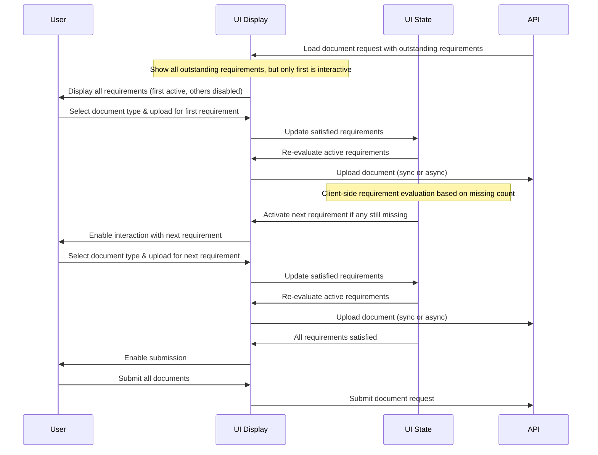

# Implementing an Incremental Document Upload Experience

> **Note**: This document is a work in progress and subject to change.

## Overview

The document upload process can be simplified by using an incremental approach that guides users through requirements step-by-step, while still providing visibility of the overall process. This represents one possible approach to consuming the document upload API through a user interface.

## User Flow with Client-Side State Management



## Implementation Details

### State Management

- **Active Requirements**: Track which requirements are currently interactive using a state object mapping document request IDs to arrays of active requirement indices.
- **Satisfied Document Types**: Maintain a list of document types that have been satisfied to prevent duplicate uploads.
- **Form State**: Use React Hook Form with dynamic Zod validation schemas that adapt based on active requirements and missing document counts.

### Key Implementation Patterns

1. **Progressive Disclosure**:

   - Show all outstanding requirements but make only active ones interactive
   - Activate them sequentially as previous ones are completed
   - Base requirement completion on the `missing` count from the API

2. **Client-Side Validation**:

   - Watch form values to evaluate requirement satisfaction
   - Use `outstanding.requirements` to determine what documents are still needed
   - Track progress based on the `missing` count for each requirement

3. **Document Processing**:

   - Convert files to base64
   - Upload with unique IDs
   - Process asynchronously
   - Update UI based on outstanding requirements after each upload

4. **Multi-Party Support**:

   - Handle document requests for multiple parties with appropriate filtering and display
   - Track outstanding requirements per party

5. **UI Considerations**:
   - Show clear progress indicators based on missing document counts
   - Display already satisfied requirements in a completed state
   - Provide visual feedback for remaining required documents
   - Implement appropriate validation based on outstanding requirements

### API State Integration

The component now relies on the API's `outstanding` field to determine:

1. Which requirements still need documents
2. How many documents are missing for each requirement
3. What document types are still acceptable

```typescript
interface DocumentRequestOutstanding {
  documentTypes: DocumentTypeSmbdo[];
  requirements: {
    documentTypes: DocumentTypeSmbdo[];
    missing: number;
  }[];
}
```

This pattern creates an intuitive experience by:

1. Giving users visibility of the entire process
2. Guiding them through each step in a controlled manner
3. Accurately reflecting the current state of document requirements
4. Preventing duplicate uploads of already satisfied requirements

While this implementation uses React Hook Form and client-side state management, other approaches to consuming the API are possible depending on specific requirements.

## Testing Scenarios for EP/US Document Requests

For Embedded Payments (EP) in the US jurisdiction, there are two primary document request scenarios that need to be tested:

### 1. Organization Party Document Requests

This scenario occurs either at the client object level or during party validation. The request structure follows the pattern in `efOrganizationDocumentRequestDetails.mock.ts`:

```typescript
{
  requirements: [{
    documentTypes: [
      'ARTICLES_OF_INCORPORATION',
      'CERTIFICATE_OF_GOOD_STANDING',
      'CERTIFICATE_OF_INCUMBENCY',
      'ARTICLES_OF_ASSOCIATION',
      'CONSTITUTIONAL_DOCUMENT',
      'LLC_AGREEMENT',
      'FILING_RECEIPT',
      'OPERATING_AGREEMENT',
    ],
    minRequired: 1
  }],
  outstanding: {
    documentTypes: [/* same as above */],
    requirements: [{
      documentTypes: [/* same as above */],
      missing: 1
    }]
  }
}
```

Key testing considerations:

- Verify that only one document from the list is required
- Test that uploading any valid document type satisfies the requirement
- Ensure proper handling of organization-specific document types
- Verify the request appears both at client level and in party validation contexts

### 2. Individual Party Document Requests

This scenario occurs during party validation for individual parties. The request structure follows the pattern in `efDocumentRequestDetails.mock.ts`:

```typescript
{
  requirements: [
    {
      documentTypes: ['PASSPORT', 'DRIVERS_LICENSE'],
      minRequired: 1
    },
    {
      documentTypes: [
        'PASSPORT',
        'DRIVERS_LICENSE',
        'CREDIT_CARD_STATEMENT',
        'BANK_STATEMENT',
        'LOAN_ACCOUNT_STATEMENT',
        'UTILITY_BILL',
        'INSURANCE_DOCUMENT'
      ],
      minRequired: 2
    }
  ],
  outstanding: {
    documentTypes: [/* same as above */],
    requirements: [
      {
        documentTypes: ['PASSPORT', 'DRIVERS_LICENSE'],
        missing: 1
      },
      {
        documentTypes: [/* same as above */],
        missing: 2
      }
    ]
  }
}
```

Key testing considerations:

- Verify the sequential nature of requirements (first requirement must be satisfied before second becomes active)
- Test various valid document combinations:
  - Passport + any secondary document
  - Driver's license + any secondary document
- Ensure proper handling of individual-specific document types
- Verify that requirements are properly tracked and updated as documents are uploaded

### Common Testing Considerations

For both scenarios:

1. Validate proper filtering of document requests by party ID
2. Test file upload functionality for each document type
3. Verify proper handling of the `missing` count in the outstanding requirements
4. Test error scenarios and validation messages
5. Verify proper state management as requirements are satisfied
6. Test the completion state when all requirements are met
