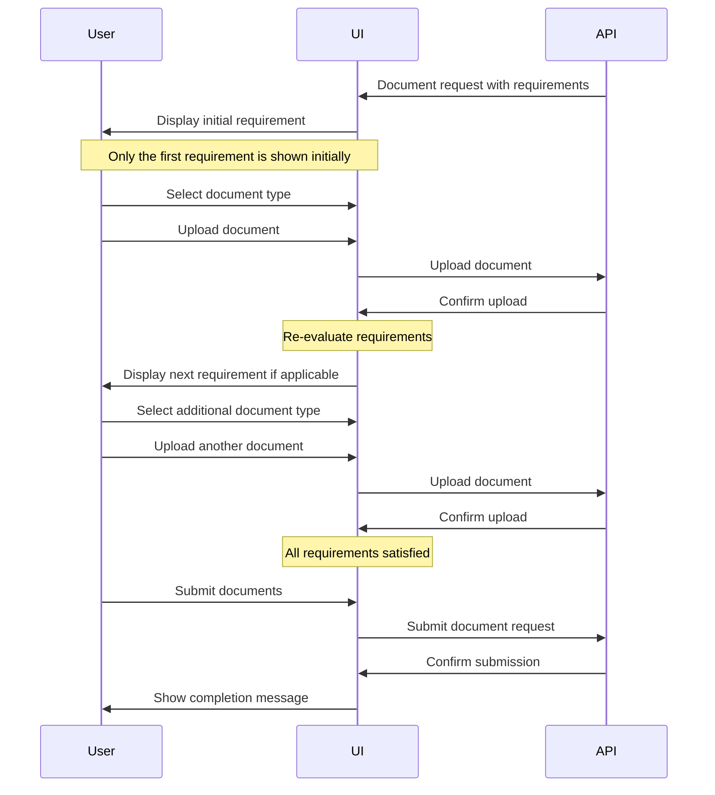
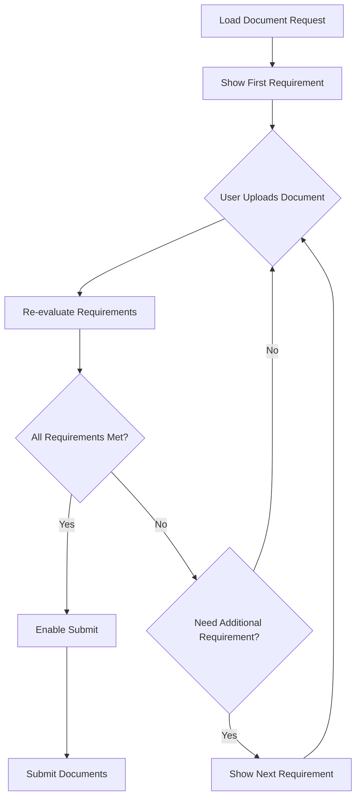
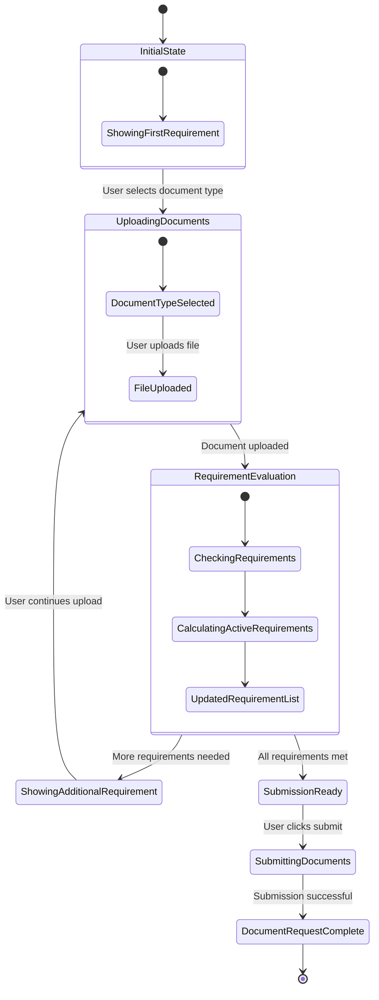
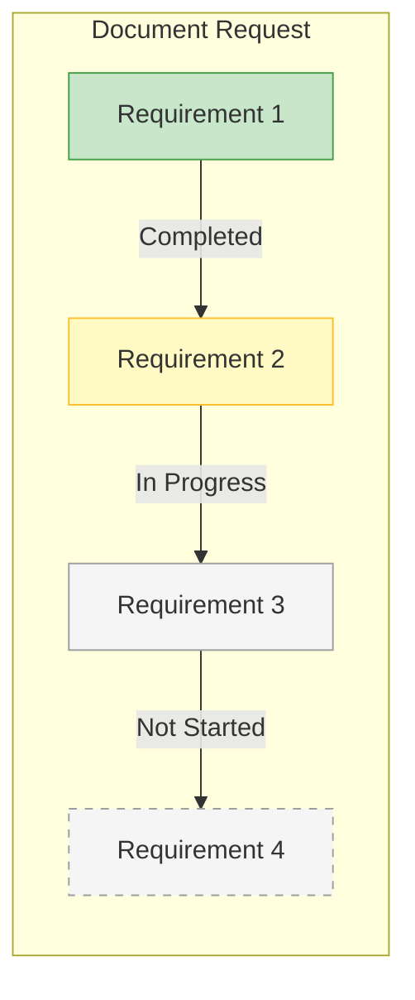

# Implementing an Incremental Document Upload Experience

## Overview

The document upload process can be complex when multiple document types are required with various conditional requirements. To simplify this experience for users, we recommend implementing an incremental requirement evaluation approach that dynamically reveals requirements as previous ones are satisfied.

## User Experience Flow

## Incremental Requirement Evaluation

The core of this approach is revealing requirements only when they become relevant, reducing cognitive load for users.

## User Interface States

The UI transitions through several states during the document upload process:

## Implementation Considerations

When implementing this incremental approach, consider the following:

1. **Visual Progress Indicators**: Show users which requirements have been satisfied and which remain.
   

2. **Document Type Selection**: Only offer document types that are valid for the current requirement and haven't already been satisfied.

3. **Contextual Guidance**: Provide clear instructions for each requirement as it becomes active.

4. **Validation Feedback**: Offer immediate feedback on file type, size, and quality.

By implementing this incremental approach, you can simplify a complex document collection process, guiding users through requirements step-by-step and reducing errors and confusion.